1. 计算机网络是通信技术和计算机技术紧密结合的产物，计算机网络一个定义是：互连的、自治的计算机集合，自治代表某一个计算机不能去控制另一个计算机，反之亦然。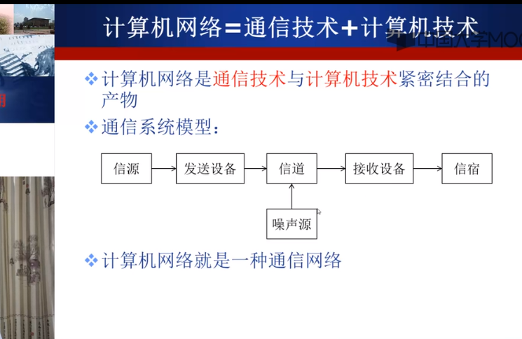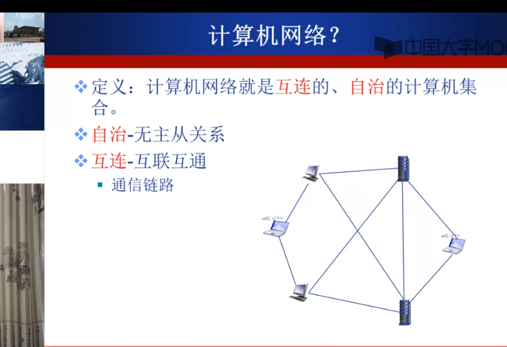

上图中还展示了计算机之间互连的一种方式，但这种方式具有很大的局限性，当距离很远、网络规模很大时浪费资源并且不易扩展。因此，引入交换网络来将这些主机相连到一起：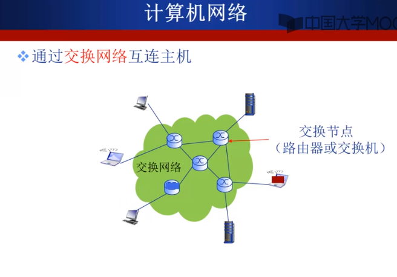

2. 全球最大的互联网：Internet，也是计算机网络的代表网络。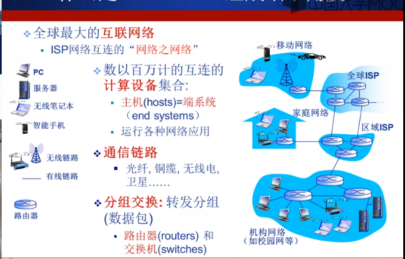

3. 计算机网络结构：网络边缘、接入网络和网络核心。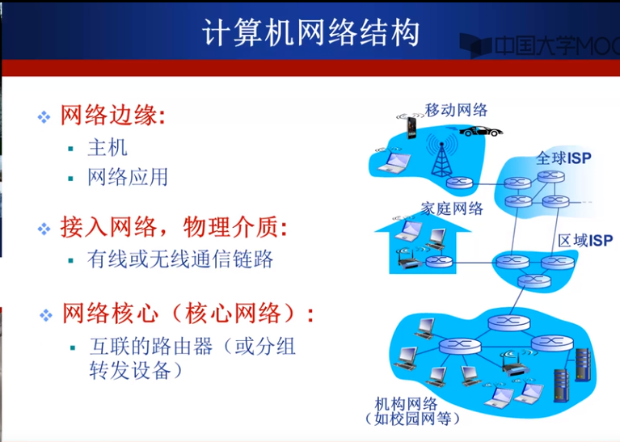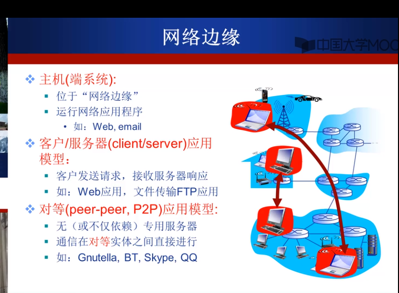

用户比较关心接入网络的带宽（单位是比特每秒）和接入方式（共享/独占）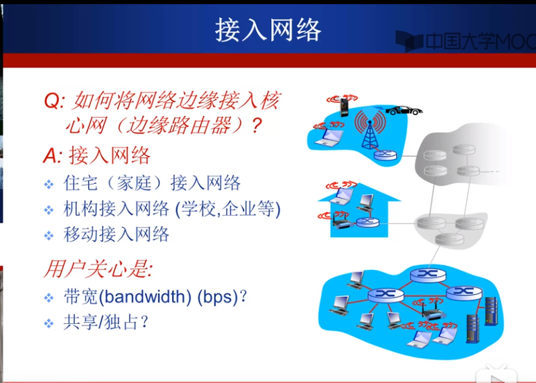

对于网络核心而言，路由器主要有两个功能，路由（根据具体的路由协议和路由算法确定分组从源到目的的路径）和转发（查找路由表后将某一分组从输入端口交换至正确的输出端口）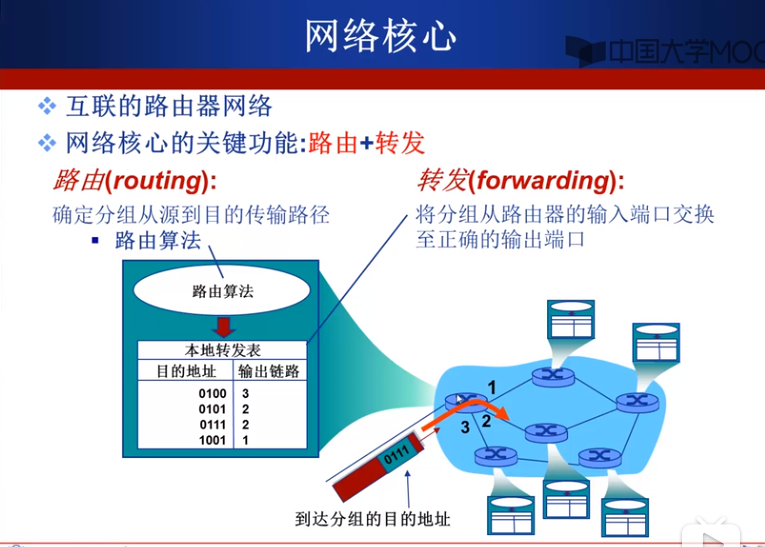

网络核心的作用就是数据交换，数据交换使用到的具体技术将在下面讲到。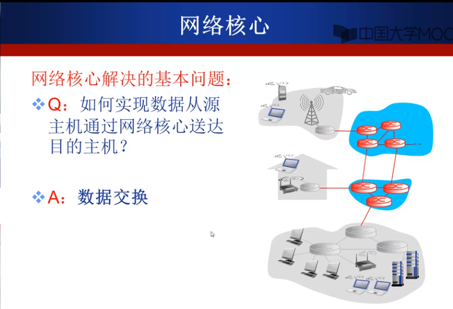

4. Internet网络结构，下面几张图可以表现出Internet结构的逐步发展过程。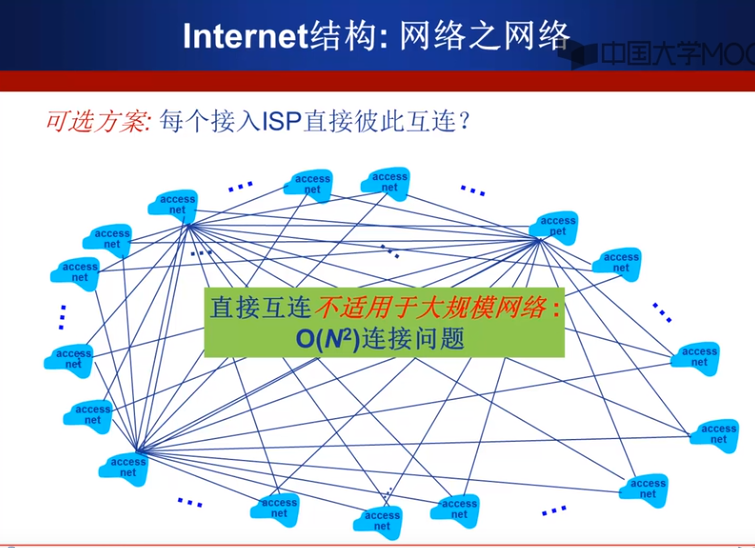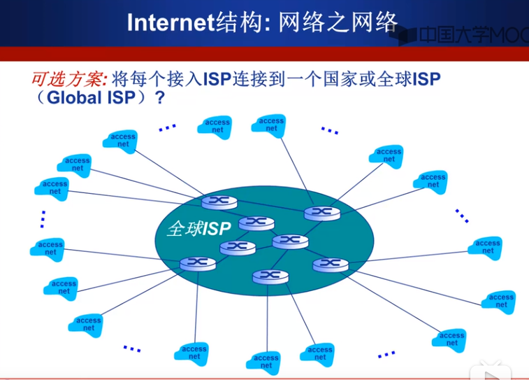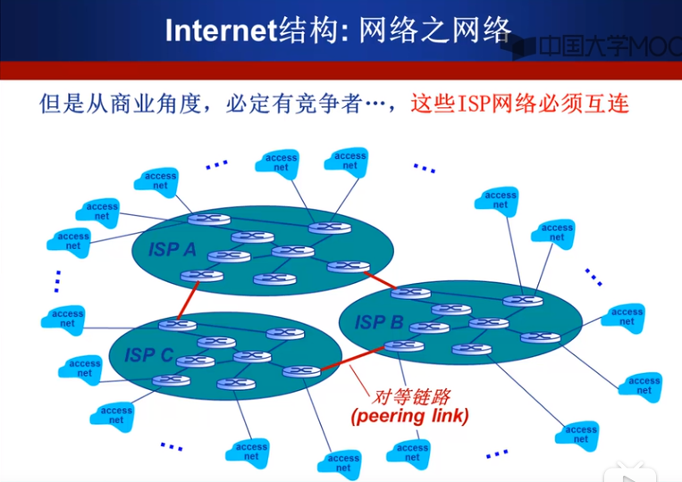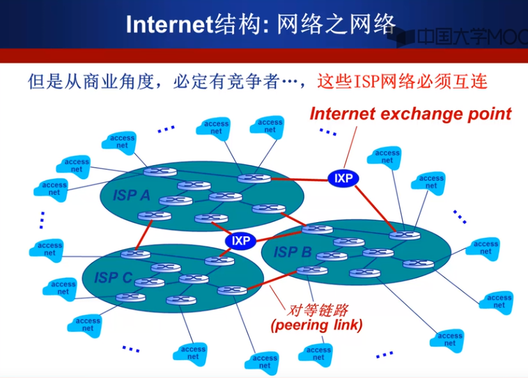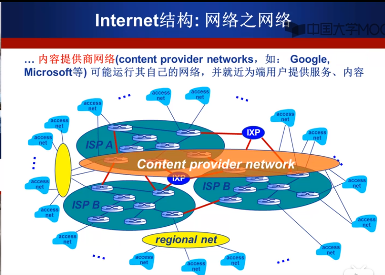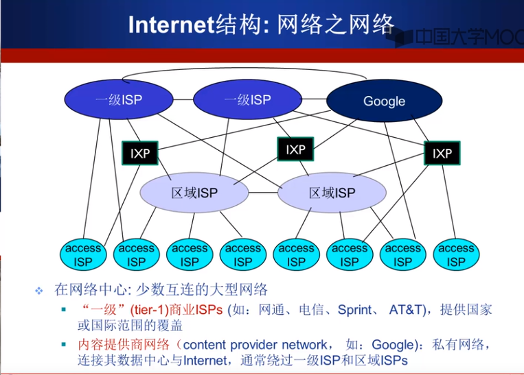
