1. 电路交换，需要三个过程（建立、交换、拆除），可以类比打电话，最大的特点是资源独占，即两个电话在通话期间所占用的通话资源（如信道资源）是不能被第三方所共享的。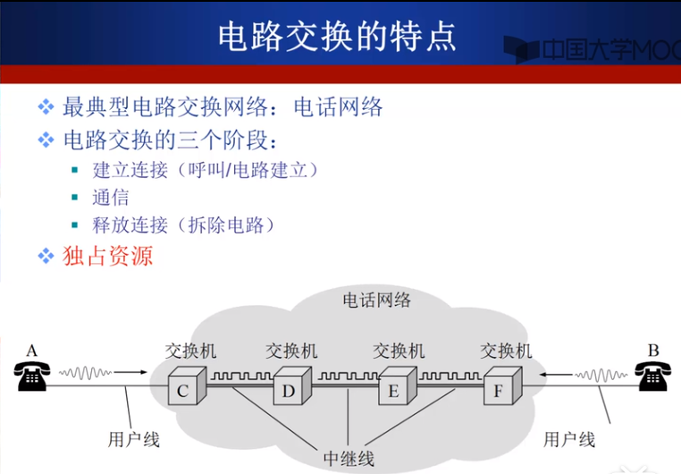

那么如何实现交换网络的中继线共享呢，就需要多路复用技术。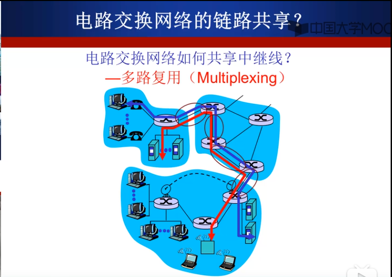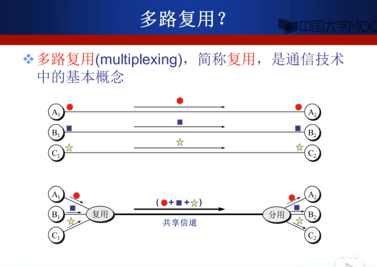

通过将中继线划分为不同的资源片，可以实现多路复用，在电路交换中，每一个连接独占一个资源片，不可共享。多路复用有多种实现方式：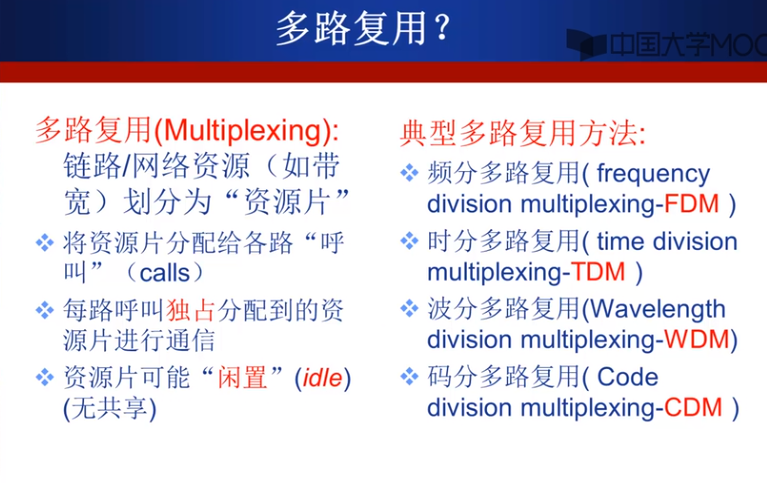

频分多路复用FDM，将信道资源划分为不同频率段的子信道，最具有代表性的有线电视网络，一根同轴电缆接到电视机上，可以看很多频道。在这种方式下，每个用户占用不同的频带。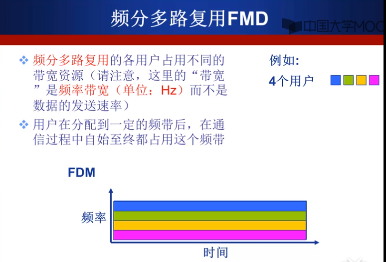

时分多路复用TDM，将时间划分为等长的帧，每个用户在这个帧中占用固定序号的时隙。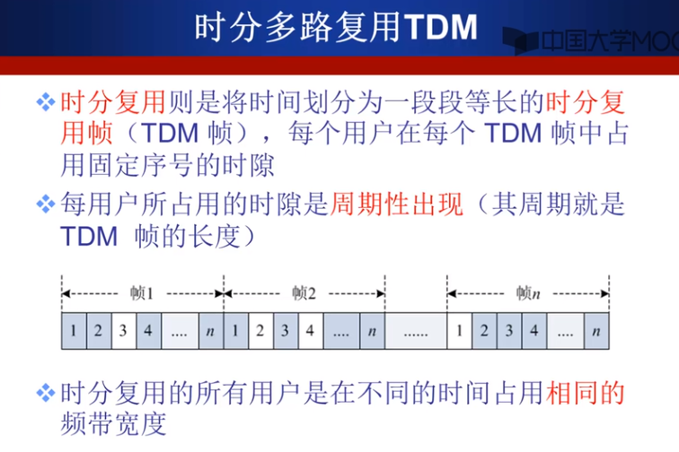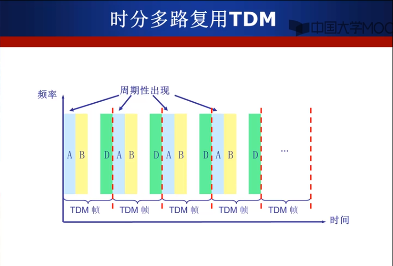

2. 报文交换，在数据传输中，将整个数据（文件）作为一个整体，一次性的将其转发到下一个节点上去。最具有代表性的是早期的电报系统。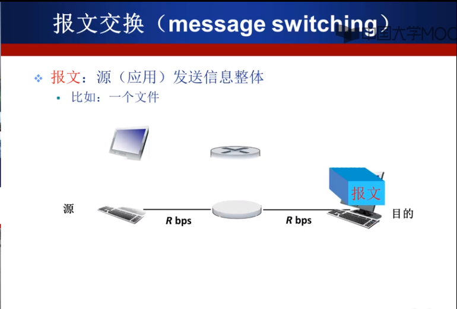

3. 分组交换，相比于报文交换就是将源数据拆分为一系列相对较小的数据包（分组），再在数据包前加上一些头部信息，然后传送，相比于报文交换多了报文的拆分和重组。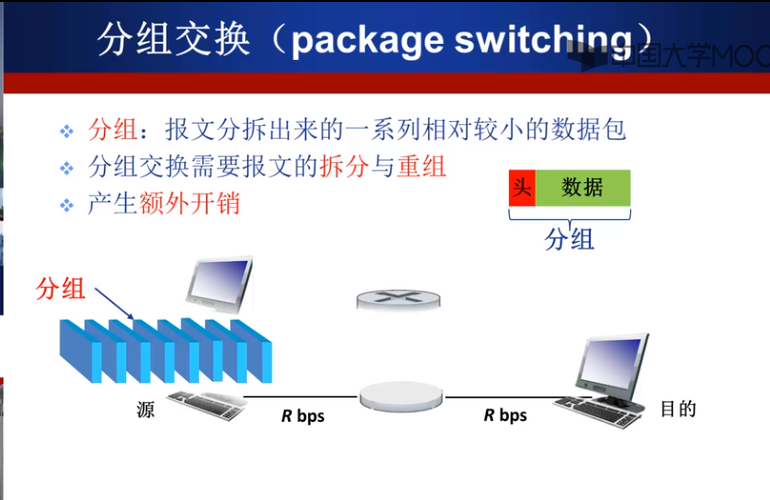

分组交换网络不像电路交换那样（在通信之前建立电路，并占下相应的带宽），而是采用统计多路复用（按需共享链路）的方式。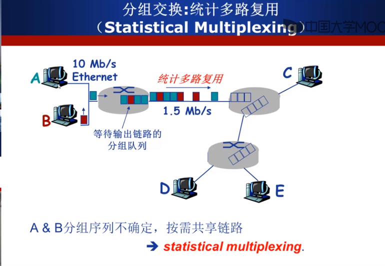

在上图中，无论链路转发A、B哪个的分组，都会以1.5Mbps的速率转发，但由于二者的分组数量不相同，因此，在相同时间内，发送分组多的主机会占用较高的平均带宽。

4. 报文交换和分组交换，二者都采用存储-转发的机制交换数据，但是具有一定的区别：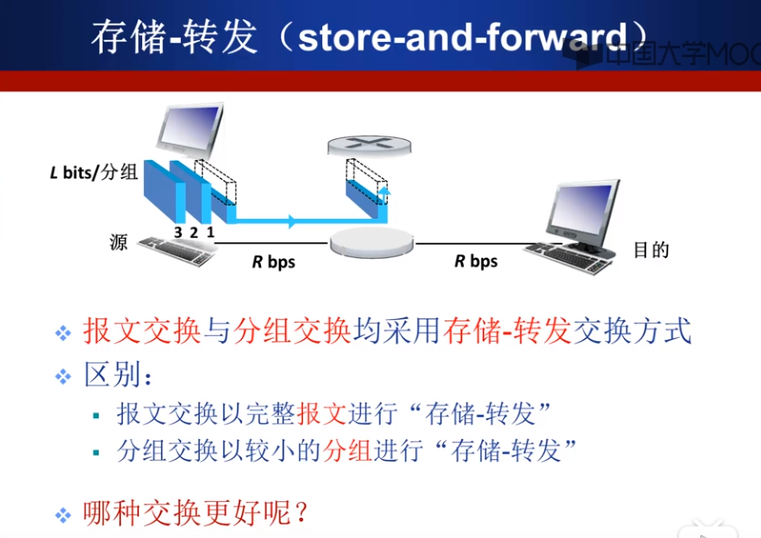

传输时延：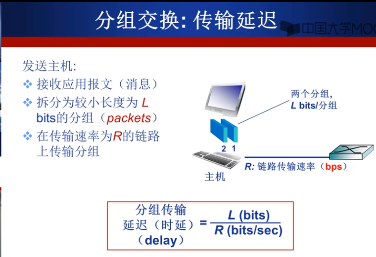

分组交换比报文交换有着更低的传输时延，以下几张图作为对比：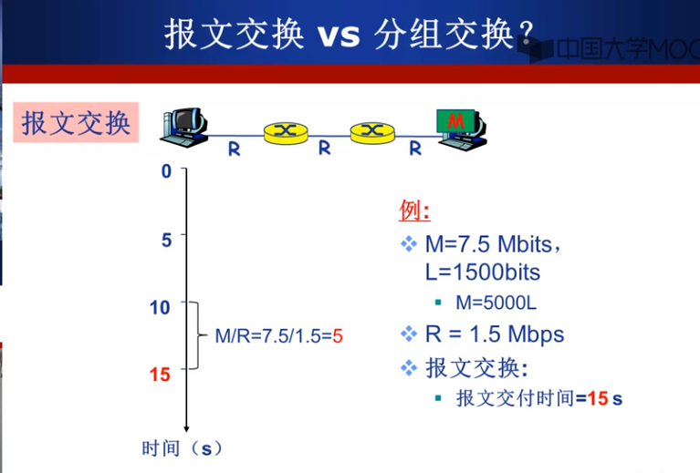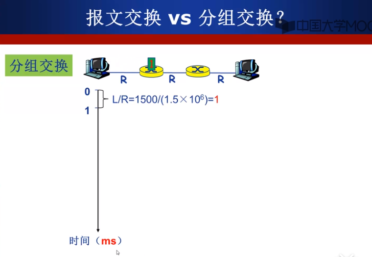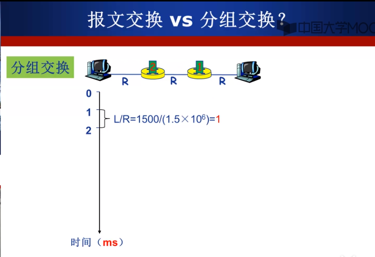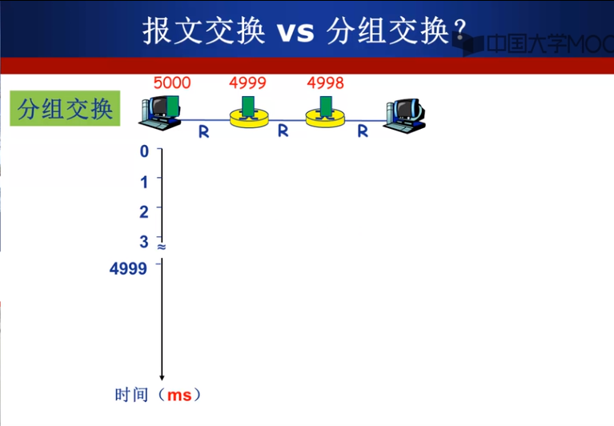

分组交换比报文交换具有更少的传输时延和需要更小的路由器缓存，主要原因是因为分组交换对一个源文件来说可以同时进行并行的接收和转发，而报文交换是串行的，因此，分组交换技术已经大部分被使用。下面是分组交换中报文交付总时间的推导公式（跳步数代表链路数量）：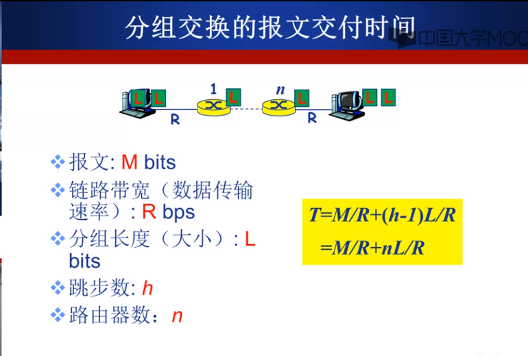

下面是一个分组交换时间的例题：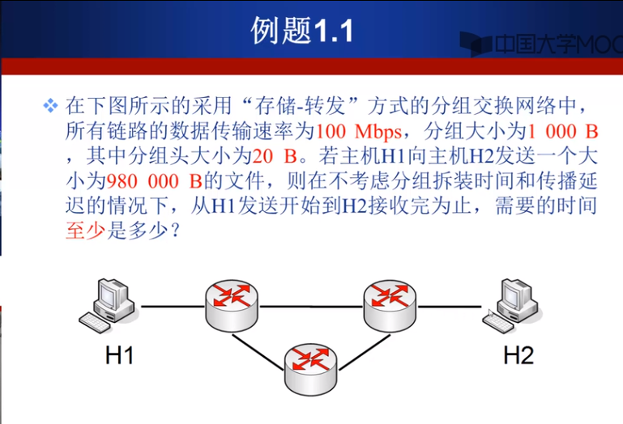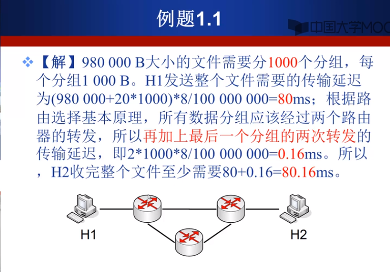

5. 电路交换和分组交换，通过实际题目的对比来说明二者的优势劣势：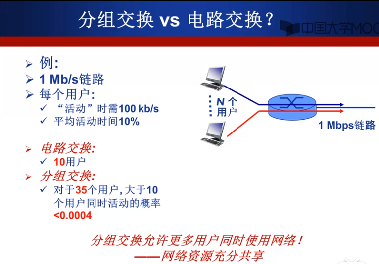

当活动时间仅占一定比例时，我们发现，当给定可以允许的冲突率的具体数值时，可以计算出共享这个链路的总连接数，并且性能好于电路交换。分组交换可以提高资源使用率。

但是分组交换一定优于电路交换吗，答案肯定是否定的（如果肯定的话，电话网络应该早就被改掉了，Internet就是一个分组交换网络），事实上，分组交换适用于突发数据传输网络（而不是电话、视频那样的），而且可能由于发送的数据大于链路的传输能力而导致的拥塞。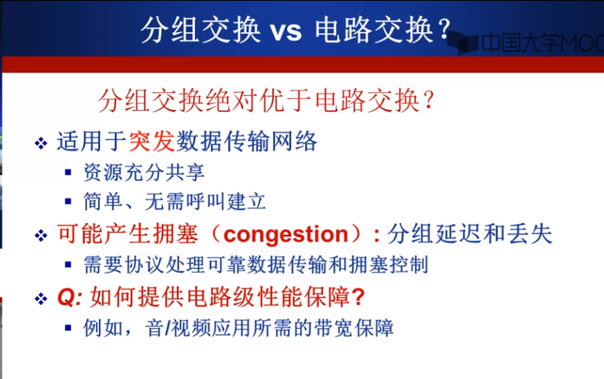