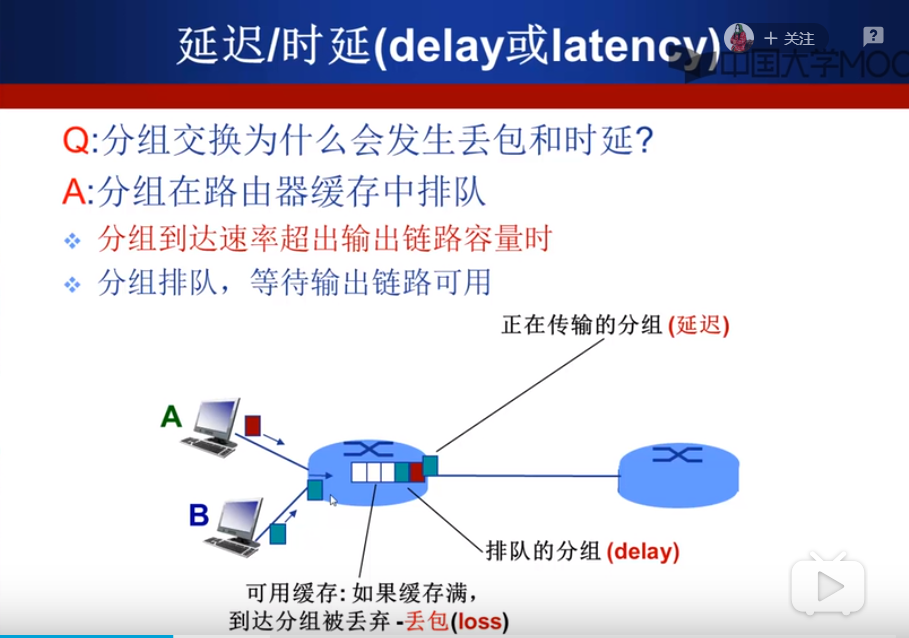
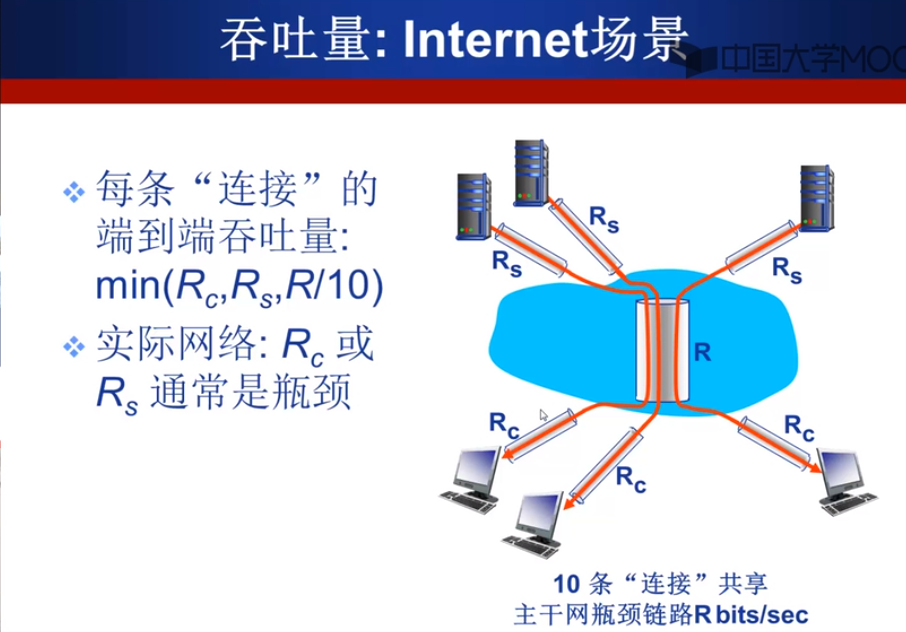

1. 速率，用来衡量每秒交换的bit数量。注意单位的大小，k，M，G分别是10的次方，而不是计算机中通常的2的多少次方。网络产品中给出的速率指标往往是理想的或者额定的速率，实际中往往达不到。

2. 带宽，在信号领域中（传输的频带宽度，HZ）和计算机网络领域中具有不同的含义（信道的额定传输速率，bps）。

3. 时延。下面解释一下为什么会发生时延？首先，路由器转发分组时会产生传输时延（上节已经讨论过），没有在转发的分组会在路由器缓存中排队，这时会产生排队时延（当分组到达速率超出输出链路容量时，并且可能会发生丢包现象）。另外，还包括其他方式产生的时延。

延迟主要包括四种：节点处理时延（比较低，毫秒级，是否考虑应该取决于问题实际的规模）、排队时延（当处理好之后，确定哪条输出链路后的排队时延，很不确定，取决于路由器拥塞程度）、传输延迟（排队轮到之后，路由器将这个分组传出去的时间，取决于当前分组的实际大小和输出链路的带宽）、传播延迟（信号在介质中走的时间，取决于物理链路的长度，也跟信号传播速率有关（光、电、无线信号））。在一个路由器中进行交换称为一跳，这一跳的时间大致取决于这四种时间。

**请注意，传播延迟和传输延迟完全不是一回事，传播指的是信号在物理链路上走的时间，而传输延迟指的是路由器发送分组所需要的时间。**

关于排队延迟：

4. 计算机网络中又一个常用的指标为：时延带宽积，代表着链路中可以容纳的最多的比特数量。

5. 丢包率。不同的计算机网络对于丢包的处理方式不同，有的丢了就丢了，有的采取重发机制。

6. 吞吐量，也是一种速率，但是不具体考虑实际链路的传输速率，针对对象是发送端和接收端的文件传输速率。

**可以看出，端到端吞吐量主要取决于瓶颈链路的带宽。**