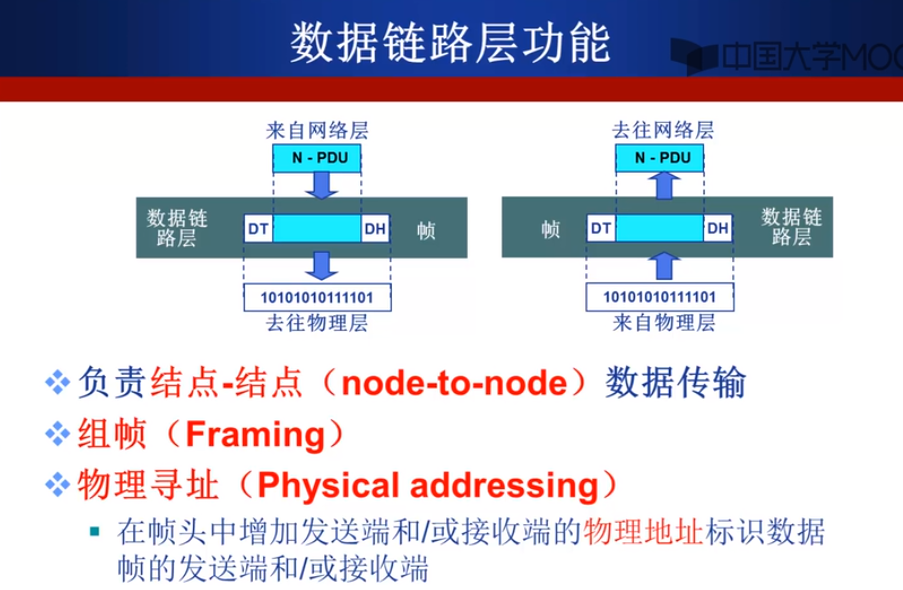

1. 为什么需要计算机网络体系结构，因为计算机网络是一个十分复杂的系统，计算机网络体系结构用来清晰的描述网络，有利于分析和学习网络，答案是分层结构。

2. 计算机网络的体系结构。需要注意的是，这个体系结构是从**功能**上对网络进行描述的，而不是从物理构成上描述（这有什么硬件，那有什么硬件），也就是说计算机网络在完成通信时，从功能上包括什么。因此，通俗的来说，**计算机网络的分层结构是每层规定了什么功能，并且每个功能通过某种具体的协议来约束和实现的结构**。也就是说，计算机网络的结构主要解决的问题是：每层有哪几个功能以及每个功能的协议。体系结构是**抽象**的，完全不关心每层的每个功能是如何实现，是硬件实现还是软件实现。

3. 分层结构的好处，为什么需要分层结构？

4. OSI七层模型数据封装与通信过程：

**为什么层间要进行数据封装？**
封装之后为了形成协议控制单元（PDU），形成PDU之后增加了一些控制信息，是否加某种控制信息不是确定的，取决于协议的自己实现，如，不是所有的协议都加入了差错检测编码。

5. 物理层主要解决的问题（主要是单一比特的传输问题）：

**注：**单工表示只能单项传输，如电视机，电视台发什么它接受什么；半双工，可以不同时的双向传输，如对讲机，说的时候不能听，听的时候不能说；全双工，支持同时双向通信，具体由两条信道实现，

6. 数据链路层主要解决的问题（解决的是物理链路两个直接相连的设备的传输，是以帧作为单位传的，头部一般是目的地址的信息之类的。物理层只负责单一比特的发送模式，但是如果此设备与多态其他设备相连，则无法解决物理寻址问题，**要注意物理寻址不是物理层的功能，而是数据链路层的功能**）：

此外，数据链路层还要解决流量控制，即发送端的发送速率与接收端的接收速率匹配，防止数据被淹没。当然还包括其他功能。

7. 网络层功能（不同于数据链路层解决两个直接相连的设备之间的通信，网络层主要解决的是多条物理链路相连的主机通信问题，也有可能跨越多个网络，在这个过程中，网络层数据报的头部始终不变，而数据链路层的帧的头部随着不同链路的跨越而发生着改变）：

8. 传输层功能（端到端传输，意思是只有在两台主机上才能发挥作用的协议，主要功能负责进程间的信息传输，报文的分段和重组，因此传输层的报文又被称为段。且负责进程的寻址。并且保证连接控制，这种连接是一种逻辑连接，而不同于电路交换的连接。）：

9. 会话层功能（插入同步点的目的在于如果发生错误，重发的时候可以从同步点开始发。最薄的一层，实际上是不存在的）：

10. 表示层功能（不同的计算机表示数据的方式可能不同，如大端小端，表示层就是为了解决交换信息的语法和语义，这一层实际也不存在，由应用层完成）：

11. 应用层功能（协议最丰富的层）：

12. TCP/IP参考模型，与OSI参考模型（先提出参考模型理论，打算使用理论实现实际但并未成功）不同的是，该模型首先实现了各种协议，然后根据协议分出了四种层次结构模型。

13. TCP/IP参考模型将网络接口层隐藏了起来，但是在现实的网络中，倾向于把这个接口打开，这样，就形成了五层参考模型。该模型参考了两种模型的优点：TCP/IP的实用性（具体的网络就是据此实现的），而OSI参考模型是从理论上讲网络讲解的十分清晰，可以说从理论和实践上都是一个很好的模型。

