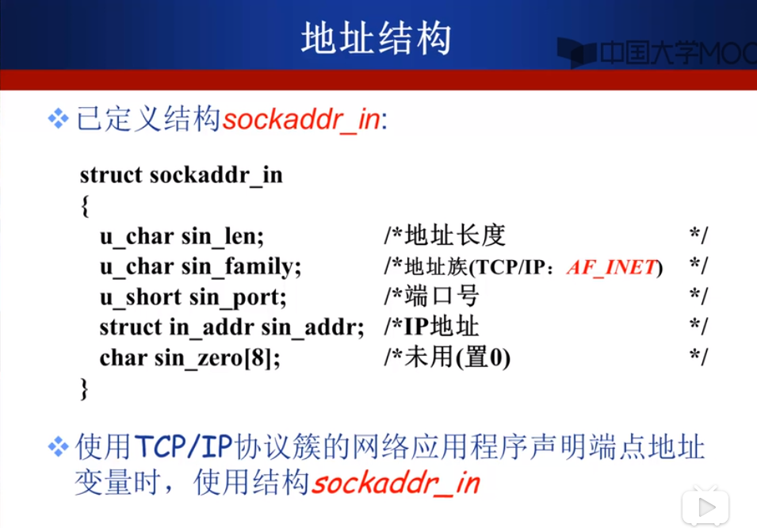

1. 开发网络程序有很多种接口，也有很多种途径可以选，针对端系统，并不包括路由器等设备上开发应用。下面根据分层模型列举了不同的开发技术，套接字编程是应用层与传输层之间的接口，而Web开发则是在应用层之上提供的网络程序设计接口。除此之外，一些远程过程调用和中间件编程也在应用层之上。

应用层由应用进程控制，而传输层以下由操作系统控制，因此，在应用层与传输层之间需要API来连接两层。

有几种典型的应用程序编程接口，其中socket是unix系统上最普遍的接口，而·winsock是基于socket而扩展的运行于windows之上的接口，当然，其他不同的系统也有不同的接口。

2. 套接字提供了应用进程间通信的抽象机制，客户和服务器进程在通信之前首先要创建套接字，接着使用套接字的过程中就像是两端的套接字直接相连了一样。事实上，这也是socket一词的来历，就像是插头连接插座之后二者就可以通信的抽象机制一样。

那么存在一个问题，一个主机上可能运行多个进程，一个进程又可能有1或多个套接字，如何定位和标识要连接的套接字呢？对于服务器来说，客户端看到的套接字标识是IP+端口号（对内），而服务器操作系统在管理套接字的时候，是通过套接字描述符对其进行管理的（对内），可以看出操作系统管理socket的机制类似于文件的抽象，事实上，UNIX操作系统中socket就是一类文件，windows是分开管理的。

在套接字的结构中，端点的地址是非常重要的信息，地址的结构是sockaddr_in，注意这个结构中的地址族，在TCP/IP协议栈中，端点的地址是IP+端口，而在其他协议栈中可能有不同的表示，因此，据此看出，socket编程从设计之初就是面向于各种协议栈的，而不是只面向于TCP/IP协议栈，对于使用TCP/IP的网络结构，地址族的值是一个常量AF_INET。

3. 