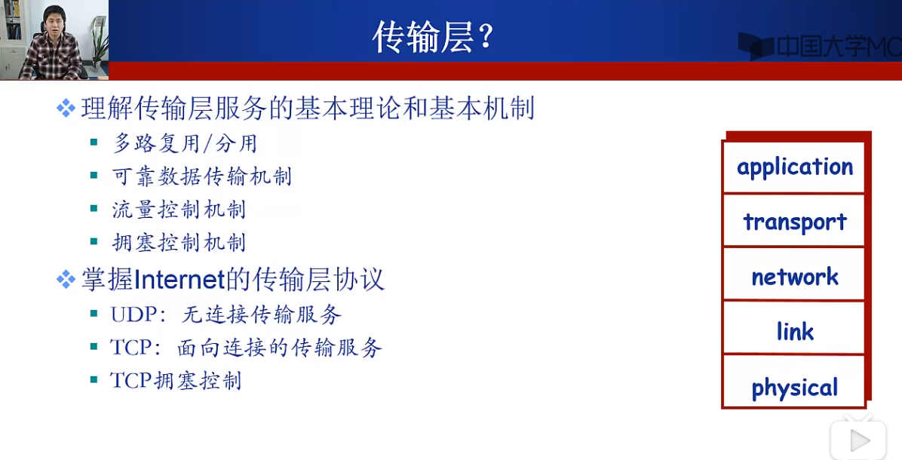
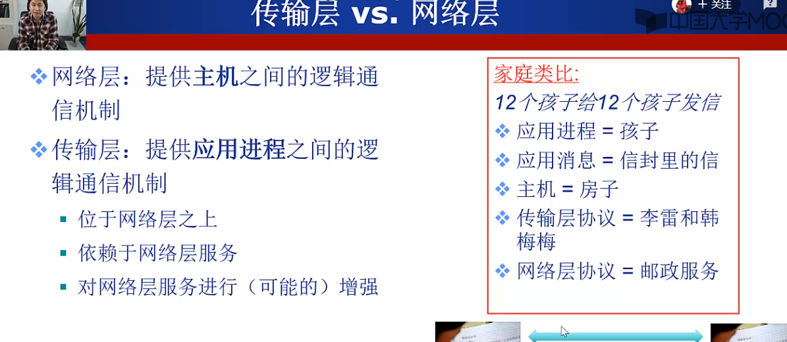
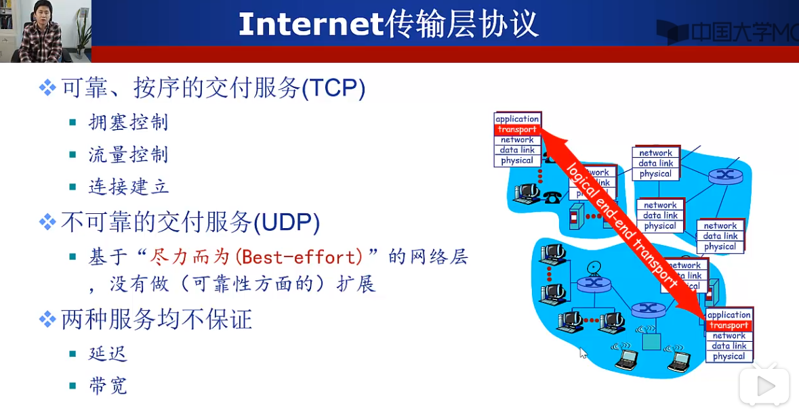

1. 主要内容：先掌握计算机网络传输层的主要功能，再根据Internet上的具体协议进行研究。

2. 传输层主要提供了不同端系统之间不同进程之间的逻辑通信机制，而网络层提供的是不同端系统之间的逻辑通信机制。因为一台主机可能运行多个不同的进程，因此，传输层提供的最基本的功能便是多路复用/多路分用。

3. 有了传输层的理论基础，Internet便根据理论实现了两种传输层协议：TCP/UDP。TCP提供了多种服务，而UDP只是基于网络层完成了传输层最基本的工作（多路复用和多路分用），没有在可靠性方面做扩展。且二者均不能保证延迟和带宽。