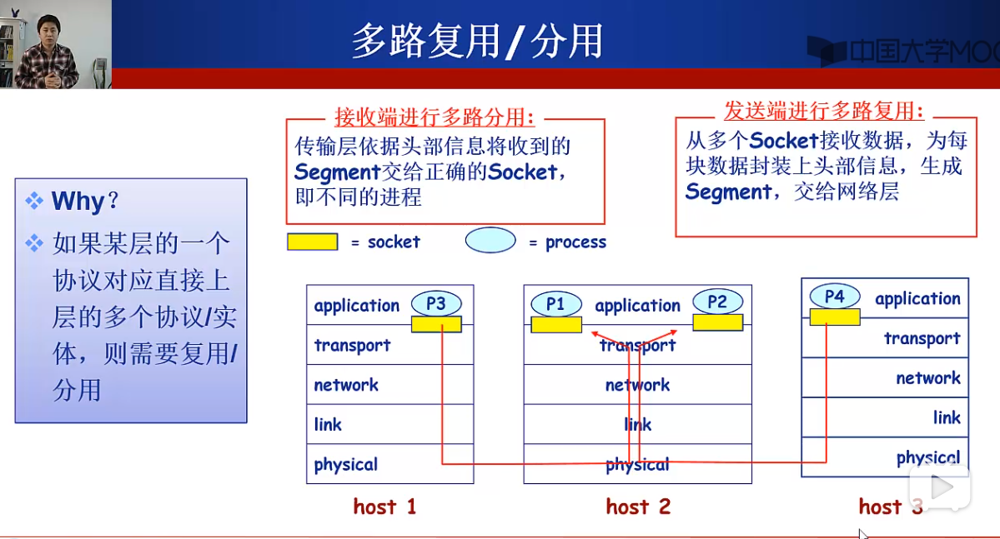
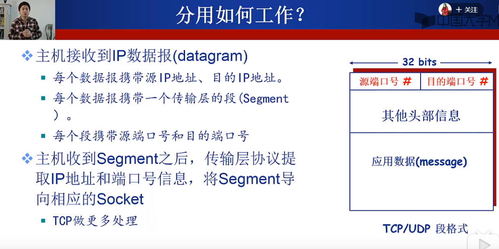
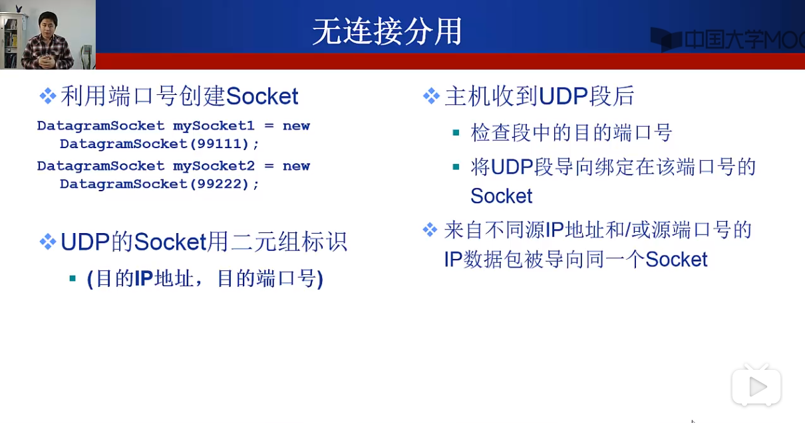
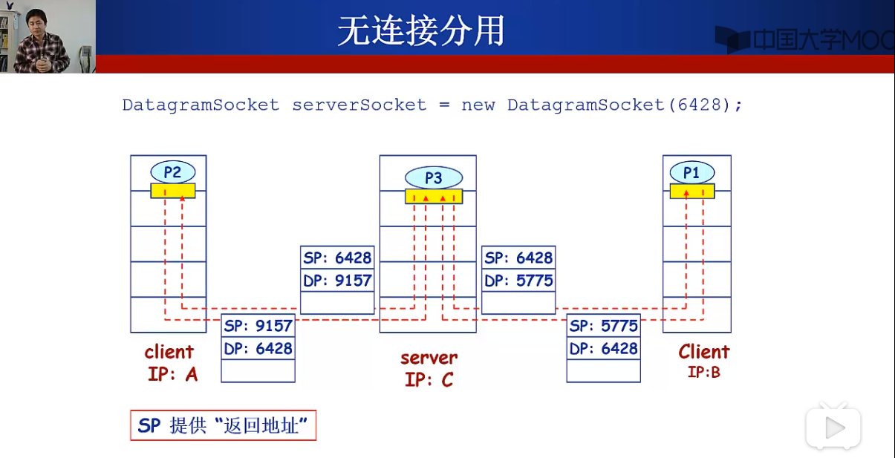
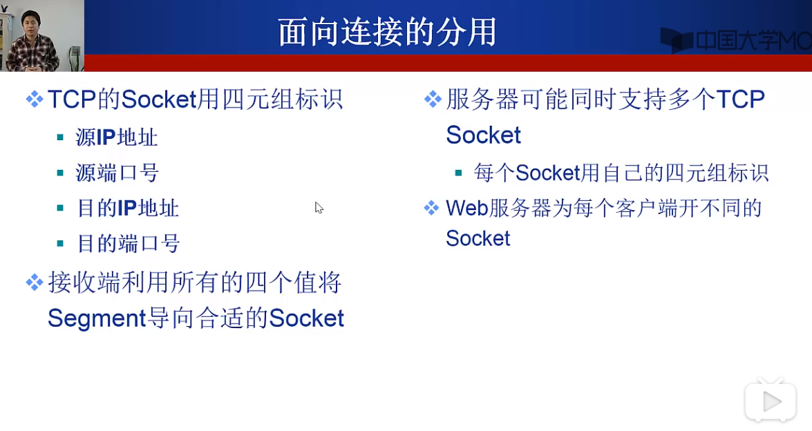
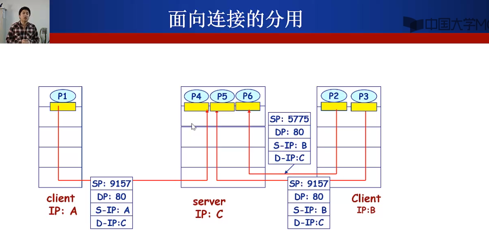
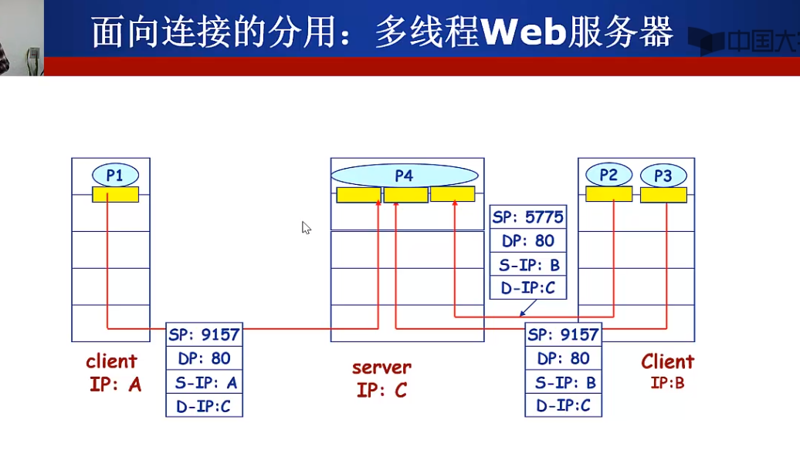

1. Socket相当于进程的门，从Socket进和出代表着从进程进和出。通过Socket接收数据，为每块数据加上头部信息，生成segment，交给网络层；根据接收到segment的头部信息将数据传送给不同的进程。这便是传输层的工作原理，但是发送端发送数据和接收端接收数据时，都要通过网络层发送和接收，因此传输层提供的最基本的服务便是多路复用和多路分用。

2. 多路分用如何工作？每个IP数据报携带源IP地址和目的IP地址，数据报中的段携带源端口号和目的端口号。TCP和UDP都有这两个端口号，遵循这个基本结构，尽管其他信息可能不同。

3. 无连接的分用，生成的socket靠二元组标识（目的IP地址和目的端口号），也就是对于不同的客户端而言，只要访问的端口号相同，则发送的数据就会被导向相同的socket

4. 有连接的分用，服务器端的socket靠四元组标识，对于相同源客户端的多个不同的连接请求，服务器端都会有不同的socket，因此，面向连接的分用会为每一个连接都建立一个socket。在最初的实现中，每一个socket都对应着一个进程来处理，而现在的实现中一般为socket新建一个线程。通过这个例子可以体现出tcp协议一对一的特点。

5. UDP协议，基于IP协议实现了复用分用功能和简单的错误校验