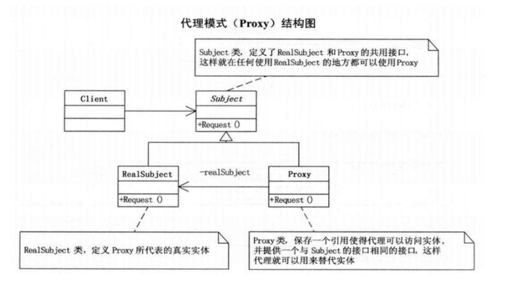

1. 代理模式
     代理模式是常用的Java设计模式，特征是代理类与被代理类具有相同的接口，代理类主要负责为被代理类预处理消息，将消息转发给被代理类，以及消息的事后处理。代理类和被代理类存在包含关系，代理类对象本身并不为调用者提供真正的服务，而是通过所包含的被代理类实现真正的服务。简单的说，代理类为被代理类的真正服务提供了一种间接性，可以增加多种用途。如下是代理模式（Proxy）结构图：
       

2. 静态代理
     如上图，通过图中的基本结构，接口、代理类、被代理类在编码时就被确定了下来。在编译后、程序运行之前，代理类的.class文件已经生成。
       举个代理模式的例子，诉讼案件中，人们通常通过律师向法庭提起诉讼，这就是一个很简单的例子，用户和律师都有提起诉讼的行为，而法庭通常通过律师与原告进行交互。下面是代码：
```java
package staticproxy;

public class TestStaticProxy {
    public static void main(String[] args) {
        AccuserProxy lawer = new AccuserProxy(new Accuser("Jack"));
        lawer.giveLawsuit();
    }
}

interface Lawsuit{
    void giveLawsuit();
}
class Accuser implements Lawsuit{
    private String name;
    public Accuser(String name) {
        this.name = name;
    }
    @Override
    public void giveLawsuit() {
        System.out.println(name + " 提起了法律诉讼");
    }
}
class AccuserProxy implements Lawsuit{
    private Accuser accuser;
    public AccuserProxy(Accuser accuser) {
        this.accuser = accuser;
    }
    @Override
    public void giveLawsuit() {
        System.out.println("消息预处理");
        accuser.giveLawsuit();
        System.out.println("消息的时候处理");
    }
}
//Output:
消息预处理
Jack 提起了法律诉讼
消息的时候处理
```
以上就是代理模式的一个简单例子，代理模式最主要的就是有一个公共接口（Lawsuit），一个具体的类（Accuser），一个代理类（AccuserProxy也就是律师）,代理类持有具体类的实例，代为执行具体类实例方法。上面说到，代理模式就是在访问实际对象时引入一定程度的间接性，因为这种间接性，可以附加多种用途。这里的间接性就是指不直接调用实际对象的方法，那么我们在代理过程中就可以加上一些其他用途。就这个例子来说，律师可以利用自己的专业知识来处理信息原告打赢官司。

3. 动态代理
何为动态？这个可能是比较难以理解的词，笔者认为，静态可以简单的认为编译时期的动作，而动态可以理解为运行时期的动作。如：静态代理在编译完成后，就已经确定了所有的.class文件和被代理类、代理类以及公共接口的所有代码结构。而动态代理在编译后并没有产生代理类的.class文件，而是在运行时期根据公共接口和被代理类的特征生成和加载到内存中去的，并通过Java提供的反射机制来调用代理类的方法。
> 大部分Java程序的代码都是静态加载的，没必要使用反射机制。动态代理的出现，可以说是Java反射机制的一个典型的应用场景。

下面说明如何将上面这个例子修改为动态代理：
- 定义公共接口和被代理类，这两个类结构和上文一样，注意无需定义代理类
- 自定义类继承InvocationHandler接口，同时将被代理类的一个实例包含到这个类中去
- 通过Proxy.newProxyInstance()方法获得动态代理产生的对象
- 使用这个对象调用方法即可

话不多说，先上代码：
```java
package dynamicproxy;

import java.lang.reflect.InvocationHandler;
import java.lang.reflect.Method;
import java.lang.reflect.Proxy;
public class TestDynamicProxy {
    public static void main(String[] args) {
        AccuserInvocationHandler accuserInvocationHandler = new AccuserInvocationHandler(new Accuser("Jack"));
        Lawsuit accuserProxy = (Lawsuit) Proxy.newProxyInstance(Lawsuit.class.getClassLoader(), new Class[]{Lawsuit.class}, accuserInvocationHandler);
        accuserProxy.giveLawsuit();
    }
}
interface Lawsuit{
    void giveLawsuit();
}
class Accuser implements Lawsuit {
    private String name;
    public Accuser(String name) {
        this.name = name;
    }
    @Override
    public void giveLawsuit() {
        System.out.println(name + " 提起了法律诉讼");
    }
}
class AccuserInvocationHandler implements InvocationHandler{
    private Object accuser;
    public AccuserInvocationHandler(Object accuser) {
        this.accuser = accuser;
    }
    @Override
    public Object invoke(Object proxy, Method method, Object[] args) throws Throwable {
        System.out.println("消息预处理");
        Object methodReturnValue = method.invoke(accuser, args);
        System.out.println("消息的时候处理");
        return methodReturnValue;
    }
}
//Output:
消息预处理
Jack 提起了法律诉讼
消息的时候处理
```
下面进行动态代理的原理分析：
代码第8行调用了Proxy.newInstance方法，从返回值就可以看得出这个方法的作用是根据传入的参数，也就是Lawsuit接口的信息新建了一个实现了Lawsuit接口的代理类的class文件，然后根据代理类的class文件生成了代理类对象。理解这个生成的.class文件可以帮助大家更好的理解动态代理的原理，运行下面代码可以得到生成的.class文件：
```java
public static void writeClassToDisk(String path){
        byte[] classFile = ProxyGenerator.generateProxyClass("$proxy0", new Class[]{Lawsuit.class});
        FileOutputStream fos = null;
        try {
            fos = new FileOutputStream(path);
            fos.write(classFile);
            fos.flush();
        } catch (FileNotFoundException e) {
            e.printStackTrace();
        } catch (IOException e) {
            e.printStackTrace();
        }finally{
            if(fos != null){
                try {
                    fos.close();
                } catch (IOException e) {
                    e.printStackTrace();
                }
            }
        }
    }
    public static void testGenerateProxyClass() {
        writeClassToDisk("D:/$Proxy0.class");
    }
```
将得到的class文件反编译得到：
```java
import java.lang.reflect.InvocationHandler;
import java.lang.reflect.Method;
import java.lang.reflect.Proxy;
import java.lang.reflect.UndeclaredThrowableException;
import testdynamicproxy.Person;
public final class $proxy0 extends Proxy
  implements Lawsuit
{
  private static Method m1;
  private static Method m3;
  private static Method m2;
  private static Method m0;

  public $proxy0(InvocationHandler paramInvocationHandler)
    throws 
  {
    super(paramInvocationHandler);
  }

  public final boolean equals(Object paramObject)
    throws 
  {
    try
    {
      return ((Boolean)this.h.invoke(this, m1, new Object[] { paramObject })).booleanValue();
    }
    catch (Error|RuntimeException localError)
    {
      throw localError;
    }
    catch (Throwable localThrowable)
    {
      throw new UndeclaredThrowableException(localThrowable);
    }
  }

  public final void giveLawsuit()
    throws 
  {
    try
    {
      this.h.invoke(this, m3, null);
      return;
    }
    catch (Error|RuntimeException localError)
    {
      throw localError;
    }
    catch (Throwable localThrowable)
    {
      throw new UndeclaredThrowableException(localThrowable);
    }
  }

  public final String toString()
    throws 
  {
    try
    {
      return (String)this.h.invoke(this, m2, null);
    }
    catch (Error|RuntimeException localError)
    {
      throw localError;
    }
    catch (Throwable localThrowable)
    {
      throw new UndeclaredThrowableException(localThrowable);
    }
  }

  public final int hashCode()
    throws 
  {
    try
    {
      return ((Integer)this.h.invoke(this, m0, null)).intValue();
    }
    catch (Error|RuntimeException localError)
    {
      throw localError;
    }
    catch (Throwable localThrowable)
    {
      throw new UndeclaredThrowableException(localThrowable);
    }
  }

  static
  {
    try
    {
      m1 = Class.forName("java.lang.Object").getMethod("equals", new Class[] { Class.forName("java.lang.Object") });
      m3 = Class.forName("dynamicproxy.Lawsuit").getMethod("giveLawsuit", new Class[0]);
      m2 = Class.forName("java.lang.Object").getMethod("toString", new Class[0]);
      m0 = Class.forName("java.lang.Object").getMethod("hashCode", new Class[0]);
      return;
    }
    catch (NoSuchMethodException localNoSuchMethodException)
    {
      throw new NoSuchMethodError(localNoSuchMethodException.getMessage());
    }
    catch (ClassNotFoundException localClassNotFoundException)
    {
      throw new NoClassDefFoundError(localClassNotFoundException.getMessage());
    }
  }
}
```
以上的代码只需重点的理解public final void giveLawsuit()函数和static静态块，static静态块中通过反射机制获得了giveLawsuit方法的信息并存到m3中，而public final void giveLawsuit()函数调用了this.h.invoke(this, m3, null); 域h是这个类的父类中的域，其实就是main函数方法调用时传入的参数accuserInvocationHandler。
因此accuserProxy.giveLawsuit();方法的实现，其实是调用了accuserInvocationHandler中的invoke方法，而invoke的三个参数分别代表：代理类对象本身、真正调用的方法名、调用方法时的参数。所以在invoke方法中，使用method.invoke(accuser, args); （此时的method变量即代表giveLawsuit方法）便可实现函数调用。
> 本质上，动态代理的实质还是静态代理。动态生成的accuserProxy代理对象中包括InvocationHandler对象，而InvocationHandler对象中则包含真正的被代理类Accuser对象，通过比静态代理多了一层的包含关系实现了动态代理。而InvocationHandler对象中一个invoke方法能实现被代理类所有的方法则是由于通过传入的method参数可以代表所有的函数这个特征来完成的。这也是动态代理的方便处之一：通过一个方法，改变method参数的数值，可以完成多个方法的调用。

4. 静态代理与动态代理的联系
- 共同点
二者本质上都是代理模式，实现的原理都是通过包含关系进行方法调用和服务的包装与代理。

- 不同点
故名思议，静态代理在编译后运行前就确定了代理类class文件以及函数调用关系和函数调用入口，而动态代理则是通过运行时根据传入的接口信息动态生成的代理类，其函数调用也通过参数来控制，做到了一个函数可以实现多个函数的特点，对于一个被代理类中存在很多函数的情况，这种方式无疑是更方便更有扩展性的。

参考：[参考链接，侵删](https://www.cnblogs.com/gonjan-blog/p/6685611.html).