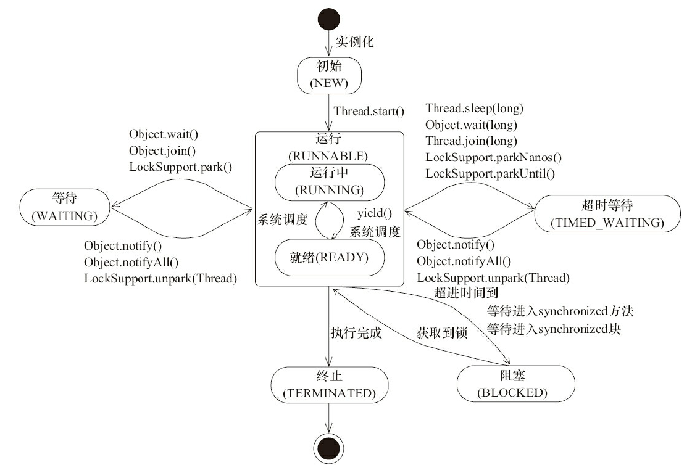
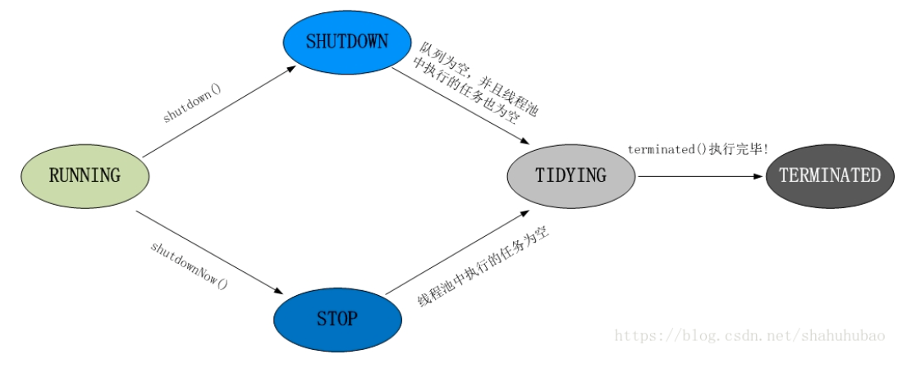

# Table of Contents

  * [Java基础](#java基础)
      * [1、面向对象是什么？](#1、面向对象是什么？)
      * [2、什么是Java虚拟机？为什么Java虚拟机被称作是平台无关的编程语言？](#2、什么是java虚拟机？为什么java虚拟机被称作是平台无关的编程语言？)
      * [3、JDK，JRE，JVM关系是什么？](#3、jdk，jre，jvm关系是什么？)
      * [4、Java支持的数据类型有哪些？什么是自动拆装箱？](#4、java支持的数据类型有哪些？什么是自动拆装箱？)
      * [5、值传递和引用传递？](#5、值传递和引用传递？)
      * [6、Java支持多继承吗？](#6、java支持多继承吗？)
      * [7、接口和抽象类的区别，abstract关键字。](#7、接口和抽象类的区别，abstract关键字。)
      * [8、单例模式（饱汉模式和饿汉模式）和工厂模式。](#8、单例模式（饱汉模式和饿汉模式）和工厂模式。)
      * [9、Error和Exception有什么区别？关于异常处理的一些细节。](#9、error和exception有什么区别？关于异常处理的一些细节。)
      * [10、阐述final、finally、finalize的区别。](#10、阐述final、finally、finalize的区别。)
  * [Java字符串](#java字符串)
      * [1、String和StringBuilder，StringBuffer区别？](#1、string和stringbuilder，stringbuffer区别？)
      * [2、字符串常量池与String.intern\(\)方法。](#2、字符串常量池与stringintern方法。)
  * [Java集合框架](#java集合框架)
      * [1、Java说出一些集合框架的优点？](#1、java说出一些集合框架的优点？)
      * [2、集合框架中的泛型有什么优点？泛型和C\+\+模板的对比。](#2、集合框架中的泛型有什么优点？泛型和c模板的对比。)
      * [3、为何Map接口不继承Collection接口？](#3、为何map接口不继承collection接口？)
      * [4、什么是迭代器-Iterator？](#4、什么是迭代器-iterator？)
      * [5、Iterator和ListIterator的区别是什么？](#5、iterator和listiterator的区别是什么？)
      * [6、fail-fast和fail-safe的区别与联系？](#6、fail-fast和fail-safe的区别与联系？)
      * [7、ArrayList的问题。](#7、arraylist的问题。)
      * [8、HashMap的工作原理是什么？HashMap的一些常见问题。](#8、hashmap的工作原理是什么？hashmap的一些常见问题。)
      * [9、List的三种遍历方式对比。](#9、list的三种遍历方式对比。)
      * [10、ConcurrentHashMap的一些问题。](#10、concurrenthashmap的一些问题。)
      * [11、CopyOnWriteArrayList的一些问题。](#11、copyonwritearraylist的一些问题。)
  * [Java多线程](#java多线程)
      * [1、线程相关知识。](#1、线程相关知识。)
      * [2、线程池的使用。](#2、线程池的使用。)
      * [3、volatile关键字。](#3、volatile关键字。)
      * [4、synchronized相关问题。](#4、synchronized相关问题。)
      * [5、synchronized与volatile对比。](#5、synchronized与volatile对比。)
      * [6、CAS（compare-and-swap）相关问题。](#6、cas（compare-and-swap）相关问题。)
  * [Java虚拟机](#java虚拟机)


## Java基础
#### 1、面向对象是什么？
- 面向对象是一种编程思想，世间万物都可以看作对象，通过对类的抽取便可完成模块的设计，优势：
  - 代码开发模块化，更容易维护和修改。
  - 复用性比较强。
  - 增加代码可读性。
- 面向对象四大基本特征：
  - 抽象，提取现实世界中某事物的关键属性，将这些属性抽象为数据和行为。
  - 封装，可以使类具有更好的独立性和隔离性，只暴露给外部一些属性和操作，以保证类的高内聚。
  - 继承，对现有类的一种复用机制，在Java语言中包括类的继承和接口的实现。
  - 多态，在继承的基础上实现，多态的三个要素：继承、重写和父类引用指向子类对象，表现为调用相同的方法呈现出不同的行为。包括编译时多态和运行时多态。方法的重载和重写都是实现多态的方式，区别在于前者实现的是编译时的多态性，而后者实现的是运行时的多态性。重载发生在一个类中，同名的方法如果有不同的参数列表（参数类型不同、参数个数不同或者二者都不同）则视为重载；重写发生在子类与父类之间，重写要求子类被重写方法与父类被重写方法有相同的返回类型，比父类被重写方法更好访问，不能比父类被重写方法声明更多的异常（里氏代换原则）。重载对返回类型没有特殊的要求。
#### 2、什么是Java虚拟机？为什么Java虚拟机被称作是平台无关的编程语言？
- Java虚拟机是一个可以执行Java字节码的虚拟机进程。Java源文件被编译成能被Java虚拟机执行的字节码文件。
- 因为Java虚拟机的存在，Java源程序不需要在不同的平台单独重写或者重新编译。Java虚拟机负责与底层操作系统交互，对Java源程序屏蔽掉了底层的细节，因此Java编程语言本身是平台无关的，这也是Java语言的一大优势。
#### 3、JDK，JRE，JVM关系是什么？
- 简单说来，JDK包含JRE，JRE包含JVM
  - JVM，Java虚拟机，提供了字节码文件的运行环境支持，在运行时，是一个Java虚拟机进程，负责解释执行字节码。
  - JRE，Java运行环境，提供了Java应用程序运行时必要的软件环境，包含JVM和丰富的系统类库。
  - JDK，Java开发工具包，包括编译运行Java程序的开发工具以及JRE。开发工具比如：用于编译的javac，用于启动JVM运行Java程序的java命令，用于生成文档的javadoc命令以及用于打包的jar命令等。
#### 4、Java支持的数据类型有哪些？什么是自动拆装箱？
- 基本数据类型（整数默认int，浮点数默认double，float和double类型后面要加后缀）
  - 整数类型byte，short，int，long
  - 字符类型char
  - 浮点类型float，double
  - 布尔类型boolean
  - 引用数据类型，包括类，接口，数组等
  - 自动装箱和拆箱是基本类型和包装类型之间的转换，自动装箱常用于集合类存放基本数据类型。
#### 5、值传递和引用传递？
- 值传递是对基本数据类型而言的，传递的是该变量本身的一个副本，在函数内部改变这个副本不会影响到变量本身。
- 引用传递是对引用类型的变量而言的，传递的是该对象地址的一个副本，而不是该对象本身或该对象本身的副本。
#### 6、Java支持多继承吗？
- Java中类只支持单继承，但是Java中接口支持多继承，接口的作用是用于扩展对象的功能，一个子接口继承多个父接口，说明子接口扩展了多个功能。
- 为什么Java不支持类的多继承？
  - Java设计者将简单视为Java语言的一大重要性质，相比C++而言，Java去掉了很多复杂并且容易使程序陷入陷阱的一些特性。多继承就是其中之一，如菱形继承问题。Java的设计者认为这种特性带来的问题多于它带来的方便，所以就不支持多继承。而事实上，不使用多继承仍然能很好的解决问题。
#### 7、接口和抽象类的区别，abstract关键字。
- 从设计层面上讲，抽象类是对类属性和行为的抽象，可以认为是子类的模板，而接口是行为的抽象，是一种行为的规范。

|   | 抽象类 | 接口 |
|-|-|-|
| 默认的方法实现 | 可以有默认的方法实现 | 完全抽象，不能实现任何方法 |
| 实现 | 子类使用extends继承抽象类，如果子类不是抽象类的话，需要实现父类中所有的抽象方法 | 子类使用implements实现接口，需要提供接口中所有声明方法的实现 |
| 构造器 | 抽象类可以有构造器 | 不能有构造器 |
| 与正常Java类的区别 | 除了不能实例化之外，没有任何区别 | 接口是与Java类完全不同的类型，不能当作正常类来使用 |
| 访问修饰符 | public，private，default等 | 默认public，不能使用其他修饰符 |
| main方法 | 可以有main方法，并且可以运行 | 没有main方法，无法运行 |
| 多继承 | 继承单个类，实现多个接口 | 继承一个或多个其他接口 |
| 速度 | 它比接口速度快 | 接口速度稍微有些慢，因为它需要时间去寻找类中实现的方法 |
| 添加新方法 | 给抽象类中添加新方法之后，可以提供默认的实现，因此，在继承抽象类的子类无需修改 | 如果往接口中添加新方法，必须修改实现该接口的类 |
| 变量 | 各种类型均可 | 默认static final类型的 |

- 什么时候使用抽象类和接口？
  - 如果想拥有默认实现的方法，就是用接口；
  - 如果想实现类似多重继承的机制，就使用接口，因为Java类不支持多重继承；
  - 如果基本功能在不断改变，需要不断的向抽象类中添加方法，就使用抽象类。这种情况下使用接口的话需要大量改动已经实现这个接口的子类。
- 关于抽象类和抽象方法的限制如下：
  - 用abstract修饰的类为抽象类，修饰的方法为抽象方法
  - 抽象类中可以有0个或多个抽象方法
  - 有一个或以上抽象方法的类必须标记为抽象
  - abstract不能与final并列修饰一个类
  - abstract不能与private，static，final或native并列修饰同一个方法
- 抽象的（abstract）方法是否可同时是静态的（static），是否可同时是本地方法（native），是否可同时被synchronized修饰？
  - 都不能。抽象方法需要子类重写，而静态的方法是无法被重写的，因此二者是矛盾的。本地方法是由本地代码（如C代码）实现的方法，而抽象方法是没有实现的，也是矛盾的。synchronized和方法的实现细节有关，抽象方法不涉及实现细节，因此也是相互矛盾的。
#### 8、单例模式（饱汉模式和饿汉模式）和工厂模式。
```java
public class Singleton{
	private Singleton(){}
	private Singleton s = new Singleton();
	public Singleton getInstance(){
		return s;
	}
}//饱汉模式
public class Singleton{
	private Singleton(){}
	private Singleton s = null;
	public Singleton getInstance(){
		if(s == null){
			s = new Singleton();
		}
		return s;
	}
}//饿汉模式
```
```java
interface IFactory{
	public IProduct createProduct();
}
class Factory implements IFactory{
	public IProduct createProduct(){
		return new Product();
	}
}
class Client{
	public static void main(String[] args){
		IFactory factory = new Factory();
		IProduct product =factory.createProduct();
		product.method();
	}
}
```
#### 9、Error和Exception有什么区别？关于异常处理的一些细节。
- Error表示系统级的错误，编译错误或虚拟机错误，程序无法处理的错误，如内存溢出；
- Exception是需要程序捕捉和处理的异常，表示的是程序本身的设计和实现问题，通过写出运行正常的程序，Exception是可以避免的。
  - 运行时异常：
    - 表示程序运行时出现的错误状态，是运行时错误，只要程序逻辑设计的没有问题就不会发生。
    - NullPointerException
    - IndexOutOfBoundsException 
  - 受检异常：
    - 跟程序运行的上下文有关，即使程序逻辑设计没有错误，仍然有可能发生，如IO时访问文件，即使程序逻辑正确，仍有可能因文件不存在导致异常。
  - Java编译器要求必须声明和抛出可能发生的受检异常，并不要求必须声明和抛出运行时异常。
- try{}里有一个return语句，那么紧跟在这个try后的finally{}里的代码会不会被执行，什么时候被执行，在return前还是后？
  - 先执行finally字句，再return。实现方式是记录下返回值等到finally执行完毕再返回这个值。所以在finally中改变返回值是不好的，如果修改的话，就会返回一个修改的值。C#语言直接使用编译错误来阻止在finally中改变返回值，Java中可以通过提升编译器的检查级别来完成。
- Java语言使用throw,throws,try,catch,finally五个关键词来处理异常。
#### 10、阐述final、finally、finalize的区别。
- final是一个修饰符，有三种用法。修饰类时，则该类不能被继承；修饰方法时也同样只能使用，不能被继承；修饰基本类型变量时，如果编译期确定，则为编译期常量，修饰引用变量时，则引用本身不能改变，引用指向的对象仍可以改变。
- finally，通常放在try…catch…的后面构造总是执行代码块，这就意味着程序无论正常执行还是发生异常，这里的代码只要JVM不关闭都能执行，可以将释放外部资源的代码写在finally块中。
- finalize，Object类中的方法，跟垃圾收集机制有关，在对象被清除之前，如果GC发现有必要执行对象的finalize()方法的话，则会执行这个方法。但是这个方法不推荐使用，如果想要清理资源的话使用finally就能做的很好了。至于为什么要设计这个方法，在《Java编程思想》中，作者提到设计这个方法是一种C++析构函数到Java语言的一种妥协，不推荐重写这个方法。
## Java字符串
#### 1、String和StringBuilder，StringBuffer区别？
- String是只读字符串，使用String引用的字符串内容不可修改。
- StringBuilder是Java 5中引入的，属于可变字符串，其用法与StringBuffer完全相同，只不过没有线程安全保证，因为各个函数都没有被synchronized修饰，因此效率更高。
#### 2、字符串常量池与String.intern\(\)方法。
- 关于字符串常量池，先看一下两句代码：
    ```java
    String s1 = new String("ab");//“ab”存在字符串常量池中，而堆中也有一个相同的对象，s1指向堆中的那个对象
    String s2 = "cd";//"cd"存在字符串常量池中，堆中无建立对象，s2指向常量池中的"cd"
    ```
- 关于String.intern()方法，Native方法，它的作用是：如果字符串常量池中已经包含了一个等于此String对象的字符串，则返回字符串常量池(运行时常量池)中这个字符串的String对象，如果不存在，则jdk1.6和jdk1.7将会有不同的行为，看如下代码：
    ```java
    String s1 = new StringBuilder("go").append("od").toString();
    System.out.println(s1.intern() == s1);
    String s2 = new StringBuilder("ja").append("va").toString();
    System.out.println(s2.intern() == s2);
    //jdk1.6输出 false false
    //jdk1.7输出 true false
    ```
  - 对以上不同结果的解释是：对于jdk1.6，如果常量池中没有相应字符串，则会复制一份原字符串对象，然后常量池中的引用指向这个新复制的字符串；而对于jdk1.7，当常量池中没有相应的字符串时，不会复制原字符串对象，只会创建一个新的字符串引用指向原来的字符串对象；
  - 对于jdk1.6的两个结果，不难理解，s1和s2都是指向堆中对象，而通过intern()方法获得的是常量池中的字符串引用，均指向s1和s2的拷贝对象；
  - 对于jdk1.7的结果，对于第一个true，比较容易理解，因为此时的intern()不会拷贝字符串，堆上的字符串引用变量和常量池中的字符串引用变量指向的都是同一个地址；而第二个false是因为"java"这个字符串时常驻常量池中的，二者的字符串引用变量指向的不是同一个位置，"java"这个字符串在System类中，而java虚拟机会自动调用System这个类。
    ```java
    //在System类中的注释可以知道，调用了initializeSystemClass方法，在此方法中调用了Version对象的init静态方法
    //sun.misc.Version.init();
    //因此sun.misc.Version类会在JDK类库的初始化过程中被加载并初始化。
    //查看Version类定义的私有静态字符串常量如下：
    private static final String launcher_name = "java";
    private static final String java_version = "1.7.0_51";
    private static final String java_runtime_name = "Java(TM) SE Runtime Environment";
    private static final String java_runtime_version = "1.7.0_51-b13";
    //在初始化Version类时，对其静态常量字段根据指定的常量值做默认初始化，所以"java"被加载到了字符串常量池中，修改上面代码使字符串值为上面常量中的任意一个都会返回false。
    String str2=new StringBuilder("1.7.0").append("_51").toString();
    System.out.println(str2.intern()==str2);
    //输出false
    ```
## Java集合框架
#### 1、Java说出一些集合框架的优点？
- 使用核心集合类降低开发成本，而非实现我们自己的集合类。
- 随着使用经过严格测试的集合框架类，代码质量会得到提高。
- 通过使用JDK附带的集合类，可以降低代码维护成本。
- 复用性和可操作性。
#### 2、集合框架中的泛型有什么优点？泛型和C\+\+模板的对比。
- 泛型的优点：
  - 提供编译期类型检查，泛型允许程序员为集合提供一个可以容纳的对象类型，有效的避免了运行时期的ClassCastException；
  - 泛型使代码整洁，不需要显式的类型转换和instanceOf操作；
  - 给运行时带来好处，不会产生类型检查的字节码指令；
- Java泛型和C++模板对比：
  - 尽管二者表现形式相似，但底层实现机制却大相径庭。Java泛型只是编译时期的“语法糖”，编译之后指定的泛型类型便被消除，提供了一种编译期检测机制；而C++模板却截然不同，编译器会针对每种模板类型创建一份模板代码的副本，如MyClass\<A\>和MyClass\<B\>不会共享静态变量；
  - C++模板可以使用int等基本数据类型，而Java中的泛型擦除机制使得Java集合类中不能使用基本数据类型；
  - C++中类型模板可以实例化，Java不支持；
  - 在Java中，无论类型参数是什么，泛型类的实例都是同一个类型，而C++中参数类型不同，实例类型也不同。
#### 3、为何Map接口不继承Collection接口？
- 集合提供的是“一组对象”的概念，而Map提供的是一组对象到另一组对象映射的概念，二者在概念上就不相同。
- Map提供了抽取key集合和value列表集合的方法，这并不适用于“一组对象”的规范。
#### 4、什么是迭代器-Iterator？
- 迭代器是一个接口，提供了对集合元素进行迭代的方法，同时也可以在迭代的过程中删除元素。
#### 5、Iterator和ListIterator的区别是什么？
- Iterator可用来遍历Set和List集合，但是ListIterator只能用来遍历List；
- Iterator对集合只能是前向遍历，ListIterator既可以前向也可以后向；
- ListIterator实现了Iterator接口，并包含了其他功能，如增加元素，替换元素	，获取前一个和后一个的元素索引等。
#### 6、fail-fast和fail-safe的区别与联系？
- fail-fast机制，即快速失败机制，是java集合(Collection)中的一种错误检测机制，作用于使用迭代器对集合进行迭代的时期。当在迭代集合的过程中该集合在结构上发生改变的时候，就有可能会发生fail-fast，即抛出ConcurrentModificationException异常。fail-fast机制并不保证在不同步的修改下一定会抛出异常，它只是尽最大努力去抛出，所以这种机制一般仅用于检测bug。该机制会抛出异常，在java.util包中的集合使用该机制。具体实现机制为，在集合类中存在一个检测集合结构变化的变量modCount，每当集合结构变化时，该变量会修改。而在迭代器中也维护了一个exceptedModCount变量，起初与modCount相等，每当调用next()或remove()方法是，都会检测这两个变量是否相等，如果不相等，抛出异常，即发生fail-fast。但为什么使用迭代器调用remove()改变集合结构不会触发呢？是因为迭代器本身调用remove()的时候，会将两个变量重新设置为相等，因此当对集合同时迭代和修改时，阿里巴巴规范中明确规定到要用迭代器，而不是使用一般的for循环。
- fail-safe机制，安全失败，采用安全失败机制的集合容器，在遍历时不是直接在集合内容上访问的，而是先复制原有集合内容，在拷贝的集合上进行遍历。所以在遍历的过程中其他线程对集合的修改不会被检测到，不会触发异常。优点是不会触发异常，缺点是需要拷贝很多无用的对象，且迭代器开始遍历的那一刻拿到的是集合拷贝，在遍历期间发生的改变是无从知晓的。java.util.concurrent包下的容器都采用安全失败，可以用于多线程并发访问，而fail-fast机制则抑制了java.util包中集合的多线程并发访问。
- 事实上，fail-fast机制不是一种完备的机制，这种机制与同步不同，通过这种机制调节多线程并发访问容器，进行读操作的线程仍会看到失效的值，迭代器本身意识不到容器内容的修改。但是，这是一种设计上的权衡，从而降低了同步对程序性能带来的影响。
#### 7、ArrayList的问题。
- ArrayList和Vector的异同
  - 相同点
    - 二者都是基于索引的，内部由数组实现；
    - 二者都是有序的，可以维护元素插入的顺序；
    - 二者都实现fail-fast机制；
    - 都允许null值，可以使用索引值进行随机访问。
  - 不同点
    - Vector同步，而ArrayList不是，但是如果在多线程情况下，目前推荐使用CopyOnWriteArrayList。
  - Array和ArrayList区别
    - Array可以容纳基本类型和引用类型，ArrayList只能容纳引用类型；
    - Array大小固定，ArrayList可扩展。
- ArrayList代码分析：
  - ArrayList中一些默认值
    - EMPTY_ELEMENTDATA是一个长度为0的空数组，DEFAULTCAPACITY_EMPTY_ELEMENTDATA也是一个长度为0的空数组，当调用无参构造函数时，使用后者，但调用带有capacity的构造函数时，如果显式的将长度指定为0，则使用前者。默认长度DEFAULT_CAPACITY为10，当使用无参构造函数时，长度为0将延迟到第一次add时。
  - 扩容问题。
    - 每次扩容1.5倍，使用移位算法，且数组最大长度为MAX_ARRAY_SIZE ，int最大值-8.
  - 扩容时函数调用
    - add()，这个函数会调用ensureCapacityInternal(size + 1)
    - ensureCapacity(minCapacity)，这个函数会取出minCapacity与10的最大值，调用ensureExplicitCapacity(minCapacity)
    - ensureExplicitCapacity(minCapacity)，这个函数会检查minCapacity与数组length的大小，如果minCapacity比较大，则增长数组，调用grow(minCapacity)
    - grow(minCapacity)，这个函数是真正的数组扩容函数，这个函数会获取新的数组长度，newCapacity = oldCapacity+(oldCapacity>>1)，这个函数同时处理了newCapacity溢出变成负数的问题，我有点看不懂。总之，当需要扩容的数组长度大于Integer.MAX_VALUE-8时，新数组的长度会变为Integer.MAX_VALUE-8。如果一直添加元素，当元素数量变为Integer.MAX_VALUE-7时，数组长度会变为Integer.MAX_VALUE，如果继续添加元素，超过了整数的最大范围，则会抛出异常。这个机制由两个if判断和hugeCapacity(minCapacity)方法来保证。
  - 最好在大量调用add之前调用ensureCapacity(minCapacity)以避免数组的频繁扩容。
#### 8、HashMap的工作原理是什么？HashMap的一些常见问题。
- HashMap工作原理：
  - HashMap通过结合数组与链表的优点进行设计，是一个链表数组，基于hash的原理，使用put(k, v)将对象存储，使用get(k)获取对象。当调用这两个方法时，都会先根据key的hashCode()计算该key所在的bucket，然后进行搜索；
- 如果两个key的hashCode相同，如何获取值对象？
  - 当调用get()方法时，先根据key的hashCode()获得bucket位置，然后根据key.equals()方法找到正确的节点，最终找到要找的值；
- hashCode()方法和equals()方法的重要性
  - HashMap中使用hashCode()方法找到bucket位置，然后通过equals()方法找到具体的对象。如果这两个方法没有被正确的实现，则不同的对象可能会产生相同的hashCode()和equals()输出，HashMap会认为他们是相同的，并且在把不同的对象覆盖掉。因此，两个方法应该遵循以下规则：
  - 如果o1.equals(o2)，那么o1.hashCode() == o2.hashCode()总是为true的；
  - 如果o1.hashCode() == o2.hashCode()，并不意味着o1.equals(o2)会为true。
- 为什么重写equals就要重写hashCode()
  - 如果不重写hashCode()，hashCode()默认返回结果为根据对象的内存地址换算出来的一个值。重写了equals()而不重写hashCode()可能会导致结果不符合上述的第一个规则，那么在使用基于hash的数据结构时会产生错误。
- HashMap和HashTable的区别
  - HashMap非线程安全，HashTable线程安全；
  - HashMap允许null的key和value出现，而HashTable不行；
  - HashMap效率比HashTable高；
  - HashTable线程安全，适合于多线程环境。然而，这个类已经不建议使用，其内部没有过多的优化，在多线程情况下使用ConcurrentHashMap来替代。
  - Hashtable默认的初始大小为11,每次扩容为2n+1。HashMap默认为16，每次扩容为二倍。HashMap链表长度大于默认阈值8时，会自动转为红黑树，这是一个非常大的改进，Hashtable没有这样的机制。
- HashMap和TreeMap的选择
  - 不考虑有序性问题的话，HashMap效率更高；
  - 如果需要有序的key集合，则使用TreeMap。
- HashMap中代码分析
  - threshold,size,loadFactor分别代表什么含义？HashMap的一些默认值设置。
    - size是HashMap中实际存储键值对的数量。
    - loadFactor为负载因子，默认值为0.75f，且threshold = loadFactor * caacity,capacity代表哈希桶及数组的长度。loadFactor可以大于1，不过在内存空间充裕的情况下，尽量不要将loadFactor增大，增大的话会增加碰撞几率。同时，因为loadFactor一般小于1，所以在平均情况下，每个哈希桶也就只装一个键值对，因此HashMap的访问时间复杂度为O(1)。
    - 当size大于threshold时，就会引起扩容。扩容是一个耗费性能的操作，所以使用之前尽量估算大小，以避免频繁的扩容。
    - 哈希数组长度默认为16，链表转红黑树的阈值默认为8，红黑树转链表阈值为6，最大容量是1<<30，
#### 9、List的三种遍历方式对比。
- 传统的for循环遍历，基于计数器：
  - 对于顺序存储的ArrayList，每次遍历平均时间复杂度为O(1)，遍历整个集合的平均时间复杂度为O(n)。
  - 对于链式存储的LinkedList，使用索引方式遍历的话，每次遍历复杂度为O(n)，遍历整个集合的平均时间复杂度为O(n^2)。
- 使用Iterator迭代器遍历：
  - 对于顺序存储来说，使用迭代器遍历并不会提高性能，但是方便在循环中删除多个元素。
  - 对于链式存储来说，使用迭代器可以使遍历整个集合的时间复杂度降为O(n)，因为使用迭代器遍历时会记录当前遍历的状态。
- foreach循环遍历：
  - 实质上也是迭代器遍历方式，是编译器提供的一个语法糖，语法上更简洁。
  - 但是不能很好的在遍历时删除多个元素。因为使用这种方式遍历时，遍历使用迭代器，而删除并没有使用迭代器，会引发fail-fast机制。
- 总之，针对链式存储来说，使用迭代器遍历会提高性能。而当想要在遍历时删除多个元素的话，就要显式的使用迭代器了。
- 在Java集合框架中，提供了一个RandomAccess接口，但该接口中并没有任何的方法，通常该接口被用作标记，标记该List是否支持随机访问。比如支持随机访问的ArrayList便实现了这个接口，而LinkedList并没有实现。实现这个接口典型的意义是：
  ```java
  if (list instanceof RandomAccess) {
      //使用传统的for循环遍历。
  } else {
      //使用Iterator或者foreach。
  }
  ```
#### 10、ConcurrentHashMap的一些问题。
- ConcurrentHashMap的一些特点：
  - ConcurrentHashMap也是一个基于散列的Map，但是它使用了一种完全不同的加锁策略来提供更高的并发性和伸缩性。
  - ConcurrentHashMap并不是将每个方法在同一个锁上同步使得每次只能有一个线程访问容器，而是使用一种粒度分段锁机制来实现更大程度的共享。
  - 在这种共享机制下，任意多的读取线程可以同时访问，一定数量的写入线程可以并发修改，读取线程和写入线程也可以并发的访问。使得并发访问环境下将实现更高的吞吐量，而在单线程中只损失非常小的性能。
  - ConcurrentHashMap返回的迭代器具有弱一致性，并非快速失败。弱一致性的迭代器可以容忍并发的修改，当创建迭代器时会遍历已有的元素，并可以（但是不保证）将修改后的数据反映给容器。
  - 尽管ConcurrentHashMap有很多优越的改进，但还是加入了一些需要权衡的因素，对于需要在整个Map上进行计算的方法，例如size()和isEmpty()，它返回的结果在计算时可能已经过期了，所以只是一个估计值。这看上去有些不安全，但事实上，这样的方法在并发环境下用处很小，因为它们的返回值总是在不断的变化。因此，这也是一个设计上的权衡，通过弱化这些操作，来换取其他更重要操作的优化，包括get，put，containsKey，remove等。
  - 总之，与Hashtable和synchronizedMap等同步容器相比，ConcurrentHashMap有着更多的优势，因此在大多数情况下，使用ConcurrentHashMap可以进一步提高代码的可伸缩性。
- 必须使用同步容器的情况：
  - ConcurrentHashMap不能被加锁来执行独占访问，因此无法使用客户端加锁来创建新的原子操作。例如，某些先检查后执行的复合操作，这种情况下只能使用同步容器并加锁。
  - 但是ConcurrentHashMap已经为我们提供了很多现成的符合操作，如若没有则添加，若相等则删除等，可以满足大部分的情况。
#### 11、CopyOnWriteArrayList的一些问题。
## Java多线程
#### 1、线程相关知识。
- 线程的状态
  - NEW，未调用start()方法之前处于的状态。
  - RUNNABLE，包括运行和就绪。
  - BLOCKED，阻塞，表示线程阻塞于锁。
  - WAITING，等待状态，表示当前线程需要等待其他线程做一些特定的动作。
  - TIMED_WAITING，超时等待，不同于WAITING，在指定的时间可以自行返回。
  - TERMINATED，终止状态，表示当前线程已经执行完毕。
  
- 理解中断状态
  - 通过调用Thread.interrupt()可以修改线程中的中断标识位，而不是使线程强行结束，线程自己通过中断标识位的改变决定做的事情。使用Thread.isInterrupted()来查看标识位。
  - 抛出InterruptedException之后，中断标识位会被清除。
- 过期的suspend()，resume()和stop()方法
  - 代表着暂停、恢复和结束。
  - suspend调用后不会释放占有的资源，容易引发死锁。
  - stop调用之后不会保证线程资源的正确释放，通常是没有给予线程完成资源释放工作的机会，因此可能会导致线程进入不确定的状态。
#### 2、线程池的使用。
- 线程池的工作原理。
  
  - 线程池是生产者消费者模式的体现，通过一个线程安全的工作队列连接生产者（客户端）和消费者（线程池内工作线程）。客户端将任务放到工作队列中便返回，而工作线程不断的取出任务并执行，当工作队列为空时，所有的工作线程处于等待状态，客户端提交任务之后会随机通知一个线程。
- 线程池的状态。
  - RUNNING，允许提交并处理任务。一旦被创建，就处于RUNNING状态，并且任务数为0。
  - SHUTDOWN，不允许提交新的任务，但是会处理完已提交的任务。调用shutdown方法会转换为此状态。
  - STOP，不允许提交新的任务，也不会处理阻塞队列的任务，并设置正在执行线程的标识位。调用shutdownNow方法会由RUNNING或SHUTDOWN转换为此状态。
  - TIDYING，所有任务执行完毕，池中工作线程数为0，等待执行terminated勾子方法。
  - TERMINATED，terminated勾子方法执行完毕。
  
- 参数介绍new ThreadPoolExecutor(corePoolSize, maximumPoolSize, keepAliveTime, timeUnit, workQueue, threadFactory, rejectedHandler)
  - corePoolSize，线程池的核心线程数量。
  - maximumPoolSize，线程池的最大线程数量。
  - keepAliveTime，线程的最大存活时间，这个时间只对超过核心线程数量的线程有效。线程池不会区分哪些是核心线程，哪些不是，只关心数量而已。因此，这个参数并不是只对某些特定的线程有用的。
  - timeUnit，第三个参数的时间单位。
  - workQueue，任务队列，分为有界队列和无界队列，当有界队列已满并且线程数达到最大时，会按照第七个参数的丢弃策略丢掉任务。如果是无界队列，则不会，而且最大线程数量那个参数也没有效果。
    - ArrayBlockingQueue，基于数组的有界队列。
    - LinkedBlockingQueue，基于链表的有界队列，吞吐量通常高于ArrayBlockingQueue。
    - SynchronousQueue，不储存元素的队列，每个插入操作直至有线程来调用移出操作，否则插入一直阻塞，吞吐量通常高于LinkedBlockingQueue。
    - 等等。
  - threadFactory，对新建的线程设置属性，如名字等。
  - rejectedHandler，丢弃策略，当有任务需要丢弃时，会执行这个参数规定的策略。默认是AbortPolicy。
    - AbortPolicy，直接抛出异常。
    - CallerRunsPolicy，添加任务者所在线程直接来运行任务，就不加入到线程池中了。
    - DiscardOldestPolicy，丢弃最旧的任务。
    - DiscardPolicy，直接丢弃。
    - 等等。
- 提交任务后，线程池的处理流程。
  - 判断是否达到核心线程数，如果没达到，创建一个新的线程处理任务。
  - 如果核心线程已满，判断任务队列，如果未满，加入队列，如果已满，添加线程，直至到达最大线程数。
  - 如果队列已满，也达到最大线程数，则执行丢弃策略。
- 几种常见线程池的构造方法。(均为Executors里静态方法)
    ```java
    public static ExecutorService newFixedThreadPool(int nThreads){
		return new ThreadPoolExecutor(nThreads, nThreads, 0L, TimeUnit.MILLIONSECONDS, new LinkedBlockingQueue<Runnable>());
    }
    public static ExecutorService newSingleThreadPool(){
    	//单线程，任务按照先来后到处理
    	return new ThreadPoolExecutor(1, 1, 0L, TimeUnit.MILLIONSECONDS, new LinkedBlockingQueue<Runnable>());
    }
    public static ExecutorService newCachedThreadPool(){
    	return new ThreadPoolExecutor(0, Integer.MAX_VALUE, 60L, TimeUnit.SECONDS, new SynchronousQueue<Runnable>());
    }
    ```
- 线程池的选择。
  - newCachedThreadPool，非常适用于IO密集的服务，服务器应该为每个请求创建一个线程，以免CPU因为等待IO响应而空闲。
  - newFixedThreadPool，适用于CPU密集的工作，在这种工作中，CPU忙于计算而很少空闲，CPU能并发执行的线程数量是一定的，因此，对于需要CPU进行大量计算的工作，创建的线程数量超过CPU的并行数量没有多大的意义。
  - CPU密集型尽量配置数量小的线程，如配置N(CPU)+1个，IO密集型由于线程并不是一直处理任务，则配置尽可能多的线程，如2*N(CPU)
  - 建议使用有界队列，有界队列能增加系统的稳定性和预警能力。
#### 3、volatile关键字。
- volatile可以认为是轻量级的synchronized，它在多处理器开发中保证了共享变量的“可见性”。可见性是指当一个线程修改一个共享变量时，另一个线程能够读到这个修改的值。如果volatile使用恰当，它比synchronized执行成本更低，因为它不会引起线程上下文的切换和调度。下面将从解释volatile的作用和实现：
  - 为什么会出现可见性问题？这要从JMM，即Java内存模型开始，Java内存模型描述的是Java线程内存模型，每一个线程对应着自己的内存空间，这与多核处理器的缓存模型类似，一个CPU对应着一个缓存。当CPU使用内存中的变量时，会首先将这个变量添加到缓存，之后对该变量的修改和读取都是直接对缓存中的变量进行操作，因此，当一个CPU运行的线程修改某个共享变量时，在另外一个CPU上运行的线程可能看不到这个变化，因此，会出现并发可见性问题。
  - volatile的实现机制，简单的来说，当一个线程修改volatile修饰的变量时，对该变量的修改会立即写入内存，同时，在其他CPU上运行中的线程会感知到这个变化，同时使缓存中该共享变量无效，重新从主存中读取。从底层来看，在CPU的角度，volatile是这样实现的：对于汇编指令来说，如果修改一个普通变量，可能生成简单的add，move之类的指令，但是对于volatile修饰的变量来说，产生的类似汇编指令有所变化，其指令前会加上一个lock前缀，如lock add，lock move等，这个lock有两个作用，在多核处理器下会引发两件事情：
    - 将当前处理器缓存行的数据写入系统内存
    - 这个写会内存的操作会使其他CPU里缓存该内存地址的数据无效。这是通过多核CPU的缓存一致性协议实现的，每个处理器都有总线嗅探机制，当发现自己缓存行对应的数据被修改的时候，就会将其置为失效状态。
#### 4、synchronized相关问题。
- synchronized实现原理。
  - 基于进入和退出monitor对象实现，同步代码块由monitorenter和monitorexit指令来实现同步。monitorenter指令插入到同步代码块的开始位置，而monitorexit则插入到结束位置。任何一个对象都与一个monitor相关联，当一个monitor被持有后，对象将处于锁定状态。当线程执行到monitorenter时，会尝试获得对象所对应的monitor的所有权。
- synchronized的优化，根据同一把锁的竞争激烈程度，锁会逐步升级，从偏向锁到轻量级锁再到重量级锁，锁只能升级，而不会降级。
  - 偏向锁，针对这样的情况：锁不仅不存在多线程竞争，而且总是由同一个线程获取。因此，偏向锁是为了减少同一线程重复获取锁的代价而引入的机制。如果一个线程获取了锁，那么锁就进入了偏向模式，此时Mark Word的结构也变成了偏向锁结构。当这个线程在此请求锁时，无需进行任何的操作（没有优化的情况下即使同一线程请求同一把锁仍然需要一些耗时的CAS操作）。对于锁竞争比较激烈的情形，偏向锁会失败，但是不会立即膨胀为重量级锁，而是轻量级锁。
  - 轻量级锁，轻量级锁针对这样的情况：线程交替执行同步代码块，但是不会同一时间访问同一把锁，如果存在同时竞争同个锁的情况，则会膨胀为重量级锁。
  - 自旋锁，轻量级锁失败后，系统不会立即将线程挂起，而是做几个空循环自旋等待（一般不会太久，可能50或100个），如果未顺利进入临界区，则将线程挂起。这也是一种优化方式，最后只能升级为重量锁。
#### 5、synchronized与volatile对比。
- synchronized解决的是执行控制的问题，根本的作用是将同步代码块在并发环境下串行化，使得修饰的代码块以原子的方式执行，同时，synchronized还能保证所有CPU操作结果直接刷到主存中。而volatile是依靠CPU的缓存一致性协议解决了可见性问题，同时禁止优化解决了顺序性问题，但是不能保证原子性。
#### 6、CAS（compare-and-swap）相关问题。
- CAS，比较并交换，是一种并发同步机制，广泛应用于Java并发包下的工具类，相对于传统的加锁实现同步的方式性能有不错的提升。其原理如下：
  - CAS需要三个操作数，内存地址V，旧的预期值A和即将更新的目标值B（在Java语言实现中，将第一个操作数拆分为对象地址和对象中变量的偏址）。当指令执行时，如果内存地址上的变量与旧的预期值相等，则修改为B，如果不相等，则什么都不做。
  - 整个CAS操作是一个原子操作，在Java中是通过Unsafe类提供的接口来进行调用。如AtomicInteger中的getAndIncrement()方法就通过调用unsafe.getAndAddInt()方法，而该方式使用compareAndSwapInt(o, offset, v, v+delta)实现，如果更新失败，则重新取值并更新。代码如下：
    ```java
    //AtomicInteger
    public final int getAndIncrement() {
        return unsafe.getAndAddInt(this, valueOffset, 1);
    }
    //Unsafe
    public final int getAndAddInt(Object var1, long var2, int var4) {
        int var5;
        do {
            var5 = this.getIntVolatile(var1, var2);
        } while(!this.compareAndSwapInt(var1, var2, var5, var5 + var4));
        return var5;
    }
    ```
  - CAS在Java中实现的原理是利用处理器提供的原子操作cmpxchg
- CAS进行同步时不会引起线程调度，这也是相比于传统的进行同步方法性能提高的一个重要因素。但是，CAS存在着以下的缺点：
  - 循环时间长开销很大。尽管少量的循环时间要比切换线程的代价小得多，但是当循环时间很长时，这仍然是个不小的开销。
  - 只能保证一个共享变量的原子操作。当需要操作多个共享变量时，仍然需要加锁。
  - ABA问题。（取款机类比）
    - 什么是ABA问题？当如果线程拿到的旧的期望值是A，但是在执行CAS之前，第二个线程将该内存地址的值修改为B，第三个线程将该内存地址的值修改为A，那么该线程会误认为在该过程中变量没有任何变化。
    - 解决方案，加个版本号即可，在执行CAS操作时，不仅要必要当前内存地址的值和旧的期望值，而且要比较二者的版本号是否一致。在Java中，使用AtomicStampedReference实现了这个机制。

## Java虚拟机
