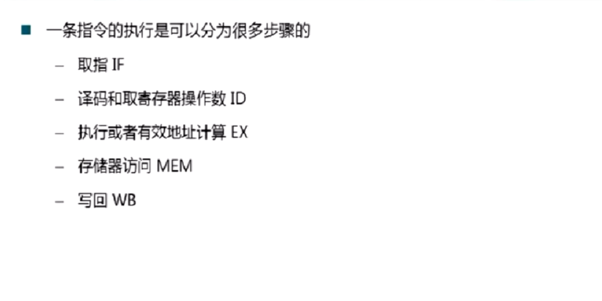

**1. 原子性**，不可再分，无线程安全问题，一般认为CPU指令是一些原子性操作。在32位虚拟机上对64位数据的读和写都不是原子的，要分两步进行，读写32位数据属于原子操作。

**2. 有序性**，计算机执行的（优化过的）机器代码指令不一定是按照程序规定的顺序来的，	但是不会破坏原来语句的语义，毫无关系的指令可能会发生重排，因此可能出现指令的乱序。

**3. 指令重排**，下面从指令的执行步骤分析指令重排的原因。一个指令中含有多个执行步骤，如果每条指令的每个步骤按顺序执行，则每条指令对应的硬件设施会长期处于空闲之中，因此为了更好的利用硬件资源，采取流水线的方式来执行多条指令的多个步骤，但是，因为一些变量数据依赖的关系，同时为了不同时占用相同的硬件资源，可以看出一些时钟周期内，流水线上存在没有执行任何步骤的时钟周期。因此，可以某些不存在数据依赖的指令重新排列一下，可以有效的较少无效的时钟周期。

**4. 可见性**，各个级别的优化手段都有可能出现可见性问题，如CPU的指令重排，编译器的优化。JVM虚拟机层面的可见性：通过server模式执行这段代码，这段代码永远不会结束，原因是：被优化的代码没能在每个循环都查询stop的值，这也是虚拟机优化后的结果。

**5. Happen-Before规则**，其中volatile类型的变量在编译后可能会产生一些新的代码来保证这种类型变量的写入先于读取发生，同时还会有一些CPU级别的指令来抑制指令重排。

**6. synchronized和volatile区别**
volatile实现了可见性和有序性，没有实现原子性，所以对volatile变量的写操作只能使用原子操作，如x=2,类似x=y，x++之类的操作不属于原子操作，且多个线程访问volatile不会引起线程阻塞。

synchronized实现了原子性、可见性和有序性，但是会引起线程阻塞，是一个重量级的线程同步机制。