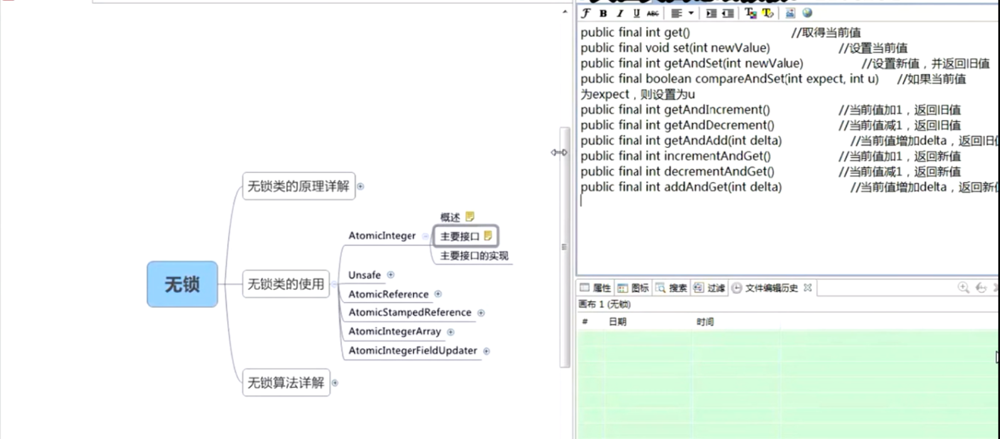
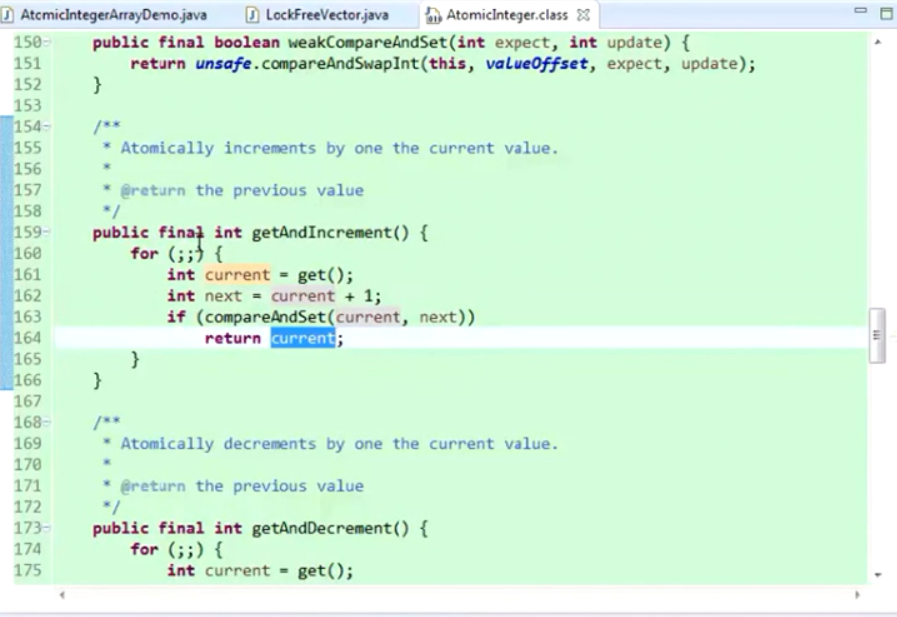
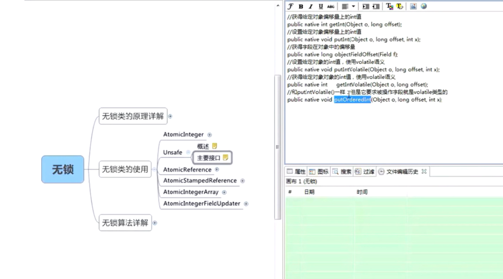
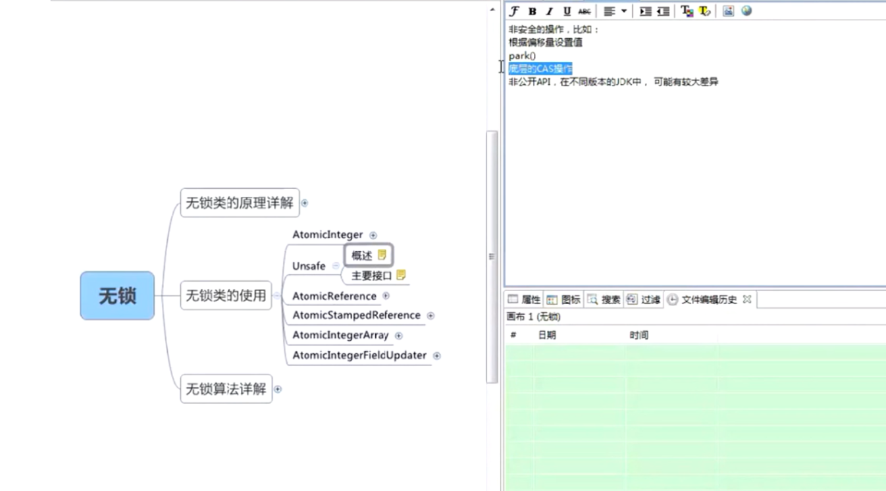
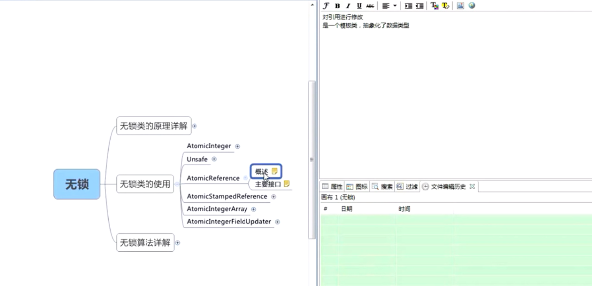

**1. 无锁**，就是基于无障碍的机制，且每次至少有一个线程运行成功。无锁的原理是通过CAS（Compare And Swap）思想和CPU的指令cmpxchg为基础的。CAS步骤包括读取比较和写入，看似有很多过程，与原子行相悖，然而却只包括一条CPU指令，的的确确是一个原子操作。
CAS主要思想是通过比较变量的值和预期值，如果不相等，则说明其他线程已经对该变量进行了写入，则当前线程什么都不做，如果相等，说明当前线程已经得到了该变量的使用权，直接赋值即可，运行成功。（看似复杂的操作，其实是CPU上的一条原子操作）

**2. AtomicInteger**，主要接口有：。这个类中有一个volatile类型的value，所有的操作都是针对这个value来进行。且很多无锁操作的算法都是通过死循环进行的，如：

**3. Unsafe类**，是提供类似于C语言指针操作的一些函数，通过设置当前对象的基地址和通过反射得到的实例变量的偏移量来确定目标变量的地址，其中提供的主要API有：

**4. AtomicReference**，相比AtomicInteger，这个类封装的是一个对象的引用。，其中包括一个volatile类型的泛型value

**5. AtomicStampedReference**，用于解决跟过程状态相关的，比如一个对象的变化过程为A B A，如果使用普通的类，则无法区别两个A，现在使用这个类，可以给这个引用加一个时间戳之类的，比如1 2 3，比较的时候除了比较两个对象，还要比较两个时间戳。

**6. AtomicIntegerArray**，里面封装的是一个final[] int，没有使用volatile修饰。