**1. ReentrantLock**，synchronized的增强版，使用synchronized时，得不到资源的线程会永远阻塞，而使用ReentrantLock则有着更多种的选择。JDK5之前，synchronized的效率不如ReentrantLock，JDK5之后，synchronized得到了更多的优化，二者效率一致，因此，在无需使用ReentrantLock的情况下使用synchronized不会带来任何多余的效率问题。下面介绍ReentrantLock：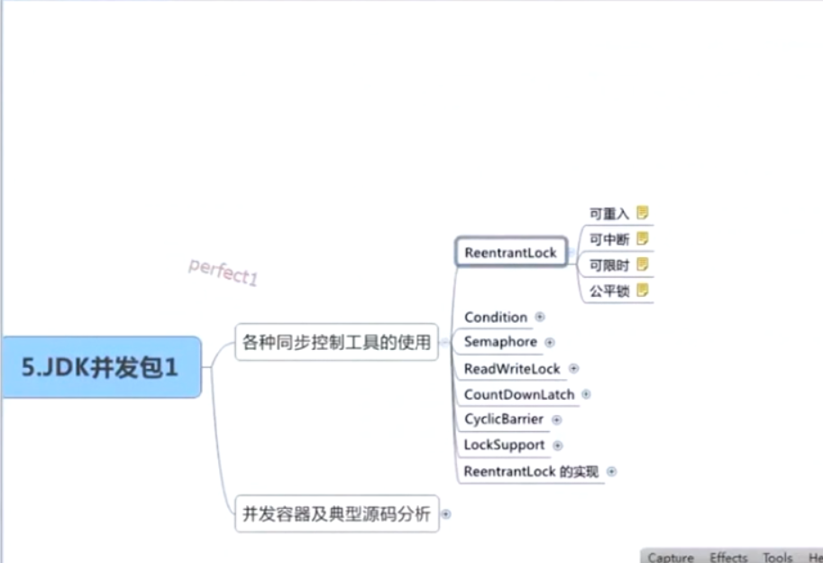**①**使用ReentrantLock必须使用以下的标准写法，将unlock方法放置在finally语句中，使得无论何时何地发生异常，当前线程都可以释放锁：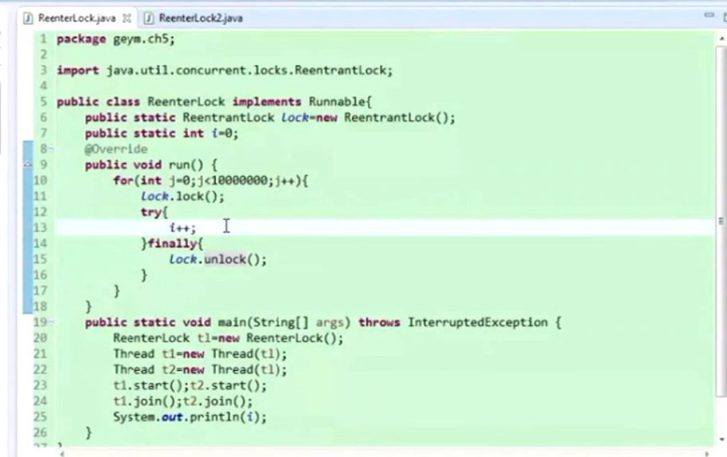**②**ReentrantLock提供了可重入的机制，即一个线程可以多次的获得同一个对象锁，这和synchronized机制类似，即一个线程在synchronized方法中调用了当前对象的另外一个synchronized方法，则当前对象锁对该线程的计数会加1，进入几次则需要释放几次，下面是ReentrantLock可重入机制的使用方式（如果注释掉一条unlock，则程序不会结束，因为当前对象锁没有被释放，仍有线程在阻塞）：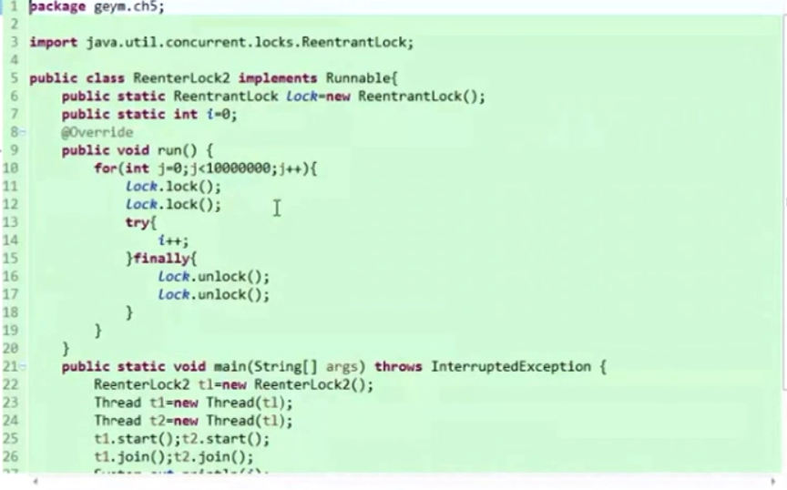**③**ReentrantLock提供了可以中断的措施，当线程之间处于死锁的时候，可以使用interrupt方法将其中断，使用方式是调用lock.interruptibly()方法：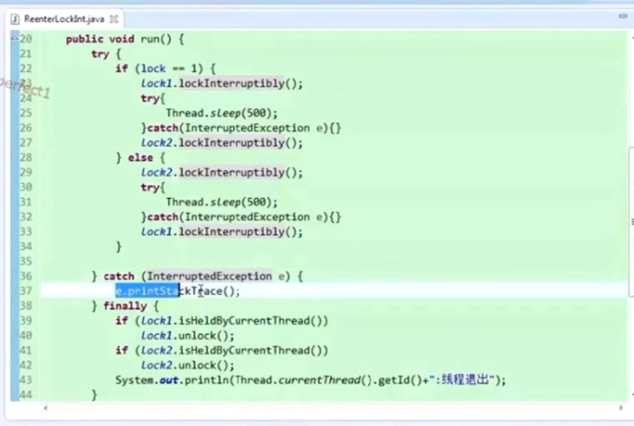**④**ReentrantLock可限时，这是使用tryLock方式来申请对象锁，返回boolean变量，如果申请失败，可以去做其他事情：**⑤**ReentrantLock提供公平锁的机制，先到先得锁，不会产生饥饿，但是公平锁比非公平锁性能差很多，所以没有特殊的必要，可以不使用公平锁，使用公平锁只需要在构造函数加入true即可。

**2. Condition**，ReentrantLock和Condition的关系与synchronized和object.wait、object.notify关系一样，只有获得了当前的对象锁，才能调用wait和notify，两对分别搭配使用。Condition的接口也与wait和nofify很像，主要的接口有await和signal。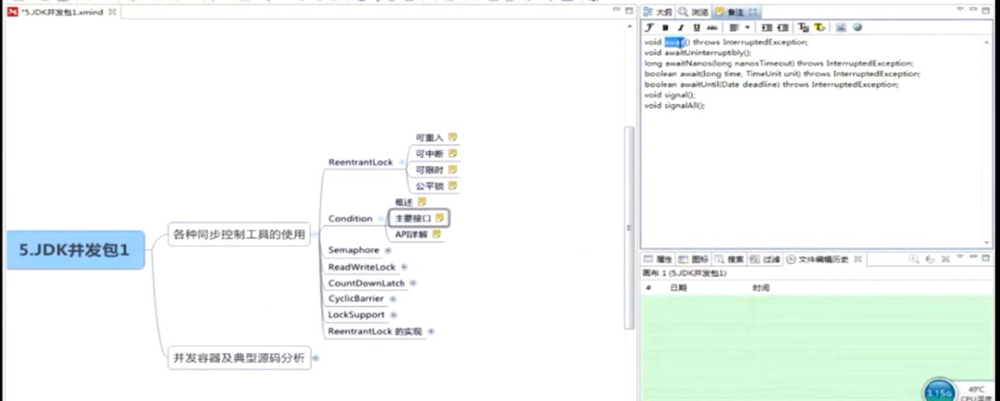使用方式也类似，通过lock中的工厂方法来创建condition对象：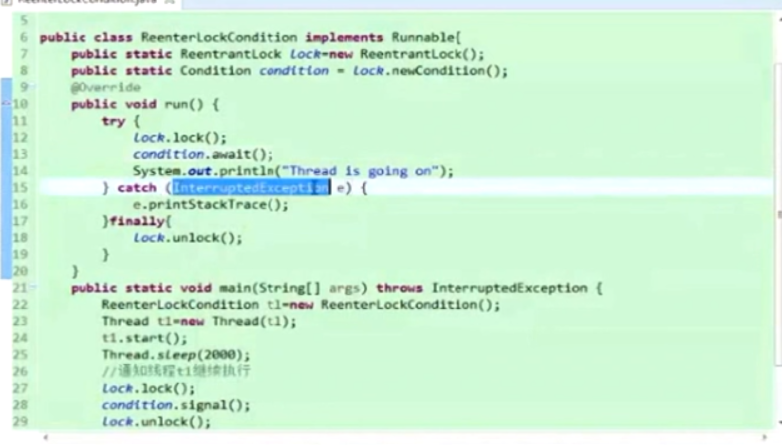

**3. Semaphore**，信号量，与锁的概念类似，锁是互斥的，只允许一个线程进入临界区，而Semaphore可以定义多个线程进入临界区，超过许可范围的线程必须等待，可以认为是一个共享锁。下面是信号量提供的方法：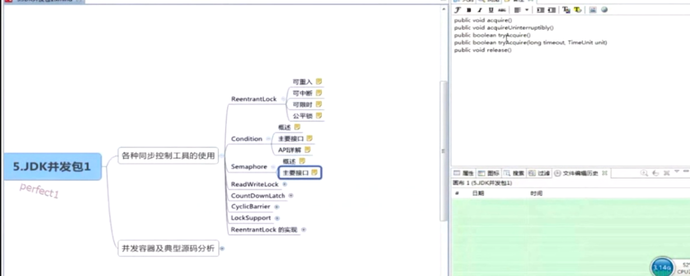具体的使用例子：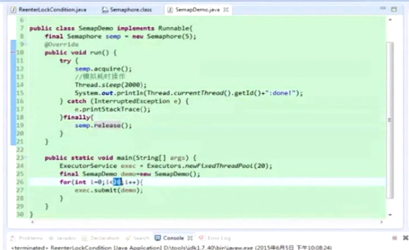

**4. ReadWriteLock**，传统的锁不区分读写，对性能有很大的影响，针对几个只读的线程，不需要进行锁定。该类定义的几种情况为：读读不阻塞，读写互斥阻塞，写写互斥阻塞。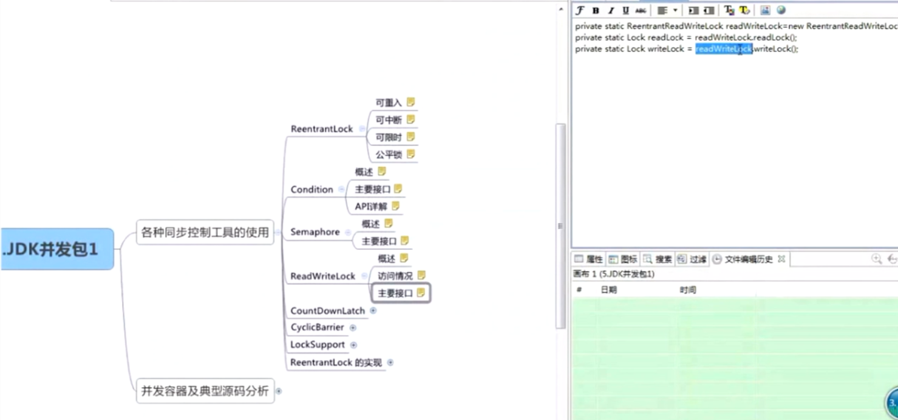

**5. CountDownLatch**，从名字可以看出是一个倒数器，使得所有的线程执行完毕之后，用以控制的主线程才能继续往下走，下图是对这个类用法的解释（自我感觉用法有点像在main中使用join）：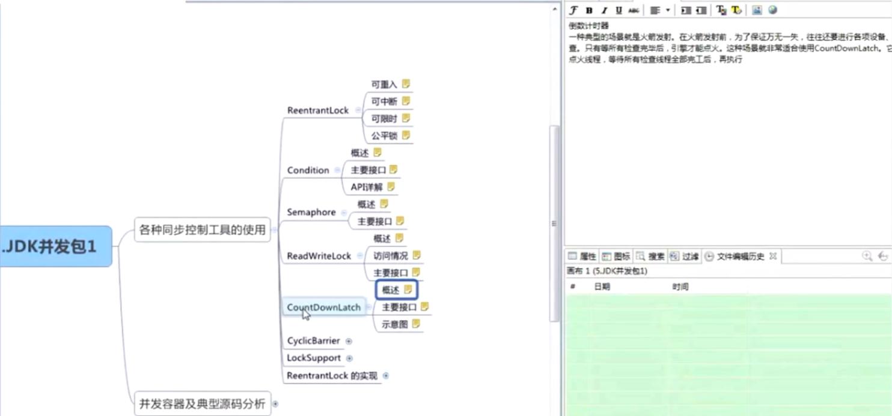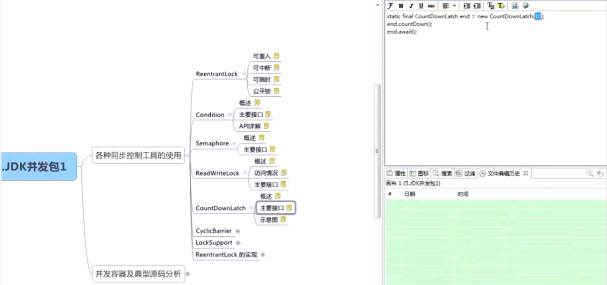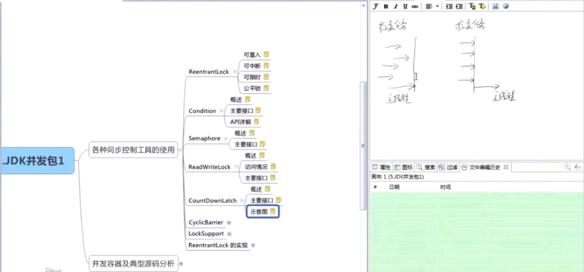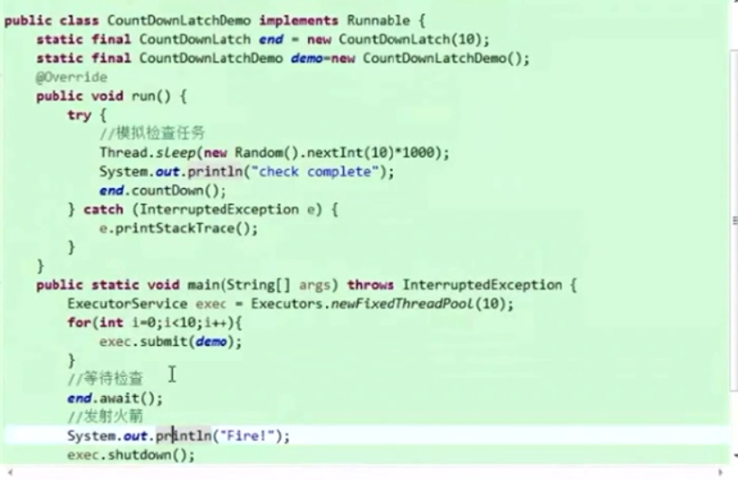

**6. CyclicBarrier**，也是一个栅栏，会让一个线程在一个时间点处等待。但是与CountDownLatch不同的是，CountDownLatch只提供一次计数，而CyclicBarrier提供了循环计数，可以反复使用，可以一批一批的去执行。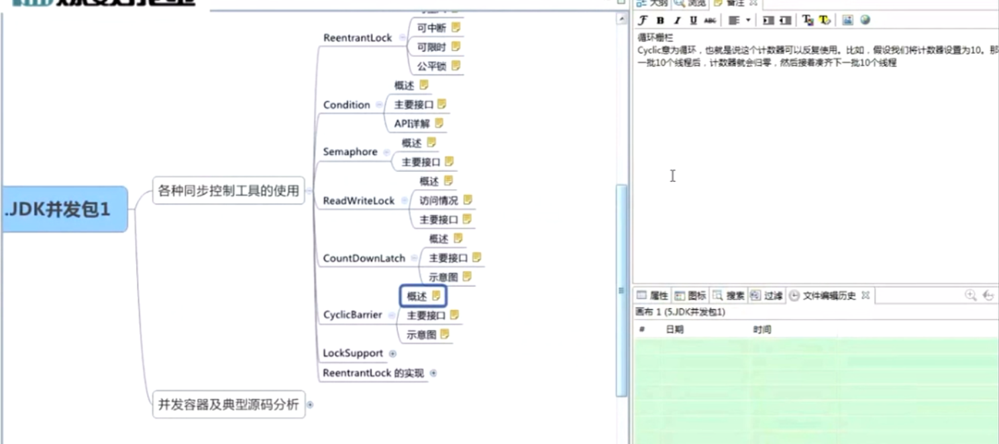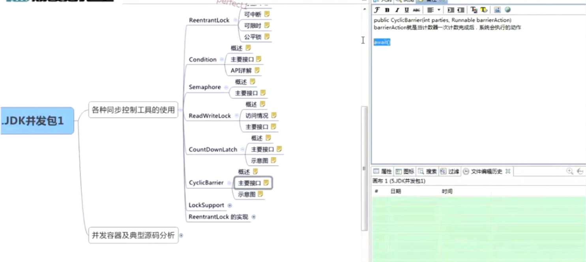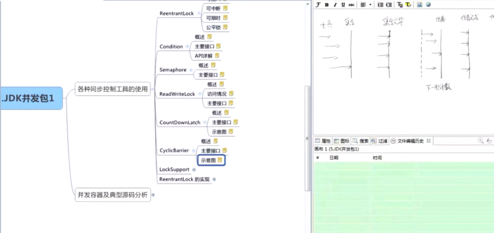

**7. LockSupport**，提供了挂起线程的方法，是一个较为底层的线程挂起和恢复的操作。与suspend类似，但是不会引起线程冻结。原因是：对于suspend来说，如果相对应的resume不幸发生在了suspend前面，则线程不会被重新运行，会被冻结，而对于LockSupport来说，如果unpark发生在park前面，则park不会其作用，因此只要park和unpark成对，便不会被冻结。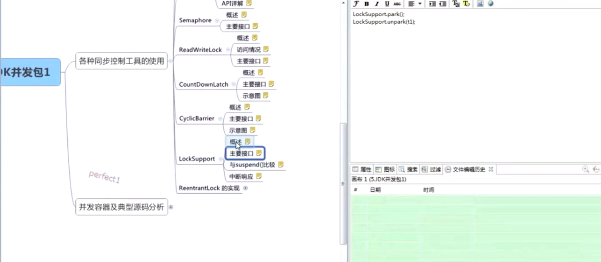且能够响应中断：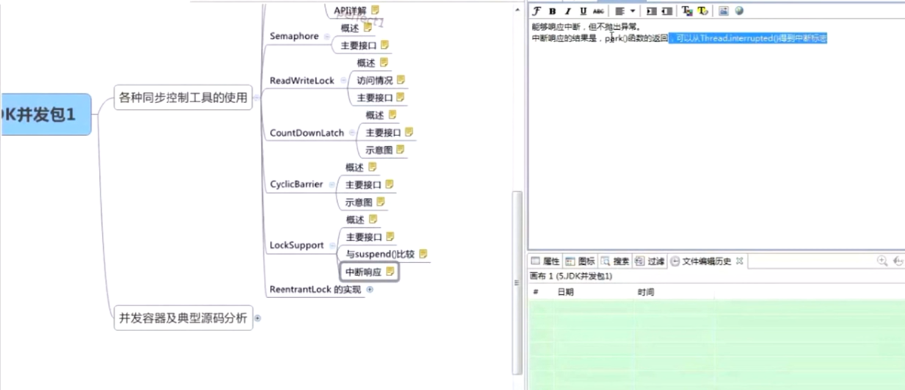

**8. ReentrantLock的实现**，是一个比较应用级别的实现，而不是直接调用操作系统底层函数的实现。他的实现主要有三个比较重要的内容：①CAS状态：用来判断自己的锁是否被线程占用，占用为1，未占用为0，进入之前使用CAS的方法来判断自己是否能成功修改锁的状态，改成功的话则获得锁，不成功的话表示自己拿不到锁，锁的实现内部就是一个CAS操作。②等待队列：多个线程没有拿到锁的话必然进入类内部维护的一个等待队列。③park()，进入到等待队列中的线程调用park，是自己挂起。这三点是ReentrantLock实现的关键，自己可以试着实现一个锁，因为都是应用级别的代码。