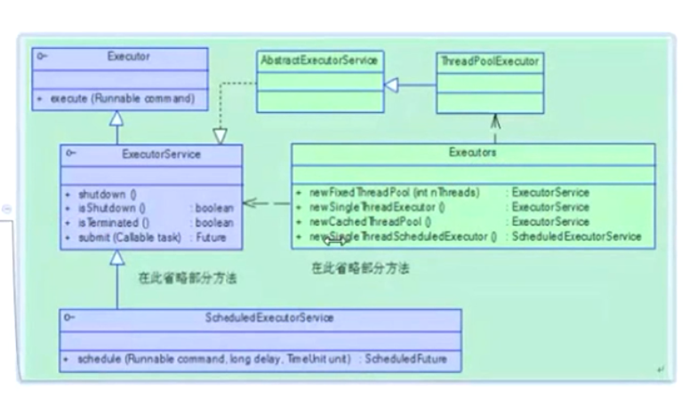
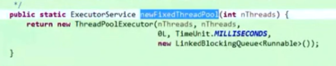
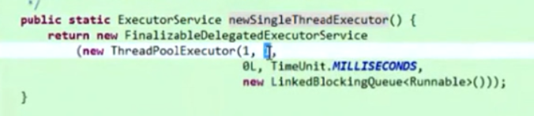
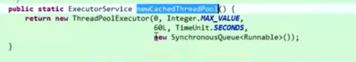
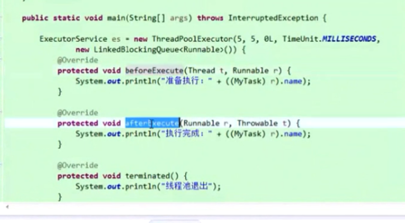
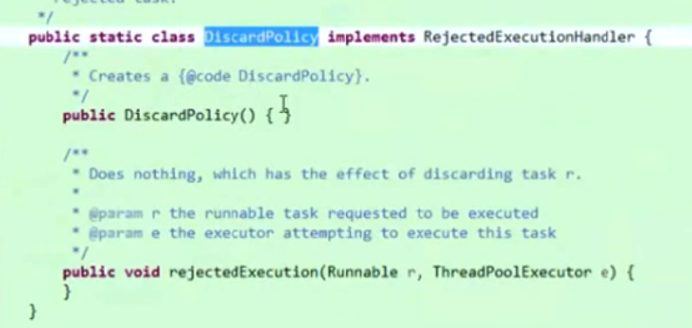
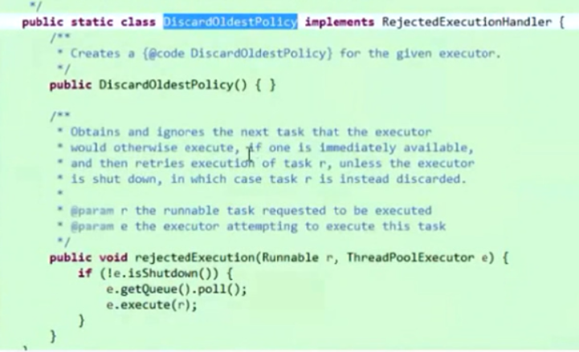
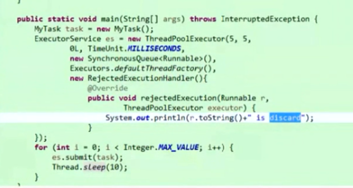
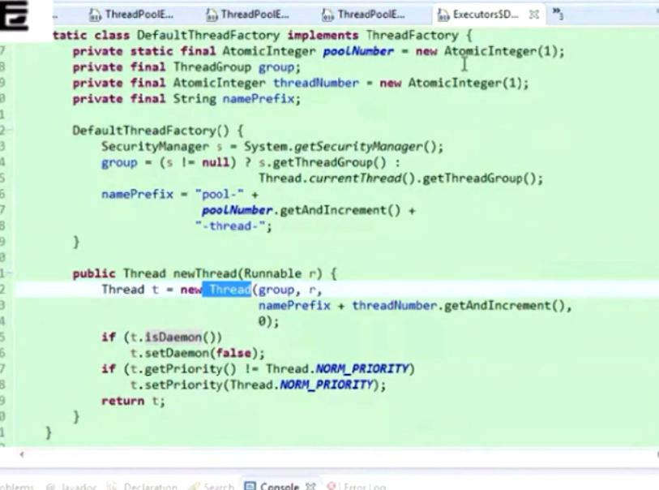
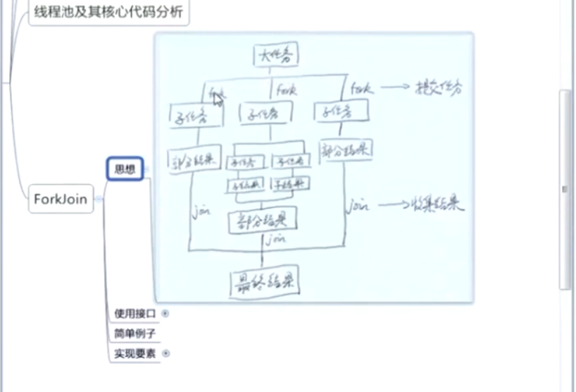

**1. 线程池的基本使用**，为什么需要线程池？线程的创建和销毁比较耗费资源，为执行某一个任务而去创建和销毁线程做不到线程的重用，浪费系统资源，线程池就是为管理和重用线程而生。以下是线程池提供的类，其中Executors是一个工厂类，用于生成各种线程池：
线程池的种类：①newFixedThreadPool，代表线程池中线程的数量是固定的，不会因为任务的工作量变化而变化；② newSingleThreadPool，单一线程的线程池，只有一个线程，来一个工作一个；③newCachedThreadPool，线程池中的线程数量是随着实际情况变化的，当任务多的时候线程数量多，当任务少的时候，线程会逐渐消亡；④newScheduledThreadPool，是一个计划任务的线程池，比如每隔五分钟调用一个任务。前三种更像是线程池的功能，而ScheduledThreadPool更像是计划任务的线程池。

**2. ThreadPoolExecutor**，真正的线程池实现，前面的几个方法都是属于Executors里的静态方法。现在研究一下这个类的构造函数：corePoolSize(int)，核心的线程池的大小，也就是核心线程数量，相当于标准数量。maxmumPoolSize(int)，线程池中最多容纳的线程数量，相比于第一个参数来说，是可以往上扩展的数量。keepAliveTime(long)，代表某些在线程池中最多可以存活多长时间，某些线程指的是，maxmumPoolSize比corePoolSize多出来的一些数量的线程，keepAliveTime的作用对象是它们。unit(TimeUnit)，代表第三个参数的单位。workQueue(BlockingQueue<Runnable>)，代表一个任务队列，里面是还没有被线程池执行的任务。还有两个参数此处不分析，下文会涉及到。分析完这些，下面看看新建几种线程池时的参数：
以下两个链接用于更好的理解线程池：[https://zhuanlan.zhihu.com/p/32867181](https://zhuanlan.zhihu.com/p/32867181)   [https://www.zhihu.com/question/23212914/answer/245992718](https://www.zhihu.com/question/23212914/answer/245992718)

**3. 线程池的扩展**，线程池的实现中还增加了一些回调接口，如beforeExecute（针对每个任务），afterExecute（针对每个任务）和terminated（针对整个线程池，如线程池关闭），图：
线程池提供了拒绝策略，也就是线程池的第七个参数，如果无限多的任务涌入线程池，则线程池可能会无限的创建线程或者将这些任务加入到等待队列中去，这样会使系统的内存崩溃，因此需要一定的拒绝策略，当任务很多时，将某些任务拒绝加入。有以下四种拒绝策略，第一种AbortPolicy会丢掉任务并且抛出异常：
第二种DiscardPolicy会直接丢掉任务，啥也不做：
第三种CallerRunsPolicy会让调用线程直接做这个任务，而不会提交给线程池：
第四种CallerRunsPolicy会丢掉队列中最老的任务：
自己也可以实现丢弃策略：
线程池的第六个参数为线程工厂，可以设置线程池中线程的各种参数，如设置线程为守护线程，改变线程的优先级等：

**4. ForkJoin**，思想是将大任务分解，最后合并：
提供了两个接口，RecursiveAction（无返回值任务）和RecursiveTask（有返回值任务）。其中该线程池中，每个线程都会有一个工作队列