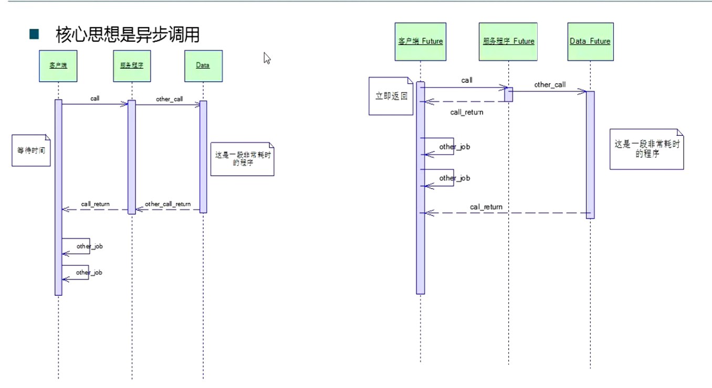
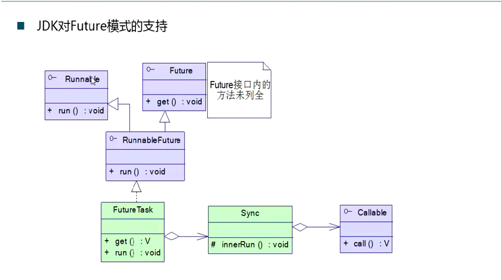
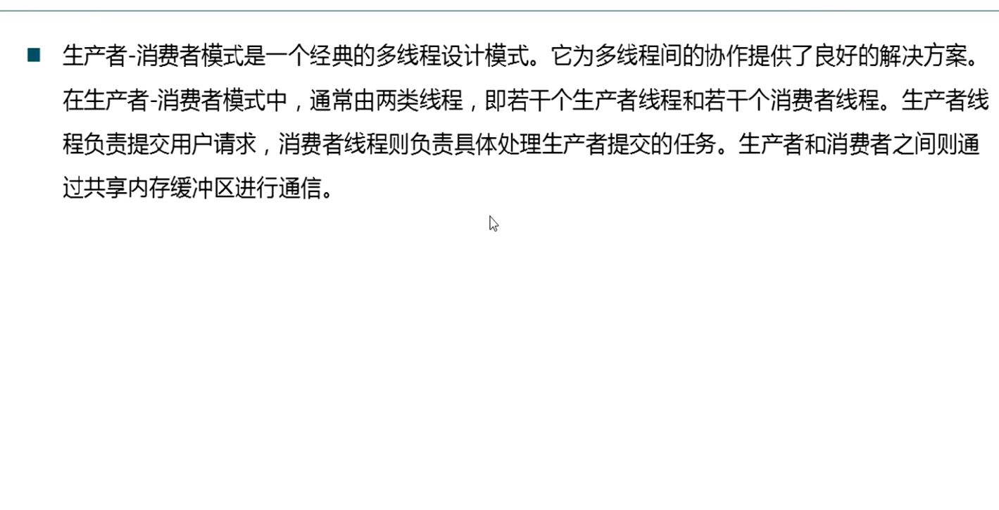
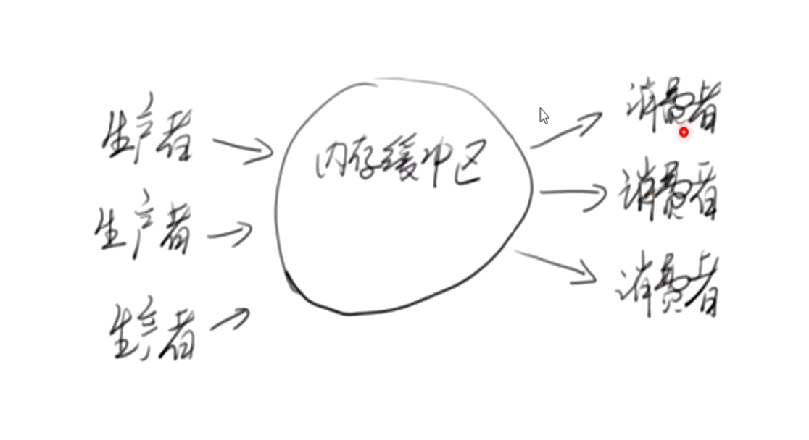
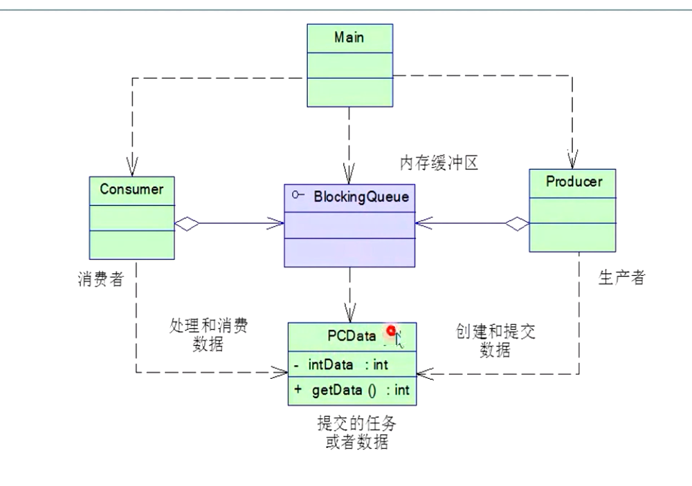

**1. 单例模式**，单例模式有以下几种线程安全的实现方式：
```java
//饿汉模式，线程安全。
public class Singleton {
	private Singleton() {}
	private static Singleton singleton = new Singleton();
	public static Singleton getInstance() {
		return singleton;
	}
}
```
```java
//饱汉模式，双重检测，线程安全。但是如果由于synchronized内部可能会指令重排的原因，可能会是某些线程返回一个已经申请空间但并没有初始化的对象，所以将singleton声明为volatile会解决问题。
public class Singleton {
	private Singleton() {}
	private static Singleton singleton;
	public static Singleton getInstance() {
		if(singleton == null) {
			synchronized (Singleton.class) {
				if(singleton == null) {
					singleton = new Singleton();
				}
			}
		}
		return singleton;
	}
}
```
```java
//饱汉模式，线程安全。
public class Singleton {
	private Singleton() {}
	//内部为饿汉模式，总体表现为饱汉模式。
	private static class SingletonHolder{
		private static Singleton singleton = new Singleton();
	}
	public static Singleton getInstance() {
		return SingletonHolder.singleton;
	}
}
```

**2. 不变模式**，对多线程来说是非常重要的，是指一个类的内部状态创建后，在整个生命期间不会发生变化，就是不变类，不变模式不需要同步。将类声明为final，同时将是实例变量也声明为final，这样能简单的实现不变模式，String和8种包装类都是不变模式的实现。

**3. Future模式**，核心是异步调用。
核心是两个Data，一个FutureData，一个RealData，当客户端异步调用时，相等于直接返回FutrueData，并在另一个线程中装配，实现异步调用。
```java
public interface Data {
	String getResult();
}
```
```java
//真正的耗时操作
public class RealData implements Data {
	final String result;
	public RealData(String para) {
		StringBuilder stringBuilder = new StringBuilder();
		for(int i = 0; i < 5; i++) {
			stringBuilder.append(para.charAt(i));
			stringBuilder.append(' ');
			try {
				Thread.sleep(200);
			}
			catch (Exception e) {
				// TODO: handle exception
			}
		}
		result = stringBuilder.toString();
	}
	@Override
	public String getResult() {
		return result;
	}
}
```
```java
//将真正的数据包装到这个类中
public class FutureData implements Data {
	private RealData realData;
	private boolean isReady;
	public synchronized void setReadData(RealData r) {
		if(isReady) {
			return;
		}
		realData = r;
		isReady = true;
		notifyAll();
	}
	public synchronized String getResult() {
		while(!isReady) {
			try {
				wait();
			} catch (InterruptedException e) {
				e.printStackTrace();
			}
		}
		return realData.result;
	}
}
```
```java
//客户端
public class Client {
	public static void main(String[] args) throws Exception {
		Client client = new Client();
		String para = "12345";
		long t1 = System.currentTimeMillis();
		Data data = client.request(para);//异步调用，需要一秒
		Thread.sleep(1000);//模拟其余的工作，一秒
		System.out.println(data.getResult());
		System.out.println((System.currentTimeMillis()-t1)+"ms");
	}
	private Data request(final String para) {
		final FutureData future = new FutureData();
		new Thread() {
			@Override
			public void run() {
				RealData realData = new RealData(para);
				future.setReadData(realData);
			}
		}.start();
		return future;
	}
}
```
JDK中也给出了Future模式的支持：

**4. 生产者消费者模式**，两个线程共享数据的模式。


