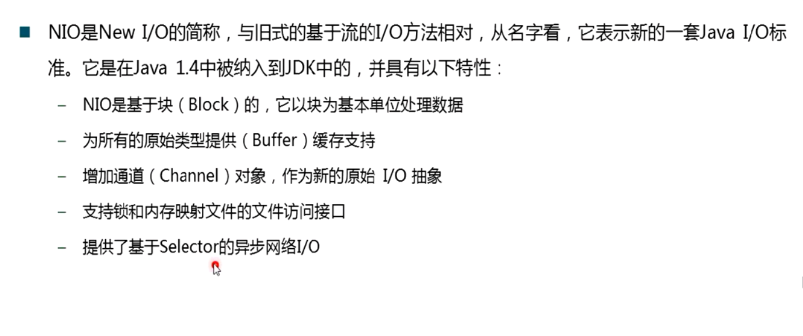
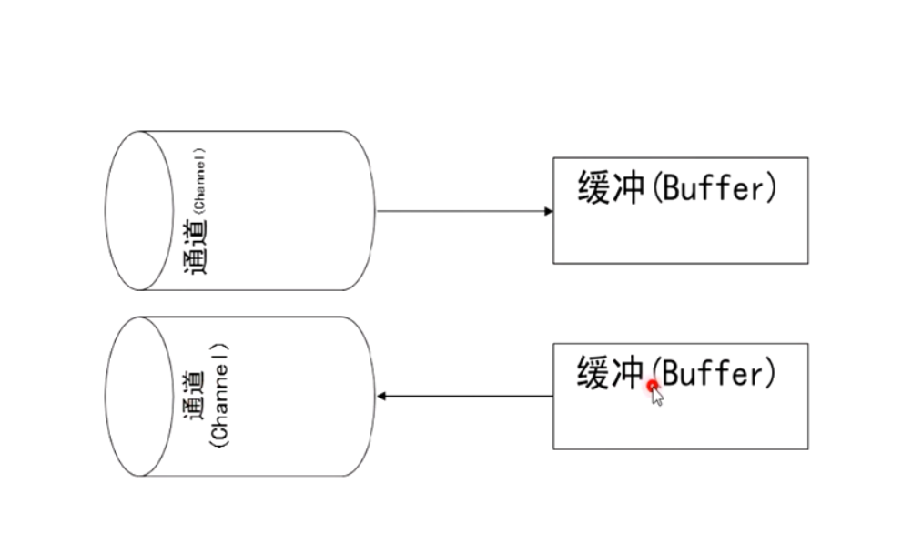
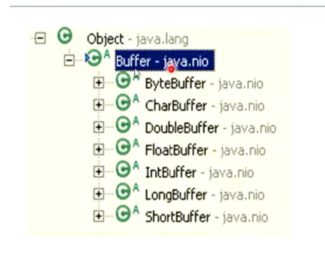
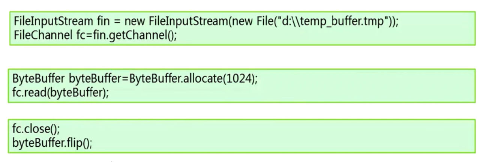
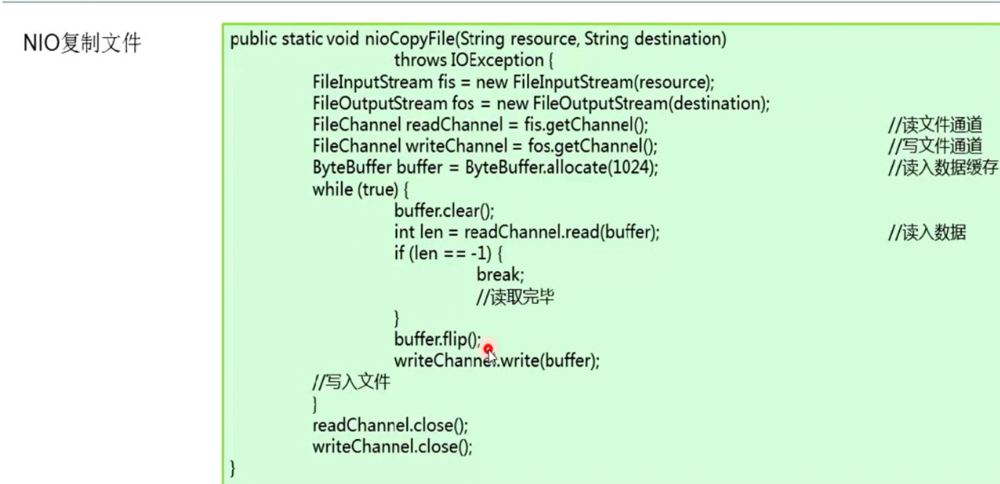
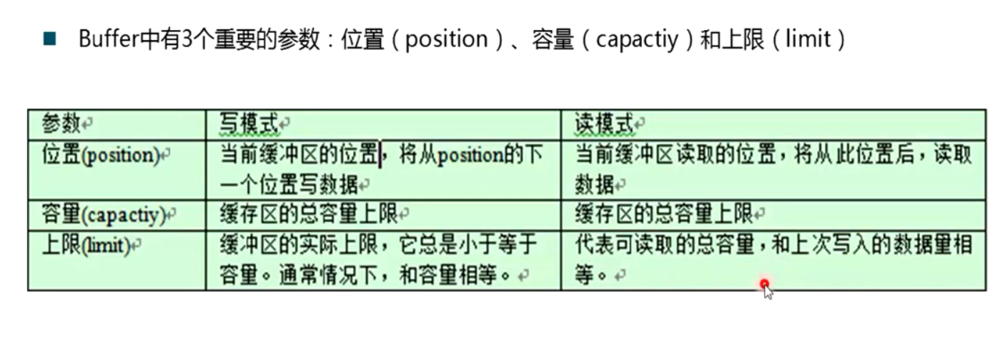
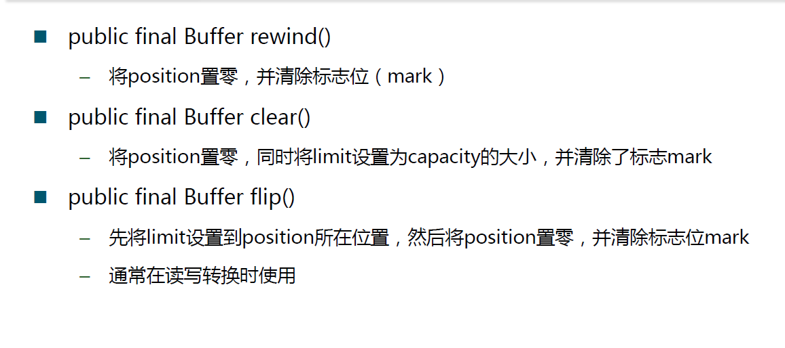
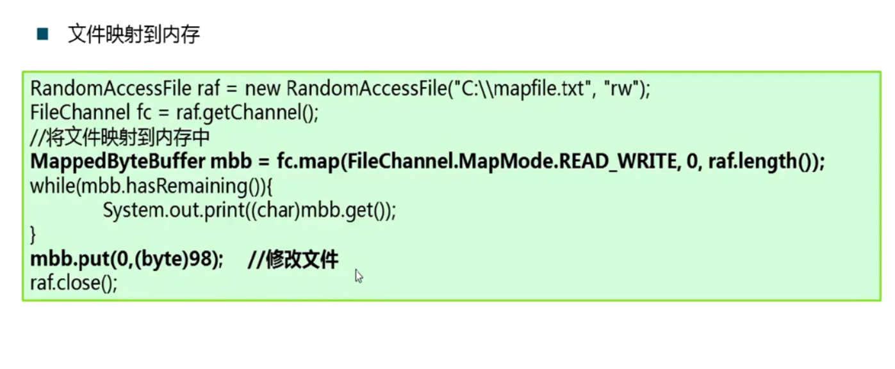

**1. NIO**，基于块block，相比于传统IO基于流（字节）效率要高一些，以块为基本单位处理数据：
NIO所有的操作都要通过buffer来实现，是NIO的核心，当要往通道里写东西的时候，要先写入buffer，从通道里读取的东西也要先写入buffer：
通道是文件的抽象，在通道的另一端，可能就是个socket或者其他操作的文件。
NIO提供了各种数据类型的buffer，使用最多的是ByteBuffer：
NIO的基本使用方式，首先定义一个FileChannel代表要操作的文件，对它的所有操作就代表对文件的操作（私以为FileChannel算得上一个适配器），接着定义buffer，通过buffer进行对文件的读写。
以下为使用NIO复制文件的一个例子，flip函数的作用是读写转换：
buffer中有三个重要参数，其中容量代表申请的总大小，而上限代表里面写入数据的实际大小：
下面是buffer具体的使用例子:
```java
package testnio;
import java.nio.ByteBuffer;
public class TestNio {
	public static void main(String[] args) throws Exception {
		ByteBuffer buffer = ByteBuffer.allocate(16);
		//刚创建完buffer之后limit默认等于capacity，因为刚创建完必然要对buffer进行写入，而limit只是读取时有意义。
		System.out.println("capacity: " + buffer.capacity() + " limit: " + buffer.limit() + " position: " + buffer.position());
		for(int i = 0; i < 4; i++) {
			buffer.put((byte)i);
			System.out.println("capacity: " + buffer.capacity() + " limit: " + buffer.limit() + " position: " + buffer.position());
		}
		//flip函数的作用是将limit置于当前position，将position置0，常用语写入和读取转换之间
		buffer.flip();
		System.out.println("capacity: " + buffer.capacity() + " limit: " + buffer.limit() + " position: " + buffer.position());
		for(int i = 0; i < 2; i++) {
			//get是逐字节读取，会使position逐渐增加
			System.out.print(buffer.get());
		}
		System.out.println();
		System.out.println("capacity: " + buffer.capacity() + " limit: " + buffer.limit() + " position: " + buffer.position());
		buffer.flip();
		System.out.println("capacity: " + buffer.capacity() + " limit: " + buffer.limit() + " position: " + buffer.position());
	}
}
//Output:
capacity: 16 limit: 16 position: 0
capacity: 16 limit: 16 position: 1
capacity: 16 limit: 16 position: 2
capacity: 16 limit: 16 position: 3
capacity: 16 limit: 16 position: 4
capacity: 16 limit: 4 position: 0
01
capacity: 16 limit: 4 position: 2
capacity: 16 limit: 2 position: 0
```
以及另外几个操作这三个参数的函数，rewind的作用可以简单的认为是多次重复读取，clear可以认为清空缓冲区，为下一次写入做准备：
**2. 文件映射到内存**，NIO还提供了文件映射到内存的操作，此时，对缓冲区的修改就相当于对文件本身的修改，效率比较高：


