1. 同步和异步，是针对与方法调用来说的。同步调用等待方法返回，异步调用直接返回，会在后台开一个线程做这个任务，但不影响下面需要做的事情。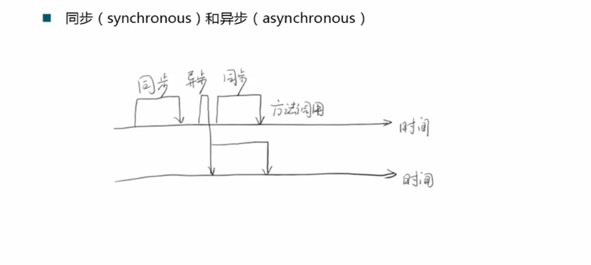

2. 阻塞和非阻塞，是用来形容多线程之间的相互影响。使用阻塞的方式来进行同步控制和线程切换需要耗费很多资源（8万个时钟周期？），但是操作比较简单，一切依靠操作系统来调度，性能不高，但可以做的很好。非阻塞则可以不需要阻塞任何线程就能做到同步控制，效率高，但对程序本身要求较高。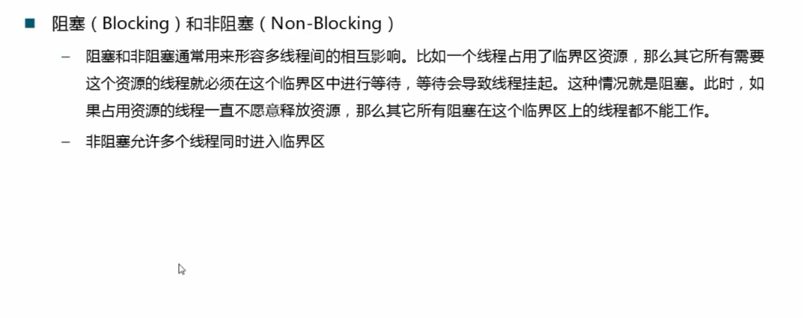

3. 死锁、饥饿和活锁。死锁代表相互占用对方有的资源，使得系统无法向下运行，无法提供服务，是一个静态问题，CPU占用为0，因为都处于阻塞状态，相对来讲比较好应付。与之相对应的是活锁，这是一个动态的过程，当两个线程相互抢占资源之后为了避免死锁，两个线程同时释放资源，然而，这种情况很容易导致活锁的发生，同时释放同时抢占，循环往复，一旦发生，比死锁更难解决，线程不停的在尝试，但是一直不能成功。饥饿，优先级低，无法得到资源。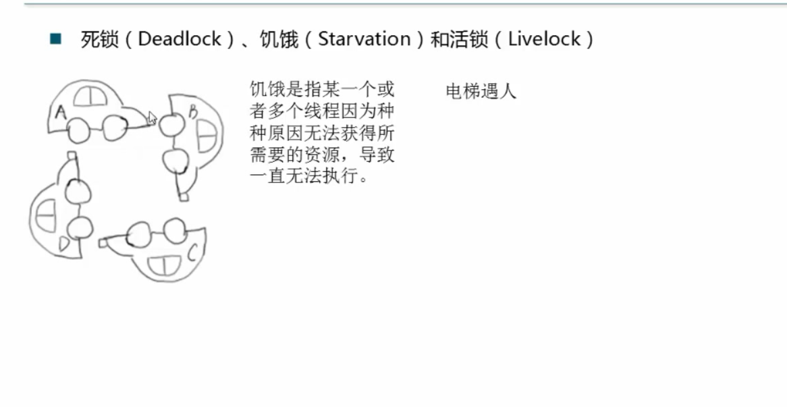

4. 线程同步的两种机制：阻塞和非阻塞。非阻塞又包括三种级别。阻塞机制是一种悲观策略，一次进入临界区一个，严进宽出。而非阻塞是一种乐观的策略，线程都可以进入临界区，出临界区时进行检查，宽进严出。不保证有线程能成功出来：保证至少有一个线程能出来：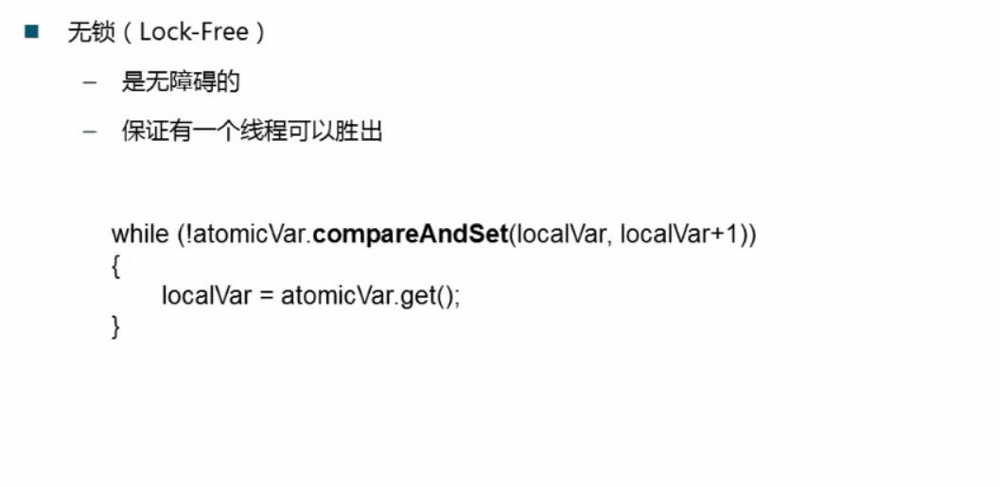保证所有的线程必须有限步骤，且无饥饿，可以说是并发最好的状态，可以使系统流畅的运行：

5. 线程类中定义的几种状态：一个线程如果刚新建出来，只是静态的实体，处于NEW状态。调用start之后，进入RUNNABLE状态，但不一定在真实执行，取决于CPU的调度。无法获得对象锁，进入BLOCKED状态，调用wait和notifyAll，可以使当前进程进入WAITING和TIMED_WAITING。

6. 线程的stop方法不推荐使用，太过于暴力，线程执行到任意语句都可能会被stop掉，被stop之后，线程会释放占用的所有的锁，因此会导致数据的不一致问题。除非程序特别简单，否则不推荐使用。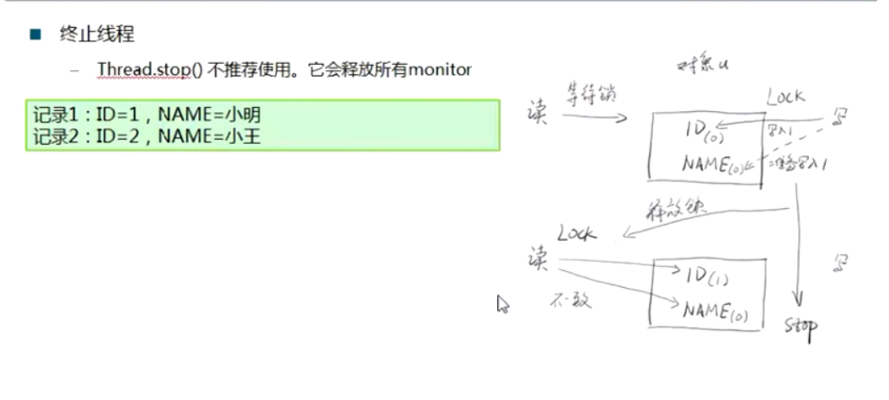

7. 线程的中断。三个函数搭配使用，当调用interrupt时，可以认为给线程打了一个招呼，同时改变了线程中的一个标志位。很多后台线程以无限循环的形式运行，当给一个运行中的线程打interrupt的招呼时，该线程不会有任何响应（左），这时可以在循环中加入判断isInterrupt语句，便可以成功（右）。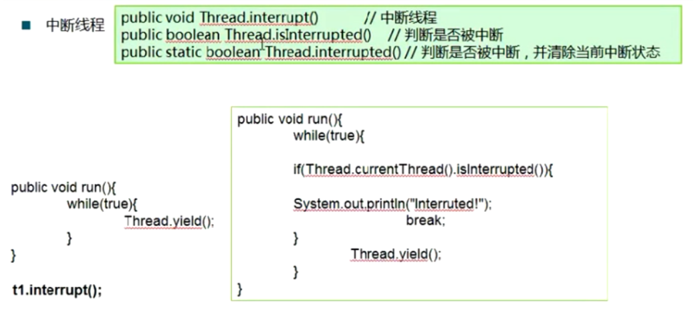在等待过程中也可以中断，但是会抛出异常，抛出异常之后标志位会被清空：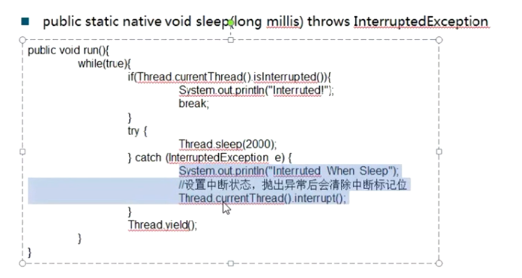

8. 挂起suspend和resume不推荐使用，有可能导致资源被一直占用无法释放。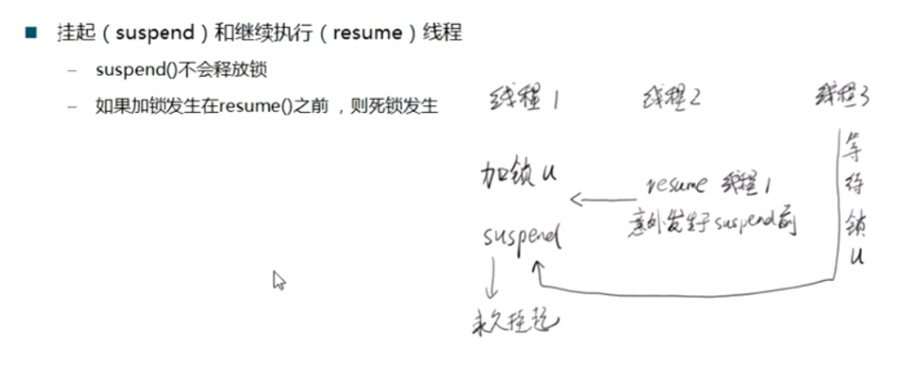

9. join的实质是wait，当前线程被阻塞到另一个线程对象上，但是不推荐在Thread上使用wait和notify，尽量在一般的对象上用，这里用法比较特殊。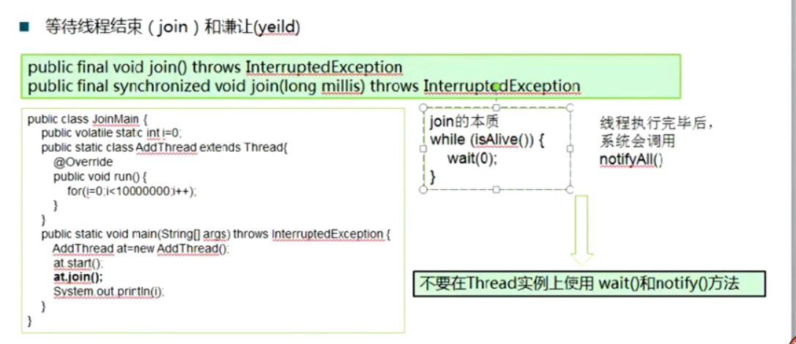

10. 守护线程。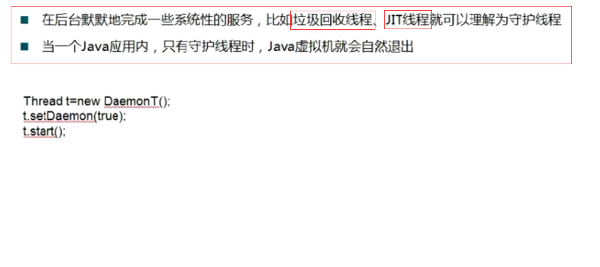

11. 基本的线程同步操作，wait方法使当前线程等待在当前对象上，同时会使当前对象释放锁，注意只有拿到对象锁之后才能调用wait。notify也一样。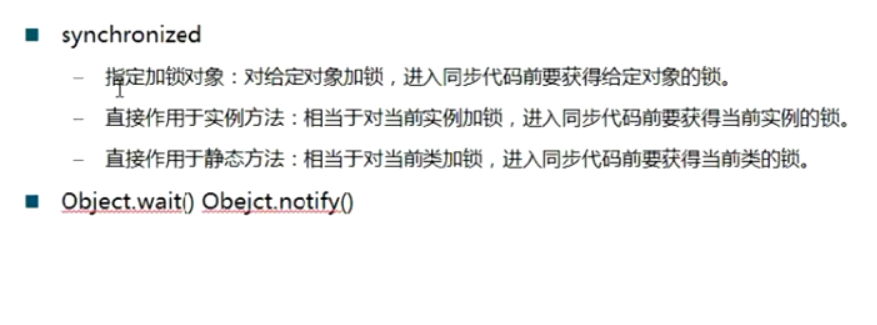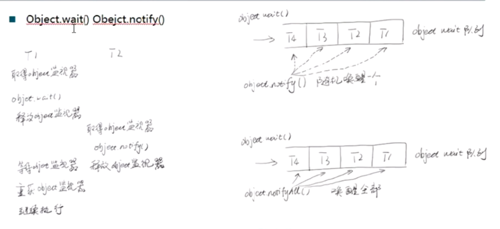
