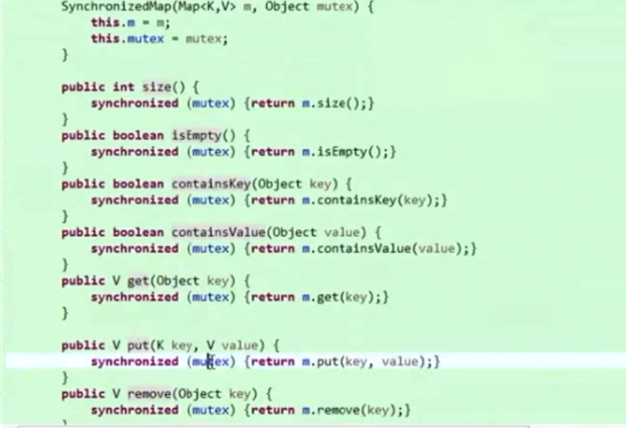
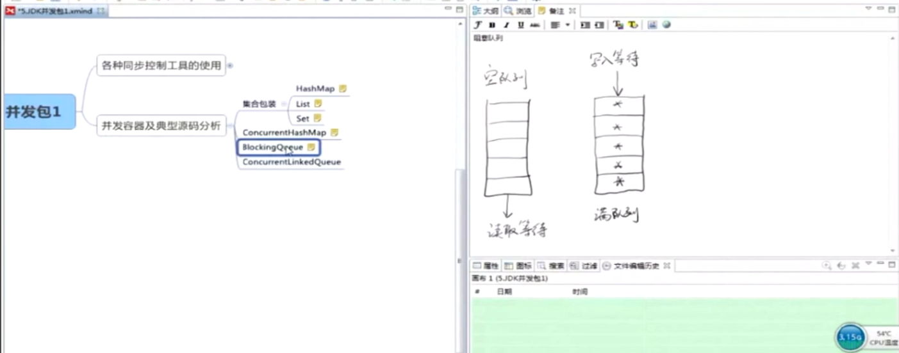

**1. 一般的HahMap、List等**，不是线程安全的操作，通过调用Collections工具类里的sychronizedMap(Map)、sychronizedSet(Set)等可以使其变为线程安全的。不过具体实现只是在传入的Map中加了synchronized锁，不能实现高效率的并发。

**2. ConcurrentHashMap**，是一个高并发高性能的解决方案。大致思想是将原本的HashMap分段，每个段有一个锁，因此可以实现和段的总数相同的线程并发。

**3. BlockingQueue**，是一个接口，与ConcurrentHashMap专门为高性能并发而设计的目的不一样，这不是一个高并发高效率的容器，性能并不好但是很重要，其被设计是为了完成在多个线程之中共享数据。如果一个队列为空，试图读取数据的线程就会处于读取等待当中，当另外一个线程写入数据之后，这个处于等待的线程就会被唤醒；如果队列已经满了，则试图继续写入的线程就会处于等待当中，直到有线程读取队列中的元素，才会被唤醒。该容器适用于生产者消费者问题。

**3. ConcurrentLinkedQueue**，相比BlockingQueue来说，是一个高效率的容器，在并发情况下表现良好，里面使用大量无锁的算法来进行并发，很少使用直接将线程挂起的操作，提高了效率。

