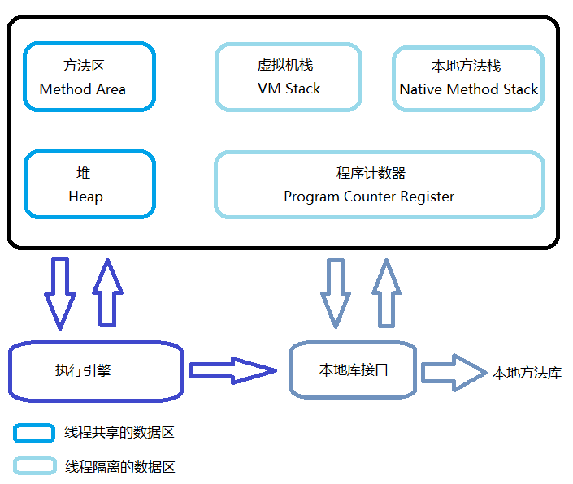
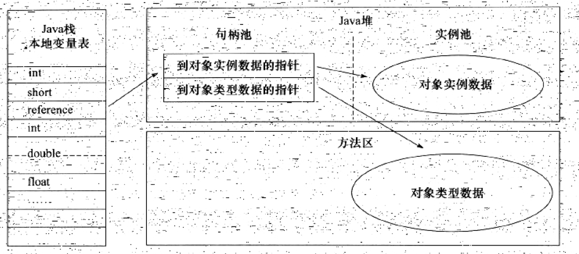
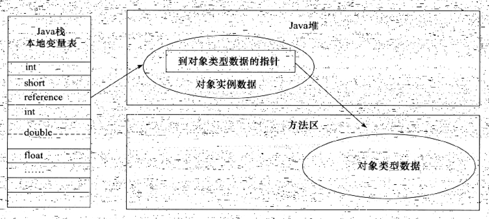
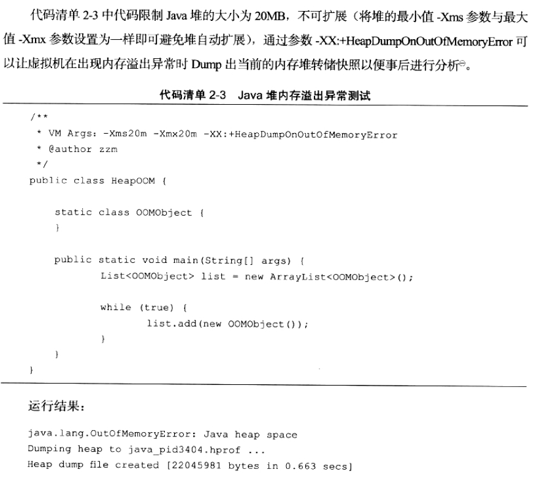
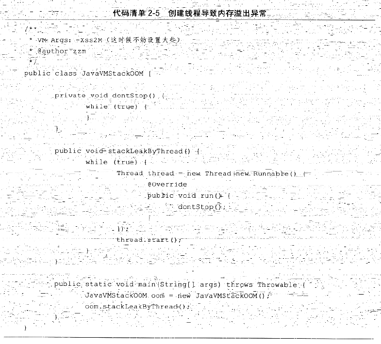
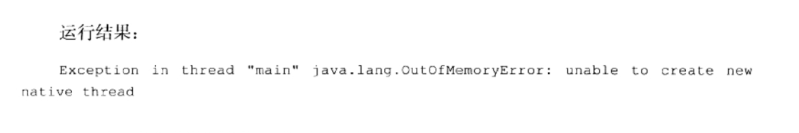

## 深入理解Java虚拟机第二章 Java内存区域与内存溢出异常

1. Java虚拟机在执行Java程序的过程中，会把它所管理的内存划分为若干个不同的数据区域。这些区域有各自不同的用途，以及创建和销毁的时间，有些区域随着虚拟机进程的启动而存在，有些区域则依赖用户线程的启动和结束而建立和销毁。根据Java SE 7虚拟机规范，Java虚拟机所管理的内存将会包括以下几个运行时数据区域：

- 程序计数器
  是一块较小的内存空间，可以看作是当前线程所执行的字节码的行号指示器，字节码解释器工作时就是改变这个计数器的值来选取下一条需要执行的字节码指令，分支、循环、跳转、异常处理、线程恢复等基础功能都需要依赖这个计数器来完成。
  由于多线程是通过线程轮流切换并分配处理器执行时间的方式来实现的，所以为了线程切换后恢复到正确的执行位置，每条线程都需要一个独立的程序计数器，各条线程计数器互不影响，因此这块内存属于“线程私有”的。
  另外，如果线程正在执行的是一个Java方法，则计数器里记录的是正在执行的虚拟机字节码指令的地址；如果执行的是Native方法，则计数器的值为空（Undefined）。此内存区域是Java虚拟机规范中没有规定任何OutOfMemoryError情况的区域。
- 虚拟机栈
  与程序计数器一样，虚拟机栈也属于线程私有的。虚拟机栈描述的是Java方法执行时的内存模型：每个方法在执行的同时会创建一个栈帧（Stack frame）用于存储局部变量表、操作数栈、动态链接、方法出口等信息。每一个方法从调用直至执行完成的过程，就对应着一个栈帧在虚拟机中从入栈到出栈的过程。
  局部变量表存放了编译器可知的各种基本数据类型（8种）、引用类型（可能指向对象起始地址，也可能指向一个代表对象的句柄或其他与此对象相关的位置）和returnAddress类型（指向了一条字节码指令的地址）。
  64位长度的long和double会占用两个局部变量空间，其余数据类型只占用一个。局部变量表所需的内存空间在编译器完成分配，在方法运行时，局部变量表在帧中所占空间是确定的并且不会发生改变的。
  虚拟机栈中可能会发生两种异常情况：如果线程请求的栈深度大于虚拟机所允许的深度，将抛出StackOverflowError异常；如果虚拟机栈可以动态扩展，如果扩展时无法申请到足够的内存，就会抛出OutOfMemoryError异常。
- 本地方法栈
与虚拟机栈所发挥的作用是非常相似的。虚拟机栈为Java方法（字节码）服务，本地方法栈为虚拟机使用到的Native方法服务。也会抛出两种异常。
- 堆
Java虚拟机管理内存中最大的一块。线程共享，在虚拟机启动时创建。用于存放对象实例，这一点在Java虚拟机规范中描述是：所有对象的实例以及数组都要在堆上分配，但是随着技术的发展，所有对象都在堆上分配也变得不是那么“绝对”了。如果在堆中没有内存完成实例分配，并且堆也无法再扩展时，将会抛出OutOfMemoryError异常。
- 方法区
属于线程共享的区域。用于存放被虚拟机加载的类信息、常量、静态变量、即时编译器编译后的代码等数据。当方法区无法满足内存分配需求时，将会抛出OutOfMemoryError异常。

2. 运行时常量池。
- 是方法区的一部分，Class文件中除了有类的版本、字段、方法、接口等描述信息外，还有一项信息是常量池（Constant Pool Table），用于存放编译期生成的各种字面量和符号引用，这部分内容将在类加载后进入方法区的运行时常量池中存放。
- 运行时常量池具有动态性。Java语言并不要求常量一定只有编译器才能产生，运行期间也可以将新的常量放入池中，这种特性被开发人员利用的比较多的是String类的intern()方法。
- 常量池属于方法区的一部分，也会抛出OutOfMemoryError异常。

3. 直接内存
- 并不是虚拟机运行时数据区的一部分，也不是Java虚拟机规范中定义的内存区域，但是这部分内存也被频繁的使用，也有可能导致OutOfMemoryError异常。
- 在JDK1.4中新加入了NIO（New Input/Output）类，引入了一种基于通道和缓冲区的I/O方式，它可以使用Native函数库直接分配堆外内存，然后通过一个存储在Java堆中的DirectByteBuffer对象作为这块内存的引用进行操作。这样能在一些场景中显著提高性能，因为避免了在Java堆中和Native堆中来回复制数据。

4. 对象的创建（讨论普通的对象，不包括数组和Class对象等）
- 虚拟机遇到new指令时，首先检查这个指令的参数能否在常量池定位到一个类的符号引用，并且检查这个符号引用代表的类是否已经被加载、解析和初始化。如果没有，就必须先执行相应的类的加载过程。
- 类加载检查通过后，虚拟机就会分配内存。对象所需的内存大小在类加载完成后便可以完全确定，而分配内存有两种策略：第一个是“指针碰撞”，要求Java堆的内存是规整的，测试只需要移动边界指针即可；第二种情况是Java堆的内存不是规整的，已使用的内存和被占用的内存相互交错，这种情况下需要根据Java虚拟机维护的空闲列表（Free list）来找到一块足够大的空间分配给对象实例。而这两种方式又与垃圾回收策略密切相关。
- 考虑在并发条件下对象创建并不是线程安全的。有两种方案：一种是对分配内存空间的动作进行同步处理；另一种是把内存分配的动作按照线程划分在不同的空间之中进行，即TLAB
- 虚拟机将分配到的内存空间都初始化为零值（不包括对象头）
- 接下来，虚拟机要对对象进行必要的设置，例如这个对象时哪个类的实例、如何找到类的元数据信息、对象的哈希码、对象的GC分代年龄等信息。这些信息存放在对象头之中。

5. 对象的内存布局（对象头、实例数据和对齐填充）
- HotSpot虚拟机对象头有两部分信息。第一部分用于存储对象自身的运行时数据，如哈希码，GC分代年龄等；对象头的另一部分是类型指针，即对象指向它类元数据的指针，虚拟机通过这个指针来确定这个对象是哪个类的实例。然而，并不是所有虚拟机都必须在对象数据上保留这个类型指针，换句话说，查找对象的类型并不一定需要通过对象本身，有的虚拟机通过句柄来实现。对象头在32位和64位虚拟机中分别是32bit和64bit。
- 实例数据部分是对象真正存储的有效信息。无论是从父类继承的，还是子类本身的，都需要记录起来。字段的存储顺序会受到虚拟机分配策略参数和字段在Java源码中定义顺序的影响。HotSpot虚拟机默认的分配策略是longs/doubles，ints，shorts/chars，bytes/booleans，oops（引用），相同长度的字段总被分配到一起。在满足这个前提条件下，父类中出现的变量会出现在子类变量之前。如果CompactFields参数值为true，那么子类中较窄的变量也可能会插入到父类变量的空隙之中。
- 对齐填充部分并不是必然存在的。HotSpot要求对象的起始地址必须是8字节的整数倍，换句话说，对象的大小必须是8字节的整数倍。而对象头正好是8的整数倍，因此，当对象实例数据部分没有对齐时，就需要通过对齐填充来补全。

6. 对象的访问定位（使用句柄和直接指针两种）
- 使用句柄访问。Java堆中会划分出一块内存作为句柄池，reference中存储的是对象的句柄地址。

- 通过指针访问。

- 这两种访问定位方式各有优势。使用句柄的好处是reference中存储的是稳定的句柄地址，在对象被移动（垃圾收集是对象移动是非常普遍的行为）是reference本身不需要修改。
使用指针访问的最大好处是速度很快，它节省了一次指针定位的时间开销，由于对象的访问十分频繁，因此这类开销积少成多会十分可观。就HotSpot而言，它是使用指针直接访问对象。

7. Java堆溢出
- Java堆用于存储对象实例，只要不断的创建对象，并且保证GC Roots到对象之间有可达路径来避免垃圾回收机制清除对象，那么对象数量达到最大堆的容量限制后就会产生OutOfMemoryError异常。

- 当发生这个异常后，一般的手段是先通过内存映像分析工具（如Eclipse Memory Analyzer）对Dump出来的堆存储快照进行分析。重点是分析是出现了内存泄漏还是内存溢出。
如果是内存泄漏，可进一步通过工具查看泄漏对象到GC Roots的引用链。于是就能找到泄漏对象是通过怎样的路径与GC Roots相关联而导致无法回收，这样可以准确的定位出泄漏代码的位置。
如果是内存溢出，就应该检查虚拟机的堆参数（-Xmx与-Xms），与机器物理内存对比看是否还可以调大。

8. 虚拟机栈和本地方法栈溢出
- 在单个线程下，无论是由于栈帧太大还是虚拟机栈容量太小，当无法分配内存的时候，虚拟机抛出的都是StackOverflowError异常，这样通常发生在无限递归调用之中。
- 如果测试不限于单线程，通过不断的建立线程的方式倒是可以产生OutOfMemoryError异常。原因是这样：操作系统分给每个进程的内存是有限的，这个有限的内存减去堆容量、方法区容量和程序计数器容量（可以忽略不计），剩下的就是由所有线程的虚拟机栈和本地方法栈瓜分。创建的线程多到一定数量时，这块内存就被完全占用，此时就会抛出异常。

- 如果在开发过程中，线程的数量不能被减少，就只能通过减小堆容量和减小栈容量来换取更多的线程，以此达到更高的效率。