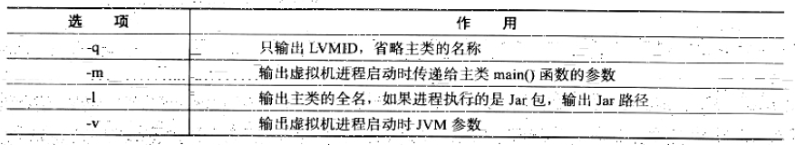
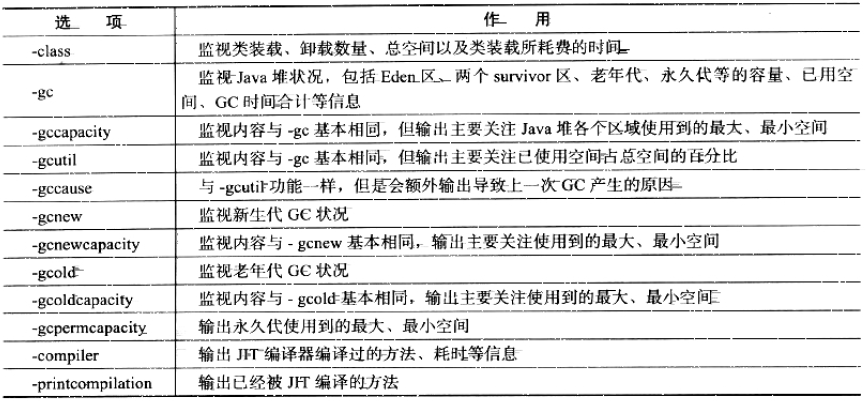
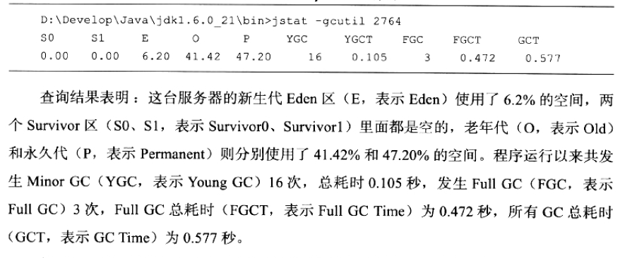
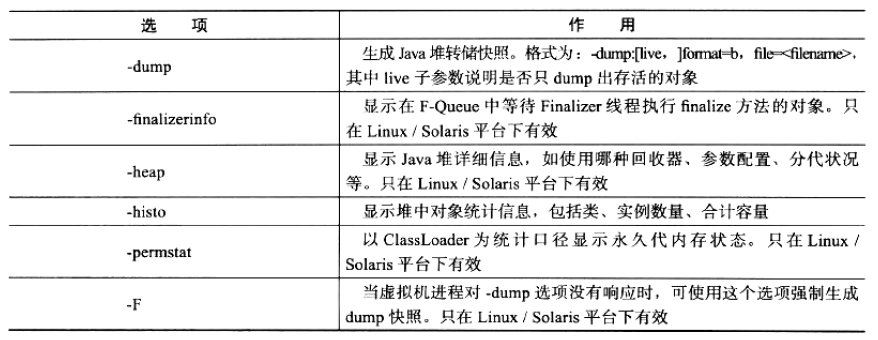
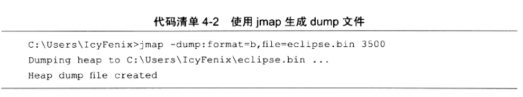

## 深入理解Java虚拟机第四章 虚拟机性能监控与故障处理工具

1. 下面说明几种基于JDK 1.6的几种主要的命令行监控工具
- jps -- JVM Process Status Tool，显示指定系统内所有的HotSpot虚拟机进程
> 可以列出正在运行的虚拟机进程，并显示虚拟机执行主类（Main Class，main()函数所在的类）名称以及这些进程的本地虚拟机唯一ID（Local Virtual Machine Identifier，LVMID）。
> jps命令格式为：jps [options][ hostid ]，jps可以通过RMI协议查询开启了RMI服务的远程虚拟机进程状态，hostid为RMI注册表中注册的主机名，jps的其他常用选项见下图：

- jstat -- JVM Statistics Monitoring Tool，用于收集HotSpot虚拟机各方面的运行数据
> 它可以显示本地或者远程虚拟机进程中的类装载、内存、垃圾收集、JIT编译等运行数据，命令格式为：jstat [option vmid [interval[s|ms] [count]] ]，对于命令格式中的vmid与LVMID需要特别说明一下，如果是本地虚拟机进程，二者是一致的，如果是远程虚拟机进程，那格式应该是： [protocol:][//]lvmid[@hostname[:port]/servername]，interval和count代表查询间隔和次数，如果忽略，说明只查询一次。
> 如果需要没250毫秒查询一次进程2764垃圾收集状况，一共查询20次，那命令应当是：jstat -gc 2764 250 20，下图是选项option：

- jinfo -- Configuration Info for Java，显示虚拟机配置信息
- jmap -- Memory Map for Java，生成虚拟机的内存转储快照（headdump文件）
> 和jinfo命令一样，jmap有不少功能在Windows平台下都是受限的，除了生成dump文件的-dump选项和用于查看每个类的实例、空间占用统计的-histo选项在所有操作系统都提供之外，其余选项都只在Linux/Solaris下使用
> jmap命令格式：jmap [ option ] vmid，option选项合法值如下图：

- jhat -- JVM Heap Dump Browser，用于分析heapdump文件，它会建立一个HTTP/HTML服务器，让用户可以在浏览器上查看分析结果
> 与jmap搭配使用，不过实事求是地说，一般不直接使用jhat来分析dump文件，主要有两个原因：一是一般不会在部署应用程序的服务器上直接分析dump文件，即使可以这样做，也会尽量将dump文件复制到其他机器上进行，因为这个分析工作耗时而且消耗硬件资源；另一个原因是这个分析功能比较简陋，相比后文介绍的VisualVM，以及专业的Eclipse Memory Analyzer、IBM HeapAnalyzer等工具具有更强大更专业的分析功能。

- jstack -- Stack Trace for Java，显示虚拟机的线程快照
> 线程快照就是当前虚拟机内每一条线程正在执行的方法堆栈的集合，主要目的是定位线程出现长时间停顿的原因，如线程间死锁、死循环、请求外部资源导致的长时间等待。线程出现停顿的时候通过jstack来查看各个线程的调用堆栈，就可以知道没有相应的线程到底在后台做些什么事情，或者等待着什么资源。
> jstack命令格式：jstack [ option ] vmid，如下图：

2. JDK中bin目录的jconsole.exe是一个可视化管理内存、线程的工具