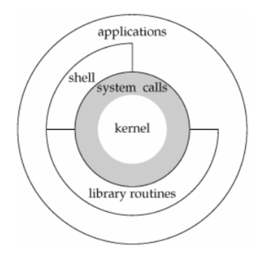
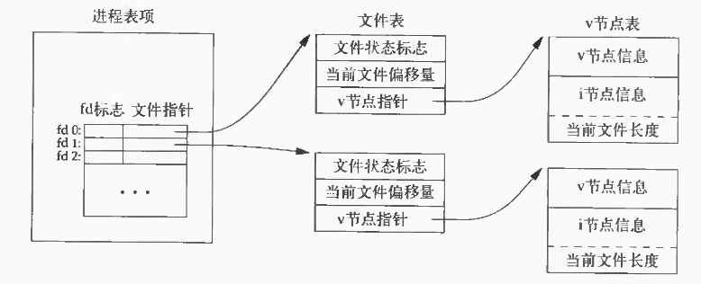
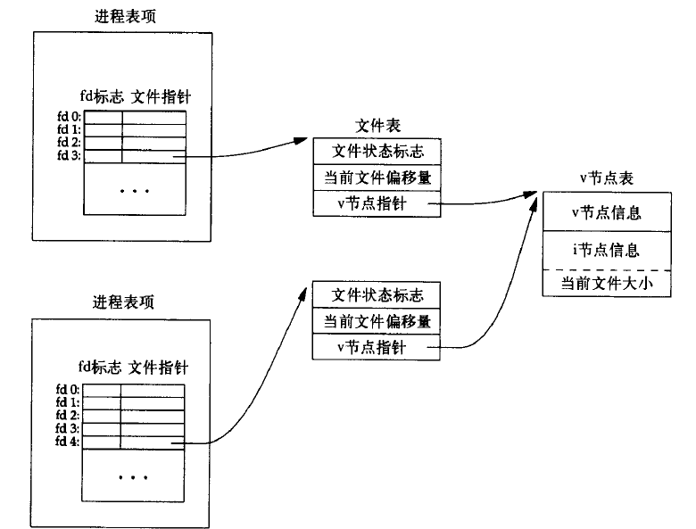

## 第1章——UNIX基础知识

### 1.2 UNIX体系结构

- 从严格意义上来说，可将操作系统定义为一种软件，它控制计算机硬件资源，提供程序运行环境，通常将这种软件称为内核
- 内核的接口被称为系统调用，公用函数库构建在系统调用接口之上，应用程序既可以使用公用函数库，又可以使用系统调用
- 如图是UNIX操作系统的体系结构：

### 1.4 文件和目录

#### 1.4.1 文件系统

- UNIX文件系统是一个目录和文件组成的一种层次结构，所有东西的起点都是被称为跟的目录，这个目录的名称是一个字符"/"
- 目录是一个包含目录项的文件，在逻辑上，可以认为每个目录项都包含一个文件名和该文件属性（文件类型，大小，所有者等），但是UNIX文件系统的大多数实现并不在目录项中存放属性

#### 1.4.2 文件名

- 创建新目录时会自动创建两个文件名：. 和 ..。点指向当前目录，点点指向父目录，在最高层次的根目录中，点点与点相同

#### 1.4.3 路径名

- 绝对路径：以/开头
- 相对路径：不以/开头，相对于进程当前工作目录而言

### 1.5 输入和输出

#### 1.5.1 文件描述符

- 通常是一个小的非负整数，内核用以标识一个特定进程正在访问的文件，当内核打开或创建一个新文件时，它都会返回一个文件描述符，在读写文件时，可以使用这个文件描述符

#### 1.5.2 标准输入、标准输出和标准错误

- 每当运行一个新程序时，所有的shell都为其打开了这3个文件描述符
- 两个常量STDIN_FILENO和STDOUT_FILENO定义在<unistd.h>中，它们指定了标准输入和标准输出的文件描述符

#### 1.5.3 不带缓冲的IO和标准IO

- 函数open、read、write、lseek以及close提供了不带缓冲的IO，这些函数都使用文件描述符，在这种情况下，选取不同的BUFFSIZE将会影响到程序的效率
- 标准IO函数为那些不带缓冲的IO函数提供了一个带缓冲的接口，使用标准IO函数无需担心如何选取最佳的缓冲区大小

### 1.6 程序和进程

#### 1.6.1 程序

- 程序是一个存储在磁盘上某个目录中的可执行文件，内核使用exec函数（7个exec函数之一），将程序读入内存，并执行程序

#### 1.6.2 进程和进程ID

- UNIX系统确保每个进程都有一个唯一的数字标识符，称为进程ID，总是一个非负整数
- 通过调用getpid可以知道线程ID，返回一个pid_t类型，建议在打印过程中将其转化为长整型打印，虽然大多数进程ID可以使用整形表示，但是使用长整型，可以提高可移植性，确保那些使用长整型实现pid_t的系统上也能正常工作

#### 1.6.3 进程控制

- 有三个主要用于进程控制的函数：fork、exec和waitpid

  - fork创建一个新进程，新进程是调用进程的一个副本，特殊的是，调用一次，返回两次，对父进程返回子进程ID，对子进程返回0
  - 在子进程中，调用exec执行新的任务。具体的，可以通过execlp函数执行从标准输入读入的命令。使用fork和exec是某些操作系统产生一个新进程的手段
  - 父进程希望等待子进程终止，就可以通过调用waitpid实现。其参数指明要等待进程的pid

- 实例代码如下：

  ```c
  #include <stdio.h>
  #include <sys/wait.h>
  #include <string.h>
  #include <unistd.h>
  #include <stdlib.h>
  
  #define MAXLINE 10
  int main() {
      char buf[MAXLINE];
      pid_t pid;
      int status;
      printf("%% ");
      while (fgets(buf, MAXLINE, stdin) != NULL){
          if(buf[strlen(buf) - 1] == '\n'){
              buf[strlen(buf) - 1] = 0;
          }
          pid = fork();
          if(pid < 0){
              fprintf(stderr, "fork error");
          }
          else if(pid == 0){
              execlp(buf, buf, (char*)0);
              exit(2);
          }
          if((pid = waitpid(pid, &status, 0)) < 0){
              fprintf(stderr, "waitpid error");
          }
          printf("%% ");
      }
      exit(0);
  }
  ```

### 1.8 用户标识

#### 1.8.1 用户ID、组ID、附属组ID

- 在口令文件中，每个用户名都对应着一个用户ID，用户不能更改其用户ID
- 同样，在口令文件中，每个用户也对应着一个组ID，这个组叫做用户的基本组。一般来说，口令文件中，有多个登录项对应着相同的组ID，这种机制使得同组的各个成员之间共享资源
- 除了在口令文件（/etc/passwd）中为一个用户指定一个基本组之外，还可以在文件/etc/group中将用户添加到其他组中，其他组被称为附属组，只有口令文件中指定的组被称为基本组

### 1.9 信号

- 信号（signal）用于通知进程发生了某种情况，例如，当进行除法除数为0时，则进程会收到SIGFPE（浮点异常）的信号，此时，进程有以下三种方式处理信号：

  - 忽略信号，有些信号表示硬件异常，例如除以0或者访问当前进程地址空间之外的存储空间，这些异常产生的后果不确定，所以不推荐这种方式
  - 按系统默认方式处理。对于除以0，系统默认是终止进程
  - 提供一个函数，信号发生时调用该函数，这被称为捕捉该信号

- 产生信号，有很多机制都可以产生信号，如：

  - 通过终端键盘产生信号，如中断键（Delete或Ctrl+C）和退出键（Ctrl+D）
  - 调用kill函数，在一个进程中调用此函数就可以向另一个进程发送一个信号

- 代码实例，通过提供一个函数来捕捉信号的方式来处理信号，方式是，使用signal()在当前进程内注册一个捕获某种信号的函数，当进程收到该信号时，就会执行该函数：

  ```c
  #include <stdio.h>
  #include <sys/wait.h>
  #include <string.h>
  #include <unistd.h>
  #include <stdlib.h>
  
  #define MAXLINE 10
  
  static void sig_int(int);
  int main() {
      char buf[MAXLINE];
      pid_t pid;
      int status;
      signal(SIGINT, sig_int);
      printf("%% ");
      while (fgets(buf, MAXLINE, stdin) != NULL){
          if(buf[strlen(buf) - 1] == '\n'){
              buf[strlen(buf) - 1] = 0;
          }
          pid = fork();
          if(pid < 0){
              fprintf(stderr, "fork error");
          }
          else if(pid == 0){
              execlp(buf, buf, (char*)0);
              exit(127);
          }
          waitpid(pid, &status, 0);
          printf("%% ");
      }
      exit(0);
  }
  static void sig_int(int signo){
      printf("get signal: %d\n", signo);
  }
  ```

### 1.10 时间值

- 日历时间
  - 自1970年1月1日00:00:00这个特定时间以来所累积的秒数累计值
  - 系统基本数据类型time_t用来保存这种时间值
- 进程时间
  - 用以度量进程使用的中央处理器资源的时间
  - 进程时间以时钟滴答计算，每秒钟曾经取为50、60或100个时钟滴答
  - 当度量一个进程时间时，UNIX系统为一个进程维护了3个进程时间值：
    - 时钟时间，它是进程运行的时间总量，其值与系统中同时运行的进程数有关
    - 用户CPU时间，是执行用户执行所用的时间量
    - 系统CPU时间，进程执行内核程序所经历的时间，如read或write
  - 用户CPU时间和系统CPU时间之和常被称为CPU时间
  - 通过执行命令 time + 命令就可以测量进程时间，这是会显示出 real user sys

### 1.11 系统调用和库函数

- 所有的操作系统提供了多种服务的入口点，由此程序向内核请求服务，这些入口点被称为系统调用
- 手册中的第三部分定义了程序员可以使用的通过库函数，虽然这些函数可能会调用一个或多个内核的系统调用，但是它们并不是内核的入口点。例如，printf会使用write系统调用，而strcpy和atoi并不使用任何系统调用
- 系统调用和库函数之间的差别是：系统调用通常提供一种最小接口，而库函数通常提供比较复杂的功能，如下，是说明这种差别的例子：
  - 在UNIX系统调用中处理存储空间分配的是sbrk，而malloc实现了一种特定类型的分配。如果不喜欢其操作方式，可以自定义自己的malloc函数，比如有很多软件包，它们使用sbrk系统调用实现自己的存储空间分配算法
  - 对于提供系统时间而言，UNIX系统调用只返回一个time_t类型的值，对该值的任何解释，比如变成可读的，适应时区的，都交由用户进程去处理。在标准库中，实现了若干例程来处理大多数情况

## 第3章——文件I/O

### 3.1 引言

- UNIX系统中大多数I/O只需用到5个函数：open、read、write、lseek、以及close，不同缓冲长度对read和write有着不同的影响
- 不带缓冲的I/O，不带缓冲指的是每个read和write都调用内核中的一个系统调用
- 多个进程共享资源时，原子操作的概念十分重要，通过文件I/O和指定open函数适当的参数可以解决部分共享资源问题。同时多个进程间共享文件时内核维护的有关数据结构也十分重要，理解这些数据结构是理解各种I/O函数的基础，这些I/O函数除了上文提到的几个，也包括dup、fcntl、sync、fsync和ioctl等

### 3.2 文件描述符

- 对于内核而言，所有打开的文件都通过文件描述符引用。文件描述符是一个非负整数，使用open或creat返回标识该文件的描述符，然后read或write等函数通过将该描述符作为参数来引用该文件
- UNIX系统中shell把文件描述符0与进程的标准输入关联，1与标准输出关联，2与标准错误关联。在符合POSIX.1的应用程序中，应使用<unistd.h>中定义的STDIN_FILENO、STDOUT_FILENO和STDERR_FILENO来提高可读性
- 文件描述符的变化范围是0~OPEN_MAX-1，早期的UNIX系统上限为19,但现在很多系统将其上限增加至63

### 3.3 函数open和openat

```c
#include <fcntl.h>
int open(const char *path, int aflag, ... /* mode_t mode */);
int openat(int fd, const char *path, int aflag, ... /* mode_t mode */);
```

- 由open和openat函数返回的文件描述符一定是最小的未用描述符数值。这一点可以用来在标准输入、输出、错误上打开新的文件。例如，一个应用程序可以先关闭标准输出，然后打开另一个文件，执行打开操作前就能知道一定会在标准输出上打开

- 对于open和openat函数而言，仅当创建新文件时才会使用最后这个参数

- path参数是要打开或创建文件的名字，该参数与参数fd的配合使用区分了open和openat函数，共有以下3种可能性：
  - path参数是绝对路径时，参数fd失效，此时两函数等价
  - path参数是相对路径时，open函数是指以进程当前工作目录为起点，而openat是指以fd指向的目录文件为起点
  - 特别的，当path参数是相对路径，并且fd取值AT_FDCWD时，则openat函数以当前进程工作目录为起点，这种情况下两函数类似

- aflag参数用来表示文件状态的标识符，可用定义在<fcntl.h>中的一个或多个常量进行或运算构成aflag参数
  - 以下五个常量必须指定，且只能指定一个
    - O_RDONLY，只读打开
    - O_WRONLY，只写打开
    - O_RDWR，读写打开
    - O_EXEC，只执行打开
    - O_SEARCH，只搜索打开（应用于目录）
  - 以下常量是可选的
    - O_APPEND，每次写时都追加到文件尾端（设置这个标识可在一定程度上解决多进程同时写共享文件的问题）
    
    - O_CLOEXEC，把FD_CLOEXEC常量设置为文件描述符标识
    
    - O_CRATE，如果文件不存在则创建，同时需要指明mode
    
    - O_EXCL，如果同时指定了O_CREAT，而文件已经存在，则出错，可以用来测试一个文件是否存在。如果不存在，则创建，这使得测试和创建成为了一个原子操作
    
    - O_SYNC，当这个文件标识描述打开时，每次write都会等待物理I/O完成，包括文件数据更新和文件属性更新
    
    - O_DSYNC，每次write都要等待物理I/O完成，但是如果该写操作并不影响读取刚写入的数据，则不需要等待文件属性被更新
    
      > O_SYNC和O_DSYNC标识有着微妙的区别。当设置了O_SYNC属性之后，数据和所有属性总是同步更新。而对于O_DSYNC来说，仅当文件属性需要反映文件数据的变化时，这些属性才会被同步更新，如文件大小属性，而对于文件的时间属性，则不会同步更新
    
    - O_RSYNC，使read操作等待，直至所有对文件同一部分挂起的写操作都完成
  
- openat函数希望解决两个问题（该函数出现的意义）：

  - 让进程中的所有线程可以使用相对路径名打开目录中的文件，而不再只能打开当前工作目录，open函数只能基于当前进程工作目录打开相对路径
  - 可以避免time-of-check-to-time-of-use错误，TOCTTOU错误的基本思想是，如果两个基于文件的函数调用，其中第二个调用依赖于第一个调用的结果，那么程序是脆弱的，因为这两个调用并不是原子操作

### 3.4 函数creat

```c
#include <fcntl.h>
int creat(const char *path, mode_t mode);
```

- 此函数等价于：

  ```c
  open(path, O_WRNOLY | O_CREAT | O_TRUNC);
  ```

- 这也是creat函数的不足之处，因为以只写的方式打开文件，如果想要继续读取其内容，则需要先关闭再打开，因此，如果有创建并读写文件的需求，可以使用如下方式：

  ```c
  open(path, O_RDWR | O_CREAT | O_TRUNC, mode);
  ```

### 3.5 函数close

```c
#include <unistd.h>
int close(int fd);
```

- 关闭一个文件时还会释放该进程加在该文件上的所有记录锁，当一个进程终止时，内核自动关闭它所有的打开文件

### 3.6 函数lseek

```c
#include <unistd.h>
off_t lseek(int fd, off_t offset, int whence);
```

- 对参数offset的解释与参数whence的值有关

  - 若whence是SEEK_SET，则将该文件的偏移量设置为距文件开始处offset个字节
  - 若whence是SEEK_CUR，则将该文件的偏移量设置为其当前值加offset，offset可为正或负
  - 若whence是SEEK_END，则将该文件的偏移量设置为文件长度加offset，offset可正可负

- 若lseek执行成功，则返回新的文件偏移量，因此以下代码可以确定当前打开文件的偏移量

  ```c
  off_t currentpos;
  currentpos = lseek(fd, 0, SEEK_CUR);
  ```

- 上述的这种方法也可以用来确定所涉及的文件是否可以设置偏移量，如果文件描述符指向的是一个管道、FIFO或网络套接字，则返回-1

- 对于普通文件来说，其偏移量必须是非负值，而某些设备也可能允许负的偏移量，因此在使用lseek的返回值时应当小心，不要测试是否小于0，而要测试它是否等于-1，下面的代码用于测试与标准输入描述符绑定的文件能否设置偏移量：

  ```c
  #include <unistd.h>
  int main(void){
      if(lseek(STDIN_FIFENO, 0, SEEK_CUR) == -1){
          printf("cannot seek\n");
      }
      else{
          printf("seek OK\n");
      }
      exit(0);
  }
  ```

- lseek将当前的文件偏移量保存在内核维护的一个数据结构中，因此并不会引起任何I/O操作，然后，该偏移量用于下一个读写操作

- 文件偏移量可以大于当前文件的长度，这时将形成空洞，但并不实际占用磁盘上的存储区，下面的代码便可以在文件中产生空洞

  ```c
  #include <unistd.h>
  #include <fcntl.h>
  char buf1[] = "abcdefghij";
  char buf2[] = "ABCDEFGHIJ";
  int main(void){
      int fd;
      fd = creat("file.hole", O_WRONLY | O_CREAT | O_TRUNC);//offset now = 0
      write(fd, buf1, 10);//offset now = 10
      lseek(fd, 16384, SEEK_SET);//offset now = 16384
      write(fd, buf2, 10);//offset now = 16394
      exit(0);
  }
  ```

- 使用od -c file.hold表示（-c）以字符方式打印文件，就可以看出文件中的空洞。当创建一个没有空洞但同样大小的文件时，二者长度虽然一致，但是有空洞的文件占用着更少的磁盘块

### 3.7 函数read

```c
#include <unistd.h>
ssize_t read(int fd, void *buf, size_t nbytes);
```

- 如果read成功，返回读到的字节数，如果已经到达文件末尾，有多种情况使得实际读到的字节数少于要求读取的字节数（nbytes）：
  - 读取普通文件时，在读到要求字节数之前已经到达了文件末尾
  - 从终端设备读取时，通常一次最多读一行
  - 从网络读取时，网络中的缓冲机制可能造成返回值小于所要求读的字节数
  - 从管道或FIFO读取时，管道中包含的字节少于所需的数量
  - 从某些面向记录的设备（如磁带）读取时，一次最多返回一个记录
  - 当一信号造成中断，而且已经读取了部分数据量时（此时在成功返回之前，该偏移量将增加实际读到的字节数）

### 3.8 函数write

```c
#include <unistd.h>
ssize_t write(int fd, const void *buf, size_t nbytes);
```

- 其返回值通常与参数nbytes相同，否则表示出错，write出错的一个常见原因是磁盘已经写满，或者超过了一个给定进程的文件长度限制
- 对于普通文件，写操作从文件的当前偏移量开始。如果在打开该文件时指定了O_APPEND选项，则在每次写操作的开始时，都会先将文件偏移量设置在文件的当前结尾处，使用这个选项有时可以解决一定的多进程共享文件问题

### 3.10 文件共享

- UNIX系统支持在不同进程间共享打开文件，在此先介绍UNIX内核用户维护打开文件状态的一系列数据结构

  - 每个进程中包含一张打开文件描述符表（存放在用户空间中），每个描述符占用一个表项，这个表项的内容是：

    - 文件描述符标识
    - 指向一个文件表项的指针

  - 内核为所有打开文件维护一张文件表，每个文件表项包含：

    - 文件状态标识（只读、只写、读写、同步、非阻塞等）
    - 当前文件偏移量
    - 指向该文件v节点表项的指针

  - 每个打开的文件都有一个v节点，v节点包含了文件类型和对此文件进行各种操作函数的指针。对于大多数文件，v节点还包含了该文件的i节点（信息直接从磁盘上的i节点读取）

    > 事实上，v节点中记录的是与具体文件系统无关的i节点部分，而i节点中则记录的是与具体文件系统相关的内容
    >
    > Linux系统并没有将相关数据结构分为i节点和v节点，而是采用了一个与文件系统相关的i节点和一个与文件系统无关的i节点

- 如下图展示了单个进程打开一系列文件时的数据结构以及多个进程共享文件时的数据结构

  
  

- 有了这些数据结构之后，可以对前面所述的操作进一步说明
  - 在完成每个write后，如果文件表项中的当前文件偏移量大于i节点中的当前文件大小，则说明文件加长了，将该偏移量写入i节点表项中
  - 如果使用O_APPEND打开一个文件，则在每次write之前，会将文件表项中的当前文件偏移量设置为i节点中的当前文件大小
  - 若使用lseek定位到文件末尾时，文件表项的当前偏移量被设置为i节点表项中的当前文件长度
  - lseek函数只修改文件表项中的当前文件偏移量，不进行任何I/O操作
- 注意文件描述符标识与文件状态标识的区别
  - 在同一个进程（dup）或不同进程（fork）中都可能出现不同的文件描述符共享一个相同的文件表项的情况
  - 文件描述符标识只作用与一个进程中的一个描述符
  - 文件状态标识作用域任何进程中指向当前表项的所有描述符

### 3.11 原子操作

- 追加一个文件

  - 问题：假设两个进程分别打开了相同的一个文件，它们对当前文件执行相同的操作，都是先lseek到文件末尾，再write数据，这样会出现数据被覆盖的问题
  - 解决：UNIX系统为这样的操作提供了一种原子操作方法，即在打开文件时设置O_APPEND标识，这样会使得内核在每次write之前，都将当前偏移量设置到该文件末尾处，于是在每次write之前不再需要调用lseek

- 函数pread和pwrite

  ```c
  #include <unistd.h>
  ssize_t pread(int fd, void *buf, size_t nbytes, off_t offset);
  ssize_t pwrite(int fd, const void *buf, size_t nbytes, off_t offset);
  ```

  - 调用pread相当于调用lseek后调用read，但是pread又与这种顺序调用有下列重要区别：
    - 调用pread时，无法中断其定位和读操作
    - 不更新当前文件偏移量
  - 调用pwrite相当于调用lseek后调用write，但也与它们有类似的区别

- 创建一个文件

  - 当使用O_CREAT | O_EXCL作为open函数的参数时，可以做到文件不存在时，创建，文件存在时，失败

### 3.12 函数dup和dup2

```c
#include <unistd.h>
int dup(int fd);
int dup2(int fd, int fd2);
```

- 这两个函数都可用来复制一个现有的文件描述符

- dup函数返回的新文件描述符一定是当前可用文件描述符的最小数值

- dup2，由fd2指定新描述符的值

  - 如果fd2已经打开，则先将其关闭
  - 如果fd等于fd2，则dup2返回fd2，而不关闭它

- 当使用dup函数时，产生的结果如下图：

  

- 复制一个文件描述符的另一种方法是使用fcntl函数
  - 调用dup(fd)等效于调用fcntl(fd, F_DUPFD, 0)
  - 调用dup(fd, fd2)等效于close(fd2) fcntl(fd, F_DUPFD, fd2)，但也不是完全等效，因为先关闭后复制并不是一个原子操作，可能因为产生信号而中断

### 3.13 函数sync、fsync和fdatasync

```c
#include <unistd.h>
int fsync(int fd);
int fdatasync(int fd);
void sync(void);
```

- 延迟写：当向文件中写入数据时，内核通常先将数据复制到缓冲区中，然后排入队列，晚些时候再写入磁盘

- 当内核需要重用缓冲区来存放其他磁盘块数据时，它会把所有延迟写数据块写入磁盘，为了保证磁盘上实际文件系统与缓冲区中内容的一致性，UNIX提供了sync、fsync和fdatasync函数

- sync只是将所有修改过的块缓冲区排入写队列，然后就返回，它并不等待实际写磁盘结束。通常，称为update的系统守护进程周期性调用sync函数，这就保证了定期冲洗内核的块缓冲区
- fsync函数只对fd指定的文件起作用，并且等待写磁盘操作结束才返回，这样可以确保修改过的块立即写到磁盘上
- fdatasync类似于fsync，但是它只影响文件的数据部分。而fsync会同步更新文件的数据部分和属性部分

### 3.14 函数fcntl

```c
#include <fcntl.h>
int fcntl(int fd, int cmd, ... /* int arg */);
```

- fcntl函数可以改变已经打开文件的属性

- fcntl函数有以下5种功能：

  - 复制一个已有的描述符（cmd=F_DUPFD或F_DUPFD_CLOEXEC）
  - 获取/设置文件描述符标识（cmd=F_GETFD或F_SETFD）
  - 获取/设置文件状态标识（cmd=F_GETFL或F_SETFL）
  - 获取/设置异步I/O所有权（cmd=F_GETOWN或F_SETOWN）
  - 获取/设置记录锁（cmd=F_GETLK、F_SETLK或F_SETLKW）

- 前8中cmd的意义解释：

  - F_DUPFD，复制文件描述符fd，新描述符有它自己的一套文件描述符标识，但是FD_CLOEXEC文件描述符被清除（表示该描述符在exec时仍然有效）
  - F_DUPFD_CLOEXEC，复制文件描述符fd，设置与新描述符关联的FD_CLOEXEC文件描述符标识的值，返回新文件描述符
  - F_GETFD，返回对应文件的文件描述符标识
  - F_SETFD，设置文件的描述符标识，按第三个参数设置
  - F_GETFL，返回文件状态标识，在使用open函数时，已描述了文件状态标识
  - F_SETFL，将文件状态标识设置为第3个参数的值，可以更改的几个标识是：O_APPEND，O_SYNC、O_NONBLOCK、O_DSYNC、O_RSYNC、O_FSYNC和O_ASYNC
  - F_GETOWN，获取当前接收SIGIO和SIGURG信号的进程ID或进程组ID，这两个信号是异步IO信号
  - F_SETOWN，设置接收SIGIO和SIGURG信号的进程ID或进程组ID

- 在修改文件描述符标识或文件状态标识时要小心，先要获得现在的标识值，然后按照期望修改它，最后设置新标识值，如果只是执行F_SETFD或F_SETFL命令，这样会关闭以前的标志位。如下代码可以修改文件状态标识：

  ```c
  #include <fcntl.h>
  void add_fl(int fd, int flags){
      int val;
      val = fcntl(fd, F_GETFL, 0);
      val |= flags;
      fcnl(fd, F_SETFL, val);
  }
  void remove_fl(int fd, int flags){
      int val;
      val = fcntl(fd, F_GETFL, 0);
      val &= ~flags;
      fcnl(fd, F_SETFL, val);
  }
  ```

  - 如果使用这样的调用：add_fl(fd, O_SYNC)，则这样就开启了同步写标识，使得每次write都要等待，直至数据已经写到了磁盘上再返回。事实上，如果不开启这个标志位，write通常只是将数据排入队列，而实际的写磁盘操作则可能在以后的某个时刻进行。而数据库系统则需要使用O_SYNC，这样一来，当它从write返回时就已经知道数据写到了磁盘上，以免数据发生丢失，这个过程叫做同步写
  - 当支持同步写时，系统时间和时钟时间应当会显著增加

### 3.15 函数ioctl

```c
#include <unistd.h> /* System V */
#include <sys/ioctl.h> /* BSD and Linux */
int ioctl(int fd, int request, ... );
```

- ioctl函数一直是I/O操作的杂物箱，不能用本章中其他函数表示的I/O操作通常都能用ioctl表示，中断I/O是使用ioctl最多的地方

