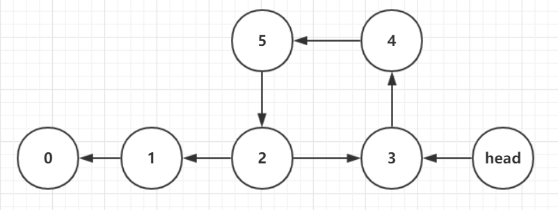

## 关于求两个单链表相交的第一个节点的问题分析

判断两个单链表是否相交以及相交的情况下求第一个相交节点，两个链表可以有环，也可以无环。因此我们可以从以下几个步骤分析：
 - 判断一个单链表是否存在环路，如果无环，返回null，反之，返回入环节点。
 - 如果两个单链表均无环，进入相应的子程序，如果无相交，返回null，反之，返回第一个相交节点。
 - 如果一个有环，一个无环，进入相应的子程序，如果无相交，返回null，反之，返回第一个相交节点。
 - 如果两个单链表均有环，进入相应的子程序，如果无相交，返回null，反之，返回第一个相交节点。

接下来，我们结合图片以及相应的理论对这四个小问题求解。

1. **判断一个单链表是否存在环路**

	如下图所示，如果单链表存在环路，则只可能是图一所示的结构，请读者自行收起野马般的思路，类似图二的结构是不存在的。
	
	
	
	上图中的入环节点为节点2。
	
	
	
	接下来，我们分析一下判断单链表是否有环，如果有环，返回入环节点的思路。

	首先，有两种解决方案，一种情况算法空间复杂度为O(N)，另一种空间复杂度O(1)，读者可以根据不同的情形择优选取。
	
	第一种：使用HashSet，因为HashSet只能容纳不重复的元素，所以从头遍历链表，将经过的每一个节点都加进去，如果发现有重复，则直接返回第一个重复的节点，就是入环节点。如果没有重复，说明链表无环，返回null。
	很明显，这个算法空间复杂度为O(N)，在此不展示代码，因为较为简单，读者有兴趣可以自己尝试，接下来讲述第二种方法，空间复杂度为O(1)。
	
	第二种：使用快慢指针。快指针一次走两步，慢指针一次走一步，很明显，当快指针遇到null走不动的时候，就可以确定链表无环，直接返回null。
	如果链表存在环路，可以得到一个结论是快指针在有限的步数内肯定会追上慢指针并且相遇（敲黑板），读者可以自行画图尝试，是一个很容易观察出来的结论。
	下一步，在快慢指针相遇的一刻，将快指针指向头节点，然后让快慢指针同时走，并都走一步，注意，这里是都走一步并且保持同步。下面，见证奇迹的时刻到了，当快慢节点再次相遇时，二者此时都指向入环节点，也就是两个指针肯定都会在入环节点处首次相遇。
	> 这个结论可以用数学归纳法证明，笔者不罗列出证明过程，读者记住这个结论就可以编码了，并且肯定正确。下面是代码。
	```java
	/**
	 * 判断一个链表是否有环，如果有环返回入环节点，如果无环，返回null。
	 * 步骤：
	 * ①准备两个快慢指针，一个一次走一步，一个一次走两步，如果有环，两个指针肯定会相遇，如果快指针走到了null，则代表无环；
	 * ②当两个指针相遇后，将快指针指向头节点，然后两个指针每次都同时走一步，当两个指针相等时，就到了链表的入环节点，返回即可。
	 * @param head
	 * @return
	 */
	private static Node getLoopNode(Node head) {
		if(head.next == null || head.next.next == null) {
			return null;
		}
		Node slow = head.next;
		Node fast = head.next.next;
		while(slow != fast) {
			if(fast.next == null || fast.next.next == null) {
				return null;
			}
			slow = slow.next;
			fast = fast.next.next;
		}
		//达到这一步之后，两个指针相遇
		
		//接着将快指针指向头节点
		fast = head;
		//二者同时走相同的步数，肯定会在入环节点处相遇，相遇后返回即可
		while(fast != slow) {
			fast = fast.next;
			slow = slow.next;
		}
		return fast;
	}
	```
	至此，第一步，判断链表是否有环，已经结束。

2. **两个无环链表的相交节点**

	这里直接说明一个结论，如果两个无环链表相交，那么它们俩的最后一个节点必然相等，也就是被两个链表共享。如果两个链表的最后一个节点不相等，那么两个链表一定不想等。
	如下图说明了两个无环列表的相交情况，下图一是正确的相交情况，下图二是不可能存在的相交情况。

	
	
	错误的情况：
	
	
	
	因此，得到上面的分析，我们来梳理一下求解第一个相交节点的思路。
	
	首先，得到分别得到两个链表的长度length1、length2和两个链表的最后一个节点end1、end2。如果两个end节点不相等，直接返回null。
	
	如果end相等，则计算两个链表的长度之差，准备两个指针分别指向等于head1和head2，让指向长链表的指针先走长度之差个步数。举个例子，如果两个链表长度之差为20，则先让指向长链表的指针走20步，接着让两个指针同步走，两个指针第一次相遇的地方，就是两个链表的第一个公共节点。

	至此，判断两个无环链表的相交节点的思路已经介绍完毕，下面看代码：
	```java
	/**
	 * 返回两个无环链表的第一个相交节点。
	 * 步骤：
	 * ①遍历两个链表，分别得到长度和最后一个节点length1,end1;length2,end2；
	 * ②如果两个链表相交，end一定相同，否则，不相交，直接返回null。
	 * ③确定两个链表长度的差值，让长的链表先走差值这么大的步数，然后两个链表同时走，相遇的时候就是第一个相交节点。
	 * @param head1
	 * @param head2
	 * @return
	 */
	private static Node noLoop(Node head1, Node head2) {
		int length1 = 0;
		int length2 = 0;
		Node end1 = head1;
		Node end2 = head2;
		while(end1.next != null) {
			length1++;
			end1 = end1.next;
		}
		while (end2.next != null) {
			length2++;
			end2 = end2.next;
		}
		//这里得到的length1和length2并不是真实的长度，因为长度没有意义，要得到的是二者的差值
		int difference = Math.abs(length1-length2);
		
	//		让长度长的先走一段距离
	//		for(int i = 0; i < difference; i++) {
	//			if(length1 > length2) {
	//				head1 = head1.next;
	//			}
	//			else {
	//				head2 = head2.next;
	//			}
	//		}
	//		
	//		共同走一段距离
	//		while(head1 != head2) {
	//			head1 = head1.next;
	//			head2 = head2.next;
	//		}
	//		return head1;
		//以上注释的一段代码跟以下的代码等效，下面的代码复用了end1和end2，使用end1来代表长的，end2来代表短的，这样就不用在循环中判断了
		end1 = length1 > length2 ? head1 : head2;
		end2 = end1 == head1 ? head2 : head1;
		for(int i = 0; i < difference; i++) {
			end1 = end1.next;
		}
		while(end1 != end2) {
			end1 = end1.next;
			end2 = end2.next;
		}
		return end1;
	}
	```
	
3. **有环链表和无环链表的相交情况**

	这里直接说明结论，一个有环链表和一个无环链表不可能存在相交节点。读者可以自行在草稿纸上画，如果还存在疑问，请继续往下读文章。
	
4. **两个有环链表的相交节点**

	如下图所示，两个有环链表的位置关系只能有以下三种：不相交，第一种相交，第二种相交。
	
	
	
	下面进行思路分析：
	
	先获取两个链表的入环节点loopNode1和loopNode2，如果两链表的入环节点相等，则为图二所示的位置关系。如果两个链表的入环节点不相等，则是图一或图三的位置关系。
	
	先谈两个入环节点相等，对应于图二所示的关系，其获取相交节点的方式几乎与获取两个无环链表相交节点的方式几乎一模一样。不一样的一点是：无环链表需遍历到end获得length之间的差值，而图二所示情况只遍历到入环节点及loopNode1或loopNode2处获得length的差值即可。获得length之间的差值后，得到相交节点与noLoop函数的逻辑一样。
	
	对于两个入环节点不相等的情况，可能对应于图一不相交，也可能是对应于图三相交。那么如何将二者区分？方式就是从第一个链表的入环节点loopNnode1开始遍历，如果在回到自身之前遇到了loopNode2，那么就是第三种情况，如果没遇到，就是第一种不相交的情况。对于图三相交的情况，直接返回两个入环节点之一即可，因为两个入环节点都是第一个相交的节点，只不过是针对不同的链表而言的。
	
	至此，获取两个有环链表第一个相交节点的思路已经介绍完毕，下面是代码：
	```java
	/**
	 * 返回两个有环链表的第一个相交节点。
	 * 步骤：
	 * ①判断两种有环链表的相交情况，可能有不相交，第一种相交，第二种相交（在相应的图上）；
	 * ②如果两个链表的入环节点相等，则为第一种相交情况；
	 * ③针对第一种相交情况，其实与无环链表相交理论基本上一致，只不过计算长度的时候无环是到end，有环则是到入环节点；
	 * ④如果不相等，则为不相交或者第二种相交情况；
	 * ⑤此时把loopNode1一直往下走，如果在回到自己之前，没有遇到loopNode2，则为两个链表不相交，
	 * 否则相交，直接返回loopNode1或loopNode2即可，因为这两个都是第一个相交节点，只不过是针对不同链表而言的。
	 * @param head1
	 * @param head2
	 * @return
	 */
	private static Node bothLoop(Node head1, Node head2) {
		Node loopNode1 = getLoopNode(head1);
		Node loopNode2 = getLoopNode(head2);
		if(loopNode1 == loopNode2) {
			int length1 = 0;
			int length2 = 0;
			Node end1 = head1;
			Node end2 = head2;
			while(end1.next != loopNode1) {
				length1++;
				end1 = end1.next;
			}
			while (end2.next != loopNode2) {
				length2++;
				end2 = end2.next;
			}
			//这里得到的length1和length2并不是到end的长度，而是到loopNode的长度
			int difference = Math.abs(length1-length2);
			end1 = length1 > length2 ? head1 : head2;
			end2 = end1 == head1 ? head2 : head1;
			for(int i = 0; i < difference; i++) {
				end1 = end1.next;
			}
			while(end1 != end2) {
				end1 = end1.next;
				end2 = end2.next;
			}
			return end1;
		}
		else {
			Node temp = loopNode1.next;
			while(temp != loopNode1) {
				if(temp == loopNode2) {
					return loopNode1;
					//or return loopNode2;
				}
				temp = temp.next;
			}
			return null;
		}
	}
	```

5. **总结**

	通过以上几个步骤，求两链表第一个相交节点的过程已经全部介绍完毕，下面是主函数的代码：
	```java
	/**
	 * 得到两个链表相交的主函数，该函数分为以下几个步骤：
	 * ①判断两个链表有环无环的情况，一个有环和一个无环的节点不可能相交；
	 * ②得到两个无环链表的相交节点；
	 * ③得到两个有环链表的相交节。
	 * @param head1
	 * @param head2
	 * @return
	 */
	public static Node getIntersectNode(Node head1, Node head2) {
		if(head1 == null || head2 == null) {
			return null;
		}
		Node loopNode1 = getLoopNode(head1);
		Node loopNode2 = getLoopNode(head2);
		//如果都是无环链表，将进入无环链表求相交节点的函数。
		if(loopNode1 == null && loopNode2 == null) {
			return noLoop(head1, head2);
		}
		//如果都是有环链表，将进入有环链表求相交节点的函数。
		if(loopNode1 != null && loopNode2 != null) {
			return bothLoop(head1, head2);
		}
		//如果一个有环一个无环，直接返回null，因为不存在相交的可能性。
		return null;
	}
	```
	
	自己在main函数中写测试用例即可，其中Node类就是普通的链表Node类，包含value和next指针。
	Github链接：[获取两链表第一个相交节点](https://github.com/Sprinte-Wei/JianZhiOfferQuestions/tree/master/src/question18)
	
	声明：由于笔者写完后没有用过多的测试用例去测试，如果存在漏洞，欢迎批评与指正。
