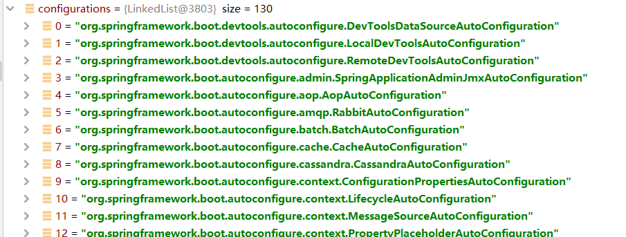
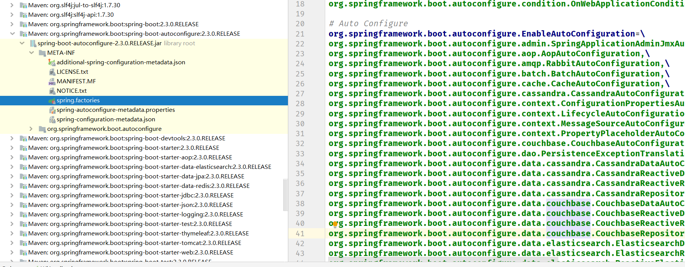

## 入门

### 快速上手

#### 1. 版本仲裁（版本控制）

spring-boot的父项目是spring-boot-starter-parent

spring-boot-starter-parent的父项目是spring-boot-dependencies

spring-boot-dependencies定义了所需以来的各种版本，是spring-boot的**版本仲裁中心**，比如jdbc版本，因此在自己的项目中无需维护版本

- 没有在spring-boot-dependencies中声明版本号的依赖，自然需要自己写版本号

```xml
<parent>
    <groupId>org.springframework.boot</groupId>
    <artifactId>spring-boot-starter-parent</artifactId>
    <version>2.3.0.RELEASE</version>
    <relativePath/> <!-- lookup parent from repository -->
</parent>
<parent>
    <groupId>org.springframework.boot</groupId>
    <artifactId>spring-boot-dependencies</artifactId>
    <version>2.3.0.RELEASE</version>
</parent>
```

#### 2. 依赖控制

spring-boot-starter-web是spring-boot项目的默认依赖，场景启动器，帮我们导入了web模块正常运行所依赖的组件，但依赖的版本都是父项目进行仲裁

```xml
<dependency>
    <groupId>org.springframework.boot</groupId>
    <artifactId>spring-boot-starter-web</artifactId>
</dependency>
```

spring boot将所有的功能场景都抽取出来，做成一个个的starters，这些starters集合了当前场景所需的所有依赖，如web，redis等，只需在项目中引入starter，spring boot就会将所需的所有依赖导入，并且自动管理版本。**需要什么功能，就导入什么场景的启动器**

#### 3. 主程序入口类

```java
@SpringBootApplication
public class WjApplication {
    public static void main(String[] args) {
        SpringApplication.run(WjApplication.class, args);
    }
}
```

@SpringBootApplication说明某个类是spring boot的主配置类，以下深入讲解一下这个注解的实现

首先，@SpringBootApplication的实现是以下代码：

```java
@Target({ElementType.TYPE})
@Retention(RetentionPolicy.RUNTIME)
@Documented
@Inherited
@SpringBootConfiguration
@EnableAutoConfiguration
@ComponentScan(
    excludeFilters = {@Filter(
    type = FilterType.CUSTOM,
    classes = {TypeExcludeFilter.class}
), @Filter(
    type = FilterType.CUSTOM,
    classes = {AutoConfigurationExcludeFilter.class}
)}
)
```

- @SpringBootConfiguration，标注在某个类上，表示这是一个spring boot的配置类

  - 其实现是通过@Configuration，这是spring底层的注解，标记该类是一个配置类（配置类就是配置文件的意思），和@SpringBootConfiguration一样都是标记配置类的，只不过一个是spring用的，一个是spring boot用的。@Configuration底层实现是@Component，组件

- @EnableAutoConfiguration，开启自动配置功能。spring boot没有配置任何东西就可以包扫描并且启动项目，就是因为这个注解，以前需要配置的东西，这个注解帮我们完成了自动配置，其实现如下：

  ```java
  @AutoConfigurationPackage
  @Import({AutoConfigurationImportSelector.class})
  ```

  - @AutoConfigurationPackage，自动配置包，通过`@Import({Registrar.class})`来实现。这是spring底层注解，意思是给容器中导入一个组件。打开Registrar类，发现，其作用是：首先追溯到注解最上层，就是@SpringBootApplication，然后将该标注的类所在的包注册到容器中，因此该包下所有的组件可以得到扫描（这个可以通过调试看出）。因此，**@SpringBootApplication标记的一个重要作用就是将该类所在包下的所有组件扫描进容器**，此时，假如给controller换到该注解以外的包，则会导致controller找不到

  - `@Import({AutoConfigurationImportSelector.class})`的作用是给容器中导入AutoConfigurationImportSelector（开启配置导入选择器），通过代码发现，其作用是：告诉spring容器要导入哪些组件的配置，如下图所示，发现这些组件都是以AutoConfiguration结尾，因此，该注解的作用是给容器中导入非常多的自动配置类，这些自动配置类的作用就是给容器中导入这个场景所需的所有组件，并配置好这些组件，比如要做aop功能，aop的自动配置类就帮忙配置好了。有了配置类，就免去了手动编写配置注入功能组件的工作

    - 那么这些自动配置类是从哪读取的呢？通过代码发现，spring boot在启动的时候，从类路径下META-INF/spring.factories中获取EnableAutoConfiguration指定的值，如下图，将这些值作为自动配置类导入到容器中，导入之后，配置就生效了，就无需自己配置了（以前需要配置的内容，spring boot都帮我们做了）

    - J2EE的整体解决方案和自动配置都在spring-boot-autoconfigure-2.3.0.RELEASE.jar包里，从这个包里可以看每一种功能怎么配的，之后可以自己修改

#### 4. 使用srping initializer快速创建spring boot项目

resources目录结构

- static：所有的静态资源，js css image
- templates：保存所有的模板页面，spring boot使用嵌入式的tomcat，默认不支持jsp，可以使用模板引擎，freemaker，thymeleaf等
- application.properties：项目配置文件，所有的配置都是默认的，可以在这个文件里面改动

### spring boot配置

#### 1. 配置文件

springboot使用一个全局的配置文件，配置文件的名字是固定的

- application.properties
- application.yml

配置文件的作用：修改springboot配置的默认值

#### 2. 配置文件与类的对应

比如使用application.yml写一个配置

```yml
server:
	port: 8081
	
person:
	name: Jack
	age: 18
```

则在bean里面写一个类person，使用注解@ConfigurationProperties(prefix = "person")将这个bean与配置文件进行映射，但是只有bean是容器中的组件，才能使用这个快速绑定功能，所以需要@Component注解

```java
@Component
@ConfigurationPropertie(prefix = "person")
public class Person {}
```

同样，在application.properties中也可以配置

```
person.name=Jack
person.age=18
```

@ConfigurationProperties与@Value

- 第一个是直接批量复制bean里的属性，第二个可以单个复制属性

@PropertySource与@ImportReSource

- @PropertySource作用是指定配置文件，不如不指定，就是全局配置文件，比如新建person.peoperties，则使用@PropertySource(value = {"classpath:person.properties"})

- @ImportReSource用来加载自己写的xml配置文件，如beans.xml，注意springboot默认加载xml配置文件，需要使用@ImportReSource注解，将该注解写到主配置类中即可，如@ImportReSource(localtion = {"classpath:beans.xml"})

- 但是，注意spring boot不推荐使用xml注解的方式，而是推荐使用配置类的方式添加配置，比如创建一个config文件夹，然后里面放置使用@Configuration声明的配置类，用来替代之前的配置文件，如下：

  ```java
  @Configuration
  public class MyConfig {
      /**
       * 作用是相当于<bean><bean/>标签，往容器中添加id为方法名userService的对象
       * @return
       */
      @Bean
      public UserService userService() {
          return new UserService();
      }
  }
  ```

  