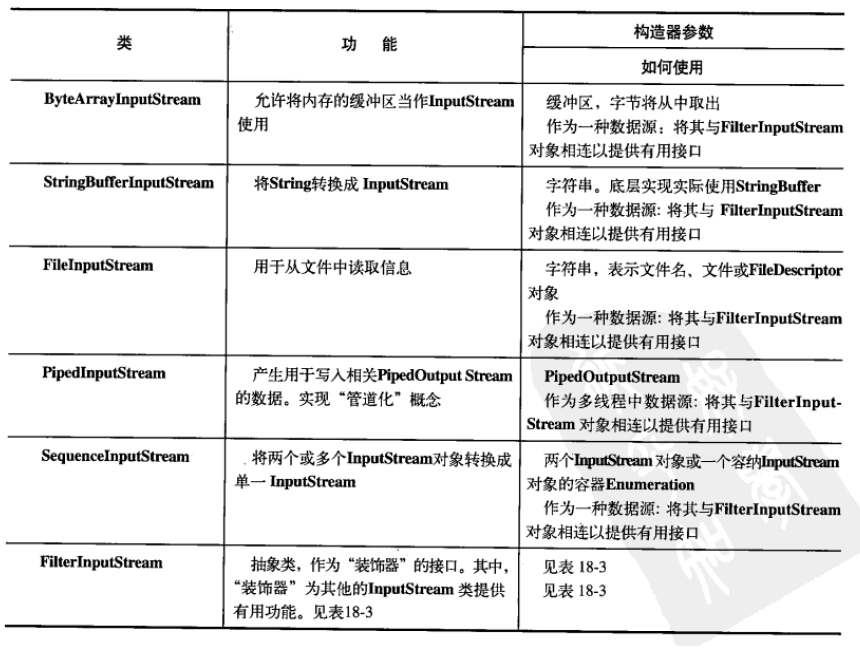

## 第一章 对象导论、第二章 一切都是对象

- 对象具有状态、行为和标识
> 状态标识内部数据，行为表示函数，标识表示对象在内存中的唯一地址

- 每个对象都有一个接口
> 接口确定了对某一个特定对象所能发出的请求，即确定了某一对象可以调用的方法

- 对象的设计要符合高内聚的原则
> 高内聚的原则强调在类中组合合适的方法，不要将所有的方法都强行塞到一个类中去

- 组合关系（composition），如果组合是动态发生的，则称为聚合（aggregation）
> 组合关系通常用户形容类的包含关系，如汽车包含引擎

- 组合和继承，建立新类时首先考虑组合，不要处处使用继承，这样会使程序结构过于复杂

- ArrayList和LinkedList
> ArrayList具有固定的访问特定元素的时间，而LinkedList访问元素的时间取决于索引的大小；ArrayList在插入和删除新元素方面比LinkedList逊色。最好的解决方案是在最初构建程序时使用LinkedList，而在性能优化时使用ArrayList

- Java中垃圾回收机制、单根基类继承机制和只能以一种方式创建对象使得Java编程比C++简单得多

- Java中char类型占两个字节，boolean呢？
> Java官方文档中并未给出boolean类型的具体大小。《Java虚拟机规范》中这样解释：虚拟机会将boolean变量当作int解释，也就是四个字节。而将boolean数组中的每个元素当作byte解释，也就是一个字节。

- Java中类变量会被初始化为0，而C++中不会。局部变量在Java和C++中均不会被初始化。

- Java设计者希望程序员反过来使用自己的域名，所有会出现com.util.…之类包名的出现，且从Java 2之后包名都是小写

## 第三章 操作符

- 一元操作符加号和减号
> 一元减号只是为了给原有数字取反而已，而一元加号存在的意义是只是为了与一元减号相对应，但不知道为什么中文书《Java编程思想（第四版）》P43会有这样一句话：“它唯一的作用就是将较小的数据类型提升为int”，而英文原著中并不存在这句话

- ++a先执行运算，再生成值，而a++先生成值，再运算
	```java
	int i = 0;
	System.out.println(i++);
	System.out.println(++i);
	```
> 效果是不相同的，第一句输出0，第二句输出2

- 基本数据类型比较可以直接使用 == 和 !=，而引用类型使用这两个只是比较了引用本身是否相等，即是否指向同一对象。如果想要比较引用数据类型内容是否相等的话，则需要使用函数equals()。另外，必须要注意的是如果想要判断自定义数据类型是否内容相等，则需要覆盖equals()函数，具体覆盖方法在文章的后续阶段

- 与C和C++不同，Java中逻辑运算符&& || ！等只能作用于boolean变量，不能作用于基本的数值变量
	```java
	int i = 0, j = 1;
	System.out.println(i && j);
	```
> 上面的用法便是错误的

- Integer和Long中均有toBinaryString()方法，如果将较小的数据类型传给Integer的这个方法，则数据会先扩展为int，再执行

- long类型的直接数赋值时不需要强行加L，而float赋值时必须加f

- 布尔值计算中可以使用& | ^等操作，具有与逻辑运算符相同的效果，但不会引起短路。而按位非是不允许在布尔值计算中出现的，目的是为了与逻辑非混淆。
	```java
	boolean a, b;
	a & b;
	a | b;
	a ^ b;
	//! ~a;
	```

- Java中移位操作只针对于int和long，而char，byte，short移位操作会先转成int，再进行移位，移位操作本身（i>>10, i<<10, i>>>10等）得到的是int，而赋值移位操作（i>>=10, i<<=10, i>>>=10）是将得到的int截断为原数据类型并赋值给原变量
  ```java
  int i = -1;
  System.out.println(Integer.toBinaryString(i));
  i >>>= 10;
  System.out.println(Integer.toBinaryString(i));
  long l = -1;
  System.out.println(Long.toBinaryString(l));
  l >>>= 10;
  System.out.println(Long.toBinaryString(l));
  short s = -1;
  System.out.println(Integer.toBinaryString(s));
  s >>>= 10;
  System.out.println(Integer.toBinaryString(s));
  byte b = -1;
  System.out.println(Integer.toBinaryString(b));
  b >>>= 10;
  System.out.println(Integer.toBinaryString(b));
  b = -1;
  System.out.println(Integer.toBinaryString(b));
  System.out.println(Integer.toBinaryString(b>>>10));
  //Output:
  11111111111111111111111111111111
  1111111111111111111111
  1111111111111111111111111111111111111111111111111111111111111111
  111111111111111111111111111111111111111111111111111111
  11111111111111111111111111111111
  11111111111111111111111111111111
  11111111111111111111111111111111
  11111111111111111111111111111111
  11111111111111111111111111111111
  1111111111111111111111
  ```
> 从最后一行便可以看出b>>>10得到的结果为int型变量

- Java的类型转换中有两种转换方式，窄化转换（narrowing conversion）和扩展转换（widening conversion），如果进行窄化转换，可以面临丢失信息的危险，则需要强制类型转换，而扩展转换则不需要显式地进行转换

- 截尾和舍入
	```java
	float a = 0.4f, b = 0.7f;
	System.out.println((int)a);
	System.out.println((int)b);
	System.out.println(Math.round(a));
	System.out.println(Math.round(b));
	//Output:
	0
	0
	0
	1
	```
> 在进行窄化转换时，必须注意截取和舍入问题，将float直接转为int是截取，而通过java.lang中的round()(float转int，double转long)方法则是舍入

- 不同类型运算之间的转换
> 比int小的类型会被转化为int，当float和double一起运算时会转为double，int和long运算时会转为long

- Java中没有sizeof()
> C和C++有sizeof()函数的原因是，不同机器上基本数据类型的字节数可能不同，为了进行移植而必须使用这个函数，而Java的数据类型在所有机器中都是相同的

- Java中基本数据类型主要分为三种：boolean，整形和浮点型
> 1. boolean型变量从本质上来说不属于整形变量，这一点与C和C++差别较大，因此对boolean类型可以进行的运算非常有限，有基本的逻辑运算 = == != && || !和位运算& | ^ &= |= ^=（不支持按位非），且不支持所有的与整形，浮点型类型的类型转换
> 2. 整形变量基本支持除了布尔逻辑运算（&& || !）之外的所有运算,且支持整形之间和浮点数之间的相互转换
> 3. 浮点运算支持的运算少于整形变量，在整形变量的基础上，不支持移位运算和按位运算等

## 第四章 控制执行流程

- 前面已经提过，不同于C和C++，Java不允许将一个数字作为布尔值使用

- 逗号操作符（不同于逗号分隔符），Java里面唯一用到逗号操作符的地方就是for循环的控制表达式
  ```java
  for(int i = 1, j = i + 10; i < 5; i++, j = i * 2){
        System.out.println("i = " + i + " j = " + j);
  }
  ```
> 通过逗号操作符，可以在for循环里定义多个变量，但是它们必须具有相同的类型。在一个控制表达式中，定义多个变量这种能力只限于for循环使用，在其他任何选择或迭代语句中都不能使用这种方式

- Java中foreach有这样的形式：for(int i : array)，定义了一个int型变量，进而将数组中的每个元素赋值给这个变量，在循环体内就可以使用数组中的元素。但是在某些方面，foreach不能取代原本的for循环，如循环体内如果需要使用循环索引下标，则原生的foreach无能为力。所以，有以下解决方案：
  ```java
  for(int i : range(0, 100)){
        System.out.println(i);
  }
  ```
> 以上的range函数用于产生合适的下标索引数组，可以增加可读性，但它的效率会降低

## 第五章 初始化与清理

- 参数顺序不同也可以构成函数重载。不过，一般不要这么做，这样会使得代码难以维护
	```java
	void f(String s, int i){}
	void f(int i, String s){}
	//也构成了重载关系
	```

- 注意函数重载与扩展转换（widening conversion）之间的关系，窄化转换需要强制类型转换才能完成函数参数的传递。注意看以下一段代码：
	```java
	static void f1(char x){ System.out.print("f1(char) "); }
	static void f1(byte x){ System.out.print("f1(byte) "); }
	static void f1(short x){ System.out.print("f1(short) "); }
	static void f1(int x){ System.out.print("f1(int) "); }
	static void f1(long x){ System.out.print("f1(long) "); }
	static void f1(float x){ System.out.print("f1(float) "); }
	static void f1(double x){ System.out.print("f1(double) "); }

	static void f2(byte x){ System.out.print("f2(byte) "); }
	static void f2(short x){ System.out.print("f2(short) "); }
	static void f2(int x){ System.out.print("f2(int) "); }
	static void f2(long x){ System.out.print("f2(long) "); }
	static void f2(float x){ System.out.print("f2(float) "); }
	static void f2(double x){ System.out.print("f2(double) "); }

	static void f3(short x){ System.out.print("f3(short) "); }
	static void f3(int x){ System.out.print("f3(int) "); }
	static void f3(long x){ System.out.print("f3(long) "); }
	static void f3(float x){ System.out.print("f3(float) "); }
	static void f3(double x){ System.out.print("f3(double) "); }

	static void f4(int x){ System.out.print("f4(int) "); }
	static void f4(long x){ System.out.print("f4(long) "); }
	static void f4(float x){ System.out.print("f4(float) "); }
	static void f4(double x){ System.out.print("f4(double) "); }

	static void f5(long x){ System.out.print("f5(long) "); }
	static void f5(float x){ System.out.print("f5(float) "); }
	static void f5(double x){ System.out.print("f5(double) "); }

	static void f6(float x){ System.out.print("f6(float) "); }
	static void f6(double x){ System.out.print("f6(double) "); }

	static void f7(double x){ System.out.println("f7(double) "); }

	static void testConstVar(){
		System.out.print("const var 5: ");
		f1(5);f2(5);f3(5);f4(5);f5(5);f6(5);f7(5);
	}
	static void testChar(){
		char x = 'x';System.out.print("char var x: ");
		f1(x);f2(x);f3(x);f4(x);f5(x);f6(x);f7(x);
	}
	static void testByte(){
		byte x = 0;System.out.print("byte var x: ");
		f1(x);f2(x);f3(x);f4(x);f5(x);f6(x);f7(x);
	}
	static void testShort(){
		short x = 0;System.out.print("short var x: ");
		f1(x);f2(x);f3(x);f4(x);f5(x);f6(x);f7(x);
	}
	static void testInt(){
		int x = 0;System.out.print("int var x: ");
		f1(x);f2(x);f3(x);f4(x);f5(x);f6(x);f7(x);
	}
	static void testLong(){
		long x = 0;System.out.print("long var x: ");
		f1(x);f2(x);f3(x);f4(x);f5(x);f6(x);f7(x);
	}
	static void testFloat(){
		float x = 0f;System.out.print("float var x: ");
		f1(x);f2(x);f3(x);f4(x);f5(x);f6(x);f7(x);
	}
	static void testDouble(){
		double x = 0f;System.out.print("double var x: ");
		f1(x);f2(x);f3(x);f4(x);f5(x);f6(x);f7(x);
	}
	public static void main(String[] args){
		testConstVar();
		testChar();
		testByte();
		testShort();
		testInt();
		testLong();
		testFloat();
		testDouble();
	}
	//Output:
	const var 5: f1(int) f2(int) f3(int) f4(int) f5(long) f6(float) f7(double)
	char var x: f1(char) f2(int) f3(int) f4(int) f5(long) f6(float) f7(double)
	byte var x: f1(byte) f2(byte) f3(short) f4(int) f5(long) f6(float) f7(double)
	short var x: f1(short) f2(short) f3(short) f4(int) f5(long) f6(float) f7(double)
	int var x: f1(int) f2(int) f3(int) f4(int) f5(long) f6(float) f7(double)
	long var x: f1(long) f2(long) f3(long) f4(long) f5(long) f6(float) f7(double)
	float var x: f1(float) f2(float) f3(float) f4(float) f5(float) f6(float) f7(double)
	double var x: f1(double) f2(double) f3(double) f4(double) f5(double) f6(double) f7(double)
	```
> 解释：如果传入数据类型正好符合函数形式参数，则会调用，如果传入数据类型小于函数形式参数，则会扩展实际数据到最接近实际数据数据类型大小的类型，此处应注意数据类型的转换顺序和规则。可以看出，针对立即数5，其被解读的方式为int，当不存在int类型时依次会转换为long->float->double；而byte转换顺序为short->int->long->float->double；short转换顺序为int->long->float->double；long转换顺序为float->double；而float则会转为double。char类型有点特殊，如果无法找到恰好接受char参数的方法，就会把char类型直接提升为int，进而long->float->double

- 构造器的创建，如果没有明确定义构造器，则编译器会自动创建默认构造器。但是如果已经定义好了一个构造器，编译器就不会自动创建

- this关键字
> 1. 为了区分不同对象调用相同的函数，编译器将所操作对象的引用作为第一个参数传给了将要调用的函数
> 2. 为了良好的编程风格和可读性，无需在类内部相互调用函数时处处写上this，这个工作由编译器完成即可。我们只在必须用到this的地方使用这个关键词，如获得当前对象的引用return this
> 3. this关键字还可用来在构造函数中调用其他的构造函数。但是需要注意使用this只能同时调用一个构造函数，并且需要将this构造函数调用置于函数的开始处，否则编译器会报错
> 4. this关键字可以在类变量和其他变量重名时发挥作用，如this.s代表类变量s，这是一种相当常见的用法

- finalize()方法，与GC相关，需要了解虚拟机垃圾回收的机制才能真正了解这个方法的用法，但是在一般类中，不建议程序员自己覆盖这个方法
	```java
	public class Test {
		public static void main(String[] args) {
			Test t = new Test();
			t.test();
			//new File(1).close();
			//new File(2);
			System.gc();
		}
		void test(){
			File f1 = new File(1);
			f1.close();
			File f2 = new File(2);
		}
	}
	class File{
		int i;
		boolean isOpen;
		public File(int i){
			isOpen = true;
			this.i = i;
		}
		public void close(){
			isOpen = false;
		}
		@Override
		protected void finalize(){
			if(isOpen){
				System.out.println("File " + i + " is not closed.");
				//super.finalize();
			}
		}
	}
	//Output: File 2 is not closed.
	```
> 1. 在C++中，如果程序没有缺陷，对象一定会被销毁，然而在Java中，GC只会处理由new关键字创建的对象，一些特殊对象无法得到回收，如某个对象在创建过程中将自己绘制到屏幕上，如果不是明确地从屏幕上将其擦除，它永远得不到清理，在这个时刻，如果在finalize()中加入了清理方法，当垃圾回收发生时，finalize()会被调用，则被回收，如果没有发生，图像会一直保留下来。因为垃圾回收finalize()方法的执行是由一个优先级较低的Finalizer线程来完成，所以finalize()是否会被调用取决于程序的执行情况，非人为因素可以干预，所以说：Java中某些对象可能不会被垃圾回收
> 2. 垃圾回收不等于C++中析构函数
> 3. 造成Java中某些对象无法被垃圾回收的原因跟本地方法调用有关，如通过调用本地C方法中的malloc申请的内存，除非在finalize()中调用free，否则永远不会被回收

- 初始化顺序
> 在类的内部，变量定义的先后决定了初始化的顺序，即使变量定义散布在方法定义之间，他们仍然会在任何方法（包括构造器）被调用之前得到初始化

- 关于类加载及类变量初始化原则和顺序
	```java
	class Bowl{
		Bowl(int i){
			System.out.println("Bowl " + i + " is created.");
		}
	}
	class Table{
		static Bowl bowl1 = new Bowl(1);
		Table(){
			System.out.println("Table is created.");
		}
		static Bowl bowl2 = new Bowl(2);
	}
	class Cupboard{
		Bowl bowl3 = new Bowl(3);
		static Bowl bowl4 = new Bowl(4);
		Cupboard(){
			System.out.println("Cupboard is created.");
		}
		static Bowl bowl5 = new Bowl(5);
	}
	public class Test {
		public static void main(String[] args) {
			System.out.println("In main, cupboard2 is created.");
			new Cupboard();
			System.out.println("In main, cupboard3 is created.");
			new Cupboard();
		}
		static Table table = new Table();
		static Cupboard cupboard = new Cupboard();
	}
	//Output:
	Bowl 1 is created.
	Bowl 2 is created.
	Table is created.
	Bowl 4 is created.
	Bowl 5 is created.
	Bowl 3 is created.
	Cupboard is created.
	In main, cupboard2 is created.
	Bowl 3 is created.
	Cupboard is created.
	In main, cupboard3 is created.
	Bowl 3 is created.
	Cupboard is created.
	```
> 1. 类加载时，静态变量按照其在类中的排列顺序依次进行初始化，注意静态变量只初始化一次且先于非静态变量的初始化，如果在类已经加载之后构造类的对象，则静态变量不会重新初始化
> 2. 构造类的对象时，进行非静态变量的初始化，这个时刻晚于静态变量的初始化，且每次构造新的对象都会重新进行非静态变量的初始化
> 3. 在程序运行之前，所有类都没有被加载，在一个类没有被加载之前，新建这个类的对象（new Cupboard()），使用关于类的任何变量和函数（Cupboard.staticVar，Cupboard.staticMethod()）都会触发类的加载过程，但是要注意新建类的对象包括加载类和新建对象两个过程，而使用静态变量或者函数则只包括加载类的过程

- 总结一下对象的创建过程，假设有一个名为Dog的类（注意什么动作会引起类的加载，类的加载之后做的动作是什么）
> 1. 定位Dog.class。首次创建类的对象，或者首次访问Dog类的静态方法/静态域时，Java解释器查找该类的路径，以定位Dog.class文件
> 2. 加载Dog.class（这个操作将会创建一个Class对象），有关静态初始化的所有动作都会执行，而且，静态初始化只在Class对象首次被加载时进行一次
> 3. 使用new操作符时，首先会在堆上为Dog分配足够的储存空间
> 4. 这段储存空间会被清零，基本数据类型为0，引用类型为null
> 5. 执行所有非静态字段的初始化动作
> 6. 执行构造器

- 显式的静态初始化（静态块）
	```java
	public class A{
		static int i;
		static{
			i = 1;
		}
	}
	```
> 尽管上面的代码看上去像个方法，但它实际上只是一段跟在static关键字后面的代码，与其他静态初始化动作一样，这段代码仅执行一次，就是发生在类加载之后

- 非静态实例初始化
	```java
	class A{
        A(){}
	}
	class As{
        A a1:
        A a2:
        {
            a1 = new A();
            a2 = new A();
        }
	}
	```
> 非静态初始化实质上就是非静态字段的初始化动作，发生在申请空间清零之后，构造函数调用之前

- 创建数组的过程中，会自动进行初始化，0、null

- 枚举类型
> 与switch语句是绝佳的搭配，注意了解内置方法values()和ordinal()

## 第六章 访问控制权限

- 当编写一个Java源文件时，此文件通常被称为编译单元，编译单元内只能有唯一一个public类，且类名必须与文件的名称相同，否则编译器不会接受。如果在编译单元内还有额外的类的话，在包之外是无法看到这些类的

- 将唯一的构造方法访问权限设置为private，可以阻碍对此类的继承（父类必须有非private的默认构造器才能进行继承操作），同时这样的思想也可以体现静态工厂的构造方法
	```java
	class Table{
		private Table(){
			System.out.println("Private Table");
		}
		static Table buildTable(){
			return new Table();
		}
	}
	public class Test {
		public static void main(String[] args) {
			Table b = Table.buildTable();
		}
	}
	```

- 为了更好的组织类的结构，以及各种方法的顺序，推荐一种将public成员置于开头，后面跟着protected、包访问权限和private成员的创建类的形式
	```java
	public class Test {
		public void f1(){}
		public void f2(){}
		protected void f3(){}
		void f4(){}
		private void f5(){}
		private int i;
	}
	```
	
- 除了内部类，任何类不要声明为private或protected，这样使任何类都无法访问它，没有任何意义，所以对于类的访问只有两种选择，就是public和包访问权限

- 将默认构造函数访问权限设置为private的两种用途
	```java
	class Apple{
		private Apple(){}
		public static Apple buildApple(){
			return new Apple();
		}
	}
	class Banana{
		private Banana(){}
		private static Banana b = new Banana();
		public static Banana access(){
			return b;
		}
	}
	```
> 1. 可以通过静态工厂的方法生成类的实例，这种方式在某些方面（如控制实例数量）比直接调用构造函数更有优势
> 2. 通过将构造函数私有化，可以完成单例模式

## 第七章 复用类（组合和继承）

- 继承的过程中，先调用父类的构造器，再调用子类的构造器，注意如果父类中不存在默认构造函数，则子类构造器必须使用super加上参数来调用已经存在的非默认构造函数

- 代理。是另一种重用对象的方法，Java并没有直接提供对它的支持，这是继承与组合间的中庸之道
	```java
	class Movement{
		void up(){ System.out.println("up"); }
		void down(){}
		void left(){}
		void right(){}
	}
	class Car{
		private static final String TAG = "This is movement delegation.";
		private Movement movement = new Movement();
		public void up(){ movement.up(); }
		public void down(){ movement.down(); }
	}
	public class Test {
		public static void main(String[] args) {
			Car c = new Car();
			c.up();
		}
	}
	```
> 通过代理可以拥有更多的控制力，可以只选择成员对象中所有方法中的某个子集，比继承更具有灵活度

- P134，自己构造的dispose()方法应该与构造函数内部语句执行速度相反

- 继承机制下的重载
	```
	class A{
		char f(char c){
			System.out.println("A : f(char)");
			return 'a';
		}
		float f(float c){
			System.out.println("A : f(float)");
			return 1.0f;
		}
	}
	class B extends A{
		void f(int i){
			System.out.println("B : f(int)");
		}
	}
	public class Test {
		public static void main(String[] args) {
			B b = new B();
			b.f('a');
			b.f(10f);
			b.f(10);
		}
	}
	//Output:
	A : f(char)
	A : f(float)
	B : f(int)
	```
> 与C++不同，在子类中引入新的重载方法时无需屏蔽父类的原有重载方法，基类子类中的方法全部都可以正常使用
> @Override用于标注覆盖的方法，覆盖则要求与父类方法函数签名和返回类型全部一致，并且加了这个标记后如果是无效的覆盖，编译器则会报错

- 选择组合还是继承？
> 尽管面向对象中继承是多次强调的，但是应该慎用这一技术，是否需要选择继承，一个最清晰的判断方法是问一问自己是否需要从新类基类进行向上转型，如果必须向上转型，则继承是必要的

- 关于final关键字
	```java
	private final int valueOne = 1;
	private static final int VALUE_TWO = 2;
	private final int valueThree = rand.nextInt(100);
	private final Dog d = new Dog();
	```
> 1. final数据。一个永不改变的编译期常量,在编译时就可以执行计算的常量，减少了运行时负担，但不是所有的final数据都能在编译时期计算其值，如第三行，仍然需要运行时确定。且非基本数据类型仍需要运行时赋值。另外，final类型的引用数据类型只是确定了一个不变的引用，其指向的对象仍有方法可以改变
> 2. final参数。这意味着无法在方法中修改参数引用所指向的对象，这一特性主要用于向匿名内部类传递数据
> 3. final方法。禁止继承类的覆盖，声明为private的方法自动也属于final
> 4. final类，无法被继承

- 存在继承结构时，类的加载、初始化、构造函数的调用顺序，以下事例展示了分别独立运行四行代码的输出结果
	```java
	class A{
		static int sa = loadA("Time of loading A");
		static int loadA(String s){
			System.out.println(s);
			return 1;
		}
		{
			System.out.println("ngoan");
		}
		int a = loadA("Time of new A");
		A(){
			System.out.println("dwankg ek");
		}
	}
	class AA extends A{
		static int saa = loadAA("Time of loading AA");
		static int loadAA(String s){
			System.out.println(s);
			return 1;
		}
		int aa = loadAA("Time of new AA");
	}
	class AAA extends AA{
		static int saaa = loadAAA("Time of loading AAA");
		static int loadAAA(String s){
			System.out.println(s);
			return 1;
		}
		int aaa = loadAAA("Time of new AAA");
	}
	public class Test{
		public static void main(String[] args) {
			//AAA ttt = new AAA();
			//int a = AAA.sa;
			//int aa = AAA.saa;
			//int aaa = AAA.saaa;
		}
	}
	//Output:
	Time of loading A
	Time of loading AA
	Time of loading AAA
	ngoan
	Time of new A
	dwankg ek
	Time of new AA
	Time of new AAA
	
	Time of loading A
	
	Time of loading A
	Time of loading AA
	
	Time of loading A
	Time of loading AA
	Time of loading AAA
	```
> 1. 当创建类的第一个对象，或者使用类的静态变量或静态方法时，就会加载类，静态变量的初始化动作按顺序发生，非静态变量的初始化动作则在新建对象的时候发生
> 2. 存在继承关系时，如果使用new操作，则先分别按照层级加载所有父类，最后加载本身，进而按照父子顺序执行非静态变量的初始化和构造器(先执行父类的非静态变量的初始化和构造器，再执行子类的)
> 3. 当只引用静态变量时，看静态变量在哪个类里，将那个类的所有父类加载，与那个类的任何子类无关
> 4. 针对这个例子，new AAA操作会首先调用A所有非静态成员的初始化动作，接着调用A的构造函数，进而AA，最后AAA

第八章 多态

- Java中除了static方法和final方法，其他的方法都是自动的发生后期绑定（动态绑定）
> 为什么要将某个方法生命为final呢，就是为了防止该方法被覆盖，同时，这样做也可以有效的“关闭”动态绑定，是编译器为final方法调用生成更有效的代码，然而，这对性能并没有什么有效的改观，所以是否使用final应该根据设计方案，而不是处于提高性能的目的来使用它

- 缺陷：覆盖私有方法
	```java
	class SubClass extends Test{
		public void test(){
			System.out.println("public method in subclass");
		}
	}
	public class Test{
		private void test(){
			System.out.println("private method in superclass");
		}
		public static void main(String[] args) {
			Test t = new SubClass();
			t.test();
		}
	}
	//Output:
	private method in superclass
	```
> 如果覆盖私有方法，因为私有方法默认final，无法被子类继承，所以在子类中覆盖基类的私有方法相当于在子类中定义新方法，所以这个新方法不具有多态的性质。因此，应养成良好的编程习惯，不要在子类中方法出现与父类private方法重名的情况

- 静态方法不存在多态特性
> 如果使用对象来调用静态方法，那么方法的调用只跟引用的类型有关，而与具体指向的对象无关，则可以根据引用所属的类型在编译期就可以确定调用的函数，无需等到运行期，所以不需要动态绑定

- 关于层次结构下dispose函数（用于一部分资源的释放和清理）的写法，书中P159

- 编写构造器时有一条有效的准则，用尽可能简单的方法时对象进入状态，如果可以的话，避免调用其他方法。在构造器中唯一能够安全调用的就是基类中的private或final方法

## 第九章 接口

- Java里抽象类和抽象方法
	```java
	abstract class A{
		abstract void f();
	}
	```
> 1. 抽象方法只有定义没有实现，当一个类中含有一个或多个抽象方法时，类本身应该也被声明为abstract
> 2. 抽象类不能用于产生对象，如果要产生对象，需要通过继承新建子类对象，且子类需要实现父抽象类所有的抽象方法，否则，子类本身也应该被定义为abstract
> 3. 不包含任何抽象方法的类也可以被声明为abstract，在这种情况下，这种方式只有一个作用，那就是阻止这个类产生对象

- interface关键字用于产生一个完全抽象的类
  ```java
  interface A{
  	//Compile-time constant
  	int VALUE = 5;//static & final
  	void f(int i);
  }
  ```
> 1. 接口中的变量默认static和final
> 2. 接口中方法默认public，当在具体类中实现接口中的方法时，也应该设置访问权限为public，应为要遵循Java向下转型过程中方法权限不能减小的规则

- 适配器模式的思想

- 如果继承的类和扩展的接口中存在同名的函数，则只需要实现一个就行了，但是这样不规范，应避免这种现象的发生

- 注意使用接口实现的工厂设计模式

- 恰当的使用方式应该是优先使用类而不是接口，从类开始，如果必须使用接口，那么久进行重构，接口是一种很重要的工具，但是它们容易被滥用

## 第十章 内部类

- 内部类和组合是完全不同的概念，只是用于把逻辑相关的类组织在一起，并控制位于内部的类的可视性

- 内部类的创建方法
	```java
	public class Outer{
		class Inner{
			private int i;
			private Inner(int i){
				this.i = i;
			}
			private void inner(){
				System.out.println("This is Inner " + i);
			}
		}
		public void outer(){
			Inner i = new Inner(1);
			i.inner();
		}
		public static void main(String[] args) {
			Outer o = new Outer();
			o.outer();
			//Inner i = o.new Inner(2);
			Outer.Inner i = o.new Inner(2);
			i.inner();
		}
	}
	```
> 1. 如果需要在外部的static方法中创建内部类对象，则需要使用外部类的对象来创建内部类对象
> 2. 通过使用外部对象.new操作可以生成内部类的对象，通过在内部类中return Outer.this可以获得外部对象的引用
> 3. 必须使用外部对象来创建内部对象，通过.new操作或者使用外部类的非静态方法。但是如果内部类是静态内部类，则不需要外部对象来创建
> 4. 外部类可以访问内部类的private元素
> 5. 普通的内部类对象默认保存外部类对象的一个引用，因此不能拥有static数据和static方法

- 当生成一个内部类对象时，此对象与制造它的外部对象（enclosing object）就有了一种联系，它能访问其外部对象的所有成员，而不需要任何特殊条件。内部类具有其外部类所有元素的访问权，通过这样的原理，可以设计序列的迭代器
	```java
	interface IIterator{
		boolean hasNext();
		void next();
		Object current();
	}
	public class Sequence {
		private Object[] sequence;
		private int index = 0;
		Sequence(int size){ sequence = new Object[size]; }
		void add(Object x){
			if(index < sequence.length){
				sequence[index++] = x;
			}
		}
		IIterator iterator(){ return new SequenceIterator(); }
		class SequenceIterator implements IIterator{
			private int i = 0;
			@Override
			public boolean hasNext(){ return i != sequence.length; }
			@Override
			public void next(){ i++; }
			@Override
			public Object current(){ return sequence[i]; }
		}
		public static void main(String[] args) {
			Sequence s = new Sequence(10);
			for(int i = 0; i < 10; i++){ s.add(i); }
			IIterator iterator = s.iterator();
			while(iterator.hasNext()){
				System.out.print(iterator.current() + " ");
				iterator.next();
			}
		}
	}
	//Output:
	0 1 2 3 4 5 6 7 8 9
	```
> 当某个外部类创建一个内部类对象时，此内部类对象会获得一个指向那个外部类对象的引用。在访问外部类成员时，就是通过这个引用来访问

- 通过将内部类声明为private，则只有在外部类本身才能访问内部类，这样能够实现更好的封装

- 匿名内部类（默认构造函数）
	```java
	interface IContent{
		int value();
	}
	public class AnonymousClass {
		public IContent getInstance(){
			return new IContent() {
				private int i = 11;
				@Override
				public int value() {
					return i;
				}
			};
		}
    }
	//以上代码相当于
	public class AnonymousClass {
		class IContentClass implements IContent{
			private int i = 11;
			@Override
			public int value(){
				return i;
			}
		}
		public IContent getInstance(){
			return new IContentClass();
		}
	}
	```

- 匿名内部类（带参数的构造函数）
	```java
	class A{
		A(int i){ }
		int value(){return 1;}
	}
	public class AnonymousClass {
		public A getSubClass(int i){
			return new A(i){
				@Override
				public int value(){return super.value() * 47;}
			};
		}
	}
	```

- 匿名内部类没有提供构造函数，但是可以通过非静态实例化语句来模仿构造函数
	```java
	interface IContent{
		void print();
	}
	public class AnonymousClass {
		public IContent getInstance(String s, float price){
			return new IContent() {
				private String string = s;
				private int cost;
				{
					cost = Math.round(price);
					if(cost > 100){
						System.out.println("A little expensive");
					}
				}
				@Override
				public void print() { System.out.println(s + cost); }
			};
		}
		public static void main(String[] args) {
			AnonymousClass a = new AnonymousClass();
			IContent i = a.getInstance("The rounding price is ", 109.1f);
			i.print();
		}
	}
	//Output:
	A little expensive
	The rounding price is 109
	```

- 匿名内部类与正规的继承类相比有些受限，匿名内部类既可以扩展类，也可以实现接口，但是不能两者兼备。而且，如果是实现接口，也只能实现一个接口

- 匿名内部类的工厂模式（以下代码同时包含工厂模式和单例模式）
	```java
	interface Service{
		void serviceMethod1();
		void serviceMethod2();
	}
	interface ServiceFactory{
		Service getService();
	}
	class ServiceImplement1 implements Service{
		private ServiceImplement1(){}
		@Override
		public void serviceMethod1(){ System.out.println("ServiceImplement1 serviceMethod1"); }
		@Override
		public void serviceMethod2(){ System.out.println("ServiceImplement1 serviceMethod2"); }
		private static ServiceFactory factory = new ServiceFactory() {
			@Override
			public Service getService() {
				return new ServiceImplement1();
			}
		};
		public static ServiceFactory getFactory(){
			return factory;
		}
	}
	class ServiceImplement2 implements Service{
		private ServiceImplement2(){}
		@Override
		public void serviceMethod1(){ System.out.println("ServiceImplement2 serviceMethod1"); }
		@Override
		public void serviceMethod2(){ System.out.println("ServiceImplement2 serviceMethod2"); }
		private static ServiceFactory factory = new ServiceFactory() {
			@Override
			public Service getService() {
				return new ServiceImplement2();
			}
		};
		public static ServiceFactory getFactory(){
			return factory;
		}
	}
	public class AnonymousClassFactory {
		private static void consumeService(ServiceFactory factory){
			Service s = factory.getService();
			s.serviceMethod1();
			s.serviceMethod2();
		}
		public static void main(String[] args) {
			consumeService(ServiceImplement1.getFactory());
			consumeService(ServiceImplement2.getFactory());
		}
	}
	//Output:
	ServiceImplement1 serviceMethod1
	ServiceImplement1 serviceMethod2
	ServiceImplement2 serviceMethod1
	ServiceImplement2 serviceMethod2
	```

- 切记，优先使用类，而不是接口

- 嵌套类
> 1. static类型的内部类。此时外部类对象与内部类对象没有什么关系，这通常被称为嵌套类。普通的内部类对象隐式的保存了一个指向外部类对象的引用，而嵌套类并不是这样
> 2. 要创建嵌套类的对象，不需要外部类的对象
> 3. 不能从嵌套类对象中访问非静态的外部类对象
> 4. 普通的内部类不能包含static数据和static方法，但嵌套类可以

- 为什么需要内部类
> 1. 一般来说，内部类用于继承自某个类或实现某个接口，内部类的代码操作其外部类对象的数据，可以认为内部类提供了某种进入外部类对象的窗口
> 2. 可以使用内部类解决多重继承问题
	```java
	class A{ }
	abstract class B{}
	class AB extends A{
		B makeB(){ return new B() {}; }
	}
	public class AnonymousClassFactory {
		static void takeA(A a){}
		static void takeB(B b){}
		public static void main(String[] args) {
			AB ab = new AB();
			takeA(ab);
			takeB(ab.makeB());
		}
	}
	```
> 3. 在单个外部类中，可以让多个内部类以不同的方式实现同一个接口，或是继承同一个类
> 4. 创建内部类对象的时刻并不依赖于外部类对象的创建

- 闭包与回调
> 闭包是一个可调用的对象，它记录了一些信息，这些信息来自创建它的作用域。通过这个定义，可以看出内部类是面向对象的闭包

## 第十一章 持有对象

- List必须按照插入顺序保存元素，Set中不能有重复元素，Queue按照排队规则来确定对象产生的顺序（通常与被插入顺序相同）

- Arrays.toString()方法用于数组打印，而打印容器无需任何方法

- Arrays.asList()方法可以接受可变参数列表，数组等参数类型，其返回值是一个List，且底层实现为ArrayList。（此ArrayList是定义在Arrays中的私有嵌套类，不同于一般的ArrayList，因此此方法的返回值不支持add，remove等）

- LinkedList包含的操作多于ArrayList

- HashSet使用了相当复杂的方式存储元素，这种技术是最快的获取元素的方式。而TreeSet会以升序的方式保存对象，LinkedHashSet则是以被添加的顺序保存对象。这三者的共同点是都被用于保存不重复的元素列表

- Map，在保存元素方面具有与Set相似的特征。HashMap提供了最快的查找技术，但是没有按照明显的顺序特征来保存元素，TreeMap按照键key的比较结果升序保存，而LinkedHashMap按照key的插入顺序来保存，同时保留了HashMap的查找速度

- ArrayList在随机访问元素方面较有优势，但插入和删除元素比较慢。LinkedList插入和删除元素较好，但是随机访问元素相对比较慢，但是它的特征集较ArrayList更大

- 对iterator()产生的迭代器中的具体元素进行操作时，必须先调用next()方法

- ListIterator类是List的迭代器，只能用于各种List类的访问，可以双向移动，可以产生迭代器在列表中指向当前元素的前一个和后一个元素的索引，并且还可以通过listIterator(n)一开始就创建一个一开始就指向索引处为n的ListIterator

- TreeSet使用红-黑树数据结构来存储数据，HashSet使用的是散列函数，具有很高的查询效率，LinkedHashSet也是用了散列技术，但是维持了元素插入时的顺序。contains()方法经常被使用来测试元素在set中的归属性

- PriorityQueue提供了自己规定优先级的队列，通过Comparator来修改这个顺序

- foreach与Iterable
	```java
	class WordIteratorClass implements Iterable<String>{
		private String[] words;
		public WordIteratorClass(String sentence){
			words = sentence.split(" ");
		}
		@Override
		public Iterator<String> iterator(){
			return new Iterator<String>() {
				private int wordCount = 0;
				@Override
				public boolean hasNext() {
					return wordCount != words.length;
				}
				@Override
				public String next() {
					return words[wordCount++];
				}
			};
		}
	}
	public class Test {
		public static void main(String[] args) {
			for(String s : new WordIteratorClass("a b c")){
				System.out.println(s);
			}
		}
	}
	```
> foreach只能用于数组或其他任何的Iterable对象，因为所有的Collection都是Iterable对象，所以所有的Collection均可以使用foreach，但是如果自定义一个类可以使用foreach循环来迭代，则需要实现Iterable接口

- 各种Queue以及栈的行为，由LinkedList提供支持

## 第十二章 通过异常处理错误

- printStackTrace()方法所提供的信息可以通过getStackTrace()方法来直接访问，这个方法返回一个由栈帧构成的数组，每一个元素都是栈中的一帧，元素0是栈顶元素
	```java
	public class Test {
		static void a(){
			try{
				throw new Exception();
			}
			catch (Exception e){
				for(StackTraceElement ste : e.getStackTrace()){
					System.out.println(ste.getMethodName());
				}
			}
		}
		static void b(){
			a();
		}
		public static void main(String[] args) {
			a();
			System.out.println("--------------------");
			b();
		}
	}
	//Output:
	a
	main
	--------------------
	a
	b
	main
	```
> 也可以打印整个StackTraceElement，也包含其他的信息

- 异常链

- Java标准异常
> Throwable这个Java类被用来表示任何可以作为异常被抛出的类。Throwable可以分为两种类型：Error用来表示编译时和系统错误（除特殊情况外，一般不用你关心）；Exception是可以被抛出的基本类型，在Java类库，用户方法以及运行时故障中都可能抛出Exception异常。所以Java程序员关心的基类型通常是Exception

- 特例：RuntimeException。会自动被Java虚拟机抛出，它们也成为“不受检查异常”，这种异常属于错误，将被自动捕获。程序员应忽略此异常及其子类类型的异常，而其他类型的异常是由编译器强制实施的
> 请务必记住：只能在代码中忽略属于RuntimeException的异常，其他类型的异常是由编译器强制实施的，究其原因，RuntimeException代表的是编程错误：
> 1. 无法预料的错误
> 2. 作为程序员，应该在代码中进行检查的错误

- return和finally
	```java
	public class Test {
		static void f(){
			try{
				System.out.println("in try");
				return;
			}
			catch (Exception e){}
			finally {
				System.out.println("in finally");
			}
		}
		public static void main(String[] args) {
			f();
		}
	}
	//Output:
	in try
	in finally
	```
> 无论try中是否有return，finally中语句都会被执行，finally中一般完成关闭文件或网络连接，处理屏幕上的图形

## 第十三章 字符串

- String对象是不可变的，指向它的任何引用都不能改变它的值。每一个起来会修改String值的方法，实际上都是创建了一个全新的String对象

- String中的“+”和“+=”是Java中仅有的两个重载过的操作符，程序员不被允许重载任何操作符。String中的“+”用来连接字符串，但是由于字符串的不可变性，会带来一定的效率问题，因此在大量利用字符串拼接的程序中，这样的方式显然是不合适的
	```java
	String f1(String[] array){
		String result = "";
		for(int i = 0; i < array.length; i++){
			result += array[i];
		}
		return result;
	}
	String f2(String[] array){
		StringBuilder result = new StringBuilder();
		for(int i = 0; i < array.length; i++){
			result.append(array[i]);
		}
		return result.toString();
	}
	```
> 因此本书作者猜想，这是Java设计者没有考虑到的问题，实际上使用String这个特性的代码都会被编译器优化成StringBuilder的append方法，因为这样更高效
> 但不能因为编译器会自动优化，就随意的使用String的这个特性，如下面两个方法的例子，f1会在每次循环时都新建一个StringBuilder对象，而f2从头到尾只会使用一个StringBuilder对象，且生成的汇编代码简短，如果已经知道最终的字符串大概有多长，可以预先制定StringBuilder的大小可以避免多次重新分配缓冲

- 想走捷径使用append(a+ " " +c)，那么编译器就会掉入陷阱，会重新创建一个StringBuilder对象来处理括号内的字符串操作

- StringBuilder是Java SE5引入的，在此之前Java使用的是StringBuffer，后者是线程安全的，因此开销也会大些

- 使用toString()函数导致无意识的递归
	```java
	public String toString(){
        return "Address: " + this;
	}
	```
> 当使用toString函数打印对象地址时，使用this是错误的做法，因为这里会将this转化为this.toString()，这样会引起递归调用，正确的应该是使用super.toString()

- Java中使用System.out.format()或System.out.printf()来像c语言printf一样进行格式化输出

- Java中正则表达式，表示数字是\\d，表示普通的反斜线是\\\\，不过换行和制表符之类的东西只需使用\n\t，字符串常用的正则表达式方法有：
  ```java
  "123".matches("-?(-|\\+)?");//false
  "So, do you……emm".split("\\W+");//[So, do, you, emmm]
  "abc dae".replaceFirst("a\\w+", "");//" dae"
  "abc dae".replaceAll("a\\w+", "");//" d"
  ```
> 问号代表0个或一个，+号代表至少一个：-?\\d+，竖线表示或：(-|\\+)?，大写\\W表示非单词字符，小写w表示单词字符

- 如果正则表达式不是只使用一次的话，非String对象的正则表达式明显具备更佳的性能，参考API中的Pattern类[java.util.regex.Pattern](https://docs.oracle.com/javase/8/docs/api/java/util/regex/Pattern.html)
> 正则表达式有3种量词，贪婪型（默认）,勉强型（加一个?），占有型（加一个+），如贪婪型x+会匹配尽可能多的x，勉强型x+?则会尽可能少的匹配也就是只匹配一个x，而占有型匹配属于完全匹配
> 在贪婪匹配的模式下，会尽量大范围的匹配，直到匹配了整个内容，这时发现匹配不能成功时，开始回退缩小匹配范围，直到匹配成功
	```java
	String test = "a<tr>aava </tr>abb ";
	String reg = "<.+>";
	System.out.println(test.replaceAll(reg, "###"));
	//Output:
	a###abb
	```
> 在勉强匹配的模式下，只要匹配成功，就不再继续尝试匹配更大范围的内容
 	```java
 	String test = "a<tr>aava </tr>abb ";
	String reg = "<.+?>";
	System.out.println(test.replaceAll(reg, "###"));
	//Output:
	a###aava ###abb
	```
> 占有型匹配属于完全匹配，匹配方式跟贪婪匹配相似，但是不再回退
	```java
	String test = "a<tr>aava </tr>abb ";
	String reg = "<.++>";
	String test2 = "<tr>";
	String reg2 = "<tr>";
	System.out.println(test.replaceAll(reg, "###"));
	System.out.println(test2.replaceAll(reg2, "###"));
	//Output:
	a<tr>aava </tr>abb
	###
	```

- Matcher类提供了很多方法，如find(), group(), start(), end(), matches(), lookingAt(), 且Pattern中提供了许多标记，如是否大小写敏感等，且提供了许多替换字符串的函数，功能十分强大，且通过reset函数可以将新的字符串运用到原来的matcher对象

- 默认的Scanner根据空白字符对输入进行分词，但是可以使用正则表达式指定自己所需要的定界符
	```java
	Scanner scanner = new Scanner("12, 12, 45, 56");
	scanner.useDelimiter("\\s*,\\s*");
	while(scanner.hasNextInt()){
        System.out.println(scanner.nextInt());
	}
	```

- 在Java引入正则表达式和Scanner类之前，分割字符串的唯一方法是使用StringTokenizer来分词，不过现在有了这两个类，可以使用更简单的方式来完成同样的工作了，可以放心的说，StringTokenizer已经可以废弃不用了

## 第十四章 类型信息

- Class对象。它包含了与类有关的信息，每个类都有一个Class对象，换言之，每当编写并且编译了一个新类，就会产生一个Class对象（更恰当地说，是被保存在一个同名的.class文件中）。位于JVM中“类加载器”的子系统负责生成这个Class类的对象
	```java
	interface IA{}
	interface IB{}
	class Super{
		static {
			System.out.println("loading super");
		}
	}
	class Sub extends Super implements IA, IB{
		static {
			System.out.println("loading sub");
		}
	}
	
	public class Test {
		static void printInfo(Class c){
			System.out.println("Class name: " + c.getName() + ". Is interface ? " + c.isInterface());
			System.out.println("======================================");
		}
		public static void main(String[] args) throws Exception {
			Class c = null;
			try{
				c = Class.forName("Sub");
			}
			catch (ClassNotFoundException e){}
	
			printInfo(c);
	
			for(Class i : c.getInterfaces()){
				printInfo(i);
			}
	
			Class superClass = c.getSuperclass();
			printInfo(superClass);
	
			Object o = c.newInstance();
			printInfo(o.getClass());
		}
	}
	//Output
	loading super
	loading sub
	Class name: Sub. Is interface ? false
	======================================
	Class name: IA. Is interface ? true
	======================================
	Class name: IB. Is interface ? true
	======================================
	Class name: Super. Is interface ? false
	======================================
	Class name: Sub. Is interface ? false
	======================================
	```
> 所有的类都是在对其第一次使用时，动态加载到JVM中的。因此，Java程序在它开始运行之前并非被完全加载，其各个部分是在必需时才加载的，这一点与许多传统语言都不同。动态加载使能的行为，在诸如C++这样的静态加载语言中是很难或者根本不可能复制的
> 类加载器会首先检查这个类的Class对象是否已经加载，如果尚未加载，默认的类加载器就会根据类名查找.class文件。在这个类的字节码被加载时，它们会接受验证，以确保其没有被破坏，并且不包含不良Java代码（这是Java中用于安全防范目的的措施之一）
> Class的newInstance()方法可以创建类的实例，但必须带有默认的构造器，返回一个Object对象

- 与Class.forName()方法相似的是，使用类字面常量也可以生成对Class对象的引用，即 A.class；即可获得A的Class对象。但不同的是，Class.forName()会引起类的加载，而使用类字面常量不会引起类的加载，仅仅是获得Class类对象的作用而已。因此，这样做更简单，更安全，因为它在编译时就会受到检查（无需try-catch），所以也更高效
> 除了引用类型，基本数据类型也能应用类字面常量来加载其对应的包装类：如int.class（等价于Integer.TYPE,另外七种省略），void.class（Void.TYPE）

- 下面通过代码验证类字面常量不会引起类的加载，而Class.forName()会引起类的加载，且从类是否加载的角度验证static final int和static int的区别
```java
class A{
    static final int COMPILE_TIME_CONSTANT = 1;
    static int RUMTIME_VARIABLE = 2;
    static {
        System.out.println("loading A");
    }
}
class B{
    static final int SPECIAL_RUNTIME_CONSTANT = new Random().nextInt();
    static {
        System.out.println("loading B");
    }
}
class C{
    static {
        System.out.println("loading C");
    }
}
public class Test {
    public static void main(String[] args) throws Exception {
        Class a = A.class;//使用类字面常量并未引起类的加载
        System.out.println("==========");
        System.out.println(A.COMPILE_TIME_CONSTANT);//使用编译期就能确定的常量并未引起类的加载
        System.out.println("==========");
        System.out.println(A.RUMTIME_VARIABLE);//使用运行时才能确定的变量会引起类的加载
        System.out.println("==========");
        System.out.println(B.SPECIAL_RUNTIME_CONSTANT);//使用运行时才能确定的常量会引起类的加载
        System.out.println("==========");
        Class.forName("C");//Class.forName()会引起类的加载
    }
}
//Output:
==========
1
==========
loading A
2
==========
loading B
1531843671
==========
loading C
```

- 向Class引用添加泛型语法的原因是仅仅为了提供编译期类型检查，如：
	```java
	Class<Number> c = Number.class;
	Class<? extends Number> c = int.class;
	```
> 使用确定的泛型语法newInstance()方法将会返回确切的类的对象

- 当进行类型检查时instanceof()函数（isInstance（））与o.getClass()比较的差别
> instanceof()函数比较是是否属于这个类或者这个类的子类
而getClass则没有考虑继承，比较的是类对象本身确切的类型

- 反射：在运行时获取类信息
```java 
Class<?> c = Class.forName("java.lang.String");
Method[] methods = c.getMethods();
Constructor[] ctors = c.getConstructors();
```
> Class类与java.lang.reflect类库一起对反射的概念进行了支持，该类库中包含了Field、Method和Constructor类（每个类都实现了Member接口）。这些类型的对象是由JVM在运行时创建的，用以表示未知类里对应的成员。
反射机制并没有什么神奇之处，RTTI和反射之间真正的区别在于，对RTTI来说，编译器在编译时打开和检查.class文件。而对于反射机制来说，.class文件在编译时是不可获取的，所以是在运行时打开和检查.class文件
通常不需要直接使用反射工具，但是它们在你需要创建更加动态的代码时会很有用。反射在Java中是用来支持其他特性的，例如对象序列化和JavaBean。

- 动态代理机制
[https://blog.csdn.net/Yufail/article/details/87918567](https://blog.csdn.net/Yufail/article/details/87918567)
> Proxy.newProxyInstance()三个参数分别代表一个类加载器（通常可以从已经被加载的对象中获取其类加载器，然后传递），一个希望该代理实现的接口列表（不是类或抽象类），以及InvocationHandler接口的一个实现。动态代理可以将所有调用重定向到调用处理器，因此通常会向调用处理器的构造器传递给一个“实际”对象的引用，从而使得调用处理器在执行其中介任务时，可以将请求转发。

- 反射机制可以调用类的任何方法任何域，即使是private也无法阻止
```java
public class Test {
    public static void main(String[] args) throws Exception {
        String s = "11";
        Field f = s.getClass().getDeclaredField("serialVersionUID");
        f.setAccessible(true);
        System.out.println(f.getLong(s));
    }
}
```

## 第十八章 Java I/O系统

- File类。它既能代表一个特定文件的名称，又能代表一个目录下的一组文件的名称。如果指的是一个文件集，就可以调用list()方法，这个方法返回一个字符串数组（因为元素个数总是固定的，所以返回数组而不是更灵活的容器）。
下面是list()方法的使用：
```java
public class Test {
    public static void main(String[] args) throws Exception {
        File file = new File(".");
        System.out.println(Arrays.toString(file.list()));
        final String regex = ".*c";
        System.out.println(Arrays.toString(file.list(new FilenameFilter() {
            private Pattern pattern = Pattern.compile(regex);
            @Override
            public boolean accept(File dir, String name) {
                return pattern.matcher(name).matches();
            }
        })));
    }
}
//Output:
[.idea, out, src, VacationStudy.iml]
[src]
```
以上使用了匿名内部类的方法，也可以新建一个类来完成对FilenameFilter接口的继承

- File类对象不仅仅只代表存在的文件或目录，也可以用File对象来创建新的目录或尚不存在的整个目录路径。还可以查看文件的特性。

- Java类库中的I/O类分成输入和输出两部分，派生自Inputstream或Reader的类都含有read()方法，用于读取单个字节和单个字符，而OutputStream或Writer的派生来都含有writer()方法，用于写单个字节或单个字符。
Java中流类库让人迷惑的主要原因在于，创建单一的结果流，却需要创建多个对象。其实这是装饰器模式，我们很少使用单一的类来创建流对象，而是通过叠合多个对象来提供所期望的功能。

- InputStream输入的实质就是通过在内存中申请一块区域（缓冲区），然后从输入流的源（字节数组、String、文件、管道、网络端口）读取字符串copy到缓冲区中。
下面是一些InputString的类型：


OutputStream输出类型则决定了内存中缓冲区的字符数组要去往的目标，如字节数组（但不是String）、文件或管道


- Reader和Writer的设计是为了更好的处理Unicode字符，而原有的InputStream和OutputStream仅能支持8位的字节流，所以添加Reader和Writer的目的是为了在所有的IO操作中都支持Unicode，另外，新类库的设计使得它的操作比旧类库更快。
> InputStreamReader和OutputStreamWriter是两个适配器类，可以把InputStream转化为Reader

## 第二十一章 并发

- 并发的意义在于使用多处理器编程，将可以同时运行的多个任务放在多个处理器上会极高的减少运行时间。但是对于单处理器来说，如果所有任务都能快速的执行没有阻塞的情况，则并发没有任何意义，因为多了切换上下文的时间。
> 在单处理器系统中并发使性能提高的常见事例是事件驱动的编程。实际上，使用并发最吸引人的一个原因就是要产生具有可以相应的用户界面。考虑这样一种情形，如果要执行某些费时的操作，在单线程的情况下，用户事件会被忽略，解决这样的问题需要你在每一段代码中都添加检查用户事件的代码，就是在所有的任务中都周期性的检查用户事件，这是相当尴尬的情况。
这时，通过创建单独的执行线程来响应用户的输入，即使这个线程在大多时间里都是阻塞的，但是程序可以保证具有一定程度的可响应性。

- Thread.yield()的调用是对线程调度器的一种建议，它在声明：我已经执行完生命周期中最重要的部分了，此刻正式切换给其他任务执行一段时间的大好时机。

- 下面介绍几个关于线程管理的类
> 1. Executor接口。里面只有一个execute(Runnable command)方法，根据JDK文档所说，自定义类实现这个接口时，既可以使任务在当前线程中同步执行（command.run），也可以开辟一个新线程异步执行新任务（new Thread(command).start）
> 2. ExecutorService接口。继承自Executor，但里面又包括了很多新的方法。如void shutdown()，调用之后便不能往当前线程池中添加任务，否则会抛出异常，但是此时线程不会立刻退出，而是等到线程池中所有的任务都已经处理完成，才会退出；List<Runnable> shutdownNow()，调用之后也不能再添加任务，并试图停止所有正在执行的线程，不再处理还在池队列中等待的任务，当然，会返回未执行的任务。它试图停止线程的方法是通过Thread.interrupt()方法实现的，但是这个方法作用有限，如果线程中没有sleep,wait,Condition,定时锁等，是无法中断当前线程的。因此，这个方法不代表线程池一定会立即退出； 而submit函数适用于实现Callable接口的具有返回值的任务的。
> 3. ThreadPoolExecutor类。继承自上面两个接口，是真正的线程池，是所有方法的实现类
> 4. Executors类。用于管理ExecutorService的工具类，其中newCachedThreadPool()，newSingleThreadScheduledExecutor()等用于返回不同类型的线程池，但是编程者应根据自己的需要来具体的使用具体的线程池对象和设置线程池的参数。
```java
public class Test {
    public static void main(String[] args) throws Exception {
        ExecutorService executorRunnable = Executors.newCachedThreadPool();
        for(int i = 0; i < 3; i++){
            final int index = i;
            executorRunnable.execute(new Runnable() {
                @Override
                public void run() {
                    for(int j = 0; j < 10; j++){
                        try {
                            Thread.sleep(10);
                        }
                        catch (Exception e){}
                        System.out.println(index + "" + j);
                    }
                }
            });
        }
        executorRunnable.shutdown();

        try {
            Thread.sleep(1000);
        }
        catch (Exception e){}

        ExecutorService executorCallable = Executors.newFixedThreadPool(3);
        List<Future<String>> resultList = new ArrayList<>();
        for(int i = 0; i < 3; i++){
            final int index = i;
            Future<String> future = executorCallable.submit(new Callable<String>() {
                @Override
                public String call() throws Exception {
                    return "This is thread" + index;
                }
            });
            resultList.add(future);
        }
        executorCallable.shutdown();
        for(Future<String> fs : resultList){
            try{
                System.out.println(fs.get());
            }
            catch (InterruptedException e){
                e.printStackTrace();
            }
            catch (ExecutionException e){
                executorCallable.shutdown();
                e.printStackTrace();
                return;
            }
        }
    }
}
```

- 注意，在任何线程池中，现有线程在可能的情况下，都会被自动复用

- CachedThreadPool在程序执行过程中通常会创建与所需数量相同的线程，然后它在回收旧线程时停止创建新线程，因此它是合理的Executor的首选。只有当这种方式会引发问题时，你才需要切换到FixedThreadPool。
SingleThreadExecutor就像是线程数量为1的FixedThreadPool，如果向它提交了多个任务，那么这些任务将会排队，所有任务都使用相同的线程，你可以看到每个任务都是按照他们被提交的顺序，并且是在下一个任务开始之前完成的。

- submit()方法会产生Future对象，可以使用isDone()方法来查询Future是否已经完成。当任务完成时，它具有一个结果，你可以调用get()方法来获取该结果。当然也可以直接调用get(),在这种情况下，结果准备就绪之前，get()方法将一直阻塞。还可以试图在调用get()之前，先调用具有超时的get()来查看任务是否完成。

- 可以通过Thread.currentThread().setPriority(int)来设置线程优先级，尽管CPU处理现有线程集的顺序是不确定的，但是调度器将倾向于让优先级更高的线程先执行。
> 在绝大多数时间里，所有的线程不应该被修改优先级，试图操纵线程优先级通常是一种错误。

- 如果知道run()方法中的一次迭代过程中已经完成了所需的工作，就可以给线程调度器一个暗示，可以切换到别的线程使用CPU了，这个暗示将通过yield()方法来做出，然而没有任何机制保证它将会被采纳。但是，yield()不能被随便依赖，实际上，它经常被误用。

- 后台线程(daemon)，是指程序运行时在后台提供一种通用服务的线程，并且这种线程并不属于程序不可或缺的一部分。当所有的非后台线程结束时，程序也就终止了，同时会杀死进程中所有的后台进程。（main是一个非后台进程，后台进程应该使用setDaemon方法来设置，且应该设置在线程run之前）
```java
public class Test {
    public static void main(String[] args) throws Exception {
        Thread t = new Thread(){
            @Override
            public void run() {
                while(true){
                    try{
                        TimeUnit.MILLISECONDS.sleep(100);
                    }
                    catch(Exception e){}
                    System.out.println(1);
                }
            }
        };
        t.setDaemon(true);
        t.start();
        try{
            TimeUnit.MILLISECONDS.sleep(1000);
        }
        catch(Exception e){}
    }
}
//如果main线程不休眠将不会有任何输出
```
> 在后台线程中派生出的子线程默认属于后台线程。

- 所有非后台线程一旦退出，JVM就会立即关闭所有的后台线程。这与finally字句的规定也能有些背道而驰，因为有些后台线程中的finally是不会得到运行的机会的
```java
public class Test {
    public static void main(String[] args) throws Exception {
        Thread t = new Thread() {
            @Override
            public void run() {
                while (true) {
                    try {
                        TimeUnit.MILLISECONDS.sleep(100);
                    } catch (Exception e) {
                    } finally {
                        System.out.println("This is in finally");
                    }
                }
            }
        };
        t.setDaemon(true);
        t.start();
    }
}
```

- 当在A线程中调用B线程中的join方法时，A线程会阻塞，直到B线程结束运行。
```java
public class Test {
    public static void main(String[] args) throws Exception {
        Thread t = new Thread() {
            @Override
            public void run() {
                try {
                    TimeUnit.MILLISECONDS.sleep(10000);
                } catch (Exception e) {}
            }
        };
        t.start();
        t.join();
        System.out.println("main thread is blocked!");
    }
}
//在t运行完之前不会有输出
```

- 关键字synchronized。如果一个任务处于一个对标记为synchronized的方法的调用中，那么在这个线程从该方法返回之前，其他任务要调用类中任何标记为synchronized方法的线程都会被阻塞
```java
synchronized void f(){}
synchronized void g(){}
```
> 如果一个任务调用f，则在返回之前，任何其他任务无法调用f或g
另外，该对象的数据成员都应该声明为private的，要不然不通过方法而直接通过数据成员来方法，synchronized将没有任何机制去阻止不同步。
> 所有对象都自动含有单一的锁，当在对象上调用synchronized方法时，此对象就会被加锁，且所有synchronized方法共享一个锁，因此一个任务调用f时，其他任务无法调用f或g
> JVM负责跟踪对象被加锁的次数，如果一个对象被解锁（完全释放），则计数会变为0。每当这个相同的任务调用synchronized方法时，就继续获得了这个对象锁，此时计数机会递增。显然，只有首先获得了锁的任务才能允许继续获得多个锁。
> 针对每个类static方法也会有一个锁（锁的计数不在对象上，而在类本身，在类的Class对象上存储），所以synchronized static方法可以在类的范围内防止对static数据的并发访问。

- 注意如果类中有超过一个方法在处理临界数据，那么必须同步所有相关的方法。如果只同步这一个方法，那么其他方法将会随意地忽略这个对象锁。

- 使用显式的Lock对象，必须显式的创建、锁定和释放，因此，它与内建的锁形式相比，代码缺乏优雅性。但是对于某些类型的问题来说，它更加灵活。
> 某些问题指的是，当你获取A和B，然后释放A，获取C，然后释放B，获取D，这样的情况下synchronized无法完成，因为synchronized只能把释放按照获取相反的顺序来进行，而显式的Lock对象可以按照任意的顺序获取和释放资源。但这样做也要更加注意编码的规范，获取资源的语句一定要搭配释放资源的语句。
```java
    private int criticalRes = 1;
    public int setCriticalRes(){
        Lock l = new ReentrantLock();
        l.lock();
        try{
            ++criticalRes;
            return criticalRes;
        }
        finally {
            l.unlock();
        }
    }
```
> 注意，return语句必须在try子句中出现，以确保unlock()不会过早发生。

- Lock的不同实现类中也可以使用tryLock()方法
```java
public class Test {
    private Lock lock = new ReentrantLock();
    public void untimed(){
        boolean captured = lock.tryLock();
        try{
            System.out.println("This is in untimed. tryLock: " + captured);
        }
        finally {
            if(captured){
                lock.unlock();
            }
        }
    }
    public void timed() throws Exception{
        boolean captured = lock.tryLock(2,TimeUnit.SECONDS);
        try{
            System.out.println("This is in timed. tryLock: " + captured);
        }
        finally {
            if(captured){
                lock.unlock();
            }
        }
    }
    public static void main(String[] args) throws Exception {
        final Test t = new Test();
        t.timed();
        t.untimed();
        new Thread() {
            {
                //setDaemon(true);
            }
            @Override
            public void run() {
                System.out.println("New thread get the lock.");
                t.lock.lock();
            }
        }.start();
        //让main线程休眠是为了让新的线程运行
        TimeUnit.MILLISECONDS.sleep(2000);
        t.timed();
        t.untimed();
    }
}
//Output:
This is in timed. tryLock: true
This is in untimed. tryLock: true
New thread get the lock.
This is in timed. tryLock: false
This is in untimed. tryLock: false
```
> tryLock()方法允许编程者尝试获得锁，如果未获得，可以先执行其他任务

- 关键字volatile。确保了所有线程对变量的可视性。如果一个域被声明为volatile，那么只要对这个域产生了写操作，那么所有的读操作就都可以看到这个修改。volatile域会被立即写入到主存中，而读取操作就发生在主存中。
> 理解原子性和易变性。原子性是JVM线程调度不可打断的最小执行单位，因此符合原子性的代码不需要同步。而使用volatile实质也是线程同步，因为对volatile修饰的变量进行写入，会强制将新值刷新到主存中，不影响其他线程的访问。
> 当一个域的值依赖于它之前的值时（例如递增一个计数器），volatile就无法工作了，因此，使用volatile的地方很有限，唯一安全的情况是类中只有一个可变的域，但是最安全的方式仍然是使用synchronized关键字。

- 对域中的值赋值和返回操作通常都是原子性的，但是i++之类的不是原子性代码

- AtomicInteger，AtomicLong，AtomicReference等特殊的原子性变量类，在涉及性能调优时，他们就大有用武之地。

- synchronized(this){}这样的代码块相当于在函数前加synchronized，只要synchronized(Object)线程得到的是不同对象的锁，便能同时访问不同的临界区。

- 除了线程同步，防止任务在共享资源上产生冲突的第二种方式就是根除对变量的共享。线程本地存储是一种自动化机制，可以为使用相同变量的每个不同的线程都创建不同的存储。如果有5个线程都要使用变量x所表示的对象，那线程本地存储就会生成5个用于x的不同存储块。这个类，就是ThreadLocal，创建时，只能通过get和set方法来访问该对象的内容，该对象通常当作静态域存储。

- 线程的几种状态：
新建：指的是线程正在创建的过程，新建之后，线程就有了可以运行的能力，如果能得到运行时需要的资源，将进入就绪状态，不能得到资源则进入阻塞状态。
就绪：在这种状态下，线程已经得到了运行需要的资源，只要调度器把时间片分给线程，线程就可以运行。也就是，在任何时刻，线程可以运行也可以不运行，这不同于阻塞和死亡状态。
阻塞：线程具有运行的能力，但是无法得到运行时需要的资源，所以就处于阻塞状态。当线程处于阻塞状态时，调度器就会忽略此线程，不会给此线程分配任何时间片，只有线程重新进入就绪状态，才能得到运行。
运行：指的是就绪的线程被分配时间片后处于运行状态。
死亡：处于死亡或终止状态的线程将不再是可调度的，并且再也不会得到CPU时间。它的任务已经结束，或者不再是可以运行的。任务死亡的通常方式是从run方法返回，但也可以被中断。

- 阻塞状态
> 1. 通过调用sleep使任务进入休眠状态，在这种情况下，线程不会被执行
> 2. 可以通过wait时线程挂起，直到线程得到了notify或notifyAll消息，线程才会进入就绪状态。
> 3. 任务在等待某个输入或输出完成
> 4. 任务试图在某个已经被占用对象锁的对象上调用方法。


