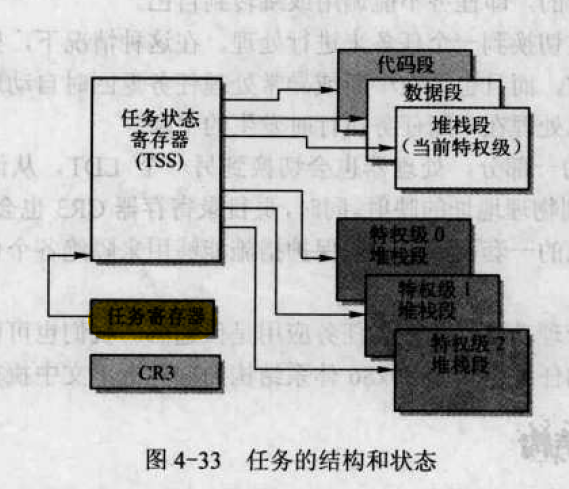

## 第一章 概述

## 第二章 微型计算机组成结构

### 2.1 微型计算机组成原理

- cpu通过地址线，数据线和控制信号线组成的内部总线与系统其他部分进行通信
  - 地址线用于提供内存或IO设备的地址
  - 数据线提供cpu与内存或IO设备之间数据传输的通道
  - 控制线负责具体的读写操作


- 如下是计算机的硬件体系结构
  - CMOS可以认为是存储BIOS所操纵数据的地方，如日期，时间，启动设置等，BIOS是启动加载时的第一个程序，包括基本输入输出的程序、开机后自检程序和系统自启动程序，固化到ROM中，可以向CMOS中进行系统设置的读写，因为要进行写，所以不能用ROM，而且不能用磁盘，所以CMOS是一个RAM芯片，即使系统掉电，也能靠后备电池保持工作。CMOS是硬件，保存着数据，BIOS就是固化到ROM中的一段程序
  - 图片上方的控制器和存储器通常集成在计算机主板上
  - 下方的控制卡（适配器）通过扩展插槽与主板上的系统总线相连接
  - 随着计算机技术的发展，很多原来使用控制卡完成的功能，都已经集成到电路芯片中，为了让不同部分都能达到最高的传输效率，现代PC板上主要有两个超大规模芯片组（chipsets）组成，北桥芯片和南桥芯片，如下图
    - 北桥芯片用于cpu，内存和AGP视频接口，还起着存储器控制作用
    - 南桥用来管理低，中速的组件，如PCL总线，USB接口等
    - 虽然总线接口发生了很大变化，但仍与传统的PC结构兼容


### 2.2 IO端口寻址和访问控制方式

#### 2.2.1 IO端口和寻址

- cpu为了访问IO接口控制器上的数据和状态信息，需要首先指定它们的地址，这种地址被称为IO端口地址或者简称地址
  - 通常一个IO控制器包含**访问数据的数据端口，输出命令的命令端口和访问控制器执行状态的状态端口**
- cpu指定和设置端口地址的方式有两种，统一编址和独立编址
  - 统一编址就是将端口归于存储器寻址地址范围内，这样的话cpu访问IO端口就像访问内存一样
  - 独立编址就是将IO控制器的地址的寻址空间当作一个独立的地址空间来使用，成为IO地址空间，每个端口对应IO地址空间中的一个地址
- IBM PC及其兼容机主要使用独立编址方式，如下图
  - 在普通Linux系统下通过cat /proc/ioports查看IO控制器端口的地址范围


- IBM PC及其兼容机主要使用独立编址的方式
  - 对于使用ISA总线结构的传统PC，其IO地址空间范围为0x000~0x3FF，有1024个端口地址可以使用
  - 对于使用EISA或PCI等总线结构的现代PC，有64KB的IO地址空间可以使用
  - 另外，IBM PC**也部分使用了统一编址的方式**，例如，CGA显示卡上显示内存的地址就直接占用了存储器地址空间0xB800~0xBC00范围

#### 2.2.2 接口访问控制

- 接口数据传输控制方式一般有三种：
  - 程序循环查询方式：cpu通过在程序中循环查询设备控制器中的状态来判断是否可以进行数据交换，这种方式不需要特殊的硬件支持，但是耗费cpu时间，在Linux操作系统中，只有在设备能够立即返回信息时才使用这种方式
  - 中断处理控制方式：需要中断控制器的支持，当IO控制器通过中断控制器向cpu提出请求时，cpu才会暂时中断去处理IO请求。在IO控制器发出中断请求时，cpu通过中断向量表（中断描述符表）来寻址相应的中断处理程序的入口地址，因此采用这种方式需要设置好中断向量表和相应的中断处理服务过程。Linux大多数设备IO采用这种方式
  - 直接存储器访问，DMA：用于**IO设备**与**系统内存**之间进行**批量**数据传输（注意，不像上两个过程，这个与cpu无关），整个过程需要专门的DMA控制器，无需cpu插手，无需软件介入，因此效率很高。在Linux中，软盘驱动程序使用中断和DMA方式配合来实现数据的传输工作

### 2.3 主存储器，BIOS，CMOS存储器

#### 2.3.2 基本输入输出程序BIOS

- 存放在ROM中的BIOS用于开机时执行各部分的自检，建立起操作系统需要使用的各种配置表，如中断向量表，硬盘参数表
  - 由于BIOS提供的这些服务不具备可重入性，即其中程序不可并发运行，从访问效率上来说，除了一些系统参数外，Linux在运行时并不使用BIOS的功能
  - 在开机后，cpu通过设置一些寄存器的值先将当前指令指向固定位置的JMP指令，这个指令会使计算机跳转到BIOS处开始执行，在BIOS执行一些硬件检测和初始化操作之后，就会将BIOS代码和数据复制到内存低端1MB末端的64kb处，然后跳转到这个地方并让cpu真正运行在**实地址模式**下，最后BIOS会从硬盘或其他块设备将操作系统引导程序加载到内存0x7c00处，并跳转到这个地方继续执行引导程序


#### 2.3.3 CMOS存储器

- 除了使用内存和ROM BIOS之外，还需要使用只有很少容量的存储器来存储实时时钟信息和系统硬件配置信息，这部分内存（CMOS）通常和时钟芯片集成到一块电路中
- CMOS在基本内存地址空间之外，需要使用IO指令来访问

### 2.4 控制器和控制卡

#### 2.4.1 中断控制器

- 在计算机刚开机时，ROM BIOS会对中断控制器芯片进行初始化，并分别把15级中断优先级分配给时钟定时器，键盘等设备使用，同时在内存开始处0x000~0xFFF区域建立中断向量表。但这些设置违背了intel公司要求，linux初始化期间又重新对芯片进行了设置
- 如下图，是机器启动后默认设置，在linux初始化时，会重新设定中断请求号与中断向量号的关系


#### 2.4.2 DMA控制器

- 主要功能是通过外部设备与内存直接传输数据来增强系统性能
- 通过对DMA控制器进行编程，外设与内存之间的数据传输能够在不受cpu控制的条件下进行

#### 2.4.3 定时/计数器

- 用于处理计算机的精确时间延迟
- 对于PC/AT机器兼容机采用的是8254芯片，3个定时/计数器分别用于时钟计时中断信号，...，Linux0.12只对通道0进行了重新设置，使得该计数器在通道3的方式下，每隔10ms发出一个中断请求信号，这个定时的中断请求信号就是内核工作的脉搏，用于定时切换当前执行的任务和统计每个任务使用的系统资源量

## 第三章 内核编程语言和环境

- 翻译过程就是将文本翻译为二进制，这种过程通常会产生一些效率不是很高的代码，所以对一些运行效率要求高或性能影响比较大的地方通常使用汇编语言来编写，或者对编译好的汇编程序进行人工修改优化

### 3.1 as86汇编器

- 在linux0.1x系统中使用到了两种汇编器
  - 第一种是产生16位代码的as86汇编器，使用配套的ld86链接器
  - 另一种是GUN的汇编器gas，使用GUN ld链接器
- as86和ld86是8086和80386上的汇编器和链接器，Linus将其移植到linux中，虽然可以为80386编制32位代码，但是linux系统只是用它来创建16位的启动引导扇区程序boot/bootsect.s和实模式下初始设置程序boot/setup.s的二进制代码
  - as86的汇编语法更像是intel系列的汇编语法，跟类unix系统的汇编风格差别较大

#### 3.1.1 as86汇编器语言语法

- 汇编器编译产生的目标文件通常至少包含3个段或区，即正文段(.text)，数据段(.data)，未初始化数据段(.bss)
  - 正文段包括执行代码和只读数据
  - 数据段是已经初始化过的段，包含可以读写的数据
  - 未初始化数据段是一个未初始化过的段，通常汇编器产生的目标文件不会为其保留空间，但在目标文件链接成执行程序被加载到操作系统时全部初始化为0
- 编译产生的字节会从.text段开始存放，我们可以使用段控制伪操作符来更改写入的段

### 3.1.2 as86汇编语言程序

``` asm
.globl begtext,begdata,begbss,endtext,enddata,endbss
.text
begtext:
.data
begdata:
.bss
begbss:
.text
BOOTSEG = 0x07c0
entry start
start:
	jmpi go, BOOTSEG
go:
	mov ax, cs
	mov ds, ax ;ds在内存寻址时默认使用
	mov es, ax ;es在bp作为寻址寄存器时使用
	mov [msg1+17], ah
	mov cx, #20 ;显示20个字符，包括msg1的18个和之后的13和10，分别代表回车换行
	mov dx, #0x1004 ;字符串显示在17行，5列
	mov bx, 0x000c ;字符显示属性，红色
	mov bp, #msg1 ;指向要显示的字符串，基址寄存器为es
	mov ax, #0x1301 ;
	int 0x10 ;BIOS中断调用0x10，功能0x13，子功能01
loop0:
	jmp loop0
msg1:
	.ascii "Loading system ..."
	.byte 13,10
	.org 510
	.word 0xAA55
.text
endtext:
.data
enddata:
.bss
endbss:
```

- 这个例子是一个bootsect.S的一个框架程序，能编译生成引导扇区代码，该程序是一个简单的引导扇区启动程序，编译链接产生的执行程序可以放入软盘的第一个扇区直接引导计算机启动，作用是启动后在屏幕的第17行第5列显示出红色字符串"Loading system ..."，然后光标下移一行，之后在25行进入死循环
- 第一行的.globla是一个伪指令，用于将跟在后面的标号定义为外部的或全局的，并且即使不使用也强制引入
- .text .data .bss分别对应目标文件的三个段，.text用于标识正文段的开始位置，并将当前段切换为.text段，另外两个也是相同的含义，不过在这个例子中，这三个段在同一重叠地址范围内，所以该程序实际上并不分段
- 第9行的赋值语句相当于定义了一个宏，可以使用十进制，八进制，十六进制
- 第10行的entry是保留关键字，该关键字的作用是迫使链接器生成的可执行文件中包括进其后指定的标号start，通常，在多个目标文件链接为一个可执行文件时，应该在其中一个汇编程序中定义entry，但在这个示例中以及linux内核boot/bootsect.s和boot/setup.s中完全可以忽略这个信息，**因为我们并不希望在生成的纯二进制文件中包括任何符号信息**
- 第12行是一个段间跳转指令，inter-segment，为什么有这条指令呢？首先，这条引导程序由BIOS负责加载，并且加载到固定的内存位置0x7c00处，BIOS加载之后，使用jmp 0x7c00将IP设置为0x7c00，并将控制权交给这段引导程序，但此时CS的值还为0，所以第一步的jmpi指令，同时设置CS的值为0x07c0，IP的值为go，也就是5，然后正常执行程序
- 之后，cx，dx，bx，bp，ax代表传给中断程序的参数
- .ascii可以直接定义字符串，用双引号括住，.byte用于定义字节
- .org代表之后的语句从510开始存放，.word定义一个字型数据，0xAA55是一个有效引导扇区标志，供BIOS加载扇区使用
- 因此，该程序编译后正好512个字节，正好一个扇区

#### 3.1.3 as86汇编语言程序的编译和链接

```shell
as86 -0 -a -o boot.o boot.s // 编译，生成与as部分兼容的目标文件
ld86 -0 -s -o boot boot.o // 链接，去掉符号信息
```

- -0代表用于生成8086的16位目标程序
- -a用于指定生成与GNU as和ld部分兼容的代码
- -s用于告诉连接器去掉可执行文件中的符号信息
- -o执行输出文件的名称
- 但是，最后生成的可执行文件是544B，多出的32B是MINIX可执行文件的头结构，为了能使用这个程序引导机器，需要人工去掉这32B，可以利用dd命令

```shell
dd bs=32 if=boot of=/dev/fd0 skip=1
```

### 3.2 GNU as汇编

- 上节介绍的as86汇编器仅用于编译内核中的boot/bootsect.s和boot/setup.s，其余汇编程序均使用gas来编译，并于c语言编译产生的模块链接
- 由于操作系统的许多关键代码要求很高的执行效率，因此，一个操作系统源码中大约包括10%其关键作用的汇编代码，Linux也不例外，它的32位初始化代码，所有中断和异常处理过程程序都使用了as汇编程序
- 在编译c语言程序时，GNU gcc编译器会首先输出一个作为中间结果的as汇编语言文件，然后gcc调用as汇编器将这些临时汇编语言程序编译成目标文件

#### 3.2.1 编译as汇编语言程序

```shell
as [选项] [-o objfile] [srcfile]
```

- 所有选项可以随意放置，但是文件名的放置次序同编译结果密切相关，它只编译一个源程序，输出一个结果，但是一个源程序可以由多个文件组成

#### 3.2.2 as汇编语法

- 为了与gcc输出汇编程序的兼容性，as编译器使用AT&T的系统V的汇编语法，这与Intel汇编程序使用的语法很不一样
  - AT&T要求立即数前要加$，寄存器名之前要加%
  - AT&T与Intel语法的源操作数和目的操作数的次序相反，add eax, 4相当于addl $4, %eax
  - AT&T内存操作数的长度由操作码最后一个字符确定，b字节 w字形 l代表32位长字
  - AT&T立即形式的远跳转，远调用，远返回指令分别是ljmp/lcall $section, $offset，lret $stack-adjust，在Intel分别是jmp/call far section:offset，ret far stack-adjust
  - AT&T不提供对多代码程序段的支持，UNIX类操作系统要求所有代码在同一个段中

#### 3.2.3 指令语句，操作数和寻址

- 通过指令名称来确定宽度，如果没有宽度，那么就会根据目的寄存器操作数来确定操作数宽度，所以mov %ax, %bx相当于movw %ax, %bx
- 符号扩展和零扩展指令分别时movs...和movz...，但都需要两个操作码后缀来指名宽度，如movsbl %al, %edx

- 跳转指令，跳转的目的地址通常使用一个标号表示，分为无条件跳转和有条件跳转
  - 无条件跳转分为直接跳转和间接跳转，直接跳转代表目的地址直接编码进指令中，而间接跳转说明目的地址取自某个寄存器或内存地址
    - 直接跳转：jmp Loop0
    - 间接跳转：jmp *%eax或jmp *(%eax)，注意使用\*号
  - 有条件跳转指令只有直接跳转

## 第四章 80x86保护模式及其编程

### 4.1 x86系统寄存器和系统指令

#### 4.1.1 标志寄存器

- 标志寄存器除了通用标志之外，还包括一些系统标志，用于控制任务切换，中断处理，指令跟踪以及访问权限等

#### 4.1.2 内存管理寄存器

- 处理器提供了4个内存管理寄存器，GDTR，LDTR，IDTR和TR，它们用于指向内存分段管理所使用到的系统表
  - GDTR，LDTR和IDTR指向的系统表，是存放一些描述符的表
    - GDTR指向全局描述符表，GDTR高32位指向**线性地址空间中的**全局描述符表（个人感觉全局描述符表的地址应该在线性地址空间的3~4G，这样可以映射到所有任务共享的公共物理地址空间中去），低16位用于表示该表的限长（长度），在机器加电之后，基地址被默认设置为0，长度值为0xFFFF，所以在保护模式初始化过程中必须给其加载一个新值
    - LDTR指向局部描述符表，该寄存器存放着16位的段选择符，32位线性空间中的基地址，16位的长度值，以及描述符属性值。值得一提的是，包含LDTR表的段必须在GDTR表中含有一个描述符项，而LDTR描述符属性值则是对GDTR描述符表项的一个缓存。所以，LDTR寄存器的保存和加载的过程大概是：给出段选择符后，通过段选择符在GDT表中找到描述符表项，然后将该表项中基地址，长度值和描述符属性都保存到寄存器中（当然也保存段选择符）。同时，在任务切换时，处理器会把新任务LDT的段选择符和段描述符都自动加载到LDTR中
    - IDTR指向中断描述符表，也是32位基地址和16位长度，在机器加电后，基地址为0，长度为0xFFFF
  - TR指向的表，用于寻址一个特殊的任务状态段，TSS，TSS包含着当前执行任务的重要信息
    - TR任务寄存器，指向当前任务的TSS段，结构是16位段选择符，32位基地址，16位TSS限长，以及描述符属性值。跟LDTR类似，包含TSS的段也必须在GDTR表中含有一项描述符，TR寄存器的加载过程也类似：给出TSS段选择符后，通过段选择符在GDT表中找到描述符项，然后将段描述符，基地址，长度值，描述符属性都保存到寄存器中。在任务切换是，处理器会把新任务TSS的段选择符和段描述符都自动加载到LDTR中

#### 4.1.3 控制寄存器

- CR0中控制处理器操作模式和状态的系统控制标志
  - PE启动保护标志，设置该位时，开启保护模式（段级保护），复位时，进入实地址模式
  - PG启动分页，复位时关闭分页，此时线性地址等于物理地址，如果要启动分页，则PE和PG都要设置
  - WP，写保护标志，当设置时，处理器会禁止超级用户程序（特权为0）向只读页面进行写操作。复位时则反之，该标志有利于UNIX类操作系统在创建进程时实现写时复制技术
  - 如果PE=0 PG=0，则处理器工作在实地址模式下，PE=1 PG=0，则运行在没有分页的保护模式下，PE=1 PG=1，则运行在有分页的保护模式下，PE=0 PG=1，这种组合模式无效
- CR1保留不用
- CR2含有导致页错误的线性地址
  - 处理器会把引起异常的线性地址放到CR2中
- CR3中含有页目录表物理内存基地址
  - 被称为PDBR，含有页目录表的物理地址，因为页目标表是4K对齐的，所以后12没用到，可以用作其他
  - 使用mov指令加载CR3时具有让TLB无效的副作用，所以，当切换任务后，CR3内容该表，TLB也会失效。但如果新任务与原任务CR3相同，这样的话处理器则无需刷新TLB

### 4.2 保护模式内存管理

#### 4.2.1 内存寻址

- 为了进行内存寻址，x86使用了一种称为段的寻址技术
  - 这种方式把线性内存空间分为一个或多个段的线性区域
  - 段地址使用16位的段选择符，其中14位可用，所以一共16384个段，段内偏址32位，共4GB
  - x86有6个段选择符，CS，DS，ES，SS，FS，GS，CS用于代码段，要执行指令的地址为CS:[EIP]，栈顶1地址则为SS:[ESP]，如果指令中没有指名数据段，则默认使用DS

#### 4.2.2 地址变换

- 从逻辑地址到物理地址变换过程中使用到了分段和分页机制
  - 分段机制把逻辑地址转变为线性地址，这个机制总是使用的
  - 分页机制把线性地址转化为物理地址，这个机制是可选的


- 分段机制
  - 提供了隔绝各个代码，数据和堆栈的机制，因此多个程序可以运行到同一个处理器而不会相互打扰
  - 段可以用来存放程序的代码，数据和堆栈，当然也可以存放系统数据结构，如TSS或LDT
  - 如果处理器中有多个程序或任务运行，那个每个程序可以分配各自的一套段
  - 所以，程序中的逻辑地址包括一个段选择符和一个偏移量，而段选择符指向了段描述符表（如GDT）中的一个描述符项，这个描述符指明了段的大小，访问权限，以及段在线性地址空间中的基地址
- 分页机制
  - 为虚拟内存提供了实现机制，通常线性地址空间比物理地址空间大

#### 4.2.3 保护

- x86支持两种保护，其一是给每个任务不同的逻辑地址空间来完全隔离各个任务，此时不同的任务映射到了线性地址空间不同的段中；另一种是对任务进行操作，以保护操作系统内存段和处理器中特殊寄存器不被程序访问
  - 任务之间的保护，x86将每个任务放置到不同的虚拟地址空间中，这样将不同的任务映射到不同的线性地址空间中去来隔绝任务。每个任务都有自己的段表（LDT）和页表，当处理器切换到一个新任务时，关键部分就是切换到新的变换表
    - 每个任务都包含全局地址空间和局部地址空间，在局部地址空间范围内的虚拟地址被转化成了不同的物理地址，而在全局地址空间中的虚拟地址被转换到了同一物理地址，这也为公共代码和数据（如操作系统）的共享提供了支持，全局地址空间也是现代Linux系统使用
  - 特权级保护，每个段都与一个特权级相关联，执行代码时，当前特权级（CPL）就是当前活动代码段的特权级，当访问一个段时，当前特权级就会与段的特权级进行比较

### 4.3 分段机制

- 每个程序都使用自己的段描述符表以及自己的段，对程序来说，段可以是完全私有的，也可以是共享的

#### 4.3.1 段的定义

- 每个段由以下几个参数组成（存到段描述符表中）
  - 段基地址
  - 段限长
  - 段属性（段的优先级；是否可读可写可执行等）
- 为了把逻辑地址转化为线性地址，处理器会进行以下操作：
  - 使用段选择符中的偏移值（索引）从GDT或LDT中定位段描述符（仅当一个新的段选择符加载到段寄存器中时才需要这一步）
  - 检测段的访问权限，检测访问段的范围确保处于段界限内
  - 将取得的基地址加上已有的偏址，获得线性地址

#### 4.3.2 段描述符表

- 每个段描述符8个字节
- 有两种段描述符表，GDT和LDT，最多包含8192个描述符项，而段选择符的第14为T1，如果为0，则从GDT中选段，否则从LDT中选


- 发生任务切换时，LDT会变成新任务的LDT，但是GDT并不会改变，因此GDT中所映射的一半虚拟地址空间是系统中所有任务共有的，LDT映射的另一半则在任务切换时被改变。系统中所有共享任务的段由GDT映射，通常包含操作系统的段以及包含当前所有任务LDT的段，LDT段可以认为是操作系统维护的数据
- GDT本身不是一个段，它是保存到线性地址空间中的一个数据结构，GDT的基地址和限长必须加载到GDTR中
- LDT本身属于系统段，所以GDT中必须含有LDT的段描述符

#### 4.3.3 段选择符

- 结构为13位的索引值，1位指示GDT还是LDT，2位的请求特权级RPL，这个请求特权级是当前执行代码段的特权级（CPL）


- 上图的a~d分别就是Linux0.1x内核的内核代码段，内核数据段，当前任务代码段，当前任务数据段
- 处理器不使用GDT和LDT的第一项


- 如上图，为了避免每个内存转换都要使用段选择符去查段描述符表，段选择符寄存器有着一些隐藏部分，用来缓存已经拿到的段描述符属性
- 但是一定要保持段描述符表项和隐藏部分的一致性，因此每次修改段描述符表项时，都重新加载这六个寄存器

#### 4.3.4 段描述符


- 上图是段描述符的通用格式，每个段描述符的长度是8字节，主要包含3个字段，基地址，限长和属性，段描述符通常由编译器，链接器，加载器或操作系统来创建，但绝不是应用程序
- 段类型字段TYPE，主要指定段或门的类型，说明段的访问种类以及段的扩展方向，该字段依赖S字段，S=1时，其为代码段或数据段，S=0时，则为系统数据段，如IDT
  - 当S=1是，第二个双字的位11指明了其属于代码段还是数据段，分开之后，TYPE字段的低三位指明了读写访问，或者执行权限
  - 堆栈段必须是可读写的段，代码段必须是可执行的段，如果错误的加载段，则会引发一般保护异常
- DPL说明了描述符段的特权级

#### 4.3.6 系统描述符类型

- 上文提到，当S=0时，该描述符类型属于系统描述符类型，处理器一般能够识别以下的系统描述符：
  - LDT的描述符
  - TSS的描述符
  - 调用门描述符
  - 中断门描述符
  - 陷阱门描述符
  - 任务门描述符
- 这些描述符可以分为两大类，系统段描述符和门描述符
  - 系统段描述符指向系统段，如LDT或TSS
  - 门描述符就是一个门，对于调用，中断，陷阱门，其中含有代码段的选择符和段中程序入口点的指针
  - 对于任务门，其中包含有TSS的选择符
  - 此时，TYPE字段不在表示访问权限，而是表示这几类描述符

### 4.4 分页机制

- 如果包含线性地址的页面不在物理内存中，处理器就会产生一个页错误异常
- 最近访问的页目录和页表会被放入TLB中

#### 4.4.1 页表结构

- 两级页表结构
  - 页目录结构，包含2^10个项，每个项4字节，存着每个页表的物理地址
  - 页表结构，包含2^10个项，每个项4字节，存着每个页的物理地址
  - 由于页表和页都是4K对齐，因此页目录和页表的低12位都可以其他用处
  - CR3寄存器指向页目录
- 两级页表的作用
  - 使用两级页表，我们不需要连续4M的空间来存储页表
  - 页目录表总是存储在物理内存中，但是页表则可根据需要分配

#### 4.4.2 页表项格式


- 这时页目录和页表项的格式，低12位可以用来做一些属性标记
  - P，是否存在
  - RW，可读还是可读写
  - US，超级用户标志
  - A，以访问
  - D，以修改，dirty，如果为0，那么换出页面时无需进行磁盘写入
  - A和D可以有效实现虚拟存储技术，通过周期性检查A标志，操作系统可以确定哪些页没有被访问过，这些页面可以成为移出的候选者；如D=1，则换出时需要重新写入磁盘

### 4.5 保护

- 在保护模式下，x86提供了段级和页级保护，这种保护机制根据特权级（4级段保护和2级页保护）提供了对某些段和页面的访问限制能力

#### 4.5.1 段级保护

- 段限长limit检查
- 段类型检查
- 特权级，分为4个特权级，处理器可以识别以下三种类型的特权级
  - 当权特权级CPL，它存放在CS和SS的位0和位1中，CPL等于当前代码段的特权级，当程序跳转到另外一个具有不同特权级的代码段中时，处理器就会改变CPL
  - 描述符特权级DPL，存在一个段描述符中的DPL字段中，DPL会与CPL或RPL做比较
  - 请求特权级RPL，它放在选择符的位0和位1中，即使CPL优先级足够，那么如果RPL优先级不够，仍无法访问，这使得RPL可用来确保高优先级的代码不会代表应用程序去访问一个段，除非应用程序自己具有这个段的访问权限

#### 4.5.2 访问数据段时的特权级检查

- 只有当段的DPL数值大于或等于CPL和RPL两者时，处理器才会把选择符加载进寄存器中


#### 4.5.4 页级保护

- 页目录和页表表项中的读写标志和超级用户标志提供了分段机制保护属性的一个子集，分页机制只识别两级权限，特权级0，1，2属于超级用户，特权级3属于普通用户

#### 4.6.7 中断描述符表

- 中断描述符表，IDT，将每个异常或中断向量分别与它们的处理过程联系起来，与GDT和LDT类似，IDT也是由8字节的项构成的数组，但表中的第1项可以包含描述符，最多有256个描述符
- IDT表可以驻留在线性空间的任何地方，使用IDTR寄存器来定位

#### 4.6.8 IDT描述符

- 包含3种类型的描述符，中断门描述符，陷阱门，和任务门描述符
  - 中断门和陷阱门含有一个长指针，指向异常或中断处理过程，使用call指令调用异常或中断处理过程
  - IDT任务门与GDT任务门类似，含有一个任务TSS段的选择符，该选择符用于处理异常或中断，使用call指令进行任务切换，执行异常或中断处理过程

### 4.7 任务管理

- 任务是处理器可以分配，调度，执行和挂起的一个工作单元，它可用于执行程序，操作系统服务，中断或异常处理程序，内核代码
- 任务很像过程调用，但会保存更多的处理器状态信息，任务切换会把控制权完全转移到一个新的执行环境中，这要求保存几乎所有寄存器的内容，包括标志寄存器和段寄存器。与过程不同，任务不可重入，任务切换不会把任何信息压入堆栈中，都被保存到TSS中

#### 4.7.1 任务的结构和状态

- 一个任务由两部分组成，任务执行空间和TSS



- 一个任务的使用由指向其TSS的段选择符来指定，当一个任务被加载进处理器中执行时，该任务的段描述符，基地址，限长，TSS描述符属性会被加载到TR中，如果使用了分页，则目录表的地址保存在CR3中，当前处理器的状态由处理器的以下内容组成：
  - 所有通用寄存器和段寄存器的值
  - 标志寄存器，程序指针EIP，控制寄存器CR3，TR任务寄存器，LDTR寄存器
  - 段寄存器指定的任务当前执行空间
  - IO映射位图基地址和IO位图信息（TSS）
  - 特权级0，1，2的堆栈指针（TSS）
  - 链接至前一个任务的指针（TSS）

#### 4.7.2 任务的执行

- 软件或处理器可以使用以下方法之一来调度一个任务：
  - 使用call指令明确调用一个任务
  - 使用jmp指令明确调用一个任务（Linux使用)
  - 由处理器隐含的调用一个中断句柄处理服务
  - 隐含调用一个异常句柄处理服务
- 所有这些调度方式都是使用一个任务门或任务TSS段的选择符来确定一个任务，当使用call或jmp指令调度一个任务时，指令中的选择符既可以执行TSS，也可以指向任务门
- 当调度一个任务执行时，当前正在运行任务和调度任务之间会自动发生任务切换操作。在切换期间，当前任务的上下文会被保存到TSS中并且暂停任务的执行。新调度任务的上下文会被加载到处理器，并且从EIP指向的指令开始
- 调用者的TSS段选择符会被保存到被调用者的TSS中，从而提供了一个返回调用者的链接

