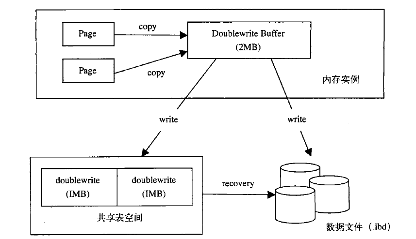
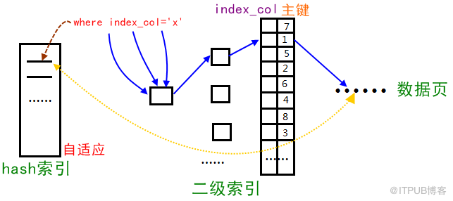

## 第2章 InnoDB存储引擎

### 2.4 关键特性

- 包括插入缓冲，两次写，自适应哈希索引，可以提高**性能**和**可靠性**

#### 2.4.1 插入缓冲

- 插入缓冲维护着Insert Buffer信息，其保存在缓冲池中，和数据页，索引页一样，**都是一个在缓冲池中的页**
- 主要作用是减少非聚集索引更新时的IO操作，达到性能上的优化
  - InnoDB维护数据时使用了聚集索引表，因此，插入新数据时（同时也维护了聚集索引）属于磁盘的顺序写入，但是更新非聚集索引却属于随机IO
  - InnoDB为了优化非聚集索引的写入，首先判断将要写入的索引所在的页是否在缓冲池中，如果在，直接插入（这种情况就不需要插入缓冲区了）；如果不在，就放入插入缓冲区中，返回结果
  - 之后，InnoDB会以一定频率执行插入缓冲区和非聚集索引叶子结点的合并操作，这通常可以将多个插入一次性的合并到索引结点中，减少了IO，增加了性能
  - 虽然叫做插入缓冲区，但也记录着删除和更新
- 插入缓冲的使用需要满足以下两个条件
  - 索引是辅助索引
  - 索引不是唯一的。解释：很显然，如果索引对应的属性要求唯一，那么在插入时，必须先到索引所在的页查看该索引值是否已经存在，这个查看操作已经是随机IO，再进行插入缓冲已经毫无意义
- 插入缓冲存在的问题
  - 应用程序执行大量的插入和更新时，如果这个时候系统宕机，会有大量的插入缓冲没有得到合并，因此，实例在进行恢复时会占用较多的时间
  - 写密集的情况下，插入缓冲会占用较多的缓冲池内存

#### 2.4.2 两次写

- 插入缓冲带来了性能上的提升，两次写则增强了innoDB数据的可靠性
- 问题描述：innoDB管理磁盘和内存的大小是页（16K），将数据刷写到磁盘时也是以16K为单位，但是如果在写入磁盘的过程中，这个页就只写了一部分（4K）系统就发生了宕机，那么这种情况被称为写失效
  - redo log对于这个问题也无能为力，因为MySQL在恢复的过程中会首先检查磁盘页的checksum，checksum是page的最后事务号，如果无法通过检测，那么MySQL认为该磁盘页发生了损坏（但不确定是之前的写失效还是认为的损坏），所以如果不存在两次写这种机制的话，该磁盘页就不会通过检测，何谈使用redo log恢复呢
- doublewrite机制
  - 首先在磁盘上建立一个2M的共享表空间
  - 在MySQL缓冲池中同样有2M的doublewrite buffer与之对应
  - doublewrite过程
    - 触发脏页刷新时，脏页首先使用memcpy拷贝到doublewrite buffer中
    - 将doublewrite buffer中内容刷写到共享表空间中去（第一次写，顺序写）
    - 将doublewrite buffer中脏页写道对应的表中（第二次写，离散写）
    - 这样，如果MySQL恢复过程中发现磁盘页不能通过检测，可以首先到共享表空间找到相应的页
    - 过程如图：

- doublewrite分析
  - 与没有doublewrite相比，使用doublewrite显然增加了磁盘IO，增加了fsync的调用次数，但是性能并不会降低到原来的50%，主要有以下原因：
    - doublewrite写入共享表空间时是顺序写，效率较高
    - 将数据从doublewrite buffer写入真正的表空间中时，系统会自动合并在磁盘上互相连接的page，这样一次可以刷新多个page
- doublewrite使用
  - 参数skip_innodb_double可以禁止doublewrite功能，在slave服务器上，可以打开
  - 在需要数据高可靠性的主服务器上，任何时候都应该启用doublewrite功能

#### 2.4.3 自适应哈希索引

- 产生背景：当innoDB通过二级索引查找数据时，不仅需要访问二级索引的B+树，还需要回表访问主键索引的B+树，搜索路径（Search Path）太长
- 因此，innoDB会监控对表上二级索引的查找，如果发现某索引值被频繁访问（此二级索引是热数据），建立哈希索引可以带来速度的提升，原理图如下：
- 构造过程
  - 自适应哈希索引功能被打开
  - 经常被访问的二级索引数据会自动被生成到哈希索引里去，自适应哈希索引通过缓冲池中的B+树构造而来，因此建立的速度很快
- 缺陷
  - 自适应哈希索引会占用innoDB buffer pool
  - 自适应哈希索引只适用于等值搜索