## 第1章 初识Redis

### 1.1 盛赞Redis

- Redis是一个基于键值对的NoSQL数据库，值有以下几种
  - string
  - hash
  - list
  - set
  - zset
  - Bitmaps
  - HyperLogLog
  - GEO
- Redis基于内存，读写性能非常好
- Redis提供了数据持久化，通过快照和日志两种方式进行
- Redis还提供了一些附加功能
  - 键过期
  - 发布订阅
  - 事务
  - 流水线
  - Lua脚本

### 1.2 Redis特性

- 速度快
  - 官方给出的读写性能是10万/秒
  - 速度快的原因
    - 数据存放于内存
    - C语言实现
    - 单线程架构，预防了多线程的竞争问题
    - Redis源代码精打细磨
- 基于键值对
  - 主要提供了5种数据结构
  - 在字符串的基础之上演变出了位图和HyperLogLog
- 丰富的功能
  - 键过期
  - 发布订阅，可以实现消息系统
  - 支持Lua脚本，可以用Lua创造出新的Redis命令
  - 简单的事务
  - 流水线，客户端可以将一组命令一次性传到Redis，减少了网络开销
- 简单稳定
  - 早期版本代码量只有2万行左右，3.0之后由于添加集群特性，增至5万行左右
  - 单线程模型，不仅使服务端处理模型变得简单，也使得客户端开发变得简单
  - Redis不需要依赖操作系统中的类库，例如Memcache需要依赖libevent这样的系统类库，Redis自己实现了事件处理的相关功能
- 客户端语言多
  - 提供了简单的tcp通信协议，多种编程语言可以很方便的接入
- 持久化
  - 两种持久化方式，RDB和AOF用来将内存数据保存到硬盘中
- 主从复制
  - Redis提供了复制功能，实现了具有多个相同数据的Redis副本，复制功能是分布式的基础
- 高可用和分布式
  - Redis2.8提供了实现高可用的Redis哨兵，能保证Redis结点的故障发现和故障自动转移
  - Redis3.0提供了分布式实现Redis Cluster，它是Redis分布式的真正实现，提供了高可用，读写和容量的可扩展

### 1.3 Redis使用场景

#### 1.3.1 Redis可以做什么

- 缓存，并且可以灵活的控制最大内存和淘汰策略
- 排行榜系统，通过列表和有序集合，可以很方便的构建各种排行榜系统
- 计数器应用，播放书，浏览数等，Redis支持天然计数功能
- 社交网络，粉丝，共同好友，推送，下拉刷新等
- 消息队列，消息队列是一个大型网站的必备组件，Redis提供了发布订阅和阻塞队列的功能，虽然和专业的消息队列相比不够强大，但是一般的消息队列功能可以满足

### 1.3.2 Redis不可以做什么

- 从数据规模来看，如果用Redis存储十分大规模的数据，经济成本相当高
- 从数据冷热的角度来看，将冷数据放到Redis中，是对内存的一种浪费

### 1.5 正确安装并启动Redis

#### 1.5.2 配置，启动，操作，关闭Redis

- 启动Redis服务
  - 默认配置，直接通过redis-server启动
  - 运行配置，通过redis-server --port 6380
  - 配置文件启动，如redis-server /opt/redis/redis.conf，**推荐使用这种方式，并且Redis目录下还有一个redis.conf配置文件，可以作为模板**

- 启动Redis客户端
  - redis-cli
- 停止Redis服务
  - redis-cli shutdown
    - 过程是断开连接，并生成持久化文件，是一种优雅的方式
    - 不要通过kill-9直接杀死进程，这样不会做持久化操作
    - 还有一个参数，代表关闭Redis之前，是否生成持久化文件redis-cli shutdown nosave|save

## 第2章 API的理解和使用

### 2.1 预备

#### 2.1.1 全局命令

- 查看所有键 keys *，打印出所有键，复杂度O(N)，当保存了大量键时，线上环境**禁止使用**
- 输出键总数dbsize，不会遍历，直接获取Redis内置的变量，复杂度O(1)
- 查看键类型type

#### 2.1.2 数据结构和内部编码

- string等5中数据结构只是客户端感知的数据结构，实际上，每种数据结构在底层都有内部编码实现，而且是多种实现，这样Redis会在合适的场景选择合适的内部编码，如：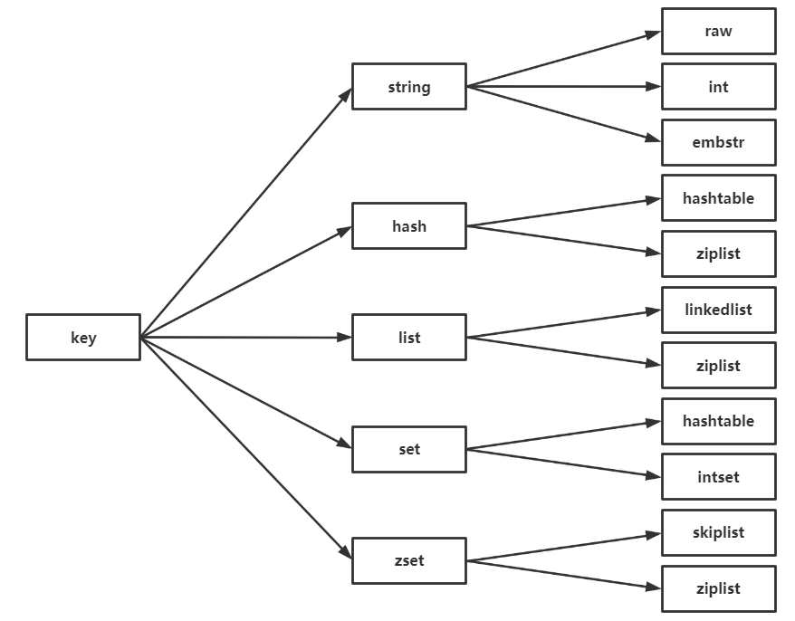

- 通过object encoding key可以查看某个key具体的实现方式

- Redis这样设计有两个好处：
  - 用户对具体实现无感知，这样一旦开发出更优秀的实现方式，无需改动外部的数据结构和命令
  - 多种实现方式可以在不同的场景下发挥不同的优势，同时，在场景出现变化时，Redis可以改变具体实现的方式

#### 2.1.3 单线程架构

- Redis使用了单线程架构和IO多路复用模型来实现高性能的内存数据库服务
  - Redis使用单线程来处理命令，一条命令到达后并不会立刻执行，而是会进入到队列中，逐条执行，所以可以确定的是，两条命令不可能同时执行，所以不会产生并发问题
- 为什么单线程还能那么快
  - 纯内存操作，内存的响应时间大概为100ns，这是Redis达到每秒万级别访问的基础
  - 非阻塞IO，Redis使用epoll，不会在网络IO上浪费过多的时间
  - 单线程避免了线程切换和竞态产生的消耗
- 同时，使用单线程结构还可以简化服务端的开发，并且对于服务端来说，锁和线程切换通常是性能杀手
- 但是单线程会有一个问题，如果某个命令执行时间过长，会造成其他命令的阻塞，对于Redis这种高性能数据库是致命的，因此Redis是面向快速执行场景的数据库

### 2.2 字符串

- Redis中最基础的结构，其他几种结构都是在字符串的基础上构建的，字符串可以是以下几种类型，**但大小不能超过512MB**
  - 字符串
  - 数字（整数，浮点）
  - 二进制（图片，音频）

#### 2.2.1 命令

- 常用命令
  - set key value [ex seconds] [px milliseconds] [nx|xx]
    - ex代表秒，px代表微秒
    - nx，键不存在时成功，用于添加，xx存在时成功，用于更新
  - setex key seconds value
    - 用于给一个键同时设置过期时间和value
    - 相当于set key value， expire key seconds
  - setnx key value
    - 只有当key不存在时，才会创建这个key，并设置value，否则返回失败
    - 可以作为分布式锁的一种实现方案：https://redis.io/topics/distlock
  - get key
    - 获取key，不存在返回nil
  - mset k1 v1 k2 v2
    - 批量设置值
    - 可以有效提高开发效率
    - 但注意每次批量发送的数据不是无节制的，数量过多容易造成Redis阻塞或网络拥塞
  - incr key
    - 增加计数
    - 不是整数，返回错误；key不存在，按0处理，返回1
    - 很多语言为了实现线程安全的计数使用了CAS，但是Redis完全不存在这个问题

#### 2.2.2 内部编码实现

- 字符串的内部编码有3种
  - int：8个字节的长整型
  - embstr：小于等于39字节的字符串
  - raw：大于39个字节的字符串

#### 2.2.3 典型使用场景

- 缓存
  - Redis作为缓存层，MySQL作为存储层
  - Redis键名规范：业务名:对象名: id:属性，如数据库名为vs，表名为user，id为1，那么命名为vs:user:1:id
- 计数
  - 视频播放量等场景
  - 实际上一个真实的计数系统要考虑的问题很多，比如防作弊，按照不同维度计数，数据持久化等
- 共享session
  - 问题：一个分布式的web服务将session保存到各自的服务器中，会存在两个问题：如果负载均衡以请求作为维度，那么相同用户的不同请求会被打到不同服务器中，造成每次刷新都要登录；如果某一个服务器挂掉，那么这个服务器上保存的所有的用户登录信息将会丢失，用户不得已重新登陆。问题如下图：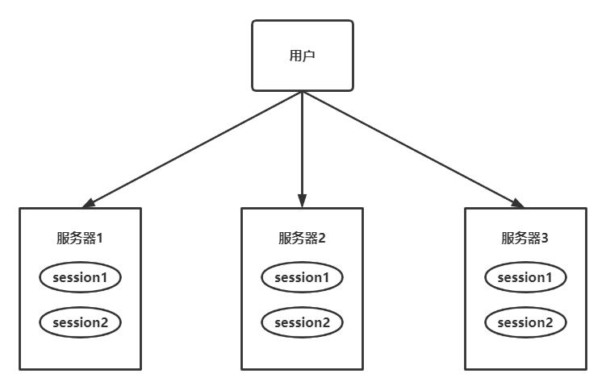
  - 解决方案是将所有的session保存到一个高可用的Redis集群中，服务器每次收到请求都要先去Redis集群中取session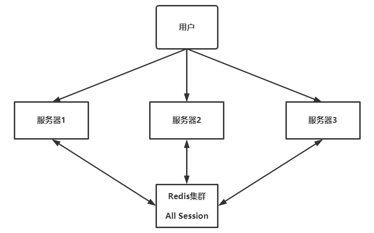
  - 限制频率
    - 比如需求是一个网站一秒内限制IP的访问次数，或验证码一分钟内不能超过几次

### 2.3 哈希

#### 2.3.1 命令

- hset key field value设置值
- hget key field
- hdel key field1 field2
- hlen key返回field数量
- hmget key field1 field2批量获取值
- hkeys key获取所有fields
- hvals key获取所有value
- hgetall key获取素有field-value
  - 注意如果field比较多，会有阻塞Redis的可能，如果只需要取部分field，使用hmget，如果一定要获取所有的field-value，就使用hscan命令

#### 2.3.2 内部编码

- 哈希的内部编码有两种：
  - ziplist（压缩列表）：当哈希元素个数小于hash-max-ziplist-entries（默认512），同时所有值都小于hash-max-ziplist-value（默认64字节），Redis会使用ziplist作为其内部实现，ziplist会更加紧凑，更节省内存
  - hashtable（哈希表）：当无法满足ziplist的要求时，Redis使用hashtable作为哈希的内部实现，因为此时ziplist的读写效率会下降，hashtable读取效率为O(1)

#### 2.3.3 使用场景

- 用来映射关系型数据库的行
- 有三种方式可以用来映射数据库的行
  - 原生字符串类型 set user:1:name tom; set user:1:age 18; set user:1:city beijing
    - 优点：直观，每个属性支持更新
    - 缺点：占用过多的键，用户信息内聚性较差，**一般不会在生产环境中使用**
  - 序列化字符串类型：set user:1 "{name:tom, age:18, city:beijing}"
    - 优点：简化编程，相比第一种可以提高内存的利用效率
    - 缺点：序列化和反序列化有开销，同时，更新一个属性就要全部序列化
  - 哈希类型
    - 优点：简单直观，也可以减少内存空间的使用
    - 缺点：当转换为hashtable时，会占用更多内存

### 2.4 列表

- 一个列表中最多含有2^32-1个元素，支持两端插入（push）和弹出（pop），还可以获取指定范围元素列表，指定索引下标的元素等。比较灵活，可以充当栈和队列，在实际中应用比较广泛
- 列表中常用的命令：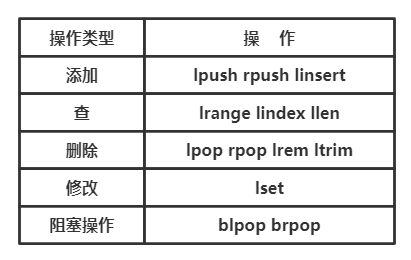- 

- 添加操作
  - lpush key v1 v2，往左边插入元素
  - rpush key v1 v2，往右边插入元素
  - linsert key before|after pivot value，如linsert age before 20 19在20之前插入19
- 查找
  - lrange key start end
    - 从左到右是0~N-1，从右到左是-1~-N
    - 包含end
- 删除
  - lpop key，从左侧删一个元素
  - lrem key count value
    - count>0，从左到右删最多count个等于value的元素
    - count<0，从右到左删除最多-count个元素
    - count=0，删除所有
  - ltrim key start end，删除start~end下标的元素
- 修改
  - lset key index newvalue
- 阻塞操作
  - blpop key1 [key2 ...] timeout
  - brpop key1 [key2 ...] timeout
  - 如果timeout=0，会一直阻塞，从左到右有一个key出现元素，就返回

#### 2.4.2 内部编码

- 仍是两种：
  - 和哈希一样，满足一定条件使用ziplist
  - 无法满足条件时，用linkedlist
- Redis3.2提供了quicklist，简单来说，它是以一个ziplist为结点的linkedlist，结合了二者的优势

#### 2.4.3 使用场景

- 消息队列，使用lpush+brpop的组合
- 文章列表
  - 用于分页展示某列表时，因为list不仅是有序的，也支持按照索引范围获取元素
- 实际上的开发场景比较多，可以参考以下：
  - lpush+lpop=栈
  - lpush+rpop=队列
  - lpush+ltrim=有限集合
  - lpush+brpop=消息队列

### 2.5 集合

- 元素不重复，无序，一个集合最多支持2^32-1个元素，且除了增删改查之外，还提供了交集，并集，差集等等，合理的使用能解决很多实际问题

#### 2.5.1 命令

- sadd key element1 [element2 element3]
- srem key element1 [element2 element3]
- scard key计算个数，并不会遍历，复杂度O(1)
- sismember key element
- srandmember key count，随机返回count个元素
- spop key，随机弹出元素
- smembers key，获取所有元素
  - 注意，smembers，lrange和hgetall都是比较重的命令，元素过多存在阻塞Redis的可能，这时候可以用sscan来完成

#### 2.5.2 内部编码

- intset（整数集合）：当集合中的元素都是整数，并且个数少于set-maxintset-entries（默认512个），Redis会选用intset，从而减少内存使用
- hashtable：不满足intset要求时，使用hashtable

#### 2.5.3 使用场景

- 比较典型的使用场景是标签，比如一个用户对娱乐，体育比较感兴趣，另一个对历史，新闻比较感兴趣，这些兴趣点就是标签
  - 给用户添加标签sadd user:1:tags tag1 tag3; sadd user:2:tags tag2 tag3
  - 给标签添加用户sadd tag:1:users user1; sadd tag:2:users user2; sadd tag:3:users user1 user2
  - 计算用户共同感兴趣的标签sinter...
  - 注意，用户和标签的关系的维护应该在一个事务内执行，防止部分命令失败造成的数据不一致
- 应用场景通常有以下几种：
  - sadd=标签
  - spop/srandmember=生成随机数，如抽奖
  - sadd+sinter=社交需求

### 2.6 有序集合

- 有序结合和集合的不同点是，每一个元素都有一个分数，可以根据分数对元素进行排序，元素不能重复，但分数可以重复

#### 2.6.1 命令

- zadd key score1 member1 [score2 member2 ...]，添加成员，复杂度为logN，而sadd复杂度为1
- zcard key，计算个数
- zscore key member，计算某个成员的分数
- zrange key start end [withscore]，按照start和end返回对应排名，如果加上选项，也会返回分数
- zrangebyscore key min max [withscore] [limit offset count]
  - 返回分数区间为min到max的成员

#### 2.6.2 内部编码

- ziplist：个数小于zset-max-ziplistentries（默认128个），同时每个元素大小小于zset-max-ziplist-value（默认64字节），使用ziplist
- skiplist，不满足条件时，使用跳表

#### 2.6.3 使用场景

- 榜单，以每个视频获赞数为例
  - 添加视频获赞zadd video:zan video1 3，zincrby video:zan video1 1
  - 取消视频赞（作弊等原因移除榜单）zrem video:zan video1
  - 展示获赞最多的十个视频zrevrangebyrank video:zan 0 9
  - 查询用户排名和获赞zscore video:zan video1; zrank video:zan video1

### 2.7 键管理

#### 2.7.2 遍历键

- 全量遍历键 keys pattern，keys *代表全部，pattern属于glob风格
- 渐进式遍历。从2.8之后，提供了新命令scan，采用渐进式遍历的方式解决keys可能带来的阻塞问题，每次scan复杂度为O(1)，但要实现keys的功能，需要多次scan，简化模型如下：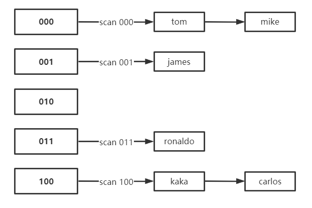
  - 每次执行scan，可以想象只扫描字典里的一部分键，直至将所有键遍历完毕，用法是scan cursor [match pattern] [count number]
  - cursor是必须参数，实际上cursor是一个游标，第一次遍历从0开始，每次scan遍历完hou会返回当前游标的值，直至游标值为0，表示遍历结束。因此使用scan的方式是在循环里每次使用scan，直至返回值为0，说明遍历完毕
  - match pattern做模式匹配，这一点和keys很像
  - count number表示每次要遍历的键个数，默认是10，可以适当增大
  - 除了scan之外，Redis还提供了hscan sscan zscan用来简化对应结构的遍历
  - 渐进式遍历可以有效解决keys命令可能产生的阻塞问题，但是如果在遍历过程中出现了键的变化，那么可能出现新增的键没有遍历到，遍历出了重复的键等问题

#### 2.7.3 数据库管理

- 切换数据库select index，index作为索引，Redis中默认配置了16个数据库，这16个数据库之间的数据没有任何关联
- 那么能不能向测试数据库和正式数据库一样，把正式的数据放入0号，测试的数据库放入1号呢？事实上，不好。Redis3.0已经弱化了这个功能，比如Redis Cluster只允许使用0号数据库，为什么要废弃掉这个“优秀”的功能呢，有以下原因
  - Redis单线程，多个数据库使用一个CPU，彼此之间还是会受影响
  - 如果一个慢查询存在，依然会影响其他数据库
  - 部分Redis客户端根本不支持这种方式
- 如果要使用多个数据库功能，建议在一台机器上部署多个Redis实例，这样业务之间不会受影响，又合理的使用了CPU资源

## 第3章 小功能大用处

- 除了基本的5中数据结构之外，Redis还提供了以下功能
  - 慢查询分析：通过慢查询分析，可以找到有问题的命令并优化
  - Redis shell：功能强大的Redis shell会有意想不到的实用功能
  - Pipeline：通过流水线可以有效提高客户端性能
  - 事务与Lua：制作属于自己的专属原子命令
  - Bitmaps：通过在字符串上使用位操作，有效节省内存
  - HyperLogLog：一种基于概率的新算法，节省空间
  - 发布订阅：基于发布订阅的消息通知机制
  - GEO：基于地理位置的功能

### 3.1 慢查询分析

#### 3.1.1 慢查询的两个配置参数

- 明确两个参数
  - 预设慢查询的时间阈值是多少
  - 慢查询记录存放在哪
- Redis通过slowlog-log-slower-than和slowlog-max-len解决这个问题
  - 慢查询队列保存到内存中
  - 当查询执行时间超过slowlog-log-slower-than时，加入队列，队列最大长度为slowlog-max-len，超过队列长度从头部丢弃
  - 结构如下图，可以看出每个慢查询有4个参数，分别是id，发生的时间，持续的时间，命令+参数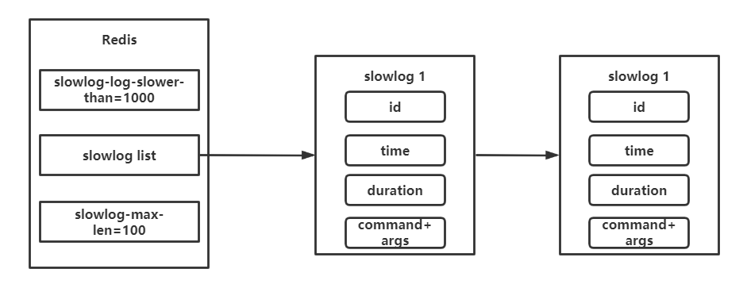

#### 3.1.2 最佳实践

- slowlog-max-len建议调大，因为Redis会对长命令进行截断操作，所以并不会过多占用内存，增大列表可以减缓慢查询被剔除的可能，例如线上可以配置1000以上
- slowlog-log-slower-than默认10ms，需要根据并发量调整该值。如果要求OPS为1000，那么建议设置为1ms
- 慢查询只记录命令执行时间，不包括排队时间和网络传输时间。因此客户端执行命令的时间大于命令本身的执行时间。因为排队机制，慢查询可能会导致其他命令级联阻塞，因此，当客户端出现请求超时时，需要检查该时间点是否有对应的慢查询
- 由于慢查询是一个内存中的队列，如果发生比较多的话，可能会被丢弃，为防止这种事情发生，可以使用slow get命令将慢查询持久化到其他存储中，例如MySQL

### 3.3 Pipeline

- Redis客户端执行命令可以分为下面四个过程，其中1+4被称为RTT
  - 发送命令
  - 命令排队
  - 命令执行
  - 结果返回
- Redis提供了批量操作命令如mget，mset等可以有效节省RTT，但大部分命令并没有批量操作
- 因此，Pipeline可以改善上述问题i，将一组Redis命令进行组装，通过一次RTT传输给Redis

#### 3.3.3 原生批量命令和Pipeline对比

- 可以用Pipeline模拟出批量操作的效果，但是也有如下区别：
  - 原生批量命令是原子的，Pipeline非原子
  - 原生批量命令是一条命令多个key，Pipeline是多条命令的组合
  - 原生批量命令是服务端实现，Pipeline需要客户端和服务端共同实现

#### 3.3.4 最佳实践

- Pipeline虽然好用，但每次组装的命令个数不能没有节制，否则会增加客户端的等待时间和网络的阻塞

### 3.4 事务与Lua

#### 3.4.1 事务

- Redis提供了简单的事务功能，将一组需要一起执行的命令放到multi和exec之间，这样，这一组命令要不然全部执行，要不然都不执行，也就是说另外一个Redis客户端看不到这组命令的中间状态
- 如果要停止事务，使用discard代替exec即可

- 如果事务中出现错误，Redis的处理机制也不相同
  - 语法错误（set写成sett），会造成整个事务无法执行
  - 运行时错误（使用zadd操作普通集合），假如第一条命令是正确的，第二条命令发生了运行时错误，那么exec之后，会成功执行第一条命令，此时数据会不一致并且Redis没有提供回滚机制，开发人员需要自己修复这个问题
- 有些应用场景，需要确保事务中的key不会被其他客户端修改才执行事务，否则不执行，此时可以用watch，如图：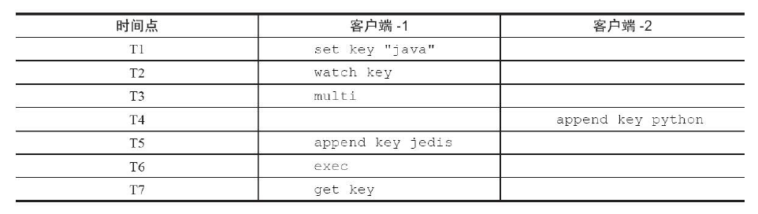

#### 3.4.3 Redis与Lua

- 在Redis中执行Lua脚本会有两种方法，eval和evalsha
- eval 脚本内容 key个数 key列表 参数列表
  - eval 'return "hello "..KEYS[1]..ARGV[1]' 1 redis world会返回hello redisworld
  - eval原理是将脚本发送给服务器，服务器将执行结果返回给客户端，如图：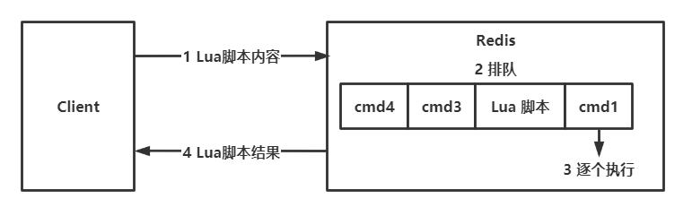
- evalsha，使用该命令时，首先应该将脚本加载到服务端，得到该脚本的SHA1校验和，之后每次会根据SHA1为参数执行命令，这样，不需要每次都传Lua脚本，脚本功能就得到了复用
  - script load "$(cat lua_get.lua)"
  - evalsha 脚本SHA1值 key个数 key列表 参数列表
  - 如图所示：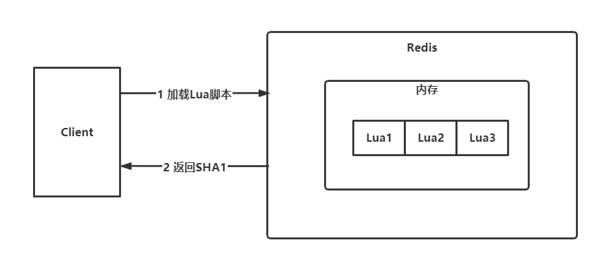

- Lua的Redis API
  - eval 'return redis.call("get", KEYS[1])' 1 hello
  - redis.call，如果脚本执行失败，直接返回错误
  - redis.pcall，如果执行失败，继续执行

#### 3.4.4 案例

- Lua脚本有如下三个好处
  - 原子执行，其中不会插入命令
  - 定制自己的命令，常驻Redis内存，实现复用
  - 多条命令一次性打包，较少网络开销

### 3.5 Bitmaps

#### 3.5.1 数据结构模型

- 本身不是一种数据结构，实际上就是个字符串，但是可以对字符串进行位操作

#### 3.5.2 命令

- 以下命令距离：将用户是否访问过网站存放到Bitmaps中，访问置1，没有访问置0，偏移量用作用户id
- 设置值
  - setbit unique:users:2020-05-20 0 1将0号用户置为以访问
  - 如果id是以一个固定的值如10000开头，则可将id减去这个值再计算偏移量，不仅省空间，而且可以避免由于申请大内存导致的阻塞
- 获取值
  - getbit unique:users:2020-05-20 19999，由于offset=19999根本不存在，所以直接返回0
- 获取Bitmaps指定范围值为1的个数
  - bitcount [start] [end]
  - bitcount unique:users:2020-05-20 直接返回所有为1的数量
- Bitmaps间的运算
  - bitop op destkey key [key...]
  - op可以取值and or not xor
- 计算Bitmaps中第一个值为targetBit的偏移量
  - bitpos key targetBit [start] [end]
  - bitpos unique:users:2020-05-20 1 返回访问的最小用户id

#### 3.5.3 Bitmaps分析

- 随着时间的推移，Bitmaps相较于列表非常可观的节省空间
- 但是，如果大量用户都是僵尸用户，即大量位都是0，这时使用bitmap是不合适的

### 3.6 HyperLogLog

- HyperLogLog并不是一种新的数据结构，实际类型为字符串类型
- 作用是可以利用极小的内存空间完成独立总数的统计，统计集是IP，Email，ID等
- 命令：
  - pfadd key element [element...]
  - pfcount key [key...]
  - pmerge destkey soucekey [sourcekey...]
- HyperLogLog内存量很小，但存在误差，Redis给出的数字是0.81%的失误率

### 3.7 发布订阅

- 发布者向指定的频道（channel）发布消息，订阅了该频道的所有订阅者都会收到消息

#### 3.7.1 命令

- 发布消息
  - publish channel:sports "Tim won the championship"
- 订阅消息
  - subscribe channel [channel...]
- 开发提示
  - 客户端在执行订阅命令之后进入了订阅状态，只能接收subscribe、
    psubscribe、unsubscribe、punsubscribe的四个命令
  - 和Kafka，RocketMQ相比，Redis的发布订阅略显粗糙，无法实现消息堆积和回溯，刚订阅的客户端无法收到之前的消息，但也足够简单

## 第4章 客户端

### 4.4 客户端管理

#### 4.4.1 客户端API

- client list命令列出了与Redis服务器相连的所有客户端连接信息，主要包含以下几个内容
  - 标识：id addr fd name
  - 输入缓冲区：qbuf qbuf-free
    - Redis为每个客户端分配了输入缓冲区，作用是临时保存用户命令，提供缓冲功能，之后，Redis会从缓冲区中拉取命令执行，如图：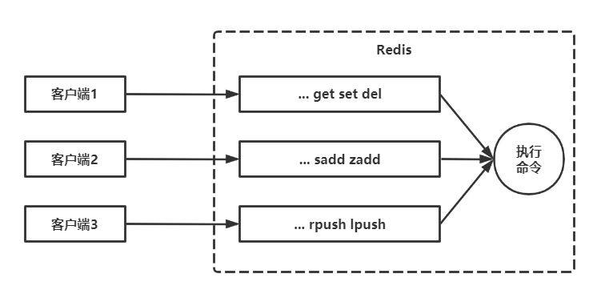
    - qbuf和qbuf-free分别表示总容量和剩余容量，Redis只是要求每个缓冲区大小不能超过1G，缓冲区会根据输入内容的大小动态调整
    - 缓冲区使用不当会有两个问题：
      - 一旦某个客户端缓冲区超过1G，客户端将会被关闭
      - 输入缓冲区不受maxmemory控制，假设一个Redis限制最多使用4G，已经存储了2G数据，但如果输入缓冲区超过了2G，将会产生数据丢失，键值淘汰，OOM等情况，如图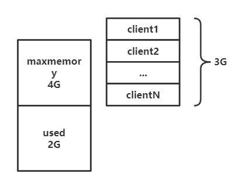-
    - 造成输入缓冲区过大的原因：
      - Redis处理速度跟不上缓冲区输入速度
      - 命令中包含大量bigkey
      - Redis发生了阻塞，造成命令积压
    - 解决方法：
      - 定期执行client list命令，手机qbuf qbuf-free异常连接的记录
  - 输出缓冲区：obl oll omem
  - 客户端存活状态：age idle，age代表连接时间，idle代表上次操作到现在没有操作的空闲时间，二者相等代表该连接一直空闲
  - 客户端的限制maxclients和timeout
    - maxclients控制连接数量，一旦超过，将被拒绝，默认值为1000
    - timeout为了控制空闲连接的数量，当idle大于timeout时，将主动关闭连接，此时，如果使用Jedis作为客户端，那么关于jedis的调用将会抛出异常
    - Redis默认配置timeout为0，这时出于对客户端的一种保护，因为很多开发者使用JedisPool时不会对连接池对象做出空闲检测，不设置timeout就不会对业务造成影响。但如果客户端本身存在一些问题，造成大量的空连接，一旦超过maxclients，后果也不堪设想
    - 所以，在实际开发与运维中，通常timeout>0，同时在客户端添加空闲检测和验证，JedisPool提供了相关的手段
  - 客户端类型
    - flag=S代表当前客户端时slave客户端
    - flag=N代表普通客户端
    - flag=O代表当前客户端正在执行monitor命令

### 4.5 客户端常见异常

- 本节将分析一下Jedis使用过程中的常见异常情况
- 无法从连接池获取连接，抛出JedisConnectionException：Could not get a resource
  from the pool
  - 如果连接池中Jedis对象（默认8个）全被占用，那么申请时就需要等待，如果超出设置的等待时间maxWaitMillis，就会抛出异常
  - 同样，没有设置等待时间，但是设置了blockWhenExhausted=false，申请时没有资源也立即会抛出异常
  - 对于这个问题，重点原因应该是连接池为什么没有资源了
    - 高并发条件下默认数量比较少，供不应求，但是正常情况下只要比默认的连接数（8个）多一些即可，因为Jedis的处理速度足够快
    - 没有正确使用连接池，比如没有释放
    - 存在慢查询，导致归还速度较慢
    - 客户端是正常的，但由于服务器的一些原因导致客户端的阻塞

- 客户端读写异常，SocketTimeoutException: Read timed out
  - 读写超时命令设置过短
  - 命令本身比较慢
  - 客户端与服务端网络不正常
  - Redis自身发生阻塞
- 还有很多，可以参考课本

### 4.6 客户端案例分析

#### 4.6.1 Redis内存陡增

- 现象
  - 服务端：Redis主节点内存陡增，几乎用满maxmemory（4G），而从节点内存没有变化（2G）
  - 客户端：传输数据时，产生OOM异常
- 分析原因，可能有两个
  - 确实有大量写入，但是主从复制出现了问题，导致主节点和从结点的内存使用差异，此时，使用dbsize查看二者键的数量，如果真的出现问题，数量应该很不一致
  - 其他原因造成主节点内存使用过大，排查是否是由于客户端缓冲区造成的
    - 执行info clients发现输出缓冲区不太正常，最大的输出缓冲区队列已经超过了20万个对象
    - 执行client list找到omem不正常的连接
    - 发现有一个连接omem非常大，flags=O，很明显，这是一个正在执行monitor命令的客户端
- 处理方法
  - 禁止使用monitor
  - 限制缓冲区大小
  - 使用专业的Redis运维工具，CacheCloud，出现问题后会报警

#### 4.6.2 客户端周期性的超时

- 现象
  - 客户端：出现大量超时，经过分析发现超时是周期性出现的
  - 服务端：没有明显的异常，只是有一些慢查询
- 分析原因
  - 网络原因：网络原因导致的超时
  - Redis本身：观察Redis日志，发现出现了异常
  - 客户端：由于是周期性出现，所以就和服务端的慢查询出现的时间比对以下时间，发现客户端超时时间和服务端慢查询出现的时间基本一致，并且慢查询的命令是hgetall
    - 找到问题，经过与业务方沟通，有一个每5分钟定时执行的hgetall任务
- 处理方法
  - 对于运维而言，监控慢查询，一旦超过阈值，报警
  - 对于开发而言，加强对Redis的理解，避免不正确的使用方式

## 第5章 持久化

- Redis支持RDB和AOF两种持久化机制，持久化可以有效的避免因进程退出导致的数据丢失问题，下次重启时，利用持久化文件即可实现数据恢复

### 5.1 RDB

- RDB持久化是把当前进程数据生成快照保存到硬盘，触发RDB可以分为手动触发和自动触发

#### 5.1.1 触发机制

- 手动触发分为对应save和bgsave
  - save会阻塞当前Redis服务器，直至RDB过程完成，对于内存比较大的实例会长时间阻塞，线上环境不建议使用
  - bgsave使用fork创建子进程，RDB持久化过程由子进程负责，阻塞只发生在fork阶段，一般时间很短
    - **思考两个问题**：为什么使用进程而不是线程？数据一致性可以保证吗？
    - **答案**：使用进程可以保证数据一致性，所以使用进程。创建进程时，其实子进程获得了与父进程相同的地址空间内容，因此相当于子进程得到了父进程调用fork时的进程快照，之后的数据写入发生在父进程，而RDB发生在子进程
- 显然，bgsave是save命令的优化，因此Redis内部涉及RDB的操作都是用bgsave，而save已经被废弃
- 除了手动触发，Redis还可以自动触发RDB
  - 使用save相关配置，如"save m n"，表示m秒内发生n次修改时，自动触发bgsave
  - 如果从节点发生全量复制操作，那么主节点会自动执行bgsave生成RDB文件并发送给从节点
  - 执行debug reload命令重新加载Redis时，也会自动触发save操作
  - 默认情况下执行shutdown命令时，如果没有开启AOF功能则自动执行bgsave

#### 5.1.2 流程说明

- 下图是bgsave的触发方式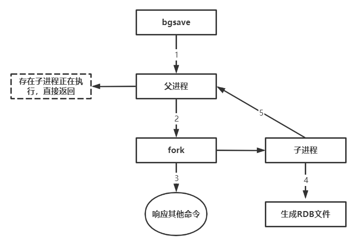
  - 执行bgsave命令，父进程首先判断是否存在RDB/AOF子进程，如果存在直接返回
  - 父进程执行fork，fork操作过程中父进程会阻塞
  - 父进程fork完成后，继续处理其他信息
  - 子进程创建RDB文件，根据父进程内存生成的临时快照文件，生成后，对原有文件进行原子替换
  - 子进程发送信号给父进程，父进程更新统计信息

#### 5.1.4 RDB的优缺点

- 优点
  - RDB是一个紧凑压缩的二进制文件（使用LZF算法压缩），代表Redis在某个时间点的进程快照，非常适合备份，全量复制等场景。比如每6小时执行bgsave备份，并把RDB文件拷贝到远程机器或文件系统中，用于灾难恢复
  - Redis使用RDB恢复数据远远快于AOF
- 缺点
  - RDB不适合实时持久化/秒级持久化，因为每次都要全量复制属于重量级操作，如果实时或秒级更新，成本过高
  - RDB使用特定的二进制格式保存，Redis演进过程中有多种格式，可能出现老版本Redis无法兼容新版RDB格式的问题
- **针对RDB不适合实时持久化的问题**，Redis提供了AOF持久化方式来解决

### 5.2 AOF

- AOF（append only file）持久化：以独立日志的方式记录每次写命令，重启时再重新执行AOF文件中的命令恢复数据
- 主要是为了解决数据持久化的实时性，目前已经是Redis持久化的主流方式

#### 5.2.1 使用AOF

- 开启AOF功能需要设置配置：appendonly yes，默认不开启
- AOF的工作流程有：命令写入（append），文件同步（sync），文件重写（rewrite），重启加载（load），如下图：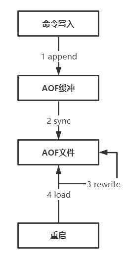
  - 所有的写入命令都会追加到aof_buf（缓冲区）中
  - AOF缓冲区根据对应的策略向硬盘做同步操作
  - 随着AOF文件越来越大，需要定期对AOF文件进行重写，达到压缩的目的
  - Redis服务器重启时，根据AOF文件进行数据恢复

#### 5.2.2 命令写入

- AOF文件内容直接是文本协议格式，如set hello world，再AOF文件中是：*3\r\n$3\r\nset\r\n$5\r\nhello\r\n$5\r\nworld\r\n

- AOF为什么直接采用文本协议格式
  - 文本协议具有很好的兼容性
  - 直接采用了文本协议格式，直接运行，避免二次处理开销
  - 具有可读性，方便直接修改和处理
- AOF为什么先写入aof_buf，而不是磁盘
  - Redis本身单线程，为了性能，就先写入内存
  - Redis可以提供多种缓冲区同步硬盘的策略，在性能和安全性做出平衡

#### 5.2.3 文件同步

- Redis提供了多种AOF缓冲区同步文件策略，由参数appendfsync控制
  - always：每次写入都要同步AOF文件，一般SATA硬盘只能大约支持几百TPS，显然与高性能背道而驰，不建议配置
  - no：由操作系统来进行AOF文件的同步，周期不可控，而且每次同步时会加大数据量，虽然提高了性能，但数据安全性无法保证
  - everysec：每秒同步，这时默认的配置，也是建议的配置，理论上在宕机时只会丢失一秒的数据（严格意义上来说最多丢失一秒数据是不准确的，5.3节有相关介绍）

#### 5.2.4 重写机制

- 随着命令不断写入AOF，文件会越来越大，为了解决这个问题，Redis引入AOF重写机制压缩文件体积
- AOF文件重写就是把Redis进程内的数据转化为写命令同步到新AOF文件的过程
- 重写后的AOF文件为什么可以变小
  - 进程内已经超时的数据不在写入文件
  - 旧的AOF文件含有无效命令，如del key，hdel key之类的，新的AOF文件只保留最终数据的写入命令
  - 多条命令可以合并为一个，如lpush list a, lpush list b等
- AOF重写过程可以手动触发和自动触发
  - 手动触发：直接调用bgrewriteaof命令
  - 自动触发：当前AOF文件体积大于auto-aof-rewrite-min-size（默认64MB），并且，当前AOF体积与上一次AOF文件体积的比值大于auto-aof-rewrite-percentage，同时满足这两个条件，才会重写
- AOF重写流程如下图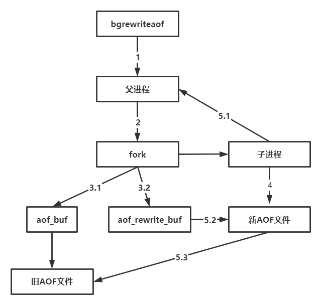
  - 执行AOF重写请求，如果正在执行AOF，直接返回，如果正在执行RDB，AOF重写会延迟到RDB完成之后（1）
  - 父进程fork子进程，这个过程相当于RDB（2）
    - fork之后，父进程继续执行原有策略，将新的命令同步到aof_buf，并定期刷新到旧的AOF文件，这个过程可以保证万一子进程失败，原有的数据同步不会受到影响（3.1）
    - 同时，fork之后，父进程会启用aof_rewrite_buf，也就是说，fork之后，父进程接收的修改命令，除了写入aof_buf，还会写入aof_rewrite_buf（3.2）
  - 子进程根据内存快照，按照一定速率批量将内存中的数据对应的命令写入新的AOF文件（4）
  - 新AOF写入完成后，子进程发送信号给父进程，父进程更新统计信息（5.1）
  - 父进程将aof_rewrite_buf中的内容更新到新AOF文件中（5.2）
  - 父进程使用新AOF文件替换老AOF文件，完成AOF重写（5.3）
  - 对于5.2和5.3来说，父进程是阻塞的，此时不能响应请求
  - 个人感觉最后还需要清空aof_buf，毕竟aof_buf存入的是新AOF文件已经包含过的内容，不过不清空应该也没啥问题，重新执行一遍，对数据没有影响

#### 5.2.5 重启加载

- AOF和RDB文件都可以用来数据恢复，流程如下：
  - AOF持久化开启并且AOF文件存在时，优先加载AOF文件
  - AOF关闭或者AOF文件不存在时，加载RDB文件
  - 加载AOF/RDB文件成功后，Redis启动成功
  - AOF/RDB文件存在错误时，Redis启动失败

### 5.3 问题定位与优化

- Redis持久化功能一直是影响Redis性能的高发地

#### 5.3.1 fork操作

- 当执行RDB或AOF重写时，必不可少使用fork，虽然fork并不拷贝父进程的物理内存空间，但是会复制父进程的页表。对于一个10GB的Redis进程，需要复制大约20MB的内存页表
- 正常情况下，fork耗时应该是每GB 20ms左右，但是对于要求几万的OPS来说，这一点已经很致命，如何改善fork的耗时
  - 优先使用物理机和高效支持fork的虚拟化技术
  - 控制Redis的最大可用内存，线上建议控制在10G以内
  - 降低fork的频率，如放宽AOF重写自动触发时机

## 第6章 复制

- 在分布式系统中，为了解决单点问题，通常会把数据复制多个副本部署到其他机器，**可以满足故障恢复和负载均衡等需求**
- Redis复制功能是实现高可用的基础，哨兵和集群都是基于复制功能的

### 6.3 复制原理

#### 6.3.1 复制过程

- 大概为6个过程（通过slaveof引发）
  - 保存主节点信息，执行slaveof保存主节点信息之后直接返回，之后由定时任务进行连接
  - 从节点内部通过定时任务维护相关复制逻辑，当发现新的主节点后，会尝试建立网络连接，如果连接失败，重新连接
  - 发送ping命令检测连接的套接字是否可用以及当前主节点是否可以处理命令，如果没有收到pong或超时，断开连接，返回第2步
  - 权限验证，如果主节点设置了requirepass参数，则需要密码验证，验证失败返回第2步
  - 同步数据集，2.8之前用sync，2.8之后用psync
  - 命令持续复制，数据同步之后，就完成了复制的建立流程，接下来主节点会持续不断的把命令发送给从节点

#### 6.3.2 数据同步

- 2.8以上使用psync完成数据同步，psync会根据不同的情况执行全量复制或是部分复制，而2.8之前的版本使用sync只能执行全量复制，跟psync的全量复制的过程相同
- psync命令运行需要以下组件支持
  - 主从节点各自复制偏移量
    - 主节点处理完命令后，会将命令长度累加到master_repl_offset指标中
    - 从节点每秒上报自身的复制偏移量给主节点，因此主节点保存着从节点的复制偏移量
    - 通过对比主从节点偏移量，可以判断主从节点数据是否一致
  - 主节点复制积压缓冲区
    - 一个队列，主节点执行完命令后，异步的将命令发送个从节点，并将该命令中的每个字节以及对应的偏移量存入复制积压缓冲区，由于是队列，所以总是保存着最新的数据，默认大小为1M
  - 主节点运行id
    - 不使用ip+port作为主节点唯一的id的原因是如果主节点重启并更新了数据集（替换RDB/AOF文件），这时再基于原来进程的偏移量复制数据是不安全的，所以不同的进程具有不同的主节点运行id
- psync的全量复制与部分复制（明确一点：数据同步时都是从节点向主节点发送psync run_id offset命令）
  - 全量复制：一般用于初次复制场景（通过run_id进行识别），以及offset不在主节点的复制积压缓冲区之内时
  - 部分复制：通常用于主从节点暂时性地断开连接（网络原因）之后又重新连上时的复制，对于runid如果相等，并且offset在积压缓冲区内，这时可以执行部分复制，显著减少网络开销
- 全量复制
  - 从节点发送psync指令，如果是第一次连接，发送psync ? -1，如果是重新连接，发送psync xxx xxx（显然，此时的run_id或offset不满足部分复制的条件）
  - 主节点根据两个参数解析出当前为全量复制，回复+FULLRESYNC run_id offset
  - 从节点先保存收到的run_id和offset
  - 主节点执行bgsave保存RDB文件到本地并发送
  - 从节点接收RDB文件
  - 主节点保存发送RDB和从节点结束RDB过程中产生的写命令会被复制到客户端缓冲区内，当从节点接收到RDB文件后，这些命令被发送给从节点，这时，主节点工作完成，并认为数据已经一致
  - 从节点收到主节点的全部数据之后，清空旧数据
  - 清空后加载RDB文件
- 部分复制
  - 从节点仍然发送psync xxx xxx
  - 主节点核对run_id相等，并且offset处于积压缓冲区内，返回+CONTINUE，表示进行部分复制
  - 主节点根据偏移量将积压缓冲区内的数据发送给从节点

#### 6.3.5 心跳

- 主从节点建立复制之后，它们之间维护者长连接并彼此发送心跳命令
  - 主节点每10秒发送ping命令，判断从节点存活性和连接状态
  - 从节点每1秒发送replconf ack offset命令，上报偏移量，同时可以检测主节点连接状态

#### 6.3.6 异步复制

- 主机点向从节点的同步写命令是异步的，也就是说，主机点处理完写命令后直接返回，而不等待从节点是否同步完成，因此节点数据集会有延迟情况

## 第7章 Redis的噩梦：阻塞

- Redis是典型的单线程架构，所有读写操作在主线程中完成，用于高并发场景时，这条线程就是生命线，如果出现阻塞，哪怕很短时间，对应用来说都是噩梦
- 阻塞的原因主要包括内在原因和外在原因
  - 内在原因
    - 不合理的使用API或数据结构
    - CPU饱和
    - 持久化阻塞
  - 外在原因
    - CPU竞争
    - 内存交换
    - 网络问题

### 7.1 发现阻塞

- Redis发生阻塞时，线上应用服务客户端最先感知到，比如Jedis客户端会抛出JedisConnectionException
- 发现问题通过日志，因为出现异常时都通过log.error打印到日志，分析日志可以找出出现问题的节点ip，port，之后再具体分析问题

### 7.2 内在原因

#### 7.2.1 API或数据结构使用不合理

- 比如hgetall命令会操作大对象，并且复杂度是O(N)

- 发现慢查询后，可以将其修改为复杂度较低的算法，并试图将大对象拆分为小对象

#### 7.2.2 CPU饱和

- 使用top命令发现Redis进程CPU占比很高
- 尝试使用集群化的方式分摊压力

#### 7.2.3 持久化阻塞

- fork阻塞，避免使用过大的内存实例和规避fork缓慢的操作系统
- AOF刷盘阻塞，默认情况下，追加AOF文件是每秒一次的刷盘操作，但如果主线程发现上次刷盘成功的时间已经超过了2秒，就会阻塞直到最近一次刷盘成功，这就造成了主线程阻塞。
  - 使用iptop查找哪一个进程给磁盘造成了读写压力导致AOF刷盘缓慢

### 7.3 外在原因

#### 7.3.1 CPU竞争

- Redis是典型的CPU密集型应用，应该避免与其他CPU密集型服务部署到同一台机器上

#### 7.3.2 内存交换

- 内存交换会严重影响Redis效率，应该保证机器有足够的内存可用，不会造成Redis频繁内存交换

## 第8章 理解内存

### 8.1 内存消耗

#### 8.1.2 内存消耗划分

- Redis进程内消耗主要包包括
  - 自身内存：自身内存消耗非常少，used_memory_rss在3MB左右，used_memory在800KB左右，二者的差值为内部碎片
  - 对象内存：可以简单理解为sizeof(key)+sizeof(value)
    - key都是字符串，应该避免使用过长的键
  - 缓冲内存：主要包括客户端缓冲，复制积压缓冲区，AOF缓冲区
    - 客户端缓冲在大流量的场景中容易失控，容易造成Redis内存的不稳定，需要重点监控
    - 复制积压缓冲区默认为1MB，整个主节点只有一个，所有从节点共享，因此可以将次空间调大，这部分内存的投入是很有价值的，可以有效避免全量复制
    - AOF缓冲区经常用于保存最近的写入命令，通常占用很少
  - 内存碎片，以下场景容易产生内存碎片
    - 频繁更新，对已存在的键执行append，setrange等更新操作
    - 大量过期键删除
- Redis子进程内存消耗
  - 由于写时复制技术，子进程并不需要消耗1倍的父进程内存
  - 如果当前系统支持THP，建议关闭，因为THP会将写实复制时复制的单位从4KB变为2MB，可能导致过多的无用复制

### 8.2 内存管理

- Redis使用maxmemory限制最大可用内存，限制内存的主要目的是：
  - 用于缓存用尽，超出maxmemory时使用LRU等删除策略释放空间
  - 防止超出服务器物理内存

#### 8.2.3 内存回收策略

- 主要包括以下两个方面
  - 删除到达过期时间的键
  - 内存使用达到maxmemory时触发内存溢出策略淘汰一些键
- 删除过期键
  - 惰性删除：访问键时，判断是否可以删除，如果可以删除，会执行删除操作并返回空
    - 节省CPU成本，不需要维护单独的TTL链表处理过期键的删除
    - 造成内存泄漏问题，过期键如果没有访问将一直不会被删除
    - 因此，Redis提供了一种定时任务删除机制作为惰性删除的补充
  - 定时任务删除，默认每秒运行10次
    - 在每个数据库空间随机检查20个键，发现过期则删除
    - 如果超过25%的键过期，将回收不足25%
- 内存溢出控制策略，Redis内存使用达到maxmemory时，会触发相应的溢出控制策略，redis支持6种策略
  - noeviction（默认）：不会删除数据，拒绝客户端写入，返回OOM
  - volatile-lru：使用LRU算法删除具有超时属性的键，如果没有可删除的，回退到noeviction
  - allkeys-lru：根据LRU删除键，不管有没有超时属性
  - allkeys-random：随机删除键
  - volatile-random：随机删除过期键
  - volatile-ttl：删除最近将要过期键，如果没有，回退到noeviction

### 8.3 内存优化

#### 8.3.1 redisObject对象

- Redis种所有存储的value都是用redisObject表示，内部结构如图：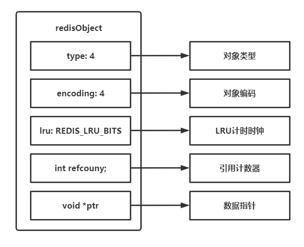
  - type：所支持的5种类型
  - encoding：使用的内部编码
  - lru：当配置了maxmemory和maxmemory-policy=volatile-lru或者allkeys-lru时，用于辅助LRU算法进行键的淘汰
  - refcount：表示当前value对象的被引用个数，可以作为不同key的共享。在Redis中，只有value为整数，并且在区间[0, 9999]时才会共享这个redisObject，这种redisObject被管理在共享对象池中
  - *ptr：如果是整数，直接存数据；其他的话存指针

#### 8.3.4 字符串优化

- 字符串结构，Redis中字符串叫做SDS，如图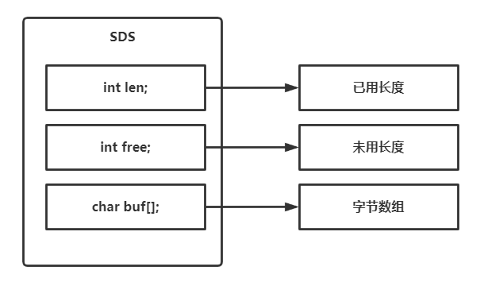

- 预分配机制，使用字符串时要注意，当使用set时，buf的长度就是字符串的长度，如果使用append命令，那么将会按照一定机制预留出一定的空间，此时free不为0，造成空间的浪费。如果要修改字符串，直接使用set即可

#### 8.3.5 编码优化

- 了解编码，使用object encoding key
- 编码类型只能从小内存编码向大内存编码转换，反过来不可逆，如ziplist->linkedlist
- ziplist编码
  - ziplist主要目的是为了节省内存，所有数据都是采用连续的内存结构
  - 结构类似：\<zlbytes>\<zltail>\<zllen>\<entry-1>\<entry-2>\<....>\<entry-n>
    \<zlend>
  - 一个ziplist可以包含多个entry，entry中又包含当前entry的长度与上一个entry的长度，因此可以实现双向查找
  - 内部结构如图：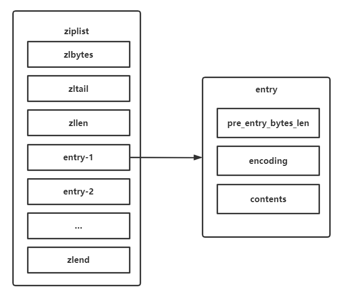
- ziplist结构特点如下：
  - 内部变现为一个连续内存数组
  - 可以模拟双向链表结构，以O(1)的时间复杂度出入队列
  - 新增删除涉及内存的重新分配或释放，增大了操作的复杂性
  - 读写操作涉及复杂的指针移动，最坏时间复杂度为N^2
  - 适合存储小对象和长度有限的数据
- ziplist使用
  - 使用ziplist可以分别作为hash、list、zset数据类型实现
  - 使用ziplist编码类型可以大幅降低内存占用
  - ziplist实现的数据结构相比原生数据结构，命令操作更加耗时
- 因此，ziplist是为了追求时间与空间的平衡
- intset编码，内部表现为存储有序，不重复的整数集，它包含3个字段
  - encoding：int-16，int-32还是int-64
  - length：元素个数
  - contents：整数数组，从小到大排序
- intset插入复杂度N，查询复杂度logN，整体占用空间非常小，所以如果长度可控的话，写入速度也非常快，因此，当使用整数集合时尽量使用intset编码

## 第9章 哨兵

- Redis Sentinel解决的问题：一旦主节点出现故障不能服务，Sentinel可以自动完成从节点到主节点的晋升，同时通知应用方更新主节点地址

### 9.1 基本概念

- Redis数据节点：主节点和从节点
- Sentinel节点集合：若干个Sentinel节点
- Redis Sentinel：Redis高可用实现方案，包括Sentinel节点集合和Redis数据节点

#### 9.1.1 主从复制的问题

- 主从复制的作用
  - 备份，主节点故障的情况下，从节点可以顶替主节点
  - 读写分离，从节点可以帮助主节点分担读压力
- 主从复制的问题
  - 一旦主节点出现了问题，需要手动将一个从节点晋升为主节点，同时，还需要通知应用方修改主节点地址，整个过程都需要人工干预
  - 主节点的写能力收到单机的限制
  - 主节点的存储能力收到单机的限制
- 第一个问题是Redis高可用问题，使用Redis Sentinel解决；第二，三个问题属于Redis分布式问题，会在第10章介绍

#### 9.1.2 高可用

- Redis主从模式下主节点出现故障后，通过以下几步进行故障转移
  - 主节点发生故障后，客户端连接失败，从节点也连接失败导致复制中断
  - 发现主节点故障后，需要选出一个从节点，执行slaveof no one命令使其称为新的主节点
  - 更新应用方新的主节点信息
  - 原来的从节点去复制新的主节点
  - 原来的主节点恢复后，也去复制新的主节点
- Redis Sentinel正是为了实现上述过程的自动化出现的，主要解决了以下问题
  - 如何判断主节点故障不可达
  - 如果有多个从节点，怎样保证只有一个晋升为主节点
  - 如何通知客户端新的主节点信息

#### 9.1.3 Redis Sentinel的高可用

- 主节点发生故障时，Redis Sentinel能自动完成**故障发现，故障转移和通知应用方**，完成真正的高可用

- Redis Sentinel是一个分布式架构，其中包含若干个Sentinel节点和Redis数据节点
  - 每个Sentinel节点会对所有的数据节点和其余Sentinel做监控
  - 当某个Sentinel发现节点不可达时，会对节点做下线标识（主观下线），如果被标识的是数据节点中的主节点，那么它会与其他Sentinel节点进行协商，如果大多数Sentinel节点都认为该主节点不可达（协商一致），它们会选举出来一个Sentinel节点作为领导者来完成故障恢复的工作，同时这个Sentinel也负责通知应用方，如图是领导者完成的工作，与9.1.2中描述类似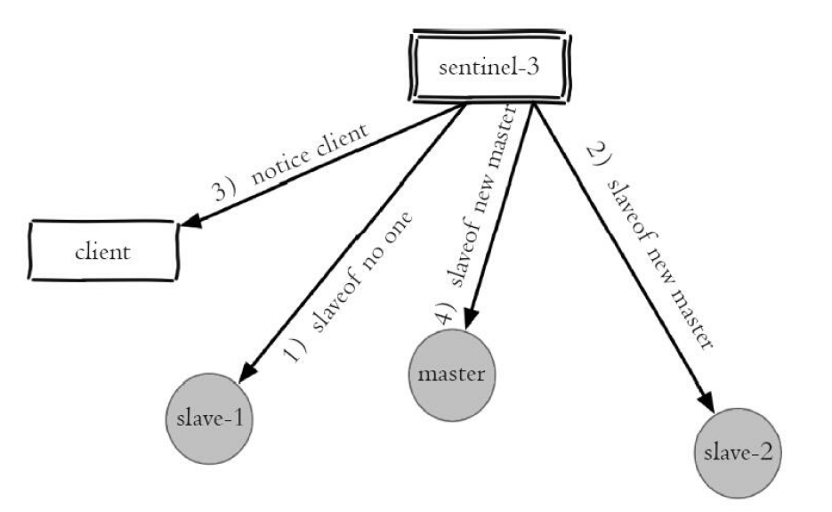
  - 整个过程完全自动，所以Redis Sentinel解决了Redis的高可用问题
- Redis Sentinel架构只是在原来主从复制的架构基础上，增加了一系列特殊的Redis节点（Sentinel节点）用来定时监控数据节点，也就是说Redis Sentinel架构并没有对原来的主从复制架构做任何特殊处理，架构图如下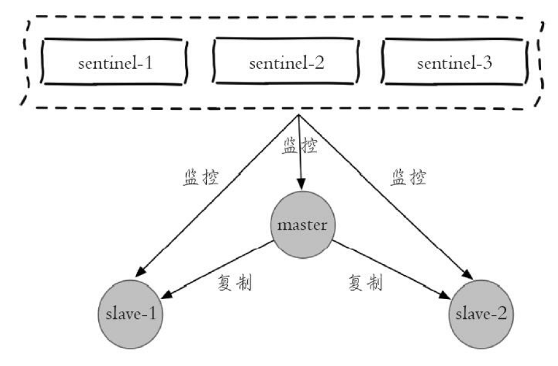

- 通过以上分析，可以看出Redis Sentinel具有以下几个功能
  - 监控：定期检测数据节点，其余Sentinel是否可达
  - 通知：将故障转移的结果通知给应用方
  - 主节点故障转移
  - 配置提供者：客户端在初始化连接时，通过Redis Sentinel获取主节点相关信息
- Redis Sentinel包含了若干个Sentinel节点，这么做有两个好处
  - 对于节点故障判断是由多个Sentinel共同完成的，可以有效的防止误判
  - 由多个Sentinel节点组成，即使个别不可用，整个Sentinel节点集合也是健壮的
- 需要注意的是，Sentinel本身就是独立的Redis节点，只不过它们有一些特殊，不存储数据，只支持部分命令

### 9.2 安装与部署

### 9.2.4 配置优化

- sentinel monitor \<master-name> \<ip> \<port> \<quorum>，用来配置监控的主节点
  - master-name是主节点的别名
  - quorum代表判定主节点不可达所需要的票数
  - **实际上，Sentinel也会监控所有的从节点与其他的Sentinel数据节点，但是从配置中并没有看到，那是因为这些信息可以从与主节点的交互中得到，这样，可以动态的得到从节点和Sentinel列表。并且，有关从节点和其他Sentinel的信息会在启动之后自动修改到配置文件中**
  - quorum一般设置为num(Sentinel)/2，并且当票数到达max(quorum, num(Sentinel)/2)时，才会进行故障转移
- sentinel down-after-milliseconds \<master-name> \<times>
  - 每个Sentinel节点定期发送ping命令判断其他节点是否可达，如果超时时间超过times，则判断为不可达

#### 9.2.5 部署技巧

- Sentinel不应该部署到同一台物理机器上
- 部署至少三个且奇数个Sentinel节点
- 一套Sentinel节点既可以监控一个主节点，也可以监控多个主节点，如何选择
  - 如果是同一业务的主节点集合，那么可以监控多个主节点
  - 否则，使用一套Sentinel节点监控一个主节点即可，此时每个Redis主节点都有自己的Sentinel集合，但容易造成资源浪费

### 9.4 客户端连接

#### 9.4.1 Redis Sentinel的客户端

- Sentinel节点具备监控，通知，故障转移，配置提供者等若干功能，因此，实际上最了解主节点信息的就是Sentinel节点集合
- 而每个主机点是通过\<master-name>标识的，所以如果想要正确连接Redis Sentinel，必须有Sentinel节点集合和masterName两个参数

#### 9.4.2 Sentinel客户端的基本实现原理

- 基本步骤如下
  - 遍历Sentinel集合，获取一个可用的Sentinel，因为Sentinel节点之间会贡献信息，所以从任意一个Sentinel节点获取主节点信息都是可以的
  - 在一个可用的Sentinel节点上，通过sentinel get-master-addr-by-name master-name可以获取主节点相关信息，这样就得到了与主节点的连接
  - 验证当前主节点是否是真正的主节点，主要是为了防止故障转移期间的主节点变化
  - 持续与各个Sentinel保持连接，一旦主节点发生变化，就会有完成故障转移的Sentinel领导者通知客户端新的主节点信息

#### 9.4.3 Jedis操作Redis Sentinel

- 类似于普通的JedisPool，但为了区分，Jedis提供了JedisSentinelPool，不过JedisSentinelPool仍然保存的是与主节点的连接，只不过这些与主节点的连接是通过Sentinel初始化的

  - 构造JedisSentinelPool的代码如下

    ```java
    public JedisSentinelPool(String masterName,
                             Set<String> sentinels,
                             final GenericObjectPoolConfig poolConfig,
                             final int connectionTimeout,
                             final int soTimeout,
                             final String password,
                             final int database,
                             final String clientName) {
    	…
    	HostAndPort master = initSentinels(sentinels, masterName);
    	initPool(master);
    	…
    }
    ```

  - 获取一个可用的Sentinel节点代码如下，可以看出得到任意一个可用的Sentinel即可得到主节点信息

    ```java
    private HostAndPort initSentinels(Set<String> sentinels, 
                                      final String masterName) {
        // 主节点
        HostAndPort master = null;
        // 遍历所有sentinel节点
        for (String sentinel : sentinels) {
            // 连接sentinel节点
            HostAndPort hap = toHostAndPort(Arrays.asList(sentinel.split(":")));
            Jedis jedis = new Jedis(hap.getHost(), hap.getPort());
            // 使用sentinel get-master-addr-by-name masterName获取主节点信息
            List<String> masterAddr = jedis.sentinelGetMasterAddrByName(masterName);
            // 命令返回列表为空或者长度不为2，继续从下一个sentinel节点查询
            if (masterAddr == null || masterAddr.size() != 2) {
            	continue;
        	}
        // 解析masterAddr获取主节点信息
        	master = toHostAndPort(masterAddr);
        // 找到后直接跳出for循环
        	break;
        }
        if (master == null) {
        // 直接抛出异常，
        	throw new Exception();
        }
        // 为每个sentinel节点开启主节点switch的监控线程
        for (String sentinel : sentinels) {
            final HostAndPort hap = toHostAndPort(Arrays.asList(sentinel.split(":")));
            MasterListener masterListener = new MasterListener(masterName,
                                                               hap.getHost(),
                                                               hap.getPort());
            masterListener.start();
        }
        // 返回结果
        return master;
    }
    ```

  - 通过主节点，初始化连接池中的Jedis连接对象，如上文代码中`initPool(master);`

  - 通过`masterListener.start();`为每一个Sentinel开启一个新的线程，用于接收Sentinel领导者完成故障转移后发来的新主节点的信息。接收信息的原理如下：Sentinel在故障转移的不同阶段，会往自身的不同channel发布信息，代表当前节点的完成，而客户端只需要订阅不同的channel就能得到故障转移的状态，对于客户端而言，最感兴趣的channel是"+switch-master"，即完成了主节点的重新选择，**因此，Redis Sentinel通知客户端的机制实质上是通过发布订阅的方式来完成的**，客户端实现代码如下

    ```java
    Jedis sentinelJedis = new Jedis(sentinelHost, sentinelPort);
    // 客户端订阅Sentinel节点上"+switch-master"(切换主节点)频道
    sentinelJedis.subscribe(new JedisPubSub() {
        @Override
        public void onMessage(String channel, String message) {
            String[] switchMasterMsg = message.split(" ");
            if (switchMasterMsg.length > 3) {
                // 判断是否为当前masterName
                    if (masterName.equals(switchMasterMsg[0])) {
                    // 发现当前masterName发生switch，使用initPool重新初始化连接池
                    initPool(toHostAndPort(switchMasterMsg[3], switchMasterMsg[4]));
                }
            }
        }
    }, "+switch-master");
    ```

- 因此，重新描述一下Jedis Sentinel客户端的实现，可以发现，内容与9.4.2完全一致
  - 遍历Sentinel集合，得到一个可用的Sentinel
  - 通过Sentinel得到主节点信息，然后初始化连接池中的所有Jedis对象，与主节点建立连接
  - 通过不同的线程监控所有的Sentinel，Sentinel领导者完成故障转移之后，会将主节点信息通过发布订阅的方式返回给客户端，客户端收到这个信息后，根据新的主节点信息，重新初始化池中的Jedis对象

### 9.5 实现原理

- Redis Sentinel的基本实现原理主要包括以下几个部分
  - 故障发现
    - 三个定时任务
    - 主观下线
    - 客观下线
  - 故障转移
    - Sentinel领导者选举
    - 故障转移

#### 9.5.1 三个定时监控任务

- 三个定时任务是用来监控所有数据节点与Sentinel节点可达性的重要保证
  - 每隔10秒，Sentinel会向所有主节点和从节点发送info命令获取最新的拓扑结构
    - 可以获取从节点信息，这也就是为什么不需要在配置文件中配置从节点信息
    - 新的从节点加入可以立即感受到
    - 节点不可达或故障后，可以更新拓扑结构
  - 每隔2秒，Sentinel会向Redis数据节点的_sentinel\_:hello频道上发送一些信息，同时每个Sentinel也会对订阅该频道，这些信息包括**当前Sentinel本身的信息以及当前Sentinel对于主节点状态的判断信息**，这完成了以下两个工作
    - 通过接收别的Sentinel发送的其本身的信息，当前Sentinel可以获得其他Sentinel的信息，这也是为什么不需要配置其他Sentinel，完成了Sentinel的自动发现
    - Sentinel节点之间交换主节点的状态，作为后面客观下线以及领导者选举的依据
  - 每隔1秒，每个Sentinel会向前两个过程得到的所有主从节点和Sentinel节点发送ping命令，检测这些节点是否可达
- 通过上面的定时任务，Sentinel节点对整个Redis Sentinel的其他节点都建立了连接，实现了对每个节点的监控，如图：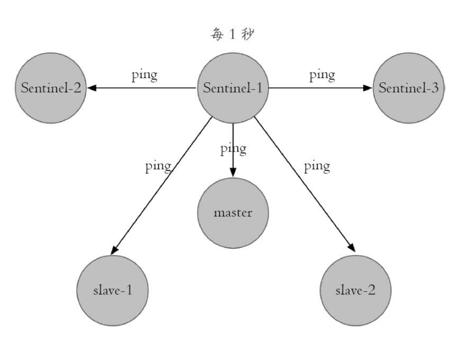

#### 9.5.2 主观下线与客观下线

- 主观下线
  - 每隔1秒的ping命令如果超时的话，Sentinel就会对该节点进行失败判定，这个行为叫做主观下线，存在误判的可能
- 客观下线
  - 当发现主观下线的是主节点时，该Sentinel会通过sentinel ismaster-
    down-by-addr命令向其他Sentinel节点询问对主节点的判断，其他Sentinel节点会通过每隔2秒的定时任务通过发布订阅机制向其他Sentinel回复自己对主节点的判断以及投票的Sentinel id，如果票数超过\<quorum>，那么此时Sentinel就会做出客观下线的决定
  - 注意，从节点和Sentinel节点在主观下线后，没有后续的故障转移操作

#### 9.5.3 领导者Sentinel节点选举

- 如果Sentinel节点对于主节点已经做了客观下线，是不是就立刻开始故障转移呢
- 并不是，实际上故障转移只需要一个Sentinel来完成，所以还会做一个领导者选举的工作，大致思路如下：
  - 每个Sentinel都可能成为领导者，当它发现主节点主观下线后，会向其他节点发送sentinel is-master-down-by-addr命令，不仅发送了自己对主节点状态的判断，也表明自己向成为领导者
  - 其余Sentinel收到命令后，也会向其他节点发送信息，如果自己判断可达，就返回可达，如果判断不可达，返回不可达同时返回自己同意当上领导者的Sentinel id。注意，如果当前Sentinel已经同意过某一个Sentinel做领导者，就不能再同意其他的了，也就是说，每个Sentinel只能有一票
  - 如果该Sentinel发现自己的票数已经大于等于max（quorum，
    num（sentinels）/2+1），那么它将成为领导者
  - 如果此次没有选出领导者，那么将会进行下一轮选举

#### 9.5.4 故障转移

- 选出领导者之后开始故障转移，步骤如下
  - 在从节点列表中选出一个节点作为主节点，选择方法如下
    - 过滤不健康的（主观下线，断线）
    - 选择slave_priority最高的从节点
    - 选择复制偏移量最大的从节点
    - 选择runid最小的从节点
  - 选出来后，执行slaveof no one使其成为主节点
  - 向剩余的从节点发送复制命令
  - 将原来的主节点作为从节点，复制新的主节点

#### 9.6.2 节点运维

- 节点下线
  - 主节点下线，选择一个合适的从节点，使用sentinel failover使其晋升即可
  - 从节点和Sentinel节点：直接操作即可。如果使用了读写分离，注意要让客户端感知到从节点的下线
- 节点上线
  - 从节点和Sentinel节点：直接相应命令添加即可，因为有了Sentinel机制，会自动发现
  - 主节点：一个Sentinel只能有一个主节点，不需要添加，如果需要替换，使用sentinel failover手动故障转移

## 第10章 集群

## 第11章 缓存设计

- 缓存能够加速应用的相应速度，同时也能降低后端负载，但是将缓存加入应用架构也会带来一些问题，这一章讲解以下常见问题以及解决方案

### 11.1 缓存的收益和问题

- 收益
  - 加速读写
  - 降低后端负载（MySQL）
- 问题
  - 数据不一致，缓存层与存储层存在一定时间窗口的不一致性，时间窗口与更新策略有关
  - 代码维护成本
  - 运维成本

### 11.2 缓存更新策略

- LRU/LFU/FIFI算法剔除
  - 一致性最差
  - 维护成本较低，配置maxmemory与淘汰策略即可
- 超时剔除
  - 一致性受超时时间影响
  - 维护成本不是很高，配置超时时间即可
- 主动更新
  - 一致性最高，但如果主动更新出现了问题，这条数据可能很长时间不会更新，建议与超时剔除一起使用
  - 维护成本比较高，开发者需要保证逻辑的正确性
- 最佳实践
  - 低一致性业务可以建议配置maxmemory和淘汰策略剔除
  - 高一致性业务结合使用主动更新和超时剔除，这样可以防止主动更新出现问题

### 11.4 缓存穿透

- 发生情况：一个根本不存在的数据，缓存层和存储层都不存在，导致所有的请求都打到了存储层，过程如下：
  - 缓存层不命中
  - 存储层不命中，不将空结果写回缓存
  - 返回空结果
- 原因有两个
  - 自身业务代码或数据出现问题
  - 恶意攻击，爬虫等
- 解决方案
  - 缓存空对象
    - 优点
      - 实时性较高
    - 缺点
      - 占用了更多缓存空间（可以配置超时时间）
  - 布隆过滤器，在缓存层之前使用布隆过滤器拦截，可以将大部分不存在的对象拦截掉
    - 优点
      - 无需占用过多缓存层空间
    - 缺点
      - 需要定时任务定时更新布隆过滤器，更新的时间间隔对数据一致性有影响，实时性较低
      - 代码维护较为复杂
- 应用场景
  - 对于数据集相对固定，实时性要求较低的场景可以使用布隆过滤器
  - 相反，使用空对象

### 11.6 缓存雪崩

- 如果缓存层由于某些原因不能服务，所有的请求都会到达存储层，造成存储层也级联宕机的现象
- 预防和解决
  - 保证缓存层的高可用，可以通过Redis Sentinel或Redis Cluster实现高可用
  - 依赖隔离组件为后端限流并降级
    - 常见的限流算法：计数器，令牌桶，漏桶
    - 隔离手段：Hystrix
    - 提前演练

### 11.7 热点key重建优化（缓存击穿）

- 发生情况（举个例子）：缓存层中有一个热点新闻负担着巨大的流量，忽然这个热点key过期导致所有的请求打到存储层，为了将存储层中的对象取出并保存到缓存层进行缓存的重建，如果缓存的重建需要较多的时间，那么在这么长的时间间隔内，会有大量的请求访问到存储层试图进行缓存的重建，这种情况成为缓存击穿

- 解决方案

  - 使用分布式锁，只能有一个请求进行缓存重建，代码如下

    ```java
    String get(String key) {
    	// 从Redis中获取数据
        String value = redis.get(key);
        // 如果value为空，则开始重构缓存
        if (value == null) {
            // 只允许一个线程重构缓存，使用nx，并设置过期时间ex
            String mutexKey = "mutext:key:" + key;
            if (redis.set(mutexKey, "1", "ex 180", "nx")) {
                // 从数据源获取数据
                value = db.get(key);
                // 回写Redis，并设置过期时间
                redis.setex(key, timeout, value);
                // 删除key_mutex
                redis.delete(mutexKey);
            }
            // 其他线程休息50毫秒后重试
            else {
                Thread.sleep(50);
                get(key);
            }
        }
        return value;
    }
    ```

  - 永远不过期，既然这种问题是由于热点key过期导致的，那么不给这个key设置过期时间，由业务方根据逻辑时间重构缓存

- 对比

  - 分布式锁，思路简单，一致性强，但可能出现死锁的风险
  - 永远不过其，基本杜绝了热点key问题，但一致性不能保证

