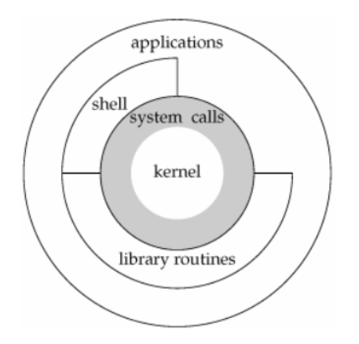
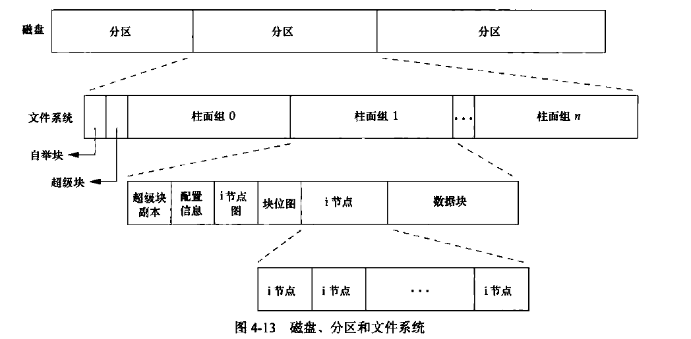
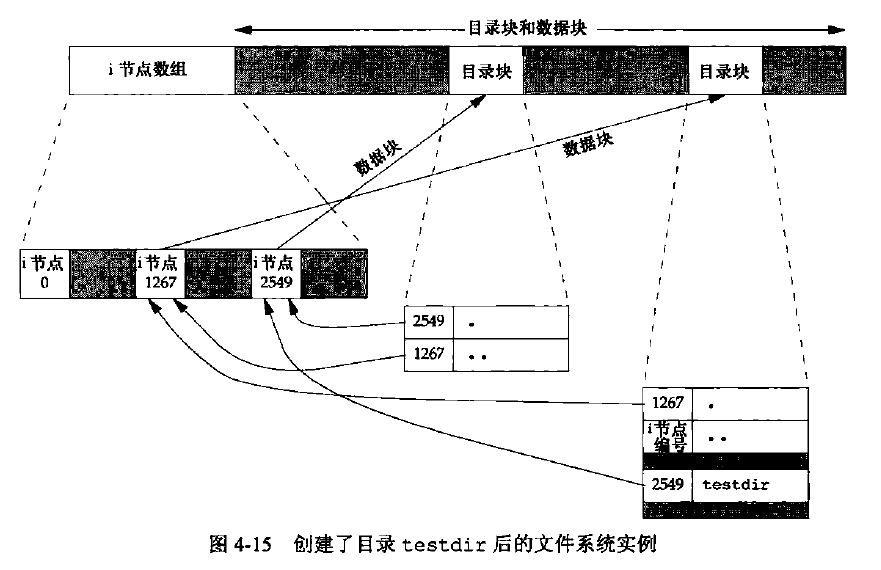

## 第1章——UNIX基础知识

### 1.2 UNIX体系结构

- 从严格意义上来说，可将操作系统定义为一种软件，它控制计算机硬件资源，提供程序运行环境，通常将这种软件称为内核
- 内核的接口被称为系统调用，公用函数库构建在系统调用接口之上，应用程序既可以使用公用函数库，又可以使用系统调用
- 如图是UNIX操作系统的体系结构：

### 1.4 文件和目录

#### 1.4.1 文件系统

- UNIX文件系统是一个目录和文件组成的一种层次结构，所有东西的起点都是被称为跟的目录，这个目录的名称是一个字符"/"
- 目录是一个包含目录项的文件，在逻辑上，可以认为每个目录项都包含一个文件名和该文件属性（文件类型，大小，所有者等），但是UNIX文件系统的大多数实现并不在目录项中存放属性

#### 1.4.2 文件名

- 创建新目录时会自动创建两个文件名：. 和 ..。点指向当前目录，点点指向父目录，在最高层次的根目录中，点点与点相同

#### 1.4.3 路径名

- 绝对路径：以/开头
- 相对路径：不以/开头，相对于进程当前工作目录而言

### 1.5 输入和输出

#### 1.5.1 文件描述符

- 通常是一个小的非负整数，内核用以标识一个特定进程正在访问的文件，当内核打开或创建一个新文件时，它都会返回一个文件描述符，在读写文件时，可以使用这个文件描述符

#### 1.5.2 标准输入、标准输出和标准错误

- 每当运行一个新程序时，所有的shell都为其打开了这3个文件描述符
- 两个常量STDIN_FILENO和STDOUT_FILENO定义在<unistd.h>中，它们指定了标准输入和标准输出的文件描述符

#### 1.5.3 不带缓冲的IO和标准IO

- 函数open、read、write、lseek以及close提供了不带缓冲的IO，这些函数都使用文件描述符，在这种情况下，选取不同的BUFFSIZE将会影响到程序的效率
- 标准IO函数为那些不带缓冲的IO函数提供了一个带缓冲的接口，使用标准IO函数无需担心如何选取最佳的缓冲区大小

### 1.6 程序和进程

#### 1.6.1 程序

- 程序是一个存储在磁盘上某个目录中的可执行文件，内核使用exec函数（7个exec函数之一），将程序读入内存，并执行程序

#### 1.6.2 进程和进程ID

- UNIX系统确保每个进程都有一个唯一的数字标识符，称为进程ID，总是一个非负整数
- 通过调用getpid可以知道线程ID，返回一个pid_t类型，建议在打印过程中将其转化为长整型打印，虽然大多数进程ID可以使用整形表示，但是使用长整型，可以提高可移植性，确保那些使用长整型实现pid_t的系统上也能正常工作

#### 1.6.3 进程控制

- 有三个主要用于进程控制的函数：fork、exec和waitpid

  - fork创建一个新进程，新进程是调用进程的一个副本，特殊的是，调用一次，返回两次，对父进程返回子进程ID，对子进程返回0
  - 在子进程中，调用exec执行新的任务。具体的，可以通过execlp函数执行从标准输入读入的命令。使用fork和exec是某些操作系统产生一个新进程的手段
  - 父进程希望等待子进程终止，就可以通过调用waitpid实现。其参数指明要等待进程的pid

- 实例代码如下：

  ```c
  #include <stdio.h>
  #include <sys/wait.h>
  #include <string.h>
  #include <unistd.h>
  #include <stdlib.h>
  
  #define MAXLINE 10
  int main() {
      char buf[MAXLINE];
      pid_t pid;
      int status;
      printf("%% ");
      while (fgets(buf, MAXLINE, stdin) != NULL){
          if(buf[strlen(buf) - 1] == '\n'){
              buf[strlen(buf) - 1] = 0;
          }
          pid = fork();
          if(pid < 0){
              fprintf(stderr, "fork error");
          }
          else if(pid == 0){
              execlp(buf, buf, (char*)0);
              exit(2);
          }
          if((pid = waitpid(pid, &status, 0)) < 0){
              fprintf(stderr, "waitpid error");
          }
          printf("%% ");
      }
      exit(0);
  }
  ```

### 1.8 用户标识

#### 1.8.1 用户ID、组ID、附属组ID

- 在口令文件中，每个用户名都对应着一个用户ID，用户不能更改其用户ID
- 同样，在口令文件中，每个用户也对应着一个组ID，这个组叫做用户的基本组。一般来说，口令文件中，有多个登录项对应着相同的组ID，这种机制使得同组的各个成员之间共享资源
- 除了在口令文件（/etc/passwd）中为一个用户指定一个基本组之外，还可以在文件/etc/group中将用户添加到其他组中，其他组被称为附属组，只有口令文件中指定的组被称为基本组

### 1.9 信号

- 信号（signal）用于通知进程发生了某种情况，例如，当进行除法除数为0时，则进程会收到SIGFPE（浮点异常）的信号，此时，进程有以下三种方式处理信号：

  - 忽略信号，有些信号表示硬件异常，例如除以0或者访问当前进程地址空间之外的存储空间，这些异常产生的后果不确定，所以不推荐这种方式
  - 按系统默认方式处理。对于除以0，系统默认是终止进程
  - 提供一个函数，信号发生时调用该函数，这被称为捕捉该信号

- 产生信号，有很多机制都可以产生信号，如：

  - 通过终端键盘产生信号，如中断键（Delete或Ctrl+C）和退出键（Ctrl+D）
  - 调用kill函数，在一个进程中调用此函数就可以向另一个进程发送一个信号

- 代码实例，通过提供一个函数来捕捉信号的方式来处理信号，方式是，使用signal()在当前进程内注册一个捕获某种信号的函数，当进程收到该信号时，就会执行该函数：

  ```c
  #include <stdio.h>
  #include <sys/wait.h>
  #include <string.h>
  #include <unistd.h>
  #include <stdlib.h>
  
  #define MAXLINE 10
  
  static void sig_int(int);
  int main() {
      char buf[MAXLINE];
      pid_t pid;
      int status;
      signal(SIGINT, sig_int);
      printf("%% ");
      while (fgets(buf, MAXLINE, stdin) != NULL){
          if(buf[strlen(buf) - 1] == '\n'){
              buf[strlen(buf) - 1] = 0;
          }
          pid = fork();
          if(pid < 0){
              fprintf(stderr, "fork error");
          }
          else if(pid == 0){
              execlp(buf, buf, (char*)0);
              exit(127);
          }
          waitpid(pid, &status, 0);
          printf("%% ");
      }
      exit(0);
  }
  static void sig_int(int signo){
      printf("get signal: %d\n", signo);
  }
  ```

### 1.10 时间值

- 日历时间
  - 自1970年1月1日00:00:00这个特定时间以来所累积的秒数累计值
  - 系统基本数据类型time_t用来保存这种时间值
- 进程时间
  - 用以度量进程使用的中央处理器资源的时间
  - 进程时间以时钟滴答计算，每秒钟曾经取为50、60或100个时钟滴答
  - 当度量一个进程时间时，UNIX系统为一个进程维护了3个进程时间值：
    - 时钟时间，它是进程运行的时间总量，其值与系统中同时运行的进程数有关
    - 用户CPU时间，是执行用户执行所用的时间量
    - 系统CPU时间，进程执行内核程序所经历的时间，如read或write
  - 用户CPU时间和系统CPU时间之和常被称为CPU时间
  - 通过执行命令 time + 命令就可以测量进程时间，这是会显示出 real user sys

### 1.11 系统调用和库函数

- 所有的操作系统提供了多种服务的入口点，由此程序向内核请求服务，这些入口点被称为系统调用
- 手册中的第三部分定义了程序员可以使用的通过库函数，虽然这些函数可能会调用一个或多个内核的系统调用，但是它们并不是内核的入口点。例如，printf会使用write系统调用，而strcpy和atoi并不使用任何系统调用
- 系统调用和库函数之间的差别是：系统调用通常提供一种最小接口，而库函数通常提供比较复杂的功能，如下，是说明这种差别的例子：
  - 在UNIX系统调用中处理存储空间分配的是sbrk，而malloc实现了一种特定类型的分配。如果不喜欢其操作方式，可以自定义自己的malloc函数，比如有很多软件包，它们使用sbrk系统调用实现自己的存储空间分配算法
  - 对于提供系统时间而言，UNIX系统调用只返回一个time_t类型的值，对该值的任何解释，比如变成可读的，适应时区的，都交由用户进程去处理。在标准库中，实现了若干例程来处理大多数情况

## 第3章——文件I/O

### 3.1 引言

- UNIX系统中大多数I/O只需用到5个函数：open、read、write、lseek、以及close，不同缓冲长度对read和write有着不同的影响
- 不带缓冲的I/O，不带缓冲指的是每个read和write都调用内核中的一个系统调用
- 多个进程共享资源时，原子操作的概念十分重要，通过文件I/O和指定open函数适当的参数可以解决部分共享资源问题。同时多个进程间共享文件时内核维护的有关数据结构也十分重要，理解这些数据结构是理解各种I/O函数的基础，这些I/O函数除了上文提到的几个，也包括dup、fcntl、sync、fsync和ioctl等

### 3.2 文件描述符

- 对于内核而言，所有打开的文件都通过文件描述符引用。文件描述符是一个非负整数，使用open或creat返回标识该文件的描述符，然后read或write等函数通过将该描述符作为参数来引用该文件
- UNIX系统中shell把文件描述符0与进程的标准输入关联，1与标准输出关联，2与标准错误关联。在符合POSIX.1的应用程序中，应使用<unistd.h>中定义的STDIN_FILENO、STDOUT_FILENO和STDERR_FILENO来提高可读性
- 文件描述符的变化范围是0~OPEN_MAX-1，早期的UNIX系统上限为19,但现在很多系统将其上限增加至63

### 3.3 函数open和openat

```c
#include <fcntl.h>
int open(const char *path, int aflag, ... /* mode_t mode */);
int openat(int fd, const char *path, int aflag, ... /* mode_t mode */);
```

- 由open和openat函数返回的文件描述符一定是最小的未用描述符数值。这一点可以用来在标准输入、输出、错误上打开新的文件。例如，一个应用程序可以先关闭标准输出，然后打开另一个文件，执行打开操作前就能知道一定会在标准输出上打开

- 对于open和openat函数而言，仅当创建新文件时才会使用最后这个参数

- path参数是要打开或创建文件的名字，该参数与参数fd的配合使用区分了open和openat函数，共有以下3种可能性：
  - path参数是绝对路径时，参数fd失效，此时两函数等价
  - path参数是相对路径时，open函数是指以进程当前工作目录为起点，而openat是指以fd指向的目录文件为起点
  - 特别的，当path参数是相对路径，并且fd取值AT_FDCWD时，则openat函数以当前进程工作目录为起点，这种情况下两函数类似

- aflag参数用来表示文件状态的标识符，可用定义在<fcntl.h>中的一个或多个常量进行或运算构成aflag参数
  - 以下五个常量必须指定，且只能指定一个
    - O_RDONLY，只读打开
    - O_WRONLY，只写打开
    - O_RDWR，读写打开
    - O_EXEC，只执行打开
    - O_SEARCH，只搜索打开（应用于目录）
  - 以下常量是可选的
    - O_APPEND，每次写时都追加到文件尾端（设置这个标识可在一定程度上解决多进程同时写共享文件的问题）
    
    - O_CLOEXEC，把FD_CLOEXEC常量设置为文件描述符标识
    
    - O_CRATE，如果文件不存在则创建，同时需要指明mode
    
    - O_EXCL，如果同时指定了O_CREAT，而文件已经存在，则出错，可以用来测试一个文件是否存在。如果不存在，则创建，这使得测试和创建成为了一个原子操作
    
    - O_SYNC，当这个文件标识描述打开时，每次write都会等待物理I/O完成，包括文件数据更新和文件属性更新
    
    - O_DSYNC，每次write都要等待物理I/O完成，但是如果该写操作并不影响读取刚写入的数据，则不需要等待文件属性被更新
    
      > O_SYNC和O_DSYNC标识有着微妙的区别。当设置了O_SYNC属性之后，数据和所有属性总是同步更新。而对于O_DSYNC来说，仅当文件属性需要反映文件数据的变化时，这些属性才会被同步更新，如文件大小属性，而对于文件的时间属性，则不会同步更新
    
    - O_RSYNC，使read操作等待，直至所有对文件同一部分挂起的写操作都完成
  
- openat函数希望解决两个问题（该函数出现的意义）：

  - 让进程中的所有线程可以使用相对路径名打开目录中的文件，而不再只能打开当前工作目录，open函数只能基于当前进程工作目录打开相对路径
  - 可以避免time-of-check-to-time-of-use错误，TOCTTOU错误的基本思想是，如果两个基于文件的函数调用，其中第二个调用依赖于第一个调用的结果，那么程序是脆弱的，因为这两个调用并不是原子操作

### 3.4 函数creat

```c
#include <fcntl.h>
int creat(const char *path, mode_t mode);
```

- 此函数等价于：

  ```c
  open(path, O_WRNOLY | O_CREAT | O_TRUNC);
  ```

- 这也是creat函数的不足之处，因为以只写的方式打开文件，如果想要继续读取其内容，则需要先关闭再打开，因此，如果有创建并读写文件的需求，可以使用如下方式：

  ```c
  open(path, O_RDWR | O_CREAT | O_TRUNC, mode);
  ```

### 3.5 函数close

```c
#include <unistd.h>
int close(int fd);
```

- 关闭一个文件时还会释放该进程加在该文件上的所有记录锁，当一个进程终止时，内核自动关闭它所有的打开文件

### 3.6 函数lseek

```c
#include <unistd.h>
off_t lseek(int fd, off_t offset, int whence);
```

- 对参数offset的解释与参数whence的值有关

  - 若whence是SEEK_SET，则将该文件的偏移量设置为距文件开始处offset个字节
  - 若whence是SEEK_CUR，则将该文件的偏移量设置为其当前值加offset，offset可为正或负
  - 若whence是SEEK_END，则将该文件的偏移量设置为文件长度加offset，offset可正可负

- 若lseek执行成功，则返回新的文件偏移量，因此以下代码可以确定当前打开文件的偏移量

  ```c
  off_t currentpos;
  currentpos = lseek(fd, 0, SEEK_CUR);
  ```

- 上述的这种方法也可以用来确定所涉及的文件是否可以设置偏移量，如果文件描述符指向的是一个管道、FIFO或网络套接字，则返回-1

- 对于普通文件来说，其偏移量必须是非负值，而某些设备也可能允许负的偏移量，因此在使用lseek的返回值时应当小心，不要测试是否小于0，而要测试它是否等于-1，下面的代码用于测试与标准输入描述符绑定的文件能否设置偏移量：

  ```c
  #include <unistd.h>
  int main(void){
      if(lseek(STDIN_FIFENO, 0, SEEK_CUR) == -1){
          printf("cannot seek\n");
      }
      else{
          printf("seek OK\n");
      }
      exit(0);
  }
  ```

- lseek将当前的文件偏移量保存在内核维护的一个数据结构中，因此并不会引起任何I/O操作，然后，该偏移量用于下一个读写操作

- 文件偏移量可以大于当前文件的长度，这时将形成空洞，但并不实际占用磁盘上的存储区，下面的代码便可以在文件中产生空洞

  ```c
  #include <unistd.h>
  #include <fcntl.h>
  char buf1[] = "abcdefghij";
  char buf2[] = "ABCDEFGHIJ";
  int main(void){
      int fd;
      fd = creat("file.hole", O_WRONLY | O_CREAT | O_TRUNC);//offset now = 0
      write(fd, buf1, 10);//offset now = 10
      lseek(fd, 16384, SEEK_SET);//offset now = 16384
      write(fd, buf2, 10);//offset now = 16394
      exit(0);
  }
  ```

- 使用od -c file.hold表示（-c）以字符方式打印文件，就可以看出文件中的空洞。当创建一个没有空洞但同样大小的文件时，二者长度虽然一致，但是有空洞的文件占用着更少的磁盘块

### 3.7 函数read

```c
#include <unistd.h>
ssize_t read(int fd, void *buf, size_t nbytes);
```

- 如果read成功，返回读到的字节数，如果已经到达文件末尾，有多种情况使得实际读到的字节数少于要求读取的字节数（nbytes）：
  - 读取普通文件时，在读到要求字节数之前已经到达了文件末尾
  - 从终端设备读取时，通常一次最多读一行
  - 从网络读取时，网络中的缓冲机制可能造成返回值小于所要求读的字节数
  - 从管道或FIFO读取时，管道中包含的字节少于所需的数量
  - 从某些面向记录的设备（如磁带）读取时，一次最多返回一个记录
  - 当一信号造成中断，而且已经读取了部分数据量时（此时在成功返回之前，该偏移量将增加实际读到的字节数）

### 3.8 函数write

```c
#include <unistd.h>
ssize_t write(int fd, const void *buf, size_t nbytes);
```

- 其返回值通常与参数nbytes相同，否则表示出错，write出错的一个常见原因是磁盘已经写满，或者超过了一个给定进程的文件长度限制
- 对于普通文件，写操作从文件的当前偏移量开始。如果在打开该文件时指定了O_APPEND选项，则在每次写操作的开始时，都会先将文件偏移量设置在文件的当前结尾处，使用这个选项有时可以解决一定的多进程共享文件问题

### 3.10 文件共享

- UNIX系统支持在不同进程间共享打开文件，在此先介绍UNIX内核用户维护打开文件状态的一系列数据结构

  - 每个进程中包含一张打开文件描述符表（存放在用户空间中），每个描述符占用一个表项，这个表项的内容是：

    - 文件描述符标识
    - 指向一个文件表项的指针

  - 内核为所有打开文件维护一张文件表，每个文件表项包含：

    - 文件状态标识（只读、只写、读写、同步、非阻塞等）
    - 当前文件偏移量
    - 指向该文件v节点表项的指针

  - 每个打开的文件都有一个v节点，v节点包含了文件类型和对此文件进行各种操作函数的指针。对于大多数文件，v节点还包含了该文件的i节点（信息直接从磁盘上的i节点读取）

    > 事实上，v节点中记录的是与具体文件系统无关的i节点部分，而i节点中则记录的是与具体文件系统相关的内容
    >
    > Linux系统并没有将相关数据结构分为i节点和v节点，而是采用了一个与文件系统相关的i节点和一个与文件系统无关的i节点

- 如下图展示了单个进程打开一系列文件时的数据结构以及多个进程共享文件时的数据结构

  
  

- 有了这些数据结构之后，可以对前面所述的操作进一步说明
  - 在完成每个write后，如果文件表项中的当前文件偏移量大于i节点中的当前文件大小，则说明文件加长了，将该偏移量写入i节点表项中
  - 如果使用O_APPEND打开一个文件，则在每次write之前，会将文件表项中的当前文件偏移量设置为i节点中的当前文件大小
  - 若使用lseek定位到文件末尾时，文件表项的当前偏移量被设置为i节点表项中的当前文件长度
  - lseek函数只修改文件表项中的当前文件偏移量，不进行任何I/O操作
- 注意文件描述符标识与文件状态标识的区别
  - 在同一个进程（dup）或不同进程（fork）中都可能出现不同的文件描述符共享一个相同的文件表项的情况
  - 文件描述符标识只作用与一个进程中的一个描述符
  - 文件状态标识作用域任何进程中指向当前表项的所有描述符

### 3.11 原子操作

- 追加一个文件

  - 问题：假设两个进程分别打开了相同的一个文件，它们对当前文件执行相同的操作，都是先lseek到文件末尾，再write数据，这样会出现数据被覆盖的问题
  - 解决：UNIX系统为这样的操作提供了一种原子操作方法，即在打开文件时设置O_APPEND标识，这样会使得内核在每次write之前，都将当前偏移量设置到该文件末尾处，于是在每次write之前不再需要调用lseek

- 函数pread和pwrite

  ```c
  #include <unistd.h>
  ssize_t pread(int fd, void *buf, size_t nbytes, off_t offset);
  ssize_t pwrite(int fd, const void *buf, size_t nbytes, off_t offset);
  ```

  - 调用pread相当于调用lseek后调用read，但是pread又与这种顺序调用有下列重要区别：
    - 调用pread时，无法中断其定位和读操作
    - 不更新当前文件偏移量
  - 调用pwrite相当于调用lseek后调用write，但也与它们有类似的区别

- 创建一个文件

  - 当使用O_CREAT | O_EXCL作为open函数的参数时，可以做到文件不存在时，创建，文件存在时，失败

### 3.12 函数dup和dup2

```c
#include <unistd.h>
int dup(int fd);
int dup2(int fd, int fd2);
```

- 这两个函数都可用来复制一个现有的文件描述符

- dup函数返回的新文件描述符一定是当前可用文件描述符的最小数值

- dup2，由fd2指定新描述符的值

  - 如果fd2已经打开，则先将其关闭
  - 如果fd等于fd2，则dup2返回fd2，而不关闭它

- 当使用dup函数时，产生的结果如下图：

  

- 复制一个文件描述符的另一种方法是使用fcntl函数
  - 调用dup(fd)等效于调用fcntl(fd, F_DUPFD, 0)
  - 调用dup(fd, fd2)等效于close(fd2) fcntl(fd, F_DUPFD, fd2)，但也不是完全等效，因为先关闭后复制并不是一个原子操作，可能因为产生信号而中断

### 3.13 函数sync、fsync和fdatasync

```c
#include <unistd.h>
int fsync(int fd);
int fdatasync(int fd);
void sync(void);
```

- 延迟写：当向文件中写入数据时，内核通常先将数据复制到缓冲区中，然后排入队列，晚些时候再写入磁盘

- 当内核需要重用缓冲区来存放其他磁盘块数据时，它会把所有延迟写数据块写入磁盘，为了保证磁盘上实际文件系统与缓冲区中内容的一致性，UNIX提供了sync、fsync和fdatasync函数

- sync只是将所有修改过的块缓冲区排入写队列，然后就返回，它并不等待实际写磁盘结束。通常，称为update的系统守护进程周期性调用sync函数，这就保证了定期冲洗内核的块缓冲区
- fsync函数只对fd指定的文件起作用，并且等待写磁盘操作结束才返回，这样可以确保修改过的块立即写到磁盘上
- fdatasync类似于fsync，但是它只影响文件的数据部分。而fsync会同步更新文件的数据部分和属性部分

### 3.14 函数fcntl

```c
#include <fcntl.h>
int fcntl(int fd, int cmd, ... /* int arg */);
```

- fcntl函数可以改变已经打开文件的属性

- fcntl函数有以下5种功能：

  - 复制一个已有的描述符（cmd=F_DUPFD或F_DUPFD_CLOEXEC）
  - 获取/设置文件描述符标识（cmd=F_GETFD或F_SETFD）
  - 获取/设置文件状态标识（cmd=F_GETFL或F_SETFL）
  - 获取/设置异步I/O所有权（cmd=F_GETOWN或F_SETOWN）
  - 获取/设置记录锁（cmd=F_GETLK、F_SETLK或F_SETLKW）

- 前8中cmd的意义解释：

  - F_DUPFD，复制文件描述符fd，新描述符有它自己的一套文件描述符标识，但是FD_CLOEXEC文件描述符被清除（表示该描述符在exec时仍然有效）
  - F_DUPFD_CLOEXEC，复制文件描述符fd，设置与新描述符关联的FD_CLOEXEC文件描述符标识的值，返回新文件描述符
  - F_GETFD，返回对应文件的文件描述符标识
  - F_SETFD，设置文件的描述符标识，按第三个参数设置
  - F_GETFL，返回文件状态标识，在使用open函数时，已描述了文件状态标识
  - F_SETFL，将文件状态标识设置为第3个参数的值，可以更改的几个标识是：O_APPEND，O_SYNC、O_NONBLOCK、O_DSYNC、O_RSYNC、O_FSYNC和O_ASYNC
  - F_GETOWN，获取当前接收SIGIO和SIGURG信号的进程ID或进程组ID，这两个信号是异步IO信号
  - F_SETOWN，设置接收SIGIO和SIGURG信号的进程ID或进程组ID

- 在修改文件描述符标识或文件状态标识时要小心，先要获得现在的标识值，然后按照期望修改它，最后设置新标识值，如果只是执行F_SETFD或F_SETFL命令，这样会关闭以前的标志位。如下代码可以修改文件状态标识：

  ```c
  #include <fcntl.h>
  void add_fl(int fd, int flags){
      int val;
      val = fcntl(fd, F_GETFL, 0);
      val |= flags;
      fcnl(fd, F_SETFL, val);
  }
  void remove_fl(int fd, int flags){
      int val;
      val = fcntl(fd, F_GETFL, 0);
      val &= ~flags;
      fcnl(fd, F_SETFL, val);
  }
  ```

  - 如果使用这样的调用：add_fl(fd, O_SYNC)，则这样就开启了同步写标识，使得每次write都要等待，直至数据已经写到了磁盘上再返回。事实上，如果不开启这个标志位，write通常只是将数据排入队列，而实际的写磁盘操作则可能在以后的某个时刻进行。而数据库系统则需要使用O_SYNC，这样一来，当它从write返回时就已经知道数据写到了磁盘上，以免数据发生丢失，这个过程叫做同步写
  - 当支持同步写时，系统时间和时钟时间应当会显著增加

### 3.15 函数ioctl

```c
#include <unistd.h> /* System V */
#include <sys/ioctl.h> /* BSD and Linux */
int ioctl(int fd, int request, ... );
```

- ioctl函数一直是I/O操作的杂物箱，不能用本章中其他函数表示的I/O操作通常都能用ioctl表示，中断I/O是使用ioctl最多的地方

## 第4章——文件和目录

### 4.1 引言

- 本章主要描述文件系统的其他特征和文件的性质，将逐个署名stat结构的每一个成员以了解文件的所有属性

### 4.2 函数stat、fstat、fstatat和lstat

```c
#include <sys/stat.h>
struct timespec{
    time_t tv_sec; // second
    long tv_nsec; // nano second
}
struct stat{
    mode_t st_mode; // file type & mode(permissions)
    ino_t st_ino; // i-node number
    dev_t st_dev; // device number (file system)
    dev_t st_rdev; // device number for special files
    nlink_t st_nlink; // number of links
    uid_t st_uid; // user ID of owner
    gid_t st_gid; // group ID of owner
    off_t st_size; // size in bytes, for regular files
    struct timespec st_atime; // time of last access
    struct timespec st_mtime; // time of last modification
    struct timespec st_ctime; // time of last last file status change
    blksize_t st_blksize; // best I/O block size
    blkcnt_t st_blocks; // number of disk blocks allocated
};
int stat(const char *restrict pathname, struct stat *restrict buf);
int fstat(int fd, struct stat *buf);
int lstat(const char *restrict pathname, struct stat *restrict buf);
int fstatat(int fd, const char *restrict pathname, struct stat *restrict buf, int flag);
```

- 以下是这几个stat函数的主要用法：
  - stat函数用于返回与pathname命名文件有关的信息结构，lstat类似于stat，只不过如果当pathname是一个符号链接文件时，将会返回符号链接本身的信息结构，而stat函数将会返回符号链接引用的目标文件的信息结构
  - fstatat函数为一个相对于当前打开目录的路径名返回文件的信息结构
    - 如果pathname是绝对路径，或者pathname是相对路径且fd取值AT_FDCWD，则与stat效果一致
    - 当flag参数的AT_SYMLINK_NOFOLLOW标识被设置时，则该函数不会跟随符号链接。总之，根据flag的取值，fstatat的作用就跟stat或lstat一样

- timespec结构定义了秒和纳秒，不足秒的部分被记入纳秒
- 使用stat函数最多的地方可能就是ls -l命令，用其可以获得有关一个文件的所有信息

### 4.3 文件类型

- 普通文件。最常用的文件类型，包含的数据是文本还是二进制数据，对于UNIX内核而言并无区别，对普通文件内容的理解由处理该文件的应用程序进行

- 目录文件。每一个目录项是其他文件的名字以及指向与这些文件有关信息的指针。对一个目录具有读权限的任一进程都可以读该目录的内容，**但只有内核可以直接写目录文件**
- 块特殊文件。提供对设备（如磁盘）带缓冲的访问，每次访问以固定长度为单位进行
- 字符特殊文件。提供对设备不带缓冲的额访问，每次访问长度可变。系统中的额所有设备要么是字符特殊文件，要么是块特殊文件
- FIFO。这种类型的文件用于进程间通信，有时也称为命名管道
- 套接字。用于进程间的网络通信，当然也可以用在同一台机器上进程之间的非网络通信
- 符号链接。这种类型的文件指向另一个文件

- 文件类型的信息包含在stat结构中的st_mode成员中，通过将st_mode作为参数，可以使用以下宏来确定文件类型：
  - S_ISREG()：普通文件
  - S_ISDIR()：目录文件
  - S_ISCHR()：字符特殊文件
  - S_ISBLK()：块特殊文件
  - S_ISFIFO()：管道或FIFO
  - S_ISLNK()：符号链接
  - S_ISSOCK()：套接字

### 4.4 设置用户ID和设置组ID

- 与一个进程相关联的ID有6个或更多，分别是：

  - 实际用户ID和实际组ID，用户标识“我们实际上是谁”，这两个字段在登录时取自口令文件中的目录项，在一个登陆会话期间这些值并不改变，当然，超级用户进程有办法改变
  - 有效用户ID、有效组ID和附属组ID，用于文件访问权限检查
  - 保存的设置用户ID和保存的设置组ID，由exec函数保存，这两个ID在执行一个程序时包含了有效用户ID和有效组ID的副本

  > 通常，有效用户ID等于实际用户ID，有效组ID等于实际组ID
  >
  > 每个文件都有一个所有者和所有组，也就是stat结构中的st_uid和st_gid
  >
  > 当执行一个程序文件时，进程的有效用户ID通常就是实际用户ID，有效组ID通常就是实际组ID，但是可以在文件模式字中设置一个标识，含义是，当执行此文件时，将进程的有效用户ID设置为文件所有者的用户ID（st_uid），与此类似，在文件模式字中还存在另外一个标识，含义是当执行此文件时将进程的有效组ID设置为文件的组所有者（st_gid）
  >
  > 例如，UNIX系统允许任一用户通过passwd命令改变口令，该程序文件就是一个设置用户ID程序，通过运行这个程序，当前进程的有效用户ID被置为root，因此就可以修改其他用户没有修改权限的/etc/passwd和/etc/shadow文件。因为运行设置用户ID的程序文件的进程通常会得到额外的权限，所以编写这种程序时要特别的谨慎
  >
  > 设置用户ID和设置组ID都包含在st_mode中，这两位可以分别使用常量S_ISUID和S_ISGID测试

### 4.5 文件访问权限

- 任何类型的文件都有以下9个访问权限：

  - S_IRUSR，S_IWUSR，S_IXUSR，用户读写执行
  - S_IRGRP，S_IWGRP，S_IXGRP，组读写执行
  - S_IROTH，S_IWOTH，S_IXOTH，其他用户读写执行

- 对于着几种访问权限有以下几种常见的解释方式：

  - 使用名字打开任意类型的文件时，对该名字中包含的每一个目录都应具有执行权限。例如为了打开文件/usr/include/stdio.h，需要对目录/、/usr和/usr/include具有执行权限，然后对文件本身具有适当的权限，这取决于以何种模式打开
  - 对一个文件的读写权限决定了是否能够打开现有文件进行读写操作，这与open函数的打开标识有关
  - 为了在一个目录中创建一个新文件，必须对该目录具有写和执行权限
  - 为了删除一个现有文件，必须对包含该文件的目录具有写和执行权限，对该文件本身则不需要有读写权限
  - 如果用7个exec函数中的任何一个执行某文件，都必须对该文件具有执行权限，该文件还必须是一个普通文件

- 进程每次打开、创建或删除一个文件时，内核就会进行文件访问权限测试，这种测试可能涉及到文件的性质（st_uid、st_gid）和进程的性质（有效用户ID，有效组ID和附属组ID），内核进行测试的方式具体如下：

  - 若进程的有效用户ID是0（超级用户），则允许访问
  - 若进程的有效用户ID等于文件的st_uid，这代表着进程拥有此文件，如果适当的访问权限位被设置，则允许访问，否则拒绝访问
  - 若进程的有效组ID或附属组ID之一等于文件的st_gid，如果适当的访问权限位被设置，则允许访问，否则拒绝访问
  - 若文件的其他用户适当的访问权限位被设置，则允许访问，否则拒绝访问

  > 按照这4步顺序执行，当某一步已经允许访问了，则不再进行之后的步骤

### 4.6 新文件和目录的所有权

- 当使用open或creat或mkdir创建新文件或新目录时，新文件或目录的st_uid和st_gid将会遵循以下规则：

  - 新文件的st_uid被设置为进程的有效用户ID

  - 新文件的st_gid有以下两种选择，这取决于新文件所在的目录是否开启了设置组ID权限位：

    - 若父目录没有开启sgid，则新文件的st_gid是进程的有效组ID
    - 若父目录开启了sgid，则新文件的st_gid是其父目录的st_gid

    > 开启sgid权限后，使得在某个目录下创建的文件和目录都具有该目录的st_gid，于是文件和目录的组所有权可以从该点向下传递，例如在Linux的/var/mail目录中就是用了这种方法

### 4.7 函数access和faccessat

```c
#include <unistd.h>
int access(const char *pathname, int mode);
int faccessat(int ffd, const char *pathname, int mode, int flag);
```

- 前面提到过，当进行文件访问权限测试的时候，实际上是测试进程的有效用户ID和有效组ID，而access函数则帮助我们用户测试实际用户ID和实际组ID对特定文件的访问权限
- mode的取值可以是R_OK、W_OK、X_OK，如果不具有相应的访问权限，则函数返回值小于0

### 4.8 函数umask

```c
#include <sys/stat.h>
mode_t umask(mode_t cmask);
```

- 参数由上面列出的9个常量（S_IRUSR、S_IWUSR）等若干位通过或运算构成的
- 通过这个函数设置当前进程的umask后，当前进程创建文件或目录的st_mode取值为mode-umask
- 几种常见的umask值是002阻止其他用户写入你的文件，022阻止同组成员和其他用户写入你的文件，027阻止同组成员写入和其他用户读写执行

### 4.9 函数chmod、fchmod和fchmodat

```c
#include <sys/stat.h>
int chmod(const char *pathname, mode_t mode);
int fchmod(int fd, mode_t mode);
int fchmodat(int fd, const char *pathname, mode_t mode, int flag);
```

- 该系列函数用于改变一个文件的权限位

- 如果想要正确使用该函数修改文件的权限位，则当前进程的有效ID必须等于文件的st_uid（该进程持有该文件），或者该进程必须具有超级用户权限

- 参数mode是15个权限位的或运算组合体，除了上面那9个外，还增加了6个，S_ISUID（suid），S_ISGID（sgid），S_ISVTX（sticky），S_IRWXU（用户读写执行），S_IRWXG（组读写执行），S_IRWXO（其他读写执行）

- 注意当使用该函数修改文件权限时，应先保存文件原来的权限，再在原来的基础上进行打开和关闭操作，代码如下：

  ```c
  int main(void){
      struct stat buf;
      stat("foo", &buf);
      chmod("foo", (buf.st_mode & ~S_IXGRP) | S_ISGID);
      exit(0);
  }
  ```

### 4.10 粘着位

- 对目录设置粘着位时，只有对该目录具有写权限的用户并且满足下列条件之一的，才能删除或重命名该目录下的文件：

  - 拥有此文件
  - 拥有此目录
  - 是超级用户

  > 目录/tmp和目录/var/tmp是设置粘着位的典型，任何用户对都可以在这两个目录中创建、读写执行文件，但是用户不能删除或重命名属于其他人的文件，因为这两个目录的文件模式中都设置了粘着位

### 4.11 函数chown、fchown、fchownat和lchown

```c
#include <unistd.h>
int chown(const char *pathname, uid_t owner, gid_t group);
int fchown(int fd, uid_t owner, gid_t group);
int fchownat(int fd, const char *pathname, uid_t owner, gid_t group, int flag);
int lchown(const char *pathname, uid_t owner, gid_t group);
```

- 这类函数使用时存在限制，如下：

  - 只有超级用户进程才能更改该文件的st_uid
  - 如果进程拥有该文件（有效用户ID等于st_uid），参数owner等于-1或文件的用户ID，并且参数group等于进程的有效组ID或进程的附属组ID之一，那么一个非超级用户进程可以更改该文件的组ID

  > 这就意味着，不能更改其他用户文件的用户ID，只能更改自己拥有文件的组ID，但是只能改到你附属的组

### 4.12 文件长度

- stat结构中的st_size表示以字节为单位的文件的长度，此字段只对普通文件、目录文件和符号链接有意义
  - 对于普通文件，其文件长度可以是0
  - 对于目录，文件长度通常是一个数（如16或512）的整数倍
  - 对于符号链接，文件长度是再文件名中的实际字节数，如指向/usr/lib的符号链接的长度为8
- stat结构中的st_blksize和st_blocks从另外一个维度描述了文件长度
  - st_blksize代表对文件I/O较合适的长度，当用大小进行读操作时，所需的时间最少，事实上，标准I/O库也试图一次读写st_blksize个字节
  - st_blocks代表当前文件所分配的实际512字节块块数（不同的UNIX版本st_blocks所用的单位可能不是512字节的块）
- 事实上，很多文件存在空洞，使用命令`du -s filename`可以查看文件所占的实际磁盘块数，如果发现这个值*512小于文件的st_size（通过`ls -l file`可以查看），则文件具有空洞

### 4.13 文件截断

```c
#include <unistd.h>
int truncate(const char *pathname, off_t length);
int ftruncate(int fd, off_t length);
```

- 如果文件长度大于length，则length以外的数据将不能访问
- 如果文件长度小于length，文件长度将增加，此时会创建空洞

### 4.14 文件系统

- 磁盘可以分为一个或多个分区，每个分区可以包含一个文件系统。i节点是固定长度的目录项，它包含了有关文件的大部分信息（不包含文件名）



- 在下图中，有两个目录项同时指向同一个i节点，每一个i节点中都有一个链接结束，也就是stat结构中的st_nlink成员，当链接计数减少至0时，才可以删除该文件，这也是为什么删除一个目录项的函数被称为unlink而不是delete
- 另外一种链接被称为符号链接，符号链接的实际内容包含了该符号链接所指向的文件的名字
- i节点包含了文件有关的所有信息：文件类型、文件访问权限位、文件长度和指向文件数据块的指针等，stat结构中的大多数信息都取自i节点，只有两项重要数据存放在目录项中：文件名和i节点编号
- 因为目录项中的i节点编号指向同一文件系统的相应i节点，一个目录项不能指向另一个文件系统的i节点这也就是ln命令（构造一个指向现有文件的新目录项）不能跨越文件系统的原因
- 当在不更换文件系统的情况下为一个文件重命名时，该文件的实际内容并未移动，只需要构造一个指向现有i节点的新目录项，并删除老的目录项，链接计数并不会改变。例如将文件/usr/lib/foo重命名为/usr/foo时，如果/usr/lib和/usr在同一个文件系统中，则文件foo的内容无需移动。这也是mv命令通常的操作方式


- 对于目录块而言，任何一个叶目录（不包含其他任何目录的目录）的链接总数是2，分别是父目录对其的链接和该目录中"."对本身的链接
- 如果该目录不是一个叶目录，则链接计数大于等于3，分别是其父目录，"."和该目录中包含的子目录



### 4.15 函数link、linkat、unlink、unlinkat和remove

```c
#include <unistd.h>
int link(const char *existingpath, const char *newpath);
int linkat(int efd, const char *existpath, int nfd, const char *newpath, int flag);
```

- flag参数是否设置AT_SYMLINK_FOLLOW决定了是对符号链接本身进行链接还是对符号链接的目标进行链接
- 很多文件系统不允许对于目录的硬连接，这样做可能在文件系统中形成循环，即使允许，也仅限于超级用户才能这样做

```c
#include <unistd.h>
int unlink(const char *pathname);
int unlinkat(int fd, const char *pathname, int flag);
```

- 解除文件的链接时，则必须包含对该目录项的写和执行权限，但如果对该目录设置了粘着位，则除了对该目录有写权限之外，还应有4.10提到的权限

- 当链接计数达到0时，该文件的内容才可能被删除。但是如果有进程打开了这个文件，则文件内容不会被立刻删除。此时的执行逻辑时，当关闭一个文件时，内核首先检查打开文件的进程个数，如果这个计数达到0，内核再去检查其链接计数，如果也是0，那么删除文件内容

  > 由于unlink的这种特性，可以确保进程创建的临时文件可以一定被删除。如通过open或creat创建一个文件，然后立即调用unlink，由于文件还处于打开状态，不会立刻被删除，但是在进程关闭或进程终止时，该文件会被删除

- 如果pathname是符号链接，那么unlink删除该符号链接，而不是删除有该符号链接的目标文件。**注意，unlink函数与其他函数不一致，如果pathname是符号链接，则unlink操作的是符号链接本身，而不是目标文件，且flag参数意义也与其他参数不一致，当flag取值AT_REMOVEDIR时，unlinkat和rmdir一样用于删除目录，没有提供函数可以删除符号链接指向的文件**

### 4.17 符号链接

- 引入符号链接的原因是为了避开硬连接的一些限制

  - 硬连接通常要求链接和文件位于同一文件系统中
  - 只有超级用户才能创建指向目录的硬连接

- 符号链接则没有这些限制，可以指向另外一个文件系统的文件、可以建立目录的符号链接，甚至可以链接至一个根本不存在的文件

  > 符号链接在引用目录文件这方面是很有用的，因为如果使用硬链接的方式引用目录文件，则可能造成难以消除的循环，使用符号链接则很容易解决这类问题

### 4.18 创建和读取符号链接

- 由于符号链接文件的特殊性，对符号链接来说，只需要提供创建（同时写进去引用文件）和读取这两个基本操作就可以了，因此可以用symlink和symlinkat函数创建一个符号链接：

  ```c
  #include <unistd.h>
  int symlink(const char *actualpath, const char *sympath);
  int symlinkat(const char *actualpath, int fd, const char *sympath);
  ```

- 因为open函数会跟随符号链接，因此下面提供的函数用于open、read和close符号链接的组合操作：

  ```c
  #include <unistd.h>
  ssize_t readlink(const char *restrict pathname, char *restrict buf, size_t bufsize);
  ssize_t readlinkat(int fd, const char *restrict pathname, char *restrict buf, size_t bufsize);
  ```

- 不要求目标文件已经存在，也不要求在同一文件系统内，这大大打破了硬链接的限制

### 4.19 文件的时间

- 文件的时间包括访问时间、修改时间和状态改变时间，由于系统并不维护对一个i节点的最后访问时间，因此access和stat函数这种访问i节点的操作并不会修改文件的任何时间
- 通过文件时间可以实现一些有意义的操作，如可以删除过去一段时间内没有被访问过的名为a.out的文件

### 4.20 函数futimens、utimensat和utimes

```c
#inlcude <sys/stat.h>
int futimens(int fd, const struct timespec times[2]);
int utimensat(int fd, const char *path, const struct timespec times[2], int flag);
```

- times数组第一个元素包含访问时间，第二个元素包含修改时间

```c
#include <sys/time.h>
int utimes(const char *pathname, const struct timeval times[2]);
```

- utimes函数用于对路径名进行操作

- 如下的程序将文件长度截断为0，但并不更改其访问时间及修改时间，首先用stat函数得到这些时间，然后截断，最后重置

  ```c
  int main(int argc, char *argv[]){
      int i, fd;
      struct stat statbuf;
      struct timespec times[2];
      for(i = 1; i < argc, ++i){
          stat(argv[i], &statbuf);
          fd = open(argv[i], O_RDWR | O_TRUNC);
          times[0] = statbuf.st_atim;
          times[1] = statbuf.st_mtim;
          close(fd);
      }
      exit(0);
  }
  ```

- 以上的程序可以修改这两个时间戳，但是无法修改最后改变时间

### 4.22 读目录

- 对目录具有读访问权限的任一用户都可以读目录，但是，为了防止文件系统产生混乱，只有内核才能写目录
- 一个目录的写权限位和执行权限位决定了是否能在该目录中创建和删除文件，并不代表着能写目录本身

### 4.24 设备特殊文件

- st_dev和st_rdev用于表示相关文件所在的设备
- 设备由主次版本号标记，对于st_dev来说，其表示的是磁盘（主）上的文件系统（次）

- 而st_rdev是字符特殊文件和块特殊文件才有的值，这个值表示的是实际设备的设备号

## 第5章——标准I/O

### 5.1 引言

- 标准I/O库处理很多细节，如缓冲区分配、以优化的块长度执行I/O等，这些处理使用户不必担心如何选择使用正确的块长度

### 5.2 流和FIFE对象

- 前面介绍的系统调用I/O函数都是围绕文件描述符的，当打开一个文件时，即返回一个文件描述符，后序的操作通过文件描述符进行。而当使用标准I/O打开或创建一个文件时，使用一个流与一个文件相关联
- 流的定向，流的定向决定了读写的字符是单字节的还是多字节的，当一个流最初被创建时，它并没有定向，如果在未定向的流上使用<wchar.h>中的多字节IO函数，则该流被设置为宽定向，如果在未定向的流上使用一个单字节IO函数，则该流被设置为字节定向
- 只有两个函数可以改变流的定向，freopen函数清除一个流的定向，fwide用于设置流的定向

```c
#include <stdio.h>
#include <wchar.h>
int fwide(FILE *fp, int mode);
```

- 根据mode的不同取值，fwide函数执行不同的工作
  - mode为负，fwide试图使其变为字节定向
  - mode为正，fwide视图使流变为宽定向
  - mode为0，fwide不设置流的定向，而是返回标识该流定向的值
  - 该函数并不改变已定向流的定向
- 当打开一个流时，标准IO函数fopen返回一个指向FILE对象的指针，该对象是一个结构，包含了标准IO库为管理该流需要的所有信息，包括用于实际IO的文件描述符、指向该缓冲区的指针，缓冲区的长度，当前缓冲区的字符数等

### 5.3 标准输入、标准输出和标准错误

- 对一个进程预定义了3个流，并且这3个流可以自动的被进程引用，这三个流stdin，stdout和stderr分别和前面提到的文件描述符STDIN_FILENO、STDOUT_FILENO和STDERR_FILENO

### 5.4 缓冲

- 标准IO库提供缓冲的目的是尽可能减少使用read和write调用的次数，它对每个IO流自动的进行缓冲管理
- 标准IO提供了三种类型的缓冲：
  - 全缓冲，在填满标准IO缓冲区后才进行实际IO操作，对于磁盘上的文件通常是全缓冲
  - 行缓冲，在输入和输出中遇到换行符或缓冲区已满时，才会进行实际的IO操作，当流涉及终端时，如标准输入和标准输出，通常使用行缓冲
  - 不带缓冲，标准错误stderr就是不带缓冲的，这可以使得出错信息尽快显示出来
- 术语冲洗flush，用于描述标准IO的写操作。缓冲区可以被自动的冲洗（当填满缓冲区时），或者可以调用函数fflush冲洗一个流。在UNIX环境中，flush有两种意思，在标准IO库方面，flush意味着将缓冲区中的内容写到磁盘上，在终端驱动程序方面，flush表示丢弃已存储在缓冲区中的数据

```c
#include <stdio.h>
void setbuf(FILE *restrict fp, char *restrict buf);
int setvbuf(FILE *restrict fp, char *restrict buf, int mode, size_t size);
```

- 给定一个流，我们可以修改其缓冲类型，但是注意这两个函数一定要在流打开后调用，并且应该在对流执行任何一个操作之前调用

  - setbuf的用法：当buf为NULL时，则设置该流为不带缓冲，如果不为NULL，则buf必须指向一个长度为BUFSIZ的缓冲区（该常量定义在<stdio.h>中），且由系统决定该流属于行缓冲还是全缓冲

  - setvbuf的用法：根据mode参数来精确的决定所需的缓冲类型。mode的取值有`_IOFBF 全缓冲 _IOLBF 行缓冲 _IONBF 不带缓冲`，当不带缓冲时，buf和size被忽略，如果带缓冲，则有buf和size指定缓冲区长度。如果带缓冲且buf为NULL，则由系统分配适当长度（BUFSIZ）的缓冲区

    > 当带缓冲且buf为空时，缓冲区属于系统缓冲区，而buf不为空时，缓冲区属于用户缓冲区

  > 注意，当在一个函数内分配一个自动变量类的缓冲区，如`buf[BUFISZ]`，则从该函数返回之前必须关闭该流，因为如果不关闭的话，在函数返回之后，自动变量类的缓冲区也被自动回收，该流的缓冲区将指向一个非法的地址空间
  >
  > 一般而言，应由系统选择缓冲区的长度并自动分配缓冲区，在这种情况下关闭此流时，标准IO库将自动释放缓冲区

```c
#include <stdio.h>
int fflush(FILE *fp);
```

- 此函数使该流所有未写的数据都被传送至内核，当fp为NULL时，此函数导致所有输出流被冲洗

### 5.5 打开流

```c
#include <stdio.h>
FILE *fopen(const char *restrict pathname, const char *restrict type);
FILE *freopen(const char *restrict pathname, const char *restrict type, FILE *restrict fp);
FILE *fdopen(int fd, const char *type);
```

- 这三个函数的区别如下：
  - fopen用于打开指定文件
  - freopen用于在指定流上打开一个指定的文件。如该流已经打开，则先关闭。如该流已经定向，则先清除定向。此函数一般用于将制定文件打开为一个预定义的流：标准输入、标准输出或标准错误
  - fdopen函数将一个标准IO流与得到的描述符结合（open、dup、dup2、fcntl、pipe、socket、socketpair或accept得到的文件描述符），此函数常用于由创建管道和网络通信通道函数返回的描述符，因为这些特殊类型的文件不能用标准IO函数打开，所以必须先调用设备专用函数以获得一个文件描述符，然后在用fdopen将其与标准IO流结合
- type参数指定了对该IO流的读写方式：
  - r或rb，为读而打开，O_RDONLY
  - w或wb，把文件截断至0长，或为写而创建，O_WRONLY | O_CREAT | O_TRUNC
  - a或ab，追加，或为写而创建，O_WRONLY | O_CREAT | O_APPEND
  - r+或r+b或rb+，为读写打开，O_RDWR
  - w+或w+b或wb+，先把文件截断为0，然后为读写打开，O_RDWR | O_CREAT | O_TRUNC
  - a+或a+b或ab+，在文件尾读写，O_RDWR | O_CREAT | O_APPEND

- 对于fdopen而言，type参数的意义稍有区别，因为该描述符已被打开，所以fdopen为写而打开并不截断该文件，另外标准IO追加写方式也不能用于创建该文件

- 当以读写类型打开同一个文件时（type中+号），具有下列限制：

  - 如果中间没有fflush、fseek、fsetpos或rewind，则在输出的后面不能直接跟随输入
  - 如果中间没有fseek、fsetpos或rewind，或者一个输入操作没有达到文件尾端，则在输入不能跟随输出

- 注意，在制定w或a类型创建一个新文件时，我们无法说明该文件的访问权限位，标准IO无法像open或creat函数那样指定访问权限。POSIX.1标准要求使用如下的访问权限位集来创建文件

  ```c
  S_IRUSR | S_IWUSR | S_IRGRP | S_IWGRP | S_IROTH | S_IWOTH
  ```

- 使用fclose关闭一个打开的流。在该文件被关闭之前，冲洗缓冲区的输出数据，而输入数据被丢弃，且释放标准IO的缓冲区。当一个进程正常终止时（调用exit或从main返回），则所有带未写缓冲数据的标准IO流都会被冲洗，所有打开的标准IO流都被关闭

### 5.6 读和写流

- 一旦打开了流，则可以从三种类型的IO中进行选择，对其进行读、写操作
  - 每次一个字符的IO，一次读写一个字符，如果流是带缓冲的，则标准IO处理所有缓冲
  - 每次一行的IO，如果想要一次读写一行，则使用fgets和fputs，每行都以一个换行符终止
  - 直接IO，或二进制IO，fread和fwrite函数支持这种类型的IO，每次IO操作读或写某种数量的对象

- 每次一个字符的IO，以下3个函数可用于一次读一个字符

  ```c
  #include <stdio.h>
  int getc(FILE *fp);
  int fgetc(FILE *fp);
  int getchar(void);
  ```

  - 函数getchar等同于`getc(stdin)`
  - 前两个函数的区别是，getc可被实现为宏，而fgetc不能实现为宏，这意味着以下几点：
    - getc的参数不应当是具有副作用的表达式，因为它可能会被计算多次
    - fgetc一定是个函数，可取址，因此可以将fgetc的地址作为参数传递
    - 调用fgetc所需时间很可能长于getc，因为调用函数所需的时间通常长于宏
  - 这三个函数返回int的目的是：int包含了所有的`unsigned char`，同时也可以用-1代表EOF，文件末尾。但是-1也可以代表出错，因此，为了区分这两种不同的情况，必须调用ferror或feof

  ```c
  #include <stdio.h>
  int ungetc(int c, FILE *fp);
  ```

  - 用此函数将字符压送回流中，但是读出字符的顺序与压送的顺序相反
  - 回送的字符，不一定必须是上一次读到的字符，不能回送EOF
  - 当读取输入流，并进行某种形式的切词或记号切分操作时，会经常用到回送字符操作，有时需要先看一看下一个字符，以决定如何处理当前字符，这种情况下，回送字符是相当有用的
  - 回送字符并没有将它们写到底层文件或设备中，只是将他们写回标准IO库的流缓冲区中

  ```c
  #include <stdio.h>
  int putc(int c, FILE *fp);
  int fputc(int c, FILE *fp);
  int putchar(int c);
  ```

  - 与输入函数一样，putchar(c)等同于putc(c, stdout)，putc可被实现为宏，而fputc不能被实现为宏

- 每次一行的IO，以下两个函数用于读取整行

  ```c
  #include <stdio.h>
  char *fgets(char *restrict buf, int n, FILE *restrict fp);
  char *gets(char *buf);
  ```

  - gets从标准输入读，而fgets则从指定的流读
  - 对于fgets，必须指定缓冲区长度n，此函数一直读到下一个换行符为止，但是不超过n-1个字符，读入的字符被送入缓冲区中，该缓冲区以null字节结尾
  - fgets函数也会读入换行符，如果该行包括最后一个换行符的字符数超过n-1，则fgets不会读入一个完整的行
  - gets是一个不推荐使用的函数，可能会造成缓冲区溢出

  ```c
  #include <stdio.h>
  int fputs(const char *restrict fp, FILE *restrict fp);
  int puts(const char *str);
  ```

  - fputs将一个c风格字符串写到指定的流，末尾的终止符null不写出
  - puts类似于fputs，但是写到标准输出，且随后会添加一个换行符到标准输出
  - puts不像gets那样不安全，但是建议不要使用puts，因为使用fgets和fputs的组合可以熟知是否要加换行符

### 5.8 标准IO的效率

- 教材P124

### 5.9 二进制IO

```c
#include <stdio.h>
size_t fread(void *restrict ptr, size_t size, size_t nobj, FILE *restrict fp);
size_t fwrite(const void *restrict ptr, size_t size, size_t nobj, FILE *restrict fp);
```

- 这两个函数返回读或写的对象数，对于读，如果出错或到达文件尾端，则数字可以少于nobj，使用ferror或feof判断究竟是哪一种情况，对于写，如果返回值少于nobj，则出错

- 读或写一个二进制数组，例如，为了将一个浮点数组的第2~5个元素写至一文件中，则可以编写如下程序：

  ```c
  float data[10];
  if(fwrite(&data[2], sizeof(float), 4, fp) != 4){
      err_sys("fwrite error");
  }
  ```

- 在一个系统上写的数据，可能要到另一个系统上处理。在这种环境下，这两个函数可能就不能正常工作，其原因是：
  - 在一个结构中，同一成员的偏移量可能随编译程序和系统的不同而不同，一个结构的二进制存放方式也可能因编译程序选项的不同而不同
  - 用于存储多字节整数和浮点值的二进制格式在不同的系统结构间也可能不同

### 5.10 定位流

- 有3种方法定位标准IO流
  - ftell和fseek函数，它们都假定文件的位置可以存放在一个长整型中
  - ftello和fsseko函数，他们使用off_t数据类型代替了长整型
  - fgetpos和fsetpos，它们使用一个抽象数据类型fpos_t来记录文件的位置