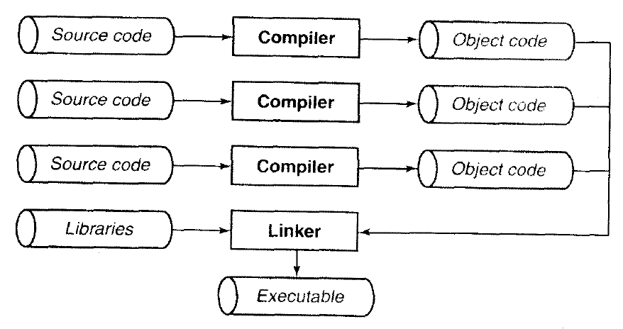

# C和指针

## 第一章 快速开始

### 1.1 简介

#### 1.1.1 空白和注释

- 想要从逻辑上删除一段代码，更好的指令是使用#if指令，这是一种更为安全的方法，预处理指令功能很强大

  ```c
  #if 0
  statement
  #endif
  ```

#### 1.1.3 main函数

- 在循环中表达式结果为0，跳过，非0，执行
- 在c语言中，存在一项约定，字符串就是以NULL结尾的字符，字符串常量如就是在源程序中用括号括起来的字符串，如"hello"，占用6个字节
- exit中的数值会传递给操作系统，EXIT_SUCCESS表示成功执行

#### 1.1.4 语句细节

- scanf对输入值进行转换时，它只读取有用的值，剩下的字符还停留在缓冲区内，如果想要清楚当前行，可以这样做：

  ```c
  while ((ch = getchar()) != EOF && ch != '\n')
  	;
  ```

- 为什么getchar()函数返回一个整数

  - 主要是为了兼容EOF，这时一个整型值，位数比字符类型要多，所以接受字符的ch要足够大，足以容纳EOF

### 1.6 编程提示的总结

- 在#include中放置函数原型
- 始终进行检查，保证数组不越界

## 第二章 基本概念

### 2.1 环境

- 在ANSI C的实现中提到了两种环境，第一种是翻译环境，即源代码被翻译为可执行代码，第二种是执行环境，用于执行实际代码
  - 标准明确说明，这两种环境不必位于同一台机器上，例如交叉编译器就可以做到这个
- 源代码转化为可执行文件主要是由翻译和链接
  - 组成程序的每个源文件通过翻译过程转换为目标代码
  - 链接器将每个目标代码捆绑到一起，形成单一而完整的可执行程序，当然链接的时候也会链接c标准库或程序员个人的程序库（编译时使用-lname选项）

#### 2.1.1 翻译

- 翻译过程也由几个步骤组成
  - 预处理，就是预处理器在源代码上进行一些文本操作，比如，用实际值替换#define，将#include引入的头文件进行文本替换，用空格替换注释
  - 编译，这个阶段是产生绝大多数警告和错误的地方，然后就产生目标代码，如果加入优化选项，则优化器会对目标代码进一步进行优化，只不过这需要额外的时间，所以在所有程序调试完毕并正式发布产品前不进行这个过程
- 翻译过程图：

- 编译并链接，在绝大多数unix操作系统中，c编译器被称为cc
  - 编译并链接一个c程序：cc program.c，这条命令中间会产生program.o，链接完成之后会被删除，最终产生a.out可执行文件
  - 编译并链接几个c文件：cc main.c sort.c lookup.c，当源文件超过一个时，产生的目标文件不会被删除，这允许当程序进行修改后，只对那些改动后的文件重新编译
  - 编译一个c文件，并将已有的目标文件链接到一起：cc main.o sort.o lookup.c
  - 编译一个文件，只产生目标文件：cc -c main.c
  - 编译几个文件，产生几个目标文件：cc -c main.c sort.c lookup.c
  - 链接几个目标文件，cc main.o sort.o lookup.o
  - 以上几个可以产生可执行文件的命令都可以加入-o name这个选项
  - 链接器在缺省状态下会在标准c中查找，如果要使用自定义程序库，应该使用-lname选项，注意这个选项应该出现在命令行的最后
- 执行
  - 首先，程序必须载入内存中，在宿主环境中（也就是具有操作系统的环境），这个任务由操作系统完成，此时，那些不是存储在堆栈中的尚未初始化的变量将在这个时候获取初始值，在独立环境中，程序的载入必须手动完成，也可以把可执行代码置入ROM中完成
  - 然后，在宿主环境中，通常会有一个小型的启动程序和程序链接到一起，负责处理一系列日常事务，如收集命令行参数，接着调用main函数，程序便开始执行，运行时使用一个堆栈，用于存储函数的局部变量和返回地址，当然，程序运行时也占用静态内存，存储在静态内存中的值在整个执行过程中一直保留着值。
  - 最后一个阶段是终止，有些执行环境允许程序返回一个代码，提示任务为什么终止运行，在宿主环境中，启动程序再次取得控制权，并可能执行各种日常事务，如关闭程序未关闭的文件
- 转义字符
  - \ddd，每个d代表八进制数，整个字符代表ddd所表示的八进制数对应的字符
  - \xddd，每个d代表十六进制数

#### 2.2.5 程序的形式

- 每个函数必须完整的出现在同一个源文件中
- 一个源文件应该包含一组相关的函数

## 第三章 数据

- 程序本身是对数据进行操作，本章重点描述变量的三个属性，作用域，链接属性和存储类型，这三个属性决定了变量的可视性（在什么地方可以使用）和生命周期（它的值将保持多久）

### 3.1 基本数据类型

- 在C语言中，仅有四种基本数据类型，整形，浮点型，指针和聚合类型（如数组和结构等），其他所有类型都是由这四种基本类型派生而来

#### 3.1.1 整形

- 整形家族包括字符，短整型，整形和长整型，它们都分为有符号和无符号
- 整形大小之间的规则：
  - 长整型>=整形，整形>=短整型，所以长整型并不一定比短整型长
  - ANSI C加入了一个规范，说明了各种整形的最小允许范围，如short int至少16位，long int至少32位，至于缺省的int是多少位，取决于编译器，通常选择这个机器最为高效的位数
- 整形字面量（常量）
  - 枚举，枚举中的符号名被当作整形常量处理，声明为枚举类型的变量实际上是整数类型，这意味着可以将枚举的符号名赋给任何整数变量，也可以将整数赋给枚举类型的变量，但是不鼓励这样使用，会削弱枚举本身的含义

#### 3.1.2 浮点类型

- 浮点数家族包括float，double，long double类型，长度范围long double>=double>=float
- 缺省都是double类型的，加上L代表long double，加上F代表float

#### 3.1.3 指针

- 指针常量，因为程序员无法事先知道特定的变量存储在哪个位置，因此，把指针常量表达为数值字面量的形式毫无意义，所以c语言内部没有有效的定义这个概念
- 字符串常量，C语言中没有字符串这个概念，字符串是以null结尾的字符数组，字符串常量的书写方式是""，空的字符串常量也至少包含一个null，同时，ANSI规定对字符串常量修改，其结果是未定义的，大多数编译器的实现方式将多个相同的字符串常量存储在同一位置，并且不可改变。如果需要改变字符串，请存储在数组中
  - 当一个字符串常量出现在一个表达式中时，表达式所使用的值是这个字符串常量的地址，而不是字符串常量本身
  - 因此，字符串常量不能赋给一个字符串数组，因为字符串常量的直接值是一个指针，而不是字符串本身
  - 不能直接赋值不方便的话，C语言中提供了一系列对字符串操作的函数

### 3.2 基本声明

- 变量声明的基本形式是：说明符（一个或多个）    声明表达式列表
- 说明符可以用于描述变量的基本类型，也可以该表标识符的默认存储类型和作用域

#### 3.2.3 声明指针

- int* a，这样让*号靠近int貌似更形象，但这并不是一个好的技巧，如要声明三个指针时，必须这样做int *a, \*b, *c

### 3.3 typedef

- 这种机制允许为各种数据类型定义新名字，如typedef int* ptr_to_int，ptr_to_int a, b, c
- 使用typedef而不是#define定义新类型，原因在于后者无法解决指针类型

### 3.4 常量

- 使用const声明常量，除了不允许修改值之外，其余和变量没有区别，但是如何让它拥有值呢，第一中方式是声明时直接初始化，第二种方式是声明为const的形参在函数调用时自动得到实参的值
- 而当设计指针变量时，const就更加有趣
  - int const *p是一个指向整形常量的指针，可以修改指针的值，但无法修改整形的值
  - int *const p则相反
  - 如果想要两者都不能修改，则使用int const *const p
- #define是另一种创建名字常量的机制，在一些情况下使用#define要比const好，因为只要允许字面值常量的地方都允许前者，比如声明数组的长度

### 3.5 作用域

- 编译器可以确认四种不同类型的作用域，文件作用域，函数作用域，代码块作用域和原型作用域
  - 文件作用域，从声明之处到文件末尾
  - 原型作用域只适用于函数原型中的参数名

### 3.6 链接属性

- 链接属性一共有三种，external，internal，none
  - 链接属性为none的总是被当作单独的个体，一般是局部变量
  - 具有文件作用域的变量或函数默认为external
  - 默认external的变量或函数加上static之后变成external，可以阻止被其他源文件使用
  - 注意，static只对默认为external的变量起效，假如在一个局部变量前加上static，效果完全不一样

### 3.7 存储类型

- 变量的缺省存储类型取决于它的声明位置
  - 在任何代码块之外声明的变量属于静态变量，在程序运行之前创建，整个执行期间始终存在
  - 在代码块中声明的变量属于自动变量，程序执行到声明自动变量的代码时创建，离开该代码块时，销毁，auto就是用来修饰自动变量的，但它很少使用，因为在代码块中声明的变量默认就是自动
  - 对于自动变量，如果加上static，则会变成静态变量，但是修改了存储类型并不代表修改了作用域，其代码块作用域仍然不会改变
  - 关键字register也可用来修饰自动变量，它建议编译器将变量放在寄存器中以加快效率，但是编译器并不一定采纳这个建议
- 初始化
  - 静态变量在编译之后就已经完成了初始化，因此运行时不会再执行静态变量的初始化动作
  - 自动变量在运行时才会得到初始化，如果不初始化，将是一个垃圾值

### 3.8 static关键字

- 在不同的上下下文环境中，static有着不同的意义
  - 当用于代码块之外的变量声明或函数定义时，static用于改变链接属性为internal，只能在源文件内部访问
  - 当用于代码块之内的变量声明时，改变了变量的存储类型，由自动改为静态，其声明周期也发生了变化

### 3.10 总结

- 具有external链接属性的实体在其他语言的术语中被称为全局实体，所有函数均可以访问它
- 具有external链接属性的实体总是具有静态类型存储
- 使用全局变量时，除了在具体的定义位置之外，其他的使用位置都必须用external关键字

## 第四章 语句

### 4.1 空语句

- 最简单的就是空语句，只包含一个分号

### 4.2 表达式语句

- c中不存在专门的赋值语句，所以在表达式后面加上一个分号构成表达式语句

- 常见的表达式语句类型：

  ```c
  x = y + 3;
  ch = getchar();
  y + 3;
  getchar();
  printf("hello");
  a++;
  ```

### 4.3 代码块

- 允许只出现一条语句的地方使用多条语句：

  ```c
  {
  	declarations
  	statements
  }
  ```

### 4.4 if语句

- c不具备布尔类型，在if的判断中使用整形代替，且statement可以用代码块代替：

  ```
  if (expression)
  	statement
  else
  	statement
  ```

### 4.5 while语句

- 同样，statement可以用代码块代替：

  ```
  while (expression)
  	statement
  ```

#### 4.5.1 break和continue语句

### 4.6 for语句

- 结构：

  ```
  for (expression1; expression2; expression3)
  	statement
  ```

### 4.7 do语句

## 第五章 操作符和表达式

## 第六章 指针

### 6.12 示例

- 计算字符串长度

  ```
  #include <stdlib.h>
  size_t strlen(char *string) {
  	int length = 0;
  	while (*string++) {
  		length++;
  	}
  	return length;
  }
  // 先计算string++，再计算*string
  ```

### 6.13 指针运算

#### 6.13.1 指针的算术运算

- 指针的算术运算只包括两种

  - 指针+-整数

    ```c
    #define N_VALUES
    float values[N_VALUES];
    float *vp;
    for(vp = &values[0]; vp < &values[N_VALUES];)
    	*vp++ = 0;
    ```

  - 指针-指针，算出差值

    - 只有在同一数组中两个指针相减才有意义，不同数组中的指针相减结果是未定义的，因为两个指针的相对位置并不明确

#### 6.13.2 指针的关系运算

- 对指针的关系运算有：< > <= >= == !=

  ```c
  for(vp = &values[N_VALUES]; vp > &values[0];)
  	*--vp = 0;
  ```

### 6.14 总结

- 除了NULL指针之外，再也没有其他指针常量，在极少数情况需要使用指针常量的话，将整数强制转换为指针类型
- 指针运算只有作用于数组中，结果才是可预测的，当数组指向数组values[N_VALUES]时，指针的算术运算和关系运算仍然有效，但当数组指向values[-1]时，关于指针的运算不保证有效，因编译器而异，所以编写循环时应注意

## 第七章 函数

### 7.2 函数声明

- 在编译时需要检查函数调用的合法性，那么如何进行检查呢，有两种方式
  - 将被调用的函数写在调用函数前面
  - 引入函数原型，将函数原型写在源文件的最上方

#### 7.2.1 原型

- 将函数原型写入头文件中，并在其他源文件中使用#<include>引用显然更好
  - include之后函数原型具有文件作用域，作用于整个文件
  - 函数原型只需要书写一次，减少错误的可能
  - 如果对函数原型进行修改，只需要重新编译包含该头文件的所有源文件即可
- 如果一个函数没有任何参数，ANSI规定这样写int f(void)
- 注意，对于一些没有函数原型的调用，传递给函数的实参将进行缺省参数提升，char和short提升为int，float提升为double，这有可能会引发一些问题，所以在使用函数时一定要注意声明函数原型

### 7.4 ADT和黑盒

- c可以用来设计抽象数据类型，要遵循一下几点规范
  - 宏定义和函数声明放在头文件中
  - 源文件中放函数实现，数据或者私有函数使用static修饰以屏蔽外界访问

## 第八章 数组

### 8.1 一维数组

#### 8.1.1 数组名

- 在使用数组名的**表达式中**，数组名被认为是一个指针常量，类型是”指向int的指针“

- 但数组具有一些和指针完全不同的特征，如数组具有确定数量的元素，而指针只是一个标量值，只有在表达式中使用时，编译器才会为它产生一个指针常量

- 在表达式中是指针常量，而不是指针变量

- 只有在两种场合下，数组名不用指针常量表示

  - 作为sizeof操作数时，返回整个数组长度，而不是指针常量的长度

  - 作为&操作数时，产生一个指向数组的指针，相当于&a[0]，而不是一个指向某个指针常量值的指针

    ```c
    int a[10];
    int b[10];
    int *c;
    c = &a[0]; //相当于c = a
    b = a; // 非法
    a = c; // 非法
    ```

#### 8.1.3 指针与下标

- 指针表达式与下标表达式通用，但下标表达市更容易理解，特别是在多维数组中，所以在可读性方面，下标有着一定的优势，但在另一方面，这个选择可能会影响运行时效率

  - 以下这段代码，使用表达式效率更高，原因是每次循环为指针做的1*4在编译后就已经确定，相当于运行时直接为指针+4，而使用下标表达式在每次寻址时都需要重新为每个循环计数计算乘法

    ```c
    int array[10], a;
    for(a = 0; a < 10; a++) {
    	array[a] = 0;
    }
    
    int array[10], ap;
    for(ap = array; ap < &array[10]; ap++) {
    	*ap = 0;
    }
    ```

  - 而下面的代码段两种使用方式完全一样

    ```c
    a = get_value();
    array[0] = 0;
    
    a = get_value();
    *(array + a) = 0;
    ```

#### 8.1.5 数组和指针

- 数组和指针并不是相等的
  - 声明一个数组时，编译器先为数组本身保留空间，再创建数组名，它的值是一个常量，指向数组首元素
  - 声明指针变量时，只会为变量本身保留空间，并不会指向任何东西

#### 8.1.11 字符数组的初始化

``` c
char message[] = {'h', 'e', 'l'};
char message[] = "hel";//初始化数组
char *message = "hel";//初始化指针
```

#### 8.2.4 指向数组的指针

``` c
int (*p)[10];
```

#### 8.2.5 作为函数参数的多维数组

```c
int matrix[3][10];
func(int (*m)[10]);
func(int m[][10]);
//两种都行，重要的是声明除了第一维度的维数，类似的，三维数组应该将后两维也传参，第一维即使传参，也被忽略
//对第一维来说，既可以写成数组的形式，也可以写成下标的形式，如*m或m[]，但之后的维度必须下标格式，如**m不合法
```

#### 8.2.7 数组长度自动计算

- 在多维数组中，只有第一维才能根据初始化列表缺省的提供，剩余的几维必须写出(理论上，剩余的几维也可以通过推断得出，但编译器不想这么做)：

  ```c
  int two_dim[][5] = {
  	{2, 2};
  	{1};
  	{3, 3, 3, 3}
  };
  
  ```

### 8.3 指针数组

```
int *p[10];
```

