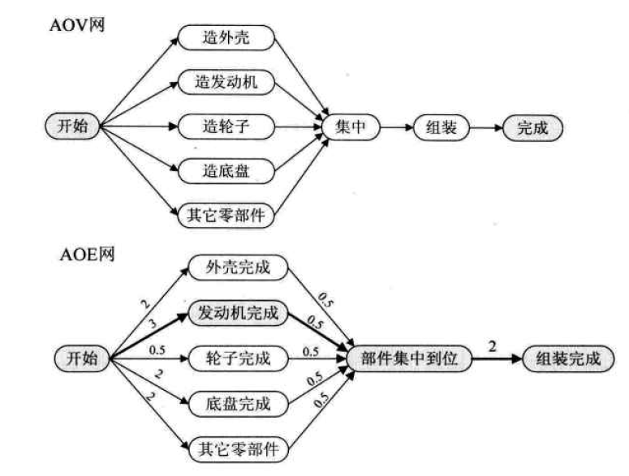

## 第1章 数据结构绪论

### 1.5 逻辑结构与物理结构

#### 1.5.1 逻辑结构

- 逻辑结构是指数据对象中数据元素之间的关系
  - 集合结构：除了同属一个集合外，没有其他关系，“平等的”
  - 线性结构：数据元素之间是一对一的关系
  - 树形结构：一对多关系
  - 图形结构：多对多关系

#### 1.5.2 物理结构

- 物理结构是指数据的逻辑结构在计算机中的存储形式
  - 顺序存储
  - 链式存储

## 第2章 算法

### 2.5 算法的特性

- 算法具有五个基本特性
  - 输入
  - 输出
  - 有穷性
  - 确定性
  - 可行性

## 第3章 线性表

### 3.2 线性表的定义

- 多个元素的有限序列。元素之间有顺序，每个元素有且只有一个前驱一个后继

## 第5章 串

### 5.6 朴素的模式匹配算法

- 算法复杂度O(mn)，效率低下

## 第6章 树

#### 6.5.2 特殊二叉树

- 斜树，所有节点都只有左子树叫左斜树，否则叫右斜树，这样的结构和线性表差不多
- 满二叉树，每一层都是满的
- 完全二叉树，除了最后一层可以不满，其他层都是满的，且最后一层的叶子节点必须从左至右排列

### 6.6 二叉树的性质

- 在第i层上，最多有2^(i-1)个节点
- 深度为k的二叉树最多有2^k-1个节点
- 对任意一颗二叉树，度为2的节点数为n2，度为0的节点数为n0，则n0=n2+1

#### 6.10.2 线索二叉树

- 在一颗普通的二叉树中，很多left和right指针都是空，存在着空间的浪费
- 因此，在线索二叉树中，原本为空的left指针指向其前驱节点，原本为空的right指针指向其后继节点
- 为了标记left指针指向其左孩子还是前驱节点，需要一个变量ltag来标记，0代表左孩子，1代表前驱节点，同时，right指针也需要rtag来标记
- 因此，在线索二叉树中应该提供一个线索化的函数，该函数将原二叉树按照某种遍历次序（一般是中序遍历）线索化

### 6.12 哈夫曼树

- 哈夫曼树用于压缩中，构建哈夫曼树时，权重大的节点离根节点更近，反之权重小的更远
- 通过堆来构建哈夫曼树
- 解压缩时，规定哈夫曼树从根节点开始，向左为0，向右为1，且所有的有效节点都在叶子节点上，因此不可能出现某一个匹配的数组是另一个的前缀的情况

## 第7章 图

### 7.2 图定义

- 两个顶点间不存在两条相同的边，且不存在顶点自身到自身的边，这样的图称为简单图，我们的研究对象就是简单图
- 无向完全图：每个点与其他顶点都有边，边的数量为n*(n-1)/2
- 有向完全图：每个点都有到其他顶点的边，边的数量为n*(n-1)
- 有很少边的图被称为稀疏图，反之为稠密图
- 边带有权重的图被称为网（可以是有向图也可以是无向图）

### 7.4 图的存储结构

- 邻接矩阵，用一个一维数组存储顶点，二维数组存储边（宽和高都为顶点的个数）
  - 可以存无向图：此时矩阵是对称的，两顶点联通，则graph\[i]\[j]=1，否则为0，对角线肯定为0
  - 可以存有向图：跟无向图类似，但不要求矩阵对称，对角线也是0
  - 可以存网：如果是有向图，则跟有向图类似，但具体存的是路径的长度，不一定对称，一般是（一个具体值，一个无穷大）；如果是无向图，则对称。且无论是有向图还是无向图，对角线肯定都为0，且两顶点不联通的话就是无穷大
- 邻接表，如果图相当稀疏的话（极端情况下没有边），那么用来表示边的关系的邻接矩阵完全浪费空间。因为邻接矩阵本身是数组，这就避免不了浪费空间的情况，因此邻接表采用数组与链表相结合的方式来表示图，邻接表则在数组中存储图的顶点链表，每一个链表代表着当前节点能到达的直接节点
  - 可以存储无向图
  - 可以存储有向图
  - 可以存储网

- 十字链表，对于邻接表而言，十分容易计算一个节点的出度，但如果要计算入度的话就要遍历整张表，因此，可以同时维护一张逆邻接表来计算入度，这样，通过维护两张表可以计算图的出度和入度。我们试图将两张表合成一张表，试图使用十字链表的方式来存储图。其实，十字交叉链正是存储稀疏矩阵常用的方式之一（另一种是三元组法，参考：https://mp.weixin.qq.com/s/N44wFJNWgxbWtw0LN6eOxA）。同时，在有向图的应用中，十字链表是非常好的数据结构模型。注意，因为有入度和出度的概念，十字链表只适用于有向图和有向网

  - 首先介绍十字链表中链表节点的数据结构（以有向图为例），节点中分为四个域，第二个域和第四个域用于表示出度相关信息，比如V1那一行的第一个节点，意思是V0是V1的第一个出度节点，同时下一个出度节点执行V2
  - 然后介绍如何构造十字链表，首先按照行和出度来构造一个普通的邻接表，此时将第一个域置为和当前行节点相同的节点，第三个域暂定为空。然后按照列和出度修改第三个域，此时直接修改指向即可，因为第一个域已经记录了指向的节点信息，如下图

  - 上图所示的需要两个指针数组来记录和列的初始指针，可以将其合并到同一个数组中去，如下图

- 邻接多重表，前面提到，十字链表是有向图的优化，解决了可以计算出度和入度的问题，但并不适用于无向图。且如果使用邻接表来直接表示无向图，那么如果有n条边，则整个链表上将会有2*n个节点，如果要删除的话，需要至少操作两次。因此，提出了邻接多重表来优化无向图，注意，这个只适用于无向图
  - 邻接多重表与十字链表类似，其节点都是边，在邻接多重表当中，共有n个边节点，其构造如下图所示，参考：https://www.cnblogs.com/wkfvawl/p/9985083.html

- 边集数组，这个和邻接矩阵，邻接表一样属于通用的图存储结构，适用于有向图，无向图和网
  - 其定义比较简单，如下图所示，如果要计算一个顶点的入度或者出度，肯定要遍历整张边的表，因此，很明显，这种表示方法并不适合对顶点进行的操作，而更加适合于对边直接操作，因此Kruskal算法就使用这种数据结构

### 7.5 图的遍历

- 深度优先，使用递归即可，注意visited数组一定要最先设置
- 广度优先，使用队列，注意在入队列之前就进行访问和设置visited数组
- 对比广度和深度搜索，深度搜索更适用于找到目标即可的问题下，而广度搜索更适合于在一定范围内找最优解

### 7.6 最小生成树

- kruskal算法，用到了并查集，具体过程为：首先将边按照权值从小到大排列，以此取出边，通过并查集如果发现该边的两个顶点已经联通，则放弃改变，否则选中该边，联通该两顶点（也就是在并查集中将两顶点union）
- prim算法，通过顶点来生成最小生成树，首先选中一个顶点，同时标记该顶点已经访问，将该顶点中所有边放入优先权队列，然后选中一个最小的边，通过该边选出第二个顶点，然后将与第二个顶点相连的其他边放入优先权队列，并标记第二个顶点为以访问，以此类推，直至最后一个顶点；这种算法有点像DFS
- kruskal针对边集，更适合于稀疏图；prim针对点集，更适合于稠密图

### 7.7 最短路径

- 参考：https://www.cnblogs.com/thousfeet/p/9229395.html

- 深搜和广搜，用来计算固定起始点的鼓励

- 迪杰特斯拉Dijkstra算法，用来计算单源最短路径，也就是给定一个顶点，可以计算出与其他n-1个顶点的最短距离
  - 思想是用到了两个集合，P用来存储已知最短距离的点，初始值仅包含V0点，也就是自身。Q用来存未知的点。实际上并没有真的使用两个集合，而是通过一个数组book[n]来控制，如果为1，就在P里面，反之在Q里面。同时有一个dist数组，记录着与V0的距离，dist数组直接读取邻接矩阵进行初始化
  - 过程是，先从Q中取出一个距离V0最短的点，也就是dist值最小的点dist[i]，同时将i记录到P中，也就是book[i]=1。然后，根据dist[i]来更新其他在Q中的dist，具体方法是，如果V0与Vj的直接距离大于V0到Vi+Vi到Vj的距离，即dist[j]>dist[i]+weight\[i][j]，更新dist[j] = dist[i]+weight\[i][j]
  - 以上叙述的过程是以此循环做的过程，因为Q中有n-1个元素，所以外层循环进行n-1次即可。
  - 算法复杂度n^2
- 弗洛伊德Floyd算法，可以计算图中任意两点的最短路径
  - 运用到的思想是，对当前权重weight\[i][j]，如果发现通过点V0中转的话距离更小，也就是说weight\[i][j]<weight\[i][0]+weight\[0][j]，那么weight\[i][j]=weight\[i][0]+weight\[0][j]
  - 既然可以使用V0来中转，那么当然也可以使用V1-V(n-1)都中转一次，即可将一整张weight表进行更新
  - 算法复杂度n^3

### 7.8 拓扑排序

- 针对有向无环图，依次删除入读为0的节点，并修改与之直接相连的节点，将入度减一
- 也被称为AOV（Activity On Vertex Network）网，节点表示活动

### 7.9 关键路径

- 拓扑排序主要解决的是一个工程能否完成，而关键路径解决的是一个工程完成的最短所需时间问题
- 此时，针对的有向无环图被称为AOE（Activity On Edge Network）网，边表示活动，边的权值表示活动时间，顶点表示状态。注意，不同于AOV，AOE的初始节点和结束节点都只能有一个，分别表示确定的初始状态和最终状态
- AOV网通过边表示活动之间的制约关系，而AOE网则用边表示具体活动和持续时间

- AOE网中，从开始点到结束点具有最大路径长度的路径被称为关键路径，关键路径上的所有活动被称为关键活动，上图中，“发动机完成”所在的路径就是关键路径，因此如果想要整体减少项目所需时间，必须从关键路径入手，比如去改进轮子制造技术是没用的
- 关键路径的计算方法（参考：https://blog.csdn.net/wang379275614/article/details/13990163）：
  - 首先引入四张表
    - 对于每个顶点，每个顶点表示一个状态，对于顶点集合来说，有两张表，分别是每个状态的最早发生时间和每个状态的最晚发生时间。最早发生时间，从前往后计算，初始值已知V1为0，然后针对某个顶点，其最早发生时间等于Max（某一个前驱的最早发生时间+当前边的权重）；最早发生时间表计算之后，开始计算最晚发生时间表，最晚发生时间的意义是，当前状态可以发生的最晚时间，以至于不耽误整体工期，计算方法是初始值Vn已经通过最早发生时间计算出来，则某个顶点的最晚发生时间为Min（某一个后继的最晚发生时间-当前边的权重），通过这样的方式，将关于点的两张表计算了出来
    - 对于每条边，每条表表示一个动作，对于边的集合来说，也有两张表，分别表示当前活动的最早开始时间和最晚开始时间。最早开始时间通过顶点的最早发生时间表来计算，首先拿出当前边的开始节点，则当前边的最早开始时间就是开始节点的最早发生时间；对于最晚开始时间来说，首先拿出当前边的结束节点，那么当前边的最晚开始时间就是结束节点的最晚发生时间减去边的权重
    - 至此，针对边的两张表也计算了出来，那么对比两张表，拿出值对应相等的边，则这些边就是关键路径上的活动，注意关键路径可能不止一条

## 第8章 查找

### 8.3 顺序表查找

- 直接在表中顺序查找

### 8.4 有序表查找

#### 8.4.1 折半查找

- 也就是二分搜索，需要表中数据元素具有顺序

#### 8.4.2 插值查找

- 对于二分查找来说，最核心的变换公式是mid=low+1/2*(high-low)，但是假如有1000个分布均匀的数，且范围为0~1000，那么为了查找5，每次使用1/2就不合适了，因此将该因此修改为(key-arr[low])/(arr[high]-arr[low])，可以提高效率，这种改进的二分查找被称为插值查找
- 对于分布均匀的有序表而言，这种方式可以提高效率，但是如果不均匀，效果不大。但无论如何，算法复杂度仍是logN

### 8.5 索引查找

- 索引查找一般用于外查找，将需要查找的内容建立索引，对索引本身保存着关键字以及当前记录的指针，因此查找索引表即可
- 索引可以分为线性索引，属性索引和多级索引，在这一章中，我们只讨论线性索引

#### 8.5.1 线性索引

- 稠密索引，对每一个记录都建立一个索引项放到线性表中，然后通过二分或插值查找对索引表进行搜索，显然，如果数据量过大时，该索引表也会十分大，降低效率

- 分块索引，跟线性索引相比，一个索引项指向一块记录范围，显然，这要求存储相关记录时按照一定方式进行存储

- 倒排索引，这个被广泛用于搜索引擎搜索网页。与一篇文章对应一系列关键词相反，倒排索引则将一个关键词与一系列文章相对应。由于关键词有序，所以可以迅速的找到对应的文章。但由于文章的数量不是固定的，其维护需要耗费一些成本

### 8.6 二叉排序树

- 左子树<根节点<右子树，插入时直接插到叶子节点上

### 8.7 二叉平衡树

- 平衡的二叉排序树，左右子树高度差不超过1

### 8.8 多路查找树

- 当在磁盘中进行查找时，要尽可能较少访问磁盘的次数，因此我们需要新的数据结构来组织磁盘上的数据
- 多路查找树，其每一个结点的孩子数可以多于两个，每一个结点处也可存储多个元素
- 这里，我们讲解4中特殊形式：2-3树，2-3-4树，B树，B+树

#### 8.8.1 2-3树

- 每一个结点要么是2结点，要么是3结点，2结点中要么有两个孩子，要么没有；3结点中要么有3个孩子，要么没有；且所有叶子结点都在同一层之上；正是因为某一个结点既可以是2结点，也可以是3结点，才会通过调节使得所有的叶子结点都在同一层上，达到一种平衡的效果
- 关于2-3树的插入，参考：https://blog.csdn.net/yang_yulei/article/details/26066409

#### 8.8.2 2-3-4树

- 和2-3树类似，同样，每个结点要不然是满的，要不然没有孩子，并且所有叶子结点在同一层，也满足平衡性

- 整体的插入过程与2-3树博客上的插入过程类似

#### 8.8.3 B树

- 是一种平衡的多路查找树，2-3树和2-3-4树都是B树的特例
- 非叶子结点中也存数据

- 插入过程参考：https://blog.csdn.net/yang_yulei/article/details/26104921

#### 8.8.4 B+树

- 跟B树类似，但把所有的数据放到了叶子结点中，非叶子结点不存储数据，只存储关键字和指针。因此，B+树不是之前严格定义的树，B树种中结点既存储指针又存储数据，因此不同的结点之间不会出现冗余的关键词，而B+树所有的非叶子结点只是用作索引，不同的结点中出现相同的关键词
- 因为B+树非叶子结点中不存储数据，所以在固定的叶子结点大小（磁盘块大小）中可以存储更到的叶子结点指针，B+树的层数也会有效的降低
- 且B+树所有的叶子节点被链表连接了起来（每一个叶子节点都保存了下一个叶子节点的指针），所以非常方便整棵树的遍历（遍历链表），也就是扫表，相比之下，B树需要中序遍历整棵树
- 同时，因为有叶子节点链表的存在，范围查找也十分方便

### 8.9 散列表

- 散列的思想是：存储位置=f(key)，即通过散列函数对key进行处理后，即可得到该记录的存储位置

- 散列函数的构造方法：
  - 直接定址法：fx=ax+b，直接取一个线性函数
  - 数字分析法：通过观察关键词列表，提取出一些位
  - 平方取中法：平方之后取中间的几位数
  - 除留余数法：fx = x mod p p是小于等于散列表长度的一个值，一般是最接近长度的一个最大质数
- 处理冲突的方法：
  - 开放定址法，在数组内，发生冲突时，就找下一个，通常，找下一个的方法有三种
    - 线性探测法，直接找下一个，容易引发堆积（不是同义词也要争抢同一个位置），使得查找效率降低
    - 二次探测法，按照序列1^2, -1^2, 2^2, -2^2...，往两边寻找
    - 双散列法，使用一个散列函数来计算步长
    - 注意，使用开放地址法删除元素时不能真删，只能将对应数组置为false，否则影响这个元素后面元素的查找
  - 拉链法
    - Java map的实现
  - 再哈希法
    - 事先准备多个哈希函数，每当发生冲突，就换一个哈希函数，当然这也增加了计算时间
  - 公共溢出区法
    - 准备一个基本表和一个溢出表，当在基本表发生冲突时，将数据存入溢出表内，查找时，在基本表内使用hash函数定位，在溢出表内使用顺序查找

## 第9章 排序

#### 9.2.2 内排序和外排序

- 内排序是指在整个排序过程中，所有记录全部被放置到内存中
- 外排序是指，在整个排序过程中，由于排序的记录个数太多，不能同时放置在内存中，整个排序过程需要内外存之间多次交换数据才行

### 9.3 排序算法

- 主要讲7种排序算法，分为两大类
  - 冒泡排序，简单选择排序，直接插入排序属于简单排序算法
  - 希尔排序，堆排序，归并排序，快速排序属于改进算法
- 冒泡排序
  - 复杂度N^2
  - 稳定
- 简单选择排序
  - 维护成两部分，前半部分已排序，后半部分未排序，每次从后半部分选出一个最小的，和当前交换
  - 复杂度N^2
  - 稳定
- 直接插入排序
  - 维护成两部分，前半部分以排序，讲后半部分的第一个作为key值，找到key应该插入的地方，之后将一部分数据后移
  - 复杂度N^2
  - 如果本身有序，插入效率很高，因为不需要太多的数据移动过程
  - 稳定
- 希尔排序
  - 插入排序的优化，思想是：如果大部分数据是有序的，那么插入排序将会很快。因此，希尔排序的思想是使数据逐渐有序。过程是有一个增量，每次都在相距这个增量的数列上进行插入排序，每次循环减小增量，增量为0时，结束
  - 复杂度跟增量有关，参考：https://blog.csdn.net/qq_39207948/article/details/80006224
  - 不稳定，因为将整个数据分为几个数列单独排序，导致数列间可能无序
- 堆排序
  - 使用了堆这个数据结构，特点是根节点为最大值（最大堆）。过程是通过向上调整先建堆，然后将最大值放到最后面，最后面的值放到最前面，然后通过向下调整恢复堆
  - 复杂度 N*logN
  - 不稳定
  - 向上调整和向下调整都可以建堆
- 归并排序
  - 复杂度 N*logN，空间N
  - 稳定
- 快速排序
  - 