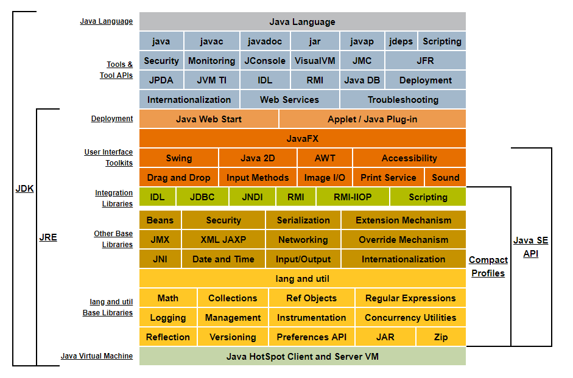
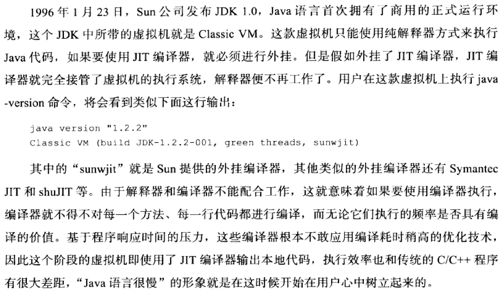
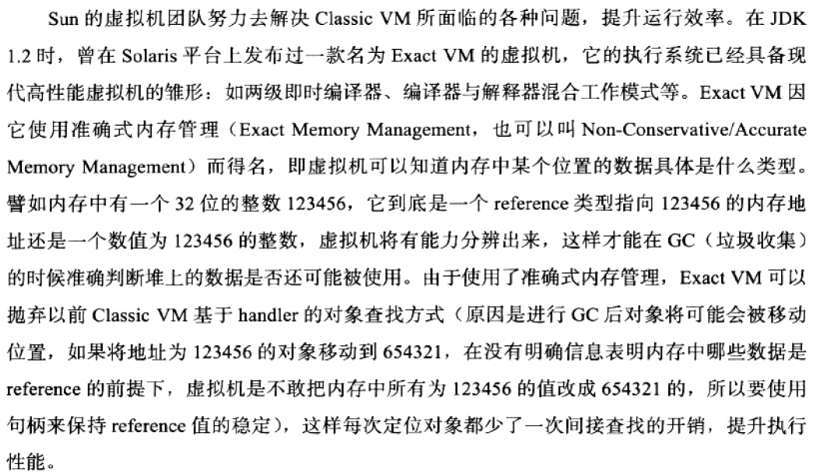

## 深入理解Java虚拟机第一章 走进Java

1. 由Sun公司官方定义的Java技术体系包括以下几个部分：
- Java程序设计语言
- 各种平台的Java虚拟机
- Class文件格式
- Java API类库
- 来自商业机构和开源社区的第三方Java类库

2. JDK(Java Development Kit)是支持Java程序开发的最小环境，一般包括Java程序设计语言，Java虚拟机和Java API类库，有些地方用JDK代指整个Java技术体系。另外Java API类库中的Java SE API子集和Java虚拟机这两部分统称为JRE(Java Runtime Enviroment)。下图是Java8技术体系：

3. Java技术体系按照业务领域也可以划分为4个平台：
- Java Card：支持一些Java小程序（Applets）运行在小内存设备上的平台
- Java ME（Micro Edition）：支持Java在移动终端（手机）上的平台，对Java API有所精简，这个版本以前称为J2ME
- Java SE（Standard Edition）：支持桌面级应用，提供了完整的API，以前称为J2SE
- Java EE（Enterprise Edition）：支持多层架构的企业应用，除了提供Java SE API外，还对其进行大量扩充，以前称为J2EE
> 为什么Java SE又称J2SE？原来J2SE全名为Java 2 Platform Standard Edition，是从Java1.2之后Java体系才分为ME,SE和EE，因此2代表Java1.2。不过这种叫法只在早期的Java版本存在。

4. Java虚拟机发展史：
- JDK1.0中所带的虚拟机就是Classic VM，是世界上第一款商用的Java虚拟机，只能以纯解释器方式来执行Java代码，与JIT编译器不能配合工作

- 在JDK1.2时Solaris平台上出现的Exact VM已经具备现代高性能虚拟机的雏形，但是在其还未在其他平台上出现时，就被更先进的HotSpot VM取代

- 从Java1.3之后，HotSpot虚拟机成为JDK的默认虚拟机
