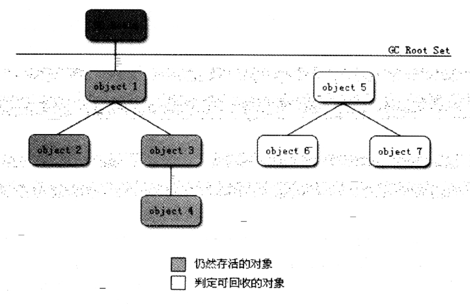
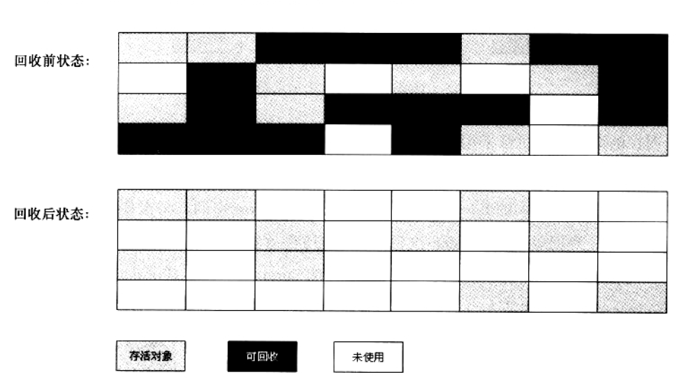
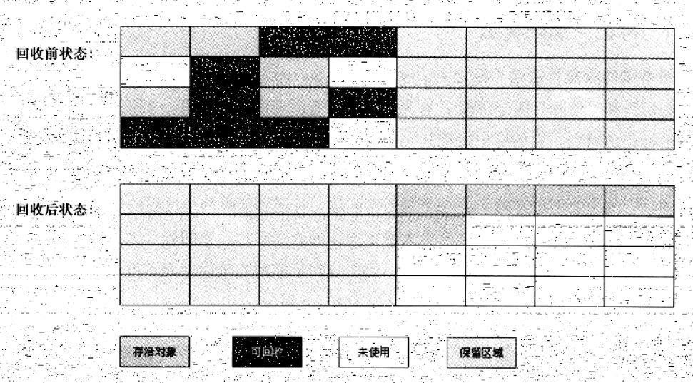
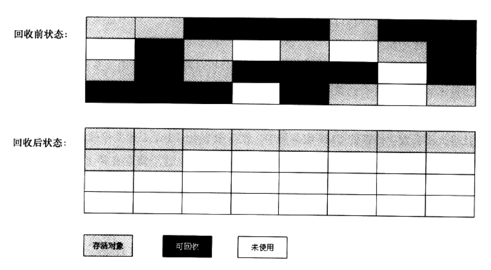
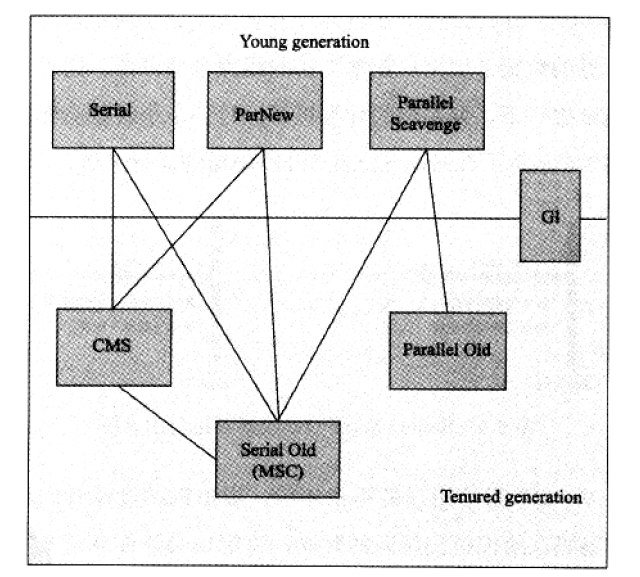
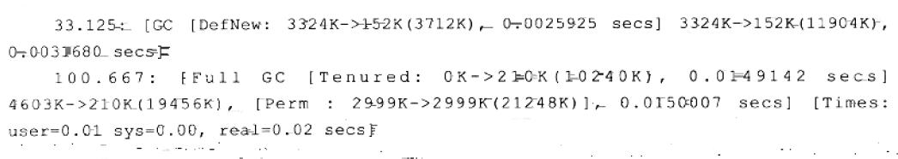

## 深入理解Java虚拟机第三章 垃圾收集器和内存分配策略

1. **垃圾回收针对的数据区域**
- 程序计数器、虚拟机栈和本地方法栈随线程而生，随线程而灭在方法结束或是线程结束时，内存就自然跟随着回收了，是垃圾回收机制不关心的区域。
- Java堆和方法区不一样，只有在运行时期才能知道会创建哪些对象，这部分内存的分配和回收都是动态的，垃圾收集器关注的是这部分内存。

2. **判断对象已死**
- 引用计数算法。主流的Java虚拟机并没有这个算法来管理内存，因为最主要的原因是它很难解决对象相互之间引用的问题。
- 可达性分析算法。这个算法的基本思路是通过一系列称为GC Roots的对象作为起始点，从这些节点向下搜索，搜索所走过的路径称为引用链，当一个对象到GC Roots没有任何引用链相连的话，则证明这个对象不可用。（下图是图论分析）

Java语言中，可以作为GC Roots的对象包括以下几种：虚拟机栈（栈帧中的本地变量表）中引用的对象、方法区中类静态属性引用的对象、方法区中常量引用的对象、本地方法栈中JNI（即一般说的Native方法）引用的对象。

3. **引用分类**
如果一个对象只被定义为被引用或者未被引用这两种状态太过于狭隘，无法描述一些“食之无味，弃之可惜”的对象。因此，从JDK1.2开始，引用类型进行了扩充。
- 强引用（Strong Reference）。程序之中大量存在的，类似`Object o = new Object();`的，只要强引用存在，对象永远不会被垃圾回收器回收。
- 软引用（Soft Reference）。用来描述一些有用但非必须的对象，在系统将要发生内存溢出之前，会将这些对象列入回收范围之中进行第二次回收。
- 弱引用（Weak Reference）。也用来描述非必须对象，强度比软引用还弱一些。被弱引用对象关联的对象只能存活到下一次垃圾回收之前。当垃圾回收器工作时，无论内存是否足够，弱引用关联的对象都会被回收。
- 虚引用（Phantom Reference）。最弱的一种引用，一个对象是否有虚引用存在，完全不会影响其生存时间，也无法使用虚引用来取得一个对象实例。设置虚引用的目的是为了在这个对象被系统回收时受到一个系统通知。

4. **两次标记和finalize()**
即使在可达性算法中不可达的对象，也并不是直接被回收的，它们暂时处于“缓刑”阶段。要真正宣告对象死亡，要至少经过两次标记阶段。
- 第一次标记。如果对象在可达性分析中发现没有与GC Roots相关联的引用链，则对象会被第一次标记。同时进行一次筛选，将有必要执行finalize()方法的对象筛选出来（筛选条件是finalize()方法被对象覆盖，且从未执行过）。
- 第二次标记。如果对象被筛选出来（即有必要执行finalize()方法），则这些对象将会被放置在一个叫做F-Queue的队列之中，并且稍后由虚拟机自动建立的一个低优先级的Finalizer线程去执行这个队列中所有的finalize()方法。这里的执行是指虚拟机会触发这个方法，但并不承诺等到这个方法运行结束，原因是防止一个对象的finalize()执行缓慢，甚至死循环的情况。如果在这个队列中的对象没有在finalize()函数运行时自救，那么没有自救的对象会进行第二次标记，经过两次标记的对象会被垃圾回收。
如果对象在finalize()方法中自救，那么在第二次标记中它就会被移出“即将回收对象”的集合。如把自己（this关键字）赋值给某个类变量或者对象的成员变量，则可完成自救。
```java
/**
 * 此代码演示了两点：
 * 1. 对象可以在GC时自救
 * 2. 自救的机会只有一次，因为对象的finalize()方法最多只会被调用一次
 * @author Yufail Copy from book
 * @author 1320018234@qq.com
 *
 */
public class Test {

    public static Test SAVE_HOOK = null;
    @Override
    protected void finalize() throws Throwable{
        super.finalize();
        System.out.println("finalize() method executed!");
        SAVE_HOOK = this;
    }

    public static void main(String[] args) throws Throwable {
        SAVE_HOOK = new Test();
        //对象第一次自救
        SAVE_HOOK = null;
        System.gc();
        //因为finalize()方法优先级很低，所以暂停0.5秒等待它
        Thread.sleep(500);

        if(SAVE_HOOK != null){
            System.out.println("Yes, I am still alive.");
        }
        else {
            System.out.println("No, I am dead.");
        }

        //下面一段相同的代码，但是却自救失败
        SAVE_HOOK = null;
        System.gc();
        Thread.sleep(500);
        if(SAVE_HOOK != null){
            System.out.println("Yes, I am still alive.");
        }
        else {
            System.out.println("No, I am dead.");
        }
    }
}
//Output:
finalize() method executed!
Yes, I am still alive.
No, I am dead.
```
> 但是不建议使用finalize()函数，更不要把它和C++中的析构函数等同，这个函数的出现只是Java刚诞生时为了使C/C++程序要更容易接受它而做出的妥协。有些教材把它描述为适合做“关闭外部资源”之类的工作，但这完全是一种自我安慰，finalize()所做的工作，使用try-finally可以做的更好，因此，作者建议大家忘掉这个函数的存在。

5. **方法区的垃圾回收**
在方法区（HotSpot虚拟机中的永久代）进行垃圾回收“性价比”一般比较低，在堆中，尤其在新生代中，常规应用进行一次垃圾收集可以回收75%-90%的空间，而永久代的垃圾回收效率远低于此。
永久代垃圾回收主要包括两个内容：废弃常量和无用的类。
- 废弃常量的回收。与回收Java堆中对象的机制类似，以常量池中的字面量回收为例，假如一个字符串是“abc”，但没有任何一个String对象引用这个常量，也没有其他地方引用了这个字面量，这时就发生内存回收。常量池中的其他类、方法、字段的符号引用与此类似。
- 无用的类的回收。相比之下，判定一个无用的类条件会苛刻很多，需要同时满足3个条件：
①该类所有的实例都被回收
②加载该类的ClassLoader已经被回收
③该类对应的java.lang.Class对象没有在任何地方被引用，无法在任何地方通过反射访问该类的方法
虚拟机可以对满足上述3个条件的无用类进行回收，这里仅仅说的“可以”，而并不是像对象一样，不用了就必然会被回收。HotSpot虚拟机提供了一些参数来决定是否回收。

6. **垃圾收集算法**
- 标记-清除算法。首先标记出需要回收的对象，标记过程上文已介绍。
这种算法有两个主要的不足之处：一个是效率问题，标记和清除两个过程的效率都不高；另一个是空间问题，标记清除之后会产生大量的不连续的内存碎片，碎片过多可能会导致无法分配较大的内存对象而不得不提前触发另一次垃圾收集动作。

- 复制算法。将内存分为大小相等的两块，当其中一块用完了，就将还存活着的对象赋值到另一块内存上，然后把已使用过的一块内存一次清理掉，且复制到另一块时，按顺序分配内存即可，实现简单，运行高效。

现代的商业虚拟机都采用这种收集算法来回收新生代，IBM公司的专门研究表明，新生代中98%的对象都是“朝生夕死”的，所以不需要按照1:1来划分内存空间，而是将内存划分为一块较大的Eden空间和两块较小的Survivor空间，每次使用Eden和其中一块Survivor，当回收时，将这两块空间中存活的对象复制到另一块Survivor空间中，最后清理掉这两块空间。
HotSpot虚拟机默认Eden和Survivor的大小比例是8:1，也就是新生代中可用内存空间为整个新生代容量的90%，只有10%的内存会被浪费。当然，98%只是一般场景下的数据，当Survivor空间不够用时，需要依赖其他内存（老年代）来进行分配担保。
- 标记-整理算法
复制算法如果在对象存活率较高时就要进行较多的复制操作，效率将会降低，无法解决100%对象存活的极端条件，因此老年代一般不能直接使用这种算法。
标记整理算法过程与标记清除算法一样，但是后续步骤不是直接对可回收对象进行清理，而是让所有存活的对象都向一端移动，然后清理掉端边界以外的内存。

- 分代收集算法
当前商业虚拟机的垃圾收集都采用分代收集算法，一般把Java堆分成新生代和老年代，新生代采用复制算法，老年代采用标记-清除或标记-整理算法。

7. **枚举根节点**
进行可达性分析时需要枚举根节点，即找出所有的GC Roots。进行可达性分析的算法和数据结构对于高效率方面有着严格的要求，主要因为：
- 从内存中逐个检查十分耗时。可作为GC Roots的节点主要在全局性的引用（例如常量或类静态属性）与执行上下文（例如栈帧的本地变量表）中，现在很多应用进方法区就几百兆，因此逐个检查十分费时。
- GC停顿使得可达性分析运行的时间有着严格的限制。可达性分析必须在一个能确保一致性的快照中进行，这里的一致性是指整个分析期间整个系统停止运行，所有Java线程都必须停顿（Stop the world），即使是号称几乎不会发生停顿的CMS收集器中，枚举根节点也是必须要停顿的。
因此，综合以上两点，在HotSpot的实现中，一组称为OopMap的数据结构用于达到此目的。

8. **安全点和安全区域**
- 程序执行时并非所有的地方都能停下来开始GC，只有到安全点才能停顿。
需要考虑的一个问题是，如何让GC发生时让所有线程都跑到最近的安全点再停顿下来。有两种方式：抢先式中断和主动式中断。
- 安全区域。是指在一段代码片段之中，引用关系不会发生变化，在这个区域的任何地方开始GC都是安全的，可以把Safe Region看作是被扩展乐的Safe Point。

9. **垃圾回收器**
如果说收集算法是内存回收的方法论，那么垃圾回收器就是内存回收的具体实现。在这里讨论HotSpot中所使用的垃圾收集器，如图：

这7种作用于不同分代的收集器，如果两个收集器之间存在连线，则说明它们可以搭配使用，虚拟机所处的区域，则表示了他们属于新生代收集器还是老年代收集器。
在此，笔者不对各种收集器做详细的介绍，想要学习此方面内容，请参阅教材。（扫描下方二维码添加笔者微信验证信息csdn即可以获得教材电子版资源）


10. **理解GC日志**
每一种收集器的日志形式是有它们自身的实现决定的，换而言之，每个收集器的日志格式都可以不一样。但虚拟机设计者为了方便用户阅读，将各个收集器的日志维持了一定的共性，如下图：

- 最前面的数字33.125代表了GC发生的时间，是从虚拟机启动以来经过的秒数。
- GC和Full GC用于说明垃圾回收的停顿类型，而不是用来区分新生代GC和老年代GC的，如果是调用了System.gc()，就会显示Full GC(System)。
- DefNnew,Tenured,Perm说明发生的分区，不同的收集器词语不一样，但是可以看出分区
- 方括号内部的3324K->152K(3712K)的含义是“GC前该内存区域已使用容量->GC后该内存区域使用容量（该内存区域总容量）”，而方括号外部的“3324K->152K(11904K)”表示“GC前Java堆已使用容量->GC后Java堆已使用容量（Java堆总容量）”。
- 再往后，0.0025925secs表示该内存区域GC所占用的时间，单位是秒。有的收集器会给出更具体的时间数据，如[Times: user=0.01 sys=0.00, real=0.02secs]。

11. **内存分配与回收策略**
- 对象有限在Eden分配
大多数情况下对象在Eden分配，当Eden区没有足够空间进行分配时，虚拟机将发起一次Minor GC。
> 新生代GC（Minor GC），新生代的垃圾回收动作，比较频繁，回收速度也比较快。
> 老年代GC（Major GC/Full GC），发生在老年代的GC，出现了Major GC，经常会伴随着至少一次的Minor GC，但这不是绝对的，却绝于垃圾回收器的设计。Major GC的速度一般会比Minor GC慢10倍以上。
- 大对象直接进入老年代
最典型的大对象是指很长的字符串以及数组，大对象对虚拟机来说是坏消息（更坏的消息是遇到一群“朝生夕灭”的短命大对象，写程序时应该避免），经常出现大对象容易导致还有不少空间就提前触发垃圾回收以获取足够的连续空间来安置它们。
虚拟机提供了一个-XX:PretenureSizeThreshold参数，命令大于这个设置值的对象直接在老年代分配，这样做是为了避免Eden区和两个Survivor区之间发生大量的内存复制。
- 长期存活的对象进入老年代
虚拟机给每个对象定义了一个年龄（Age计数器），如果对象在Eden出生并经过第一次Minor GC被移动到Survivor中，年龄则被设为1，对象在Survivor中每度过一次Minor GC，年龄就会增加一岁，达到设置的阀值，就会进入老年代。
- 动态对象年龄判定
为了能更好的适应不同程序的内存状况，虚拟机并不是永远要求对象年龄大于阀值MaxTenuringThreshold才能晋升老年代，如果Survivor空间中相同年龄的对象的总大小大于Survivor空间的一半，年龄大于或等于这个的可以直接进入老年代，无需大于阀值。